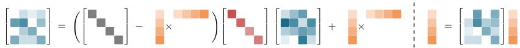
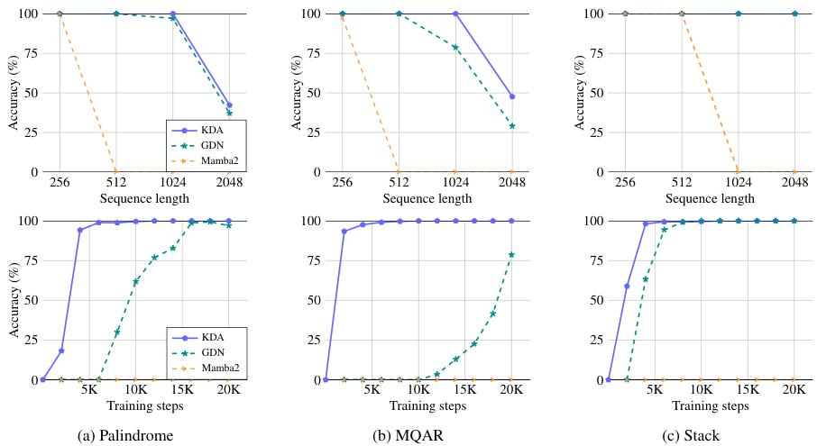
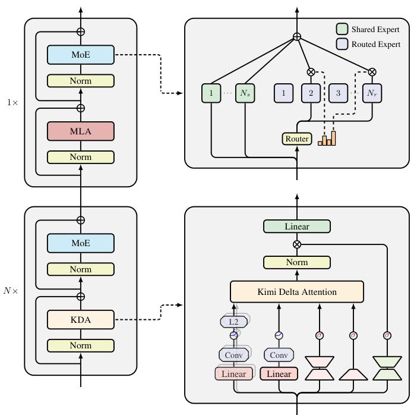

# Kimi Linear Attention (KDA)

## 摘要

本报告深入剖析了 Kimi Linear 架构的核心组件——Kimi Delta Attention (KDA)。KDA 是一种创新的线性注意力机制，它在 Gated DeltaNet (GDN) 的基础上进行了两项关键的、相辅相成的升级：**引入通道级别的细粒度遗忘门**和**作为动态位置编码器以解耦RoPE**。这两大创新不仅显著增强了模型的表达能力和记忆管理精度，还优化了模型架构，使其在处理超长上下文时表现出卓越的性能和效率。

---

## 1. 背景：从 Gated DeltaNet 到 Kimi Delta Attention

Kimi Linear 和 Qwen3-Next 等前沿模型都采用了基于“门控增量法则 (Gated Delta Rule)”的线性注意力，该方法将注意力过程视为一个在线学习和记忆修正的过程。Kimi Delta Attention (KDA) 可以被视为对 Qwen3-Next 所使用的 Gated DeltaNet (GDN) 的一次重要精细化升级。

- **Gated DeltaNet (GDN)**: 引入了“遗忘”机制来控制记忆状态的衰减，但其遗忘门 $\alpha_t$ 是一个**标量（Scalar）**，对一个注意力头内的所有特征维度采用统一的遗忘速率。这是一种相对粗粒度的控制。

- **Kimi Delta Attention (KDA)**: 对此进行了关键改进，旨在实现更精细的控制和更强的表达能力。

---

## 2. 核心创新一：通道级别遗忘门 —— 更精细的记忆管理者

这是 KDA 与 GDN 最根本的区别，也是其性能提升的关键。

### 2.1 原理：从粗粒度到细粒度的进化

#### Gated DeltaNet (GDN) 的粗粒度控制
GDN 的状态更新公式如下：
$$
\mathbf{S}_{t} = \alpha_{t}(\mathbf{I} - \beta_{t}\mathbf{k}_{t}\mathbf{k}_{t}^{\top})\mathbf{S}_{t - 1} + \beta_{t}\mathbf{k}_{t}\mathbf{v}_{t}^{\top} $$ 
在这里，$\alpha_t \in [0, 1]$ 是一个**标量**。这意味着对于一个注意力头内的所有特征维度，模型在每个时间步只能使用**同一个遗忘速率**。这好比一个总阀门控制着整个水池的放水速度，无法进行差异化处理。

#### Kimi Delta Attention (KDA) 的细粒度控制
KDA 将此机制进行了精细化，其状态更新公式变为：
$$
\mathbf{S}_{t} = (\mathbf{I} - \beta_{t}\mathbf{k}_{t}\mathbf{k}_{t}^{\top})\mathrm{Diag}(\alpha_{t})\mathbf{S}_{t - 1} + \beta_{t}\mathbf{k}_{t}\mathbf{v}_{t}^{\top} $$ 
这里的关键变化是 $\alpha_t$ 成为了一个**向量**，并被构造成一个对角遗忘矩阵 $\mathrm{Diag}(\alpha_{t}) \in \mathbb{R}^{d_k \times d_k}$。

下图直观地展示了 KDA 的核心循环更新机制：

*图1：KDA 核心更新机制图示。记忆状态 $\mathbf{S}_{t-1}$ 首先经过细粒度的对角遗忘门 $\mathrm{Diag}(\alpha_t)$ 进行通道级别的衰减，然后再通过增量法则 $(\mathbf{I} - \beta_t \mathbf{k}_t \mathbf{k}_t^\top)$ 进行修正，并加上新的键值信息。*

### 2.2 细粒度控制的优势

1.  **选择性记忆 (Selective Memory)**: 模型获得了在同一时间步内差异化管理记忆的能力。例如，某些通道可以学习以极低的遗忘率（$\alpha_t$ 中对应元素接近1）来“固化”长期的关键信息，而另一些通道则可以快速更新（$\alpha_t$ 中对应元素接近0）以追踪短期的上下文信息。

2.  **特征专业化 (Feature Specialization)**: 不同的特征通道可以演化出对不同时间尺度（Temporal Patterns）的敏感性。这使得模型可以为不同的特征学习不同的**时间常数**或**衰减半衰期**，这对于建模真实世界中发生在多个时间尺度上的事件至关重要。

3.  **表达能力增强**: 这种精细化的控制能力极大地增强了模型的表达能力。如下图所示，在需要精确记忆和复杂状态追踪的合成任务（如 Palindrome 复制、多查询关联召回）上，KDA 的性能和收敛速度显著优于其前身 GDN。

*图2：KDA 在合成任务上的表现。无论是在 Palindrome、MQAR 还是状态追踪任务中，KDA（蓝色/绿色实线）都取得了最高的准确率和最快的收敛速度，验证了细粒度记忆管理的有效性。*

---

## 3. 核心创新二：解耦RoPE —— 担当动态位置编码器

在传统 Transformer 中，位置信息由 RoPE 等独立模块提供。Kimi Linear 做出了一个大胆而高效的架构决策：在其全局注意力层（MLA）中彻底放弃 RoPE (NoPE)，让 KDA 承担起位置感知的全部职责。

下图展示了 Kimi Linear 的整体混合架构：

*图3：Kimi Linear 整体架构图。模型由 KDA 层和全注意力层（MLA）以 3:1 的比例交错堆叠而成。关键在于，MLA 层不使用位置编码（NoPE），位置感知的任务完全由 KDA 层承担。*

### 3.1 原理：从固定编码到动态编码

#### 传统 RoPE 的工作方式
在带有 RoPE 的注意力机制中，Query 和 Key 之间的分数计算隐式地包含了位置信息：
$$ 
s_{t,i} = (\mathbf{R}_t \mathbf{q}_t)^\top (\mathbf{R}_i \mathbf{k}_i) = \mathbf{q}_t^\top \mathbf{R}_{t-i}^\top \mathbf{k}_i $$ 
这里的 $\mathbf{R}$ 是旋转矩阵，其参数（频率）是**固定的**，仅与绝对位置或相对位置有关，而与输入内容无关。

#### KDA 如何担当位置编码器
KDA 的循环结构天然地编码了位置信息。我们可以将其展开，观察其与上述公式的深刻联系。KDA 的输出可以表达为：
$$
\mathbf{o}_{t} = \sum_{i = 1}^{t}\left(\mathbf{q}_{t}^{\top}\left(\prod_{j = i + 1}^{t}\mathbf{A}_{j}\right)\mathbf{k}_{i}\right)\mathbf{v}_{i} $$ 
这里的核心是状态转移矩阵 $\mathbf{A}_{j} = \mathrm{Diag}(\alpha_{j})(\mathbf{I} - \beta_{j}\mathbf{k}_{j}\mathbf{k}_{j}^{\top})$。
- 累积乘积项 $\prod_{j = i + 1}^{t}\mathbf{A}_{j}$ 扮演了与 RoPE 中的旋转矩阵 $\mathbf{R}_{t-i}$ 类似的角色，它建立了从位置 $i$ 到 $t$ 的关系。
- **关键区别**在于：RoPE 的 $\mathbf{R}$ 矩阵是**固定的**，而 KDA 的 $\mathbf{A}_j$ 矩阵是**动态的、数据依赖的**，因为它内部的 $\alpha_j$, $\beta_j$, 和 $\mathbf{k}_j$ 都是由当前输入 $x_j$ 动态计算得出的。

**通道级遗忘门是实现动态编码的关键**。$\mathrm{Diag}(\alpha_{j})$ 的对角结构允许状态转移矩阵 $\mathbf{A}_{j}$ 在每个特征维度上具有不同的衰减行为。这完美地模拟了 RoPE 为不同维度分配不同旋转频率以编码位置的思想，但将其从一个“固定规则”升级为了一个“可学习、自适应的策略”。

### 3.2 解耦 RoPE 的架构优势

1.  **提升长文本外推能力**: Kimi 的实验证实，移除全局注意力中的 RoPE，完全依赖 KDA 进行位置感知，可以有效避免因 RoPE 固定频率导致的在超长文本上的性能瓶颈，从而获得更好的长上下文泛化能力。

2.  **架构简化与职责分离**:
    -   全局注意力层 (MLA) 不再需要 RoPE 模块，使得整体架构更简洁。
    -   模型内的职责划分更加清晰：
        -   **KDA 层**: 同时负责高效的**长程时序依赖建模**和**动态的位置信息编码**。
        -   **MLA 层 (NoPE)**: 专注于在无位置偏见的情况下，执行纯粹基于内容的**全局信息交换和强力信息召回**。

---

## 4. 总结

Kimi Delta Attention 的两大核心创新是一个**一体两面的设计**：

- **通道级别的遗忘门** 不仅让 KDA 成为了一个更优秀的**记忆管理者**，能够更精细地控制信息的存留；它还赋予了 KDA 成为一个更强大的**位置编码器**的潜力，使其可以学习到数据依赖的、动态的位置偏见。

- **解耦RoPE**是这一设计理念在上层架构的**“必然体现”**。正是因为 KDA 能够胜任位置编码的职责，Kimi Linear 才能自信地构建一个更简洁、高效且在长文本上表现更优的 NoPE 混合架构。

综上所述，KDA 并非简单地对线性注意力进行加速，而是通过深化其核心机制，使其在功能上更加完备，成功地将**时序依赖建模**与**动态位置感知**两大关键任务融为一体，为构建下一代高效长文本大语言模型提供了宝贵的范例。