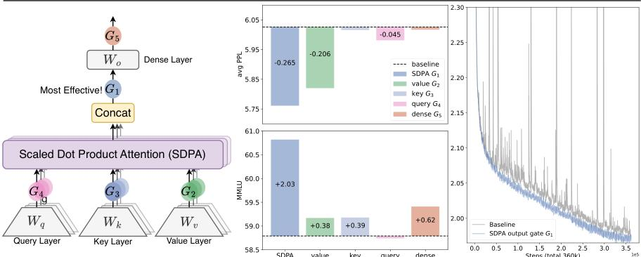
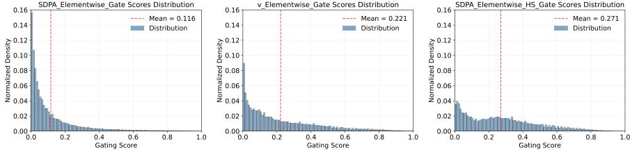
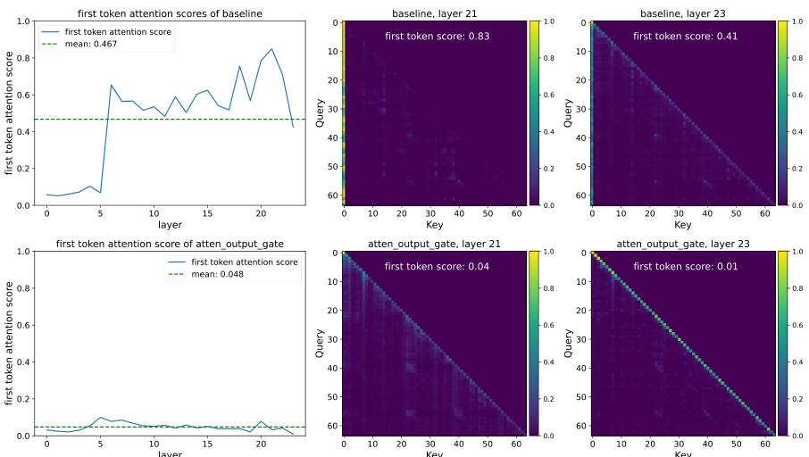
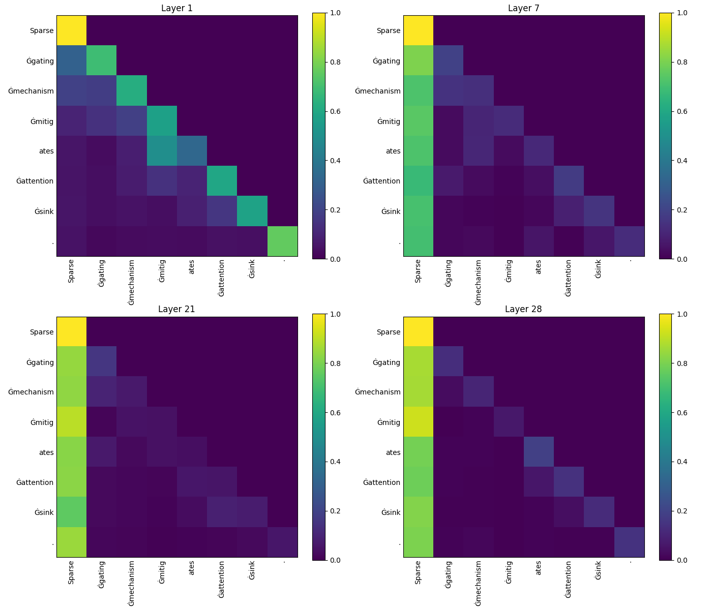
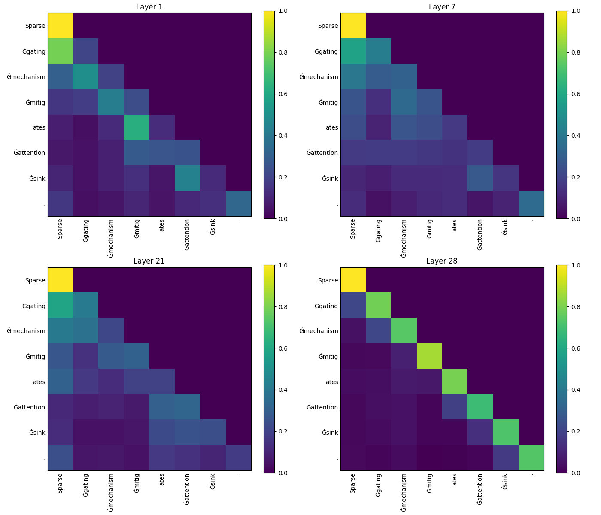
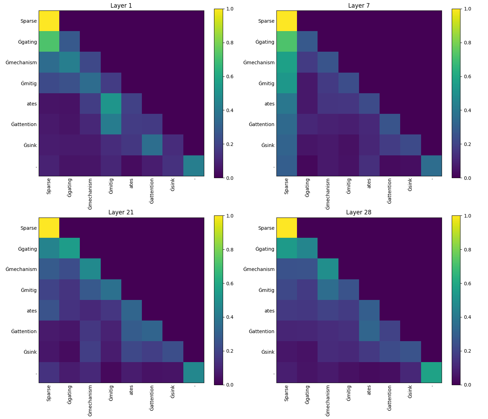

# Gated Attention for Large Language Models (GLA) 论文总结

## 1. 研究背景

传统神经网络（如LSTMs、Transformer等）广泛采用门控机制，但其在标准Softmax注意力机制中的具体作用和贡献往往未被系统性地深入探究。许多现有工作将门控与复杂的架构因素（如专家路由）混淆，导致其独立价值难以被准确评估。本论文旨在通过系统性实验，揭示门控机制对模型性能、训练稳定性及行为模式的独立影响。

## 2. 主要创新点

*   **系统性实验**: 首次在 Transformer 注意力层中对门控机制的**不同位置、粒度（Headwise/Elementwise）、形式（Multiplicative/Additive）和激活函数**进行了大规模综合比较。
*   **核心发现**: 在**Scaled Dot-Product Attention (SDPA) 输出之后**（论文中标记为 `G1` 位置）应用一个**头专用（Head-Specific）**或**元素级别（Elementwise）**的**乘性（Multiplicative）Sigmoid 门控**，能持续显著提升模型性能。
*   **机制洞察**: 将门控的有效性归因于两大关键因素：引入了**非线性**和**输入依赖的稀疏性**。
*   **重要突破**: 发现这种稀疏门控机制能有效**消除“注意力沉洞”（Attention Sink）**现象，从而显著提升模型的长上下文外推能力。论文还开源了首个“无注意力沉洞”模型。

## 3. 原理与效果分析

论文深入分析了门控机制在“非线性”、“稀疏性”和“无注意力沉洞”这三个方面的具体体现和作用。

### 3.1 门控机制原理

#### 公式定义

论文将门控机制形式化为以下公式 (Equation 5):
$$
Y^{\prime} = g(Y, X, W_{\theta}, \sigma) = Y \odot \sigma(X W_{\theta})
$$
其中：
- $Y$: 需要被调节的输入（例如 SDPA 的输出）。
- $X$: 用于计算门控分数的另一个输入（例如注意力层的输入隐状态）。
- $W_{\theta}$: 门控层的可学习参数。
- $\sigma$: 非线性激活函数（例如 Sigmoid）。
- $\odot$: 逐元素相乘。
- $\sigma(X W_{\theta})$: 计算出的门控分数，作为动态过滤器控制信息流。

#### 核心代码实现

该公式对应到代码中的核心逻辑如下，即在计算完 `attn_output` 后，应用 Sigmoid 激活的 `gate_score`。

```python
# attn_output 是 SDPA 的输出
# gate_score 是从 q_proj 中分离出的门控分数

# 应用门控 (G1 位置)
if gate_score is not None:
    # gate_score 形状与 attn_output 匹配以进行广播
    gate_score = gate_score.transpose(1, 2)
    # 应用 Sigmoid 激活函数和乘性门控
    attn_output = attn_output * torch.sigmoid(gate_score)
```

### 3.2. 非线性 (Non-linearity)

*   **原理**: 在多头注意力中，Value 投影 ($W_V$) 和输出投影 ($W_O$) 构成了一个低秩线性映射，限制了模型表达能力。如下公式 (Equation 6) 所示，两者可以合并。
    $$
o_{i}^{k} = \left(\sum_{j=0}^{i} S_{i j}^{k} \cdot X_{j} W_{V}^{k}\right) W_{O}^{k} = \sum_{j=0}^{i} S_{i j}^{k} \cdot X_{j}(W_{V}^{k} W_{O}^{k})
    $$
    门控机制通过在它们之间插入非线性激活函数，打破了这种线性限制。
    
    
    *<center>图1: 论文研究的五种不同门控位置，其中 G1 和 G2 能有效引入非线性。</center>*

*   **作用**: 在 SDPA 输出 (`G1`) 或 Value 投影 (`G2`) 之后插入非线性门控，打破了原有线性映射的限制，显著增强了模型的表达能力。
*   **证据**: **Table 3** 表明，引入非线性的门控变体以及 RMSNorm 等操作，均能带来 PPL 的降低和性能的提升。

### 3.3. 稀疏性 (Sparsity)

*   **原理**: SDPA 输出门控计算出的 `gate_score` 经过 Sigmoid 激活后，会产生大量接近 0 的值，从而形成**输入依赖的稀疏分布**。
*   **作用**: 稀疏门控分数充当一个动态过滤器，根据输入上下文选择性地抑制不相关信息，保留关键信息。
*   **证据**:
    *   **Table 4** 显示，最有效的门控变体具有极低的平均门控分数（例如 0.116）。
    *   **Figure 3** 直观地展示了门控分数的高度稀疏性，大量分数集中在 0 附近。
        
        *<center>图2: 不同门控方式的分数分布。左图（SDPA Elementwise）的稀疏性最强，效果最好。</center>*

### 3.4. 无注意力沉洞 (Attention-Sink-Free)

*   **原理**: 由门控机制引入的输入依赖稀疏性，有效地过滤了与当前 Query 不相关的上下文信息，从而阻止了序列开头的 Token 不成比例地获得过多的注意力权重，从根本上缓解了“注意力沉洞”现象。
*   **作用**: 消除注意力沉洞避免了冗余的注意力分配，使模型能更均匀或更合理地关注整个上下文，从而显著提升模型处理长序列的能力和对上下文长度扩展的鲁棒性。
*   **证据**: 
    *   **Figure 2** 提供了最直接的视觉证据，基线模型将大量注意力集中在首个 Token，而门控模型则将注意力更合理地分散开。
        
        *<center>图3: 论文中展示的注意力热力图对比。基线模型有明显的“注意力沉洞”（左侧高亮条），而门控模型则没有。</center>*
    *   **Table 5** 在 RULER 基准测试上证明，在将上下文长度扩展到 64k 和 128k 时，门控模型相比基线模型展现出显著优越的性能，验证了消除注意力沉洞的实际益处。

#### **实际模型注意力对比**

以下三张图是通过 `demo.py` 脚本生成的，分别展示了基线（`baseline`）、元素级门控（`gate_elementwise`）和头级门控（`gate_headwise`）三种模型在处理相同输入时的实际注意力热力图。

**1. Baseline 模型注意力**

*<center>可以清晰地看到，尤其是在 Layer 7, 21, 28 中，左侧第一列（对应第一个 Token 'Sparse'）有非常明亮的垂直条带，这正是“注意力沉洞”的直观表现：所有后续的 Token 都给予了第一个 Token 过高的注意力。</center>*

**2. Gated 模型注意力 (Element-wise & Head-wise)**

*<center>Element-wise 门控模型</center>*


*<center>Head-wise 门控模型</center>*

*<center>在两个门控模型中，左侧的亮黄色垂直条带基本消失了。注意力权重被更合理地分配到了对当前 Token 有意义的其他 Token 上（例如，对角线附近的注意力增强），这证明了门控机制成功地缓解了“注意力沉洞”。</center>*

## 4. 主要结论

*   在 SDPA 输出之后应用头专用/元素级的乘性 Sigmoid 门控，是提升模型性能最有效的方式。
*   门控机制能显著降低困惑度（PPL）、提高各项基准测试分数，并增强训练稳定性。
*   其有效性归因于在注意力机制中引入了**非线性**并实现了**输入依赖的稀疏性**。
*   门控彻底**消除了注意力沉洞**，极大地提升了模型处理长上下文的能力和鲁棒性。
*   这是一种计算开销极小但效果显著的改进，为未来高级基础模型的设计提供了重要的方向。