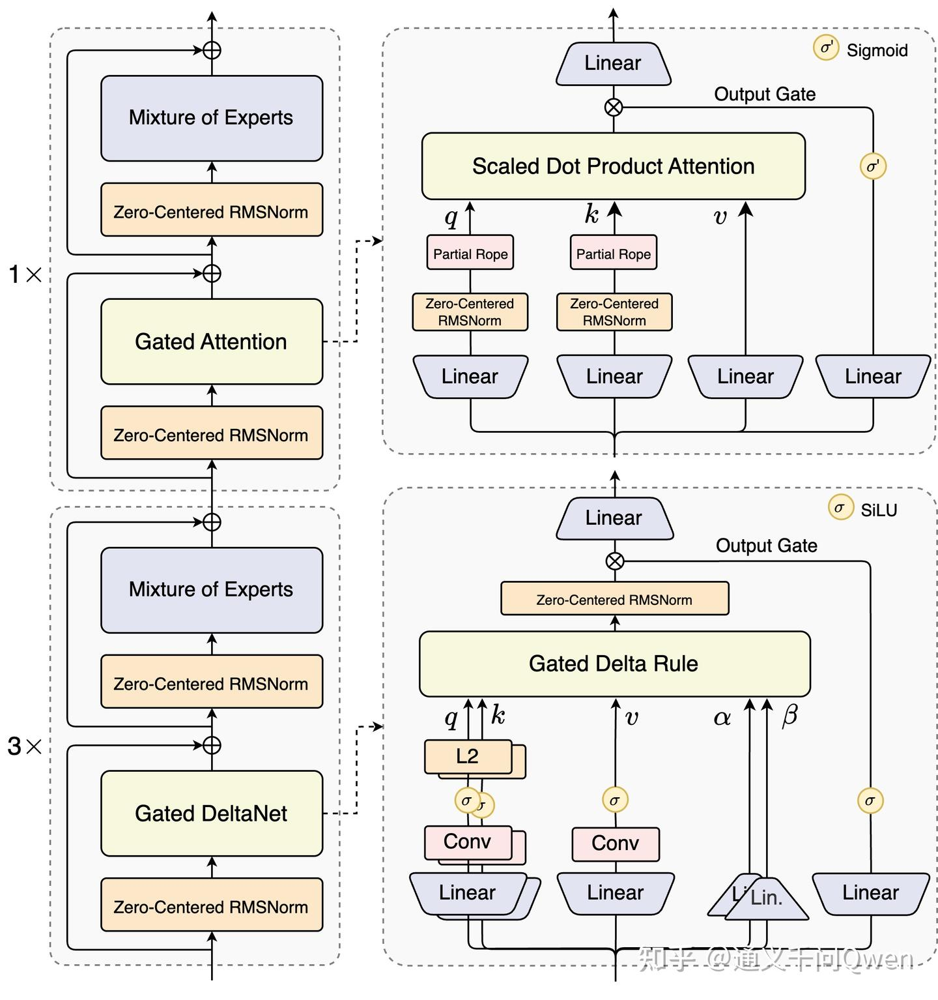
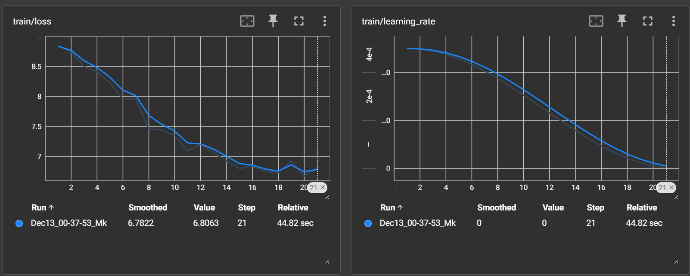

## **Qwen3-Next 架构深度解析技术报告**

- [Qwen3-Next：迈向更极致的训练推理性价比](https://zhuanlan.zhihu.com/p/1949631642294522105)
### **摘要**

本报告旨在深度剖析Qwen3-Next模型的核心技术创新。Qwen3-Next是一个旨在以更高效率处理超长上下文（Long Context）并扩展模型容量的大语言模型（LLM）。其架构设计的核心在于两大创新：**混合注意力机制（Hybrid Attention Mechanism）** 和 **高稀疏度专家混合模型（High-Sparsity Mixture-of-Experts, MoE）**。通过将负责高效长程依赖建模的线性注意力（Gated DeltaNet）与负责强信息召回的标准注意力（Gated Attention）相结合，并在前馈网络层引入大规模稀疏激活的MoE结构，Qwen3-Next在保持强大模型性能的同时，显著降低了长文本处理的计算与显存开销，为构建更大、更高效的语言模型提供了新的范式。

### **1. 引言**

随着大语言模型能力的不断增强，如何经济高效地处理日益增长的上下文长度，成为模型架构演进的关键挑战。传统的Transformer架构采用的Softmax Attention机制，其计算和显存复杂度与序列长度呈二次方关系 $O(N^2)$，这使得处理数十万甚至上百万长度的文本变得异常昂贵。

Qwen3-Next的设计目标正是为了攻克这一难题。它并非单一地采用某种线性注意力来替代传统注意力，而是通过一种“取长补短”的混合策略，在保证模型核心能力不降级的前提下，最大化长上下文处理的效率。

### **2. 核心架构创新**

Qwen3-Next的架构创新主要体现在Transformer块的两个核心组件中：注意力层（Attention Layer）和前馈网络层（Feed-Forward Network, FFN）。

#### **2.1 混合注意力机制 (Hybrid Attention Mechanism)**

这是Qwen3-Next架构的基石。模型没有在所有层中统一使用某种注意力，而是根据层的位置，策略性地部署了两种功能互补的注意力机制。

**调度策略**：通过配置`softmax_attn_index`来指定哪些层使用标准注意力，其余层则使用线性注意力。这种设计使得模型可以在不同深度上侧重于不同的能力。

```python
#来源: pretrain.py -> DecoderLayer
class DecoderLayer(nn.Module):
    def __init__(self, config, layer_idx):
        super().__init__()
        self.softmax_attn_index = config.softmax_attn_index
        
        # 根据当前层的索引决定实例化哪种注意力
        if layer_idx in self.softmax_attn_index:
            self.self_attn = Attention(config, layer_idx)  # 标准门控注意力
        else:
            self.linear_attn = GatedDeltaNet(config, layer_idx) # 门控增量网络
```

##### **2.1.1 Gated Attention: 强信息召回的基石**

*   **原理与作用**:
    在模型的少数关键层（例如25%的层）中，保留了标准的缩放点积注意力。它的$$O(N^2)$$复杂性使其能够构建全局的、任意两个令牌之间的依赖关系，这对于需要精确信息召回和强记忆能力的复杂推理任务至关重要。为了进一步增强其表达能力，Qwen3-Next为其增加了**输出门控（Output Gating）**。

*   **数学公式**:
    标准注意力的核心公式为：
    $$\text{Attention}(\mathbf{Q}, \mathbf{K}, \mathbf{V}) = \text{softmax}\left( \frac{\mathbf{Q}\mathbf{K}^\top}{\sqrt{d_k}} \right) \mathbf{V}$$
    而Gated Attention在其基础上增加了一个由输入 $\mathbf{x}$ 投影而来的门控向量 $\mathbf{z}$：

    $$
    \text{GatedAttention}(\mathbf{x}) = \text{proj}_{\text{out}}(\text{Attention}(\mathbf{Q},\mathbf{K},\mathbf{V})) \odot \sigma(\text{proj}_{\mathbf{z}}(\mathbf{x}))
    $$ 
    其中, `⊙` 表示逐元素相乘, `σ` 是Sigmoid或SiLU等激活函数。

*   **代码实现**:
    门控机制体现在`Attention`类的`forward`方法末尾。

    ```python
    # 来源: pretrain.py -> Attention.forward
    # ... attention 'output' is calculated
    
    # 门控输出 (Gated Output)
    output = output.transpose(1, 2).contiguous().view(b, s, -1)
    z = z.sigmoid()
    output = output * z  # <-- 门控机制在这里
    output = self.o_proj(output)
    ```

##### **2.1.2 Gated DeltaNet: 高效长程依赖建模的引擎**

*   **核心思想：从二次到线性的转变**
    `GatedDeltaNet` (GDA) 的本质思想是将传统注意力中`O(N²)`的全局求和，改写为`O(N)`的**增量更新（Delta Update）递推格式**。它不再为每个查询去回顾全部历史键值，而是维护一个不断演进的“记忆状态”（State），每个新的令牌到来时，仅需对该状态进行一次更新和查询。
    
    `GatedDeltaNet`在递推结构的基础上，融合了两个关键机制：
    1.  **增量误差修正 (Delta Rule)**: 并非简单地累加新的键值信息，而是先用当前记忆预测“应该”出现的值，然后计算预测与真实值之间的“误差”（Delta），最后只把这个误差信息精确地修正到记忆状态中。
    2.  **门控机制 (Gating)**: 引入两个动态门控，一个控制历史记忆的遗忘速率（衰减门），另一个控制新信息修正的强度（更新门），使记忆的演进更加灵活和依赖于内容。

*   **数学原理 (增量更新视角)**
    这个视角与代码实现最为贴合。设当前处理的是第 `t` 个令牌，状态矩阵为 $S \in \mathbb{R}^{d_k \times d_v}$：

    1.  **状态衰减 (State Decay)**：
        *   上一步的记忆状态 $S_{t-1}$ 乘以一个动态生成的衰减门 $g_t$ (值小于1)，用于遗忘部分过时信息。
           $$
            S'_{t-1} = g_t \cdot S_{t-1}$$ 

    2.  **基于当前状态预测值 (Value Prediction)**：
        *   使用衰减后的状态 $S'_{t-1}$ 和当前的键 $k_t$ 来预测当前的值。
           $$
            \hat{v}_t = {S'_{t-1}}^\top k_t$$ 

    3.  **计算增量/修正量 (Delta Calculation)**：
        *   计算真实值 $v_t$ 与预测值 $\hat{v}_t$ 之间的“误差”$\delta_t$，并由更新门 $\beta_t$ 进行缩放。
           $$
            \delta_t = \beta_t \cdot (v_t - \hat{v}_t)$$ 

    4.  **更新记忆状态 (State Update)**：
        *   通过外积操作，将由当前键 $k_t$ 和修正量 $\delta_t$ 构成的新关联信息，叠加到记忆状态上。
           $$
            S_t = S'_{t-1} + k_t \delta_t^\top$$ 

    5.  **计算当前步的输出 (Output Calculation)**：
        *   使用当前的查询 $q_t$ 来查询更新后的记忆状态 $S_t$，得到输出。
           $$
            o_t = S_t^\top q_t$$ 

*   **与论文公式的等价性**
    在一些论文（如 arXiv 2412.06464）中，您可能会看到另一种等价的数学形式，它从矩阵变换的视角描述了相同的过程：
    $$
    S_t = g_t S_{t-1}(\mathbf{I} - \beta_t k_t k_t^\top) + \beta_t v_t k_t^\top$$ 
    这里的 $(\mathbf{I} - \beta_t k_t k_t^\top)$ 是一个类Householder投影矩阵，它对旧状态 $S_{t-1}$ 执行一次“选择性擦除”，其效果等价于上述步骤中的“预测-修正”过程。两种写法虽然看似不同，但在代数上可以相互推导，共同描述了GDA的核心——**门控增量更新**。

*   **代码实现**:
    `pretrain.py`中的代码完美地实现了上述“增量更新视角”的数学步骤。

    ```python
    # 来源: pretrain.py -> GatedDeltaNet.forward
    for i in range(s):
        q_t, k_t, v_t = query[:,:,i], key[:,:,i], value[:,:,i]
        g_t, beta_t = g[:,:,i].exp().unsqueeze(-1).unsqueeze(-1), beta[:,:,i].unsqueeze(-1)

        # Step 1: 状态衰减
        last_recurrent_state = last_recurrent_state * g_t
        
        # Step 2: 预测值 (kv_mem)
        kv_mem = (last_recurrent_state * k_t.unsqueeze(-1)).sum(dim=-2)
        
        # Step 3: 计算修正量 (delta)
        delta = (v_t - kv_mem) * beta_t
        
        # Step 4: 状态更新
        last_recurrent_state = last_recurrent_state + k_t.unsqueeze(-1) * delta.unsqueeze(-2)
        
        # Step 5: 计算输出
        core_attn_out[:, :, i] = (last_recurrent_state * q_t.unsqueeze(-1)).sum(dim=-2)
    ```
*   **卷积的引入**: 在进入循环更新之前，代码首先对Q/K/V的联合投影应用了一维深度可分离卷积。其作用在于引入**局部上下文感知**，让模型在进行长程依赖建模前，能先融合相邻令牌的特征。

#### **2.2 高稀疏度专家混合模型 (High-Sparsity MoE)**

*   **原理与作用**:
    为了在不显著增加计算成本的前提下，大幅增加模型的参数总量（即知识容量），Qwen3-Next在前馈网络层（FFN）采用了MoE结构。其原理是将单个巨大的FFN替换为大量小型的“专家”FFN，并由一个轻量级的“门控网络”（Gating Network）为每个输入令牌动态选择激活少数几个专家。

*   **代码实现**:
    `MoE`类封装了整个逻辑，`Gating`类负责选择专家，`Expert`类就是单个FFN。

    ```python
    # 来源: pretrain.py -> MoE
    class MoE(nn.Module):
        def __init__(self, config):
            super().__init__()
            self.experts = nn.ModuleList([Expert(config) for _ in range(config.expert_num)])
            self.gating = Gating(config)
            
        def forward(self, x):
            # 1. Gating网络为每个token选择top-k个专家，并计算权重
            sparse_logits, indices, gate_logit = self.gating(x)
            final_outputs = torch.zeros_like(x)
            
            # ... (循环遍历专家，只对被选中的token进行计算)
            
            for i, expert in enumerate(self.experts):
                # 找到需要由当前专家处理的token
                expert_mask = (indices == i).any(-1)
                if expert_mask.any():
                    # ... (执行专家计算并将结果按权重加回)
            
            return final_outputs, gate_logit
    ```
    此外，为了保证专家被均衡使用，模型在训练时还引入了一个**负载均衡损失（load balancing loss）**，代码中的`load_balancing_loss_func`函数实现了这一点。

### **3. 训练稳定性设计**

除了上述两大核心创新，Qwen3-Next还采用了一系列技术来保证大规模MoE模型训练的稳定性，例如**零中心化均方根层归一化（Zero-Centered RMSNorm）**、对MoE路由器参数的归一化等，这些设计共同确保了模型能够高效且稳定地进行训练。

### **4. 总结**

Qwen3-Next通过其精巧的**混合注意力机制**和**高稀疏度MoE架构**，成功地在模型性能、计算效率和模型容量三个维度上取得了卓越的平衡。它没有选择单一的技术路线，而是将不同机制的优势有机结合，为解决大语言模型面临的核心挑战提供了宝贵的实践经验和架构范本。本报告所解析的原理、公式和代码实现，清晰地展示了其设计的精妙之处，对后续的大模型架构研究具有重要的参考价值。


<div align="center">
    
</div>

### **5. 附录：架构图解**

架构图详细展示了 **Qwen3-Next** 模型中单个层（Layer）的混合架构，结合了传统的 **注意力机制 (Attention)** 和高效的 **门控线性注意力机制 (Gated Linear Attention/Gated DeltaNet)**。该架构可分为 **层结构 (Layer Structure)** 和 **组件内部结构 (Component Details)** 两部分。

---

#### **5.1 层结构 (Layer Structure)**

整个层结构采用了一个混合专家的路由方式，层内混合了两种主要的子模块：

1.  **注意力模块 (Attention Block)**：位于图的上方（标有 \times$ 的部分），是标准的 Transformer 结构中的自注意力机制，但加入了 **门控 (Gating)** 和 **Zero-Centered RMSNorm**。
2.  **Gated DeltaNet 模块 (Linear Attention Block)**：位于图的下方（标有 $3\times$ 的部分），采用了高效的 Gated DeltaNet（一种线性注意力或状态空间模型变体），同样加入了 **Zero-Centered RMSNorm**。

##### **MoE (Mixture of Experts) 路由**

模型层使用了 **混合专家 (Mixture of Experts, MoE)** 结构。

*   输入序列经过一个 **路由 (Router)** 机制（图中未直接画出，但 MoE 模块隐含），将输入分配给一组不同的专家。
*   在 Qwen3-Next 中，专家被分为两组：
    *   **注意力专家 (Attention Experts)**：执行传统的注意力计算（如 \times$ 所示）。
    *   **Gated DeltaNet 专家 (Gated DeltaNet Experts)**：执行 Gated DeltaNet 计算（如 $3\times$ 所示）。
*   图中的 $1\times$ 和 $3\times$ 表示在每个 MoE 路由周期中，模型可能**选择 1 个 Attention 专家和 3 个 Gated DeltaNet 专家**进行计算，并将它们的输出加权求和，然后作为 MoE 模块的最终输出。
*   这种混合专家的设计允许模型根据输入内容，灵活地选择使用二次复杂度的强大**注意力机制**（用于关键信息捕捉）还是线性复杂度的**Gated DeltaNet**（用于长文本高效处理），从而在性能和效率之间取得平衡。

##### **残差连接与归一化**

在每个子模块（Gated Attention 或 Gated DeltaNet）和 MoE 模块的输出之后，都使用了 **残差连接 (Residual Connection)**（图中的 $\bigoplus$ 符号），将模块的输出加回到输入上，这是深度神经网络稳定训练的关键。

*   **Zero-Centered RMSNorm**：在每个子模块之前和内部都使用了 **Zero-Centered RMSNorm**，这是一种为了进一步提高模型**数值稳定性**而引入的改进。

---

#### **5.2 核心组件内部结构 (Component Details)**

##### **A. 门控注意力 (Gated Attention)**

**上部虚线框**展示了**注意力模块**的内部结构：

1.  **Zero-Centered RMSNorm**：输入首先进行归一化。
2.  **Q、K、V 计算**：归一化后的输入分别经过三个独立的 **线性层 (Linear)** 投影，得到 Query ($q$)、Key ($k$) 和 Value ($v$) 向量。
3.  **位置编码**：Query ($q$) 和 Key ($k$) 采用了 **Partial Rope** (旋转位置编码) 以引入序列的位置信息。
4.  **Scaled Dot Product Attention (缩放点积注意力)**：进行核心的 $Q K^\top / \sqrt{d_k}$ 注意力计算，并应用于 Value ($v$)。
5.  **输出门控 (Output Gate)**：注意力机制的输出（经过 $v$ 缩放）与另一个输入分支（经过一个 **线性层** 和 **Sigmoid ($\sigma$) 激活**）进行**相乘**操作，即 **输出门控机制**。

##### **B. 门控 DeltaNet (Gated DeltaNet)**

**下部虚线框**展示了 **Gated DeltaNet** 模块的内部结构，这是一种用于高效处理长序列的线性注意力或状态空间模型 (SSM) 变体：

1.  **核心输入**：输入分别投影为 Query ($q$)、Key ($k$) 和 Value ($v$)。
2.  **Gated Delta Rule**：该模块基于 **Gated Delta Rule**（门控 $\Delta$ 规则），它结合了：
    *   **门控 (Gating)**：来自 Mamba 等 SSM 的思想，用于**自适应的记忆控制**（决定何时保留或遗忘信息）。
    *   **Delta Rule ( $\Delta$ 规则)**：一种源自 RNN 的机制，用于**精确的记忆修改/更新**，而不是像传统注意力那样每次都从头计算。
3.  **具体组件**：
    *   $q$ 和 $k$ 经过 **L2 归一化**。
    *   $q$ 和 $k$ 分别经过一个 **卷积 (Conv)** 层和 **线性层 (Linear)**，然后经过 **Sigmoid ($\sigma$)** 激活。
    *   $v$ 经过一个 **卷积 (Conv)** 层和 **线性层 (Linear)**。
    *   引入了两个关键的门控参数 **$\alpha$ (衰减/遗忘门)** 和 **$\beta$ (更新门)**，它们通过线性层和 **Sigmoid ($\sigma$)** 激活计算得到。$\alpha$ 控制记忆的衰减，$\beta$ 控制新输入对记忆状态的修改强度。
4.  **Zero-Centered RMSNorm**：在 Gated Delta Rule 的输出前进行归一化。
5.  **输出门控 (Output Gate)**：归一化后的输出与另一个输入分支（经过一个 **线性层** 和 **SiLU 激活**）进行**相乘**操作。

<div align="center">
    
</div>