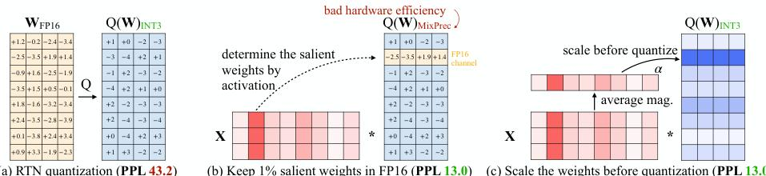
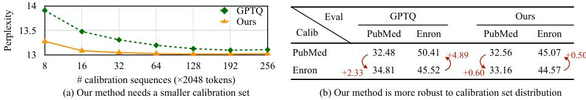
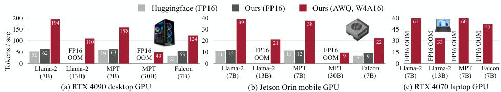
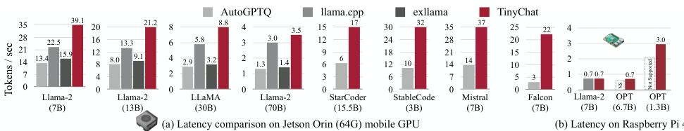

# AWQ: 激活感知权重行化论文核心思想总结

本文是对论文《AWQ: ACTIVATION-AWARE WEIGHT QUANTIZATION FOR ON-DEVICE LLM COMPRESSION AND ACCELERATION》核心内容的梳理与总结。

## 1. 背景

大型语言模型（LLMs）在人工智能领域取得了巨大成功，但其庞大的模型尺寸和高昂的计算成本使得在手机、笔记本电脑等端侧设备上的部署变得极其困难。模型量化（Quantization）技术通过降低模型参数的位宽（如从16-bit浮点数降为4-bit整数），成为解决这一挑战的关键技术，它能有效减小模型大小、降低内存占用和推理延迟。

## 2. 动机：现有量化方案的局限性

在AWQ之前，主流的量化方案存在各自的瓶颈，这促使了新方法的诞生：

-   **量化感知训练 (QAT)**：对于LLM来说，在训练中模拟量化的成本过高，难以承受。
-   **传统训练后量化 (PTQ)**：如简单的四舍五入（RTN），在低比特设置下会导致严重的模型精度损失。
-   **GPTQ等高级PTQ方法**：虽然性能优于RTN，但其依赖复杂的重构过程，容易**过拟合**校准数据集，损害了模型在其他领域（如编程、多模态）的泛化能力。
-   **混合精度方案**：即保留部分重要权重为高精度，其余进行量化。这种方法虽然能提升性能，但对现代GPU等硬件**不友好**，破坏了计算的统一性和连续性，难以实现有效加速。

## 3. 原理：AWQ 的核心方法

AWQ提出了一种硬件友好且能保持高精度的全新量化思路。

### 3.1 核心观察：权重的重要性由激活值决定

AWQ最关键的洞察是：**一个权重的“重要性”不应由其自身的大小决定，而应由流经它的“激活值（Activation）”的大小决定。**

如下图所示，简单的RTN量化（左）性能很差。如果将1%由激活值决定的“显著”权重保留为FP16（中），性能会大幅提升，但这带来了硬件效率问题。AWQ（右）通过激活感知的缩放，在保持硬件友好的前提下，达到了与混合精度相当的性能。

*
图1. AWQ核心思想：通过保护由激活值决定的1%显著权重来降低量化误差
*

### 3.2 解决方案：激活感知的缩放 (Activation-aware Scaling)

为了在不使用混合精度的前提下保护显著权重，AWQ提出了一种等效的缩放方法。

对于原始计算 $y = w \cdot x$，可以等价变换为 $y = (w \cdot s) \cdot (x/s)$，其中 $s$ 是一个缩放因子。AWQ将量化施加在被缩放后的权重上。

标准的量化函数为：
$$
Q(w) = \Delta \cdot \mathrm{Round}(\frac{w}{\Delta}),\quad \Delta = \frac{\max (|\mathbf{w}|)}{2^{N - 1}}
$$
量化误差主要来自取整 `Round`。引入缩放因子 $s$ 后，新的计算方式为 $Q(w\cdot s) \cdot (x/s)$。其误差可以表示为：
$$
\mathrm{Err}(Q(w\cdot s)(\frac{x}{s})) = \Delta' \cdot \mathrm{RoundErr}(\frac{ws}{\Delta '})\cdot x\cdot \frac{1}{s}
$$
其中 $\Delta'$ 是基于缩放后权重计算的新量化步长。在 $s$ 不过大的情况下，$\Delta' \approx \Delta$。因此，新的量化误差相比原始误差：
$$
\mathrm{Err_{new}} \approx \frac{1}{s} \mathrm{Err_{old}}
$$
这意味着，**通过将权重放大 $s$ 倍（$s>1$），其量化误差会相应地减小 $s$ 倍**，从而实现了对该权重的保护。

### 3.3 实现方法：自动搜索最佳缩放因子

AWQ通过一个简单的搜索过程来确定每个通道的最佳缩放因子 $s$。它将复杂的优化目标：
$$
\mathbf{s}^{*} = \underset {\mathbf{s}}{\arg \min}\mathcal{L}(\mathbf{s}) = \| Q(\mathbf{W}\cdot \mathrm{diag}(\mathbf{s}))(\mathrm{diag}(\mathbf{s})^{-1}\cdot \mathbf{X}) - \mathbf{W}\mathbf{X}\|
$$
简化为寻找一个单一的超参数 $\alpha$。它将缩放因子 $s$ 参数化为与激活值大小 $s_X$ 相关的形式：
$$
\mathbf{s} = \mathbf{s}_{\mathbf{X}}^{\alpha}
$$
通过快速的网格搜索找到最优的 $\alpha$，即可确定所有通道的缩放因子。这个过程无需反向传播，避免了过拟合。

## 4. 实验：性能与效果验证

实验部分全方位验证了AWQ的优越性。

### 4.1 泛化能力：在多模态任务上表现出色

AWQ由于不过拟合校准集，因此在需要高度泛化能力的多模态任务上表现优异。如下图，在解释一个梗图时，AWQ量化后的LLaVA模型能准确理解其中的幽默感，而RTN模型则给出了错误的描述。

*
图2. AWQ（绿色）能准确理解梗图的幽默，而RTN（红色）则会产生错误描述
*

同样，在COCO图像描述任务中，AWQ能生成更准确的图片标题。

*
图3. 对于给定的图片，AWQ（绿色）的描述更贴切
*

### 4.2 数据效率与鲁棒性

AWQ对校准集的大小和分布不敏感。

*
图4. 数据效率（左）与分布鲁棒性（右）
*

-   **左图**：AWQ（蓝色曲线）仅用**十几条样本**就能达到极佳性能，远少于GPTQ（橙色曲线）所需的数据量。
-   **右图**：当校准集和评估集来自不同领域时，**AWQ的性能几乎不受影响**，而GPTQ的性能则大幅下降，证明了AWQ更强的鲁棒性。

### 4.3 实际加速效果：TinyChat

论文开发的TinyChat推理引擎能将AWQ的理论压缩转化为实际速度。

*
图5. 在桌面和移动GPU上的加速效果
*

-   **图5** 显示，在桌面GPU（4090）和移动GPU（Orin）上，AWQ+TinyChat的组合比标准的FP16实现**快了约3.3倍**，并且能在8GB显存的笔记本上流畅运行13B大模型。

*
图6. 与其他推理系统的对比
*

-   **图6** 显示，与其他开源推理框架（如llama.cpp）相比，TinyChat在性能和模型支持广度上都具有明显优势，甚至可以在树莓派等资源极度受限的设备上部署7B模型。
