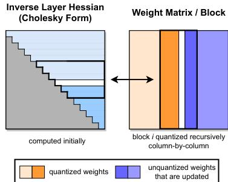
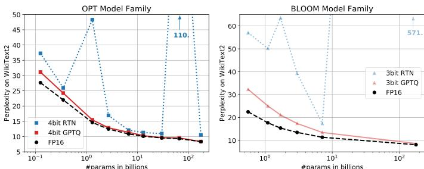

# GPTQ 技术总结：高精度、高效率的大模型量化方案

本文档旨在对 **GPTQ (Generative Pre-trained Transformer Quantization)** 技术进行全面而精炼的总结。内容基于论文《GPTQ: Accurate Post-Training Quantization for Generative Pre-trained Transformers》。

---

### 1. 技术要点概述

GPTQ 是一种**训练后量化 (Post-Training Quantization, PTQ)** 技术，其核心亮点在于：

*   **高精度**：能够将千亿级参数的大语言模型（LLM）压缩至 **3-bit 或 4-bit**，而模型性能（如困惑度、任务准确率）**几乎没有损失**，远超传统的量化方法。
*   **高效率**：作为一种“一次性 (one-shot)”方法，它**无需重新训练**模型。量化一个 1750 亿参数的模型在单张 A100 GPU 上仅需约 **4 小时**。
*   **实用性强**：能够将超大模型部署在更少的硬件上（例如，将需要 5 张 GPU 的 OPT-175B 模型部署在**单张 GPU** 上），并带来显著的端到端**推理加速**（约 3-4 倍）。

---

### 2. 背景与相关工作

#### 背景
大语言模型（如 GPT-3、OPT、BLOOM）虽然强大，但其巨大的体积（如 175B 模型在 FP16 下占用 326GB）带来了两大挑战：
1.  **高昂的硬件成本**：推理需要多张昂贵的顶级 GPU。
2.  **缓慢的推理速度**：在生成任务中，反复从内存中加载巨大的权重矩阵成为瓶颈。

**量化**通过将高精度浮点数（FP16）转换为低精度整数（INT8/INT4/INT3）来解决这些问题，但关键挑战在于如何在压缩的同时保持模型的准确性。

#### 相关工作
*   **量化感知训练 (QAT)**：在训练时引入量化，精度高，但对 LLM 而言重新训练的成本无法接受。
*   **训练后量化 (PTQ)**：在预训练好的模型上直接进行量化，成本低。
    *   **简单方法 (RTN - Round-To-Nearest)**：直接将权重四舍五入到最近的量化值。此方法在 8-bit 以上时表现尚可，但在 4-bit 及以下时精度会急剧下降。
    *   **高级方法 (OBQ, AdaRound)**：通过更复杂的算法（如考虑权重间的二阶关系）来最小化量化误差，精度很高，但计算复杂度极高，无法扩展应用于拥有数百亿参数的 LLM。

**GPTQ 的定位**：GPTQ 填补了其中的空白，它**首次**实现了一种兼具**高精度**（如 OBQ）和**高效率**（可扩展至 175B 模型）的训练后量化方案。

---

### 3. 原理与算法讲解

GPTQ 的核心思想是**带有补偿的逐层量化**，它继承自 **OBQ (Optimal Brain Quantization)** 框架，并通过一系列工程和算法优化实现了惊人的效率提升。

#### 核心目标
对于模型中的每一层，找到一个量化后的权重矩阵 $\hat{W}$，使其输出 $\hat{W}X$ 与原始输出 $WX$ 的均方误差最小。

$$ \underset{\hat{W}}{\arg\min} ||WX - \hat{W}X||^2 $$

这个误差的 Hessian 矩阵 $H$（二阶导数矩阵）包含了权重之间相互作用的关键信息，可以指导我们如何做出最优的补偿，其表达式为：

$$ H = 2XX^T $$

#### 理论溯源：从 OBS 到 OBQ
要理解 GPTQ，必须先了解它的前辈 OBS 和 OBQ。

##### OBS (Optimal Brain Surgeon) - 剪枝的理论基石
OBS 最初用于神经网络剪枝（移除权重），它的核心思想是：在移除一个权重 $w_q$ 时，**更新网络中所有其他权重**来补偿这次移除带来的性能损失。

*   **选择移除谁**：选择移除后对模型性能影响最小的权重。该权重 $w_q$ 由以下公式决定，它衡量了权重自身大小与其对网络影响（由 Hessian 逆矩阵 $H^{-1}$ 的对角线元素表示）之间的关系：
    $$ 
    w_q = \underset{i}{\arg\min} \left( \frac{w_i^2}{2 \cdot [H^{-1}]_{ii}} \right) 
    $$
*   **如何补偿**：移除 $w_q$ 后（即令其值为0），其他所有权重的最佳更新量 $\delta w$ 由以下公式给出，它将移除的误差“分散”到其他权重上：
    $$ \delta w = - \left( \frac{w_q}{[H^{-1}]_{qq}} \right) \cdot H^{-1}_q $$

##### OBQ (Optimal Brain Quantization) - 将量化问题巧妙转化
OBQ 的天才之处在于，它意识到**量化一个权重**（从 $w$ 变为 $\text{quant}(w)$）本质上是一次**扰动**，这与 OBS 的剪枝（从 $w$ 变为 $0$）在数学上是同构的。

OBQ 完整地继承了 OBS 的“扰动+补偿”框架，并将其应用于量化：
1.  **逐个量化**：在层内，迭代地选择权重进行量化。
2.  **贪心选择**：每一步都选择一个权重进行量化，选择标准是：在经过其他**未量化**权重补偿后，该次量化造成的**总误差增量最小**。
    $$ w_q = \underset{q}{\arg\min} \left( \frac{(\text{quant}(w_q) - w_q)^2}{[H_F^{-1}]_{qq}} \right) $$
    （其中 $F$ 是当前所有未被量化的权重集合）
3.  **实时补偿**：每量化一个权重，就立即根据 Hessian 逆矩阵 $H_F^{-1}$ 更新所有其他**未量化**的权重。

虽然 OBQ 精度极高，但它“逐个贪心选择、逐个更新”的模式需要对权重进行排序和复杂的迭代计算，导致其计算成本极高，无法应用于拥有巨大权重矩阵的 LLM。

#### GPTQ 的三大核心优化
GPTQ 保留了 OBQ “基于 Hessian 补偿”的精髓，但通过三大优化解决了其效率瓶颈：

1.  **固定顺序量化 (Arbitrary Order Insight)**：GPTQ 团队发现，在参数极度冗余的大模型中，OBQ 精心设计的“最优量化顺序”带来的好处微乎其微。因此，GPTQ 放弃了复杂的动态排序，直接**按固定的顺序（如逐列）进行量化**。这极大地简化了算法，是实现高效扩展的第一步。

2.  **懒惰批量更新 (Lazy Batch-Updates)**：为了解决逐列更新带来的低 GPU 利用率问题，GPTQ 引入了**块（Block）**处理机制。它将权重矩阵的列分成多个块（例如，大小为 128），先在块内完成所有量化和局部补偿，然后将累积的更新效应**一次性地**传播到矩阵的其余部分。这显著减少了内存读写次数，大幅提升了计算效率。

3.  **Cholesky 稳定计算 (Cholesky Reformulation)**：在处理巨大矩阵时，重复的逆矩阵更新容易导致数值不稳定。GPTQ 创造性地使用**Cholesky 分解**来替代原始的求逆更新步骤，从而保证了算法在千亿级模型上的数值鲁棒性和稳定性。

*
图 1: GPTQ 量化过程示意图。算法以块为单位进行，在一个块（粗体）内部逐列量化（白色列为当前列），并更新块内其他权重（蓝色）。处理完一个块后，再将影响更新到矩阵的其余部分。
*

---

### 4. 实验效果总结

GPTQ 的实验结果令人信服，证明了其在精度、效率和实用性上的巨大成功。

*   **精度表现**：在 4-bit 量化下，GPTQ 几乎没有性能损失；在要求更高的 3-bit 量化下，依然能保持非常高的准确率，而传统方法（RTN）则完全失效。一个有趣的发现是，**模型越大，量化的相对精度损失反而越小**，这意味着 GPTQ 对超大模型尤其有效。

*
图 2: 在 OPT 和 BLOOM 模型上，GPTQ 量化后的困惑度（越低越好）远优于 RTN，并无限接近于原始 FP16 基线。
*

*   **效率表现**：在单张 A100 GPU 上，量化 175B 参数的 OPT 模型仅需约 **4.2 小时**，量化 176B 的 BLOOM 模型仅需 **3.8 小时**。

*   **实际收益**：
    *   **硬件节省**：3-bit 量化的 OPT-175B 模型可从需要 **5 张 A100 GPU** 减少到仅需 **1 张**。
    *   **推理加速**：通过减少内存带宽压力，3-bit 量化模型在生成任务上比 FP16 版本快 **3-4.5 倍**。

**结论**：GPTQ 是一个里程碑式的工作，它首次展示了对千亿级大语言模型进行高精度、高效率的低比特量化是完全可行的，极大地推动了 LLM 在真实世界中的部署和应用。