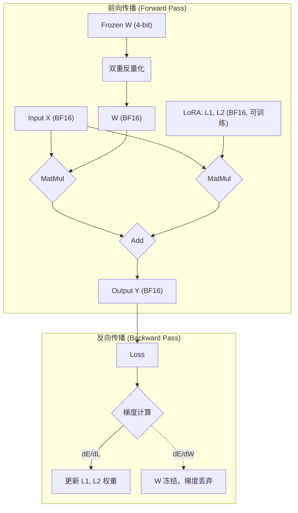

# QLoRA: 高效微调量化大语言模型

`QLoRA (Quantized Low-Rank Adaptation)` 是一种高效的大语言模型（LLM）微调方法，它通过将预训练模型量化为4-bit精度，并结合低秩适配器（LoRA），极大地降低了微调所需的硬件门槛。QLoRA使得在**单张48GB的专业GPU上微调650亿参数**的模型成为可能，同时保持了与16-bit全参数微调相当的性能。

本文档旨在深入解析QLoRA的核心技术、实验效果与实践应用。

## 1. 技术细节与核心原理

### 1.1 LoRA原理回顾

在深入QLoRA之前，我们先回顾其基础——**LoRA (Low-Rank Adaptation)**。LoRA是一种参数高效微调（Parameter-Efficient Fine-Tuning, PEFT）技术，其核心思想是在保留预训练模型权重`W`不变（冻结）的同时，通过训练一个低秩分解矩阵的“旁路”来适应新任务。

对于一个原始的线性层 $Y = XW$，LoRA的修改如下：

$$Y = XW + s \cdot X \cdot L_1 \cdot L_2$$

*   $W \in \mathbb{R}^{d \times k}$ 是原始的、被冻结的权重矩阵。
*   $L_1 \in \mathbb{R}^{d \times r}$ 和 $L_2 \in \mathbb{R}^{r \times k}$ 是两个低秩的可训练矩阵，其中秩 $r \ll d, k$。
*   $s$ 是一个缩放常数。

在微调过程中，只有 $L_1$ 和 $L_2$ 的参数被更新，其参数量（$dr + rk$）远小于原始矩阵 $W$ 的参数量（$dk$），从而实现了参数高效性。


<center>图1: 不同微调方法的内存需求对比。QLoRA在LoRA的基础上，通过量化基础模型进一步降低了显存占用。</center>

### 1.2 QLoRA 整体架构

QLoRA 在LoRA的基础上，引入了三大关键创新，将基础模型的存储和计算效率推向了极致。

*   **核心思想**: 将冻结的预训练模型 $W$ 量化为 **4-bit** 精度进行存储，在计算（前向和反向传播）时，再将其动态地**反量化**到16-bit浮点数（BFloat16），而梯度仅用于更新16-bit的LoRA适配器参数。

QLoRA的三大核心技术组件是：
1.  **4-bit NormalFloat (NF4) 量化**
2.  **双重量化 (Double Quantization, DQ)**
3.  **分页优化器 (Paged Optimizers)**

### 1.3 关键技术一：4-bit NormalFloat (NF4) 量化

NF4是QLoRA实现高精度4-bit量化的基石。它是一种专门为通常呈正态分布的神经网络权重设计的新数据类型。

*   **原理**:
    标准量化方法对存在“离群点”的数据分布不友好。而**分位数量化 (Quantile Quantization)** 是一种信息论上的最优方法，它能确保每个量化级别代表相同数量的输入值。    NF4正是基于此思想，但它利用了“神经网络权重呈标准正态分布 $\mathcal{N}(0, 1)$”这一先验知识。
    NF4数据类型通过**预先计算标准正态分布的理论分位数**来构建。这套固定的分位数就是NF4的“码表”，无需为每个权重张量动态计算，从而兼顾了效率与精度。

*   **量化过程与公式**:
    1.  **构建NF4码表**: 对标准正态分布 $\mathcal{N}(0, 1)$，计算其 $2^4+1$ 个分位点，并通过以下公式得到16个量化值 $q_i$：
        $$q_i = 0.5 \cdot \left( Q_X\left(\frac{i}{2^k + 1}\right) + Q_X\left(\frac{i+1}{2^k + 1}\right) \right)$$
        其中 $Q_X$ 是 $\mathcal{N}(0, 1)$ 的分位数函数（累积分布函数的逆）。这16个值构成了NF4数据类型的精确定义。

    2.  **量化权重**: 对一个给定的权重张量，首先通过块量化（block-wise）将其归一化到 `[-1, 1]` 区间，然后将每个归一化后的值映射到NF4码表中最近的一个值。


<center>图2: 不同4-bit数据类型的性能对比。NF4（蓝色）为正态分布的数据提供了最优的量化精度，显著优于传统的4-bit浮点数（FP4）。</center>

### 1.4 关键技术二：双重量化 (Double Quantization, DQ)

双重量化旨在进一步压缩量化过程本身带来的显存开销。

*   **原理**:
    块量化虽然提高了精度，但每个“块”都需要一个32-bit的量化常数。这会带来不可忽视的额外显存（平均每参数$0.5 \text{ bit/参数}$）。双重量化的思想是：**对这些量化常数本身再进行一次量化**。

*   **过程**:
    1.  **第一次量化**: 将FP32权重 $W$ 量化为NF4，得到 $W_{\text{nf4}}$ 和一批32-bit的第一级量化常数 $c_2$。
    2.  **第二次量化**: 将 $c_2$ 这个浮点数集合本身，再次进行量化（例如，使用FP8），得到 $c_{2_\text{fp8}}$ 和一批更小、更少的32-bit第二级量化常数 $c_1$。

    通过这种方式，量化常数的平均显存开销从 **$0.5 \text{ bit/参数}$** 降低到约 **$0.13 \text{ bit/参数}$**。

### 1.5 关键技术三：分页优化器 (Paged Optimizers)

这是一种工程优化手段，用以解决训练过程中因显存峰值导致的OOM（Out-of-Memory）问题。

*   **原理**:
    它利用 **NVIDIA统一内存 (Unified Memory)** 特性，允许在GPU显存不足时，将优化器状态（如Adam的momentum和variance）自动地从**GPU显存“分页”交换到CPU主存**。当优化器更新需要这些数据时，再将其自动调回GPU。

*   **作用**:
    这相当于把CPU内存当作了GPU显存的“虚拟内存”，有效平滑了训练过程中的显存峰值，确保了在极限资源下训练的稳定性。

### 1.6 QLoRA 训练流程

QLoRA的训练流程巧妙地结合了低精度存储和高精度计算。

<center>


</center>

<center>图3: QLoRA 训练流程示意图</center>

1.  **前向传播**:
    *   输入 $X$ (BF16) 进入模型。
    *   冻结的4-bit权重 $W_{\text{nf4}}$ 被加载，并通过**双重反量化**恢复为 $W_{\text{bf16}}$。
    *   主干网络计算 $X \cdot W_{\text{bf16}}$。
    *   LoRA旁路网络计算 $X  L_1  L_2$ (BF16)。
    *   最终输出 `Y` 是两部分之和，公式为：
        $$Y_bf16 = X_bf16 * doubleDequant(c1, c2_fp8, W_nf4) + X_bf16 * L1_bf16 * L2_bf16
        $$

2.  **反向传播与更新**:
    *   损失函数的梯度在整个计算图上以BF16精度进行反向传播。
    *   虽然梯度会流经反量化操作，但我们**只计算并更新LoRA模块 (`L1`, `L2`) 的梯度**。基础模型 `W` 的梯度被计算后即丢弃。
    *   因此，整个过程实现了“用4-bit的成本存储模型，用16-bit的精度进行有效训练”。

## 2. 实验结果

### 2.1 性能对比

实验证明，QLoRA在大幅降低资源消耗的同时，其性能与16-bit微调方法相当。

*   **学术基准**: 在GLUE和Super-NaturalInstructions任务上，QLoRA (NF4) 的性能与16-bit全参数微调和16-bit LoRA微调的基线持平。

*   **MMLU基准**: 在针对LLaMA模型的MMLU测试中，QLoRA (NF4) **完全恢复了16-bit LoRA的性能**，并且显著优于QLoRA (FP4)。

| LLaMA Size | Dataset | BFloat16 | Float4 | **NFloat4 + DQ** |
| :--- | :--- | :--- | :--- | :--- |
| 7B | Alpaca | 38.4 | 37.2 | **39.0** |
| 13B | FLAN v2 | 50.6 | 50.0 | **50.7** |
| 33B | Alpaca | 57.7 | 55.9 | **57.3** |
| 65B | FLAN v2 | 62.5 | 63.3 | **63.9** |
<center>表1: LLaMA模型在MMLU 5-shot测试集上的平均准确率对比。NF4+DQ组合的性能与BF16基线相当。</center>

### 2.2 资源消耗

QLoRA在资源节约方面的优势是革命性的。

*   **显存占用**:
    *   常规16-bit微调一个65B模型需要 **>780 GB** 显存。
    *   使用QLoRA微调，仅需 **<48 GB** 显存。


<center>图4: 不同规模LLaMA模型使用QLoRA微调时的显存占用分解。即使是33B模型，也能在24GB显存的GPU上进行训练（需借助分页优化器）。</center>

## 3. 应用与实践

### 3.1 适用模型与典型案例

*   **适用模型**:
    QLoRA具有良好的通用性，论文中验证过的模型架构包括：
    *   LLaMA
    *   T5
    *   RoBERTa
    *   OPT
    *   BLOOM
    *   Pythia

*   **典型案例：Guanaco聊天机器人**:
    研究团队使用QLoRA在OASST1（一个开源、高质量的对话数据集）上微调LLaMA模型，训练出了**Guanaco**模型家族。
    *   **卓越性能**: Guanaco 65B在Vicuna基准测试中性能达到ChatGPT的**99.3%**，是当时表现最好的开源聊天模型。
    *   **高性价比**: Guanaco 33B模型可在**单张24GB消费级GPU**上于12小时内完成训练，性能超越了需要66GB显存的Open Assistant 33B模型。

### 3.2 代码示例与配置

结合Hugging Face的`transformers`、`peft`和`bitsandbytes`库，可以方便地应用QLoRA。

```python
import torch
from transformers import AutoTokenizer, AutoModelForCausalLM, BitsAndBytesConfig
from peft import LoraConfig, get_peft_model, prepare_model_for_kbit_training

# 模型ID
model_id = "meta-llama/Llama-2-7b-hf"

# 1. QLoRA 配置 (BitsAndBytesConfig)
#    配置4-bit量化的细节
bnb_config = BitsAndBytesConfig(
    load_in_4bit=True,                          # 启用4-bit量化
    bnb_4bit_quant_type="nf4",                  # 设置量化类型为 NF4
    bnb_4bit_use_double_quant=True,             # 启用双重量化
    bnb_4bit_compute_dtype=torch.bfloat16,      # 设置计算数据类型为 bfloat16
)

# 2. 加载量化后的基础模型
model = AutoModelForCausalLM.from_pretrained(
    model_id,
    quantization_config=bnb_config,
    device_map={"":0}                           # 将模型加载到指定GPU
)

# 3. LoRA 配置
#    在加载了4-bit模型后，定义LoRA适配器的参数
lora_config = LoraConfig(
    r=64,                                       # LoRA的秩
    lora_alpha=16,                              # LoRA的alpha参数
    lora_dropout=0.1,                           # LoRA层的dropout率
    target_modules=["q_proj", "v_proj"],        # 指定要应用LoRA的模块，"all-linear"可应用于所有线性层
    bias="none",
    task_type="CAUSAL_LM",
)

# 4. 应用LoRA和准备模型
model = prepare_model_for_kbit_training(model)  # 预处理模型以适配k-bit训练
model = get_peft_model(model, lora_config)      # 将LoRA配置应用到模型上
model.print_trainable_parameters()              # 打印可训练参数的数量和比例

# ... 接下来是标准的模型训练流程 (使用Hugging Face Trainer) ...
```

*   **关键配置参数**:
    *   `load_in_4bit=True`: 激活4-bit加载的核心开关。
    *   `bnb_4bit_quant_type="nf4"`: 指定使用NF4数据类型，这是保证性能的关键。
    *   `bnb_4bit_use_double_quant=True`: 启用双重量化以节省更多显存。
    *   `target_modules`: 指定将LoRA应用到哪些线性层。根据论文结论，为了最好地复现全量微调性能，应尽可能多地应用，例如设置为`"all-linear"`（在较新版本的`peft`中支持）或手动列出所有线性层名称。