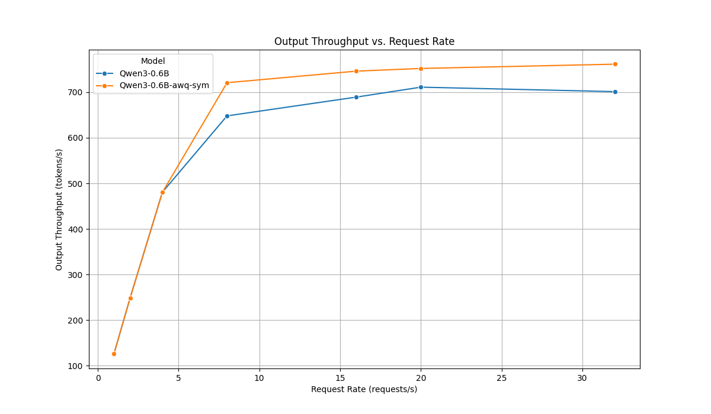
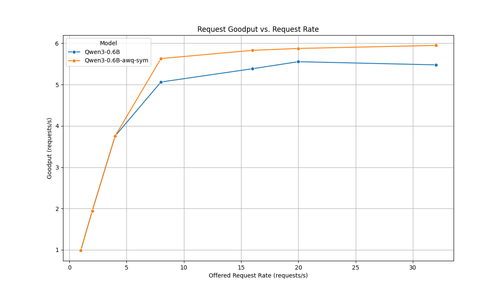
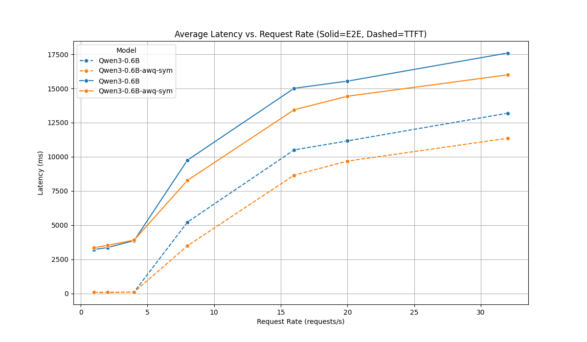

# LLM 量化与 vLLM 性能基准测试

## 项目概述

本项目提供了一个完整的工具集，用于使用**激活感知权重化 (AWQ)** 对大型语言模型 (LLM) 进行量化，并利用 `vLLM` 对其性能进行基准测试。

项目的主要目标是展示和分析与原始的 FP16 模型相比，经过 4-bit AWQ 量化后的模型所带来的性能提升。本次分析使用的模型是 `Qwen/Qwen3-0.6B`。

**核心技术:**
- **vLLM**: 用于高性能推理服务和性能基准测试（吞吐量与延迟）。
- **llmcompressor**: 一个用于执行 AWQ 一键量化的库。
- **Hugging Face `transformers`**: 用于加载基础模型和分词器。

## 项目结构

```
.
├── Qwen/Qwen3-0.6B/           # 原始 FP16 模型
├── Qwen3-0.6B-awq-sym/        # 4-bit AWQ 量化模型
├── logs/                      # 日志文件目录
├── scripts/                   # 自动化 Shell 脚本
│   ├── benchmark_through.sh
│   └── vllm_servers.sh
├── src/                       # 核心逻辑 Python 脚本
│   ├── llm_awq_copressed.py
│   └── plot_sweep_results.py
├── sweep_res/                 # 基准测试结果与图表
│   ├── awq_summary.csv
│   ├── origin_summary.csv
│   └── plots/
├── params.json                # 基准测试请求速率配置文件
└── README.md                  # 本文件
```

## 使用说明

### 1. 安装依赖

首先，请安装所需的 Python 包。本项目依赖 `vllm`, `llmcompressor`, `pandas`, `matplotlib` 和 `seaborn`。

```bash
pip install vllm llmcompressor "pandas<2.2.0" matplotlib seaborn
```

### 2. 模型量化

要创建量化模型，请运行 `llm_awq_copressed.py` 脚本。它会加载 `Qwen/Qwen3-0.6B` 基础模型，应用 AWQ 一键量化，并将结果保存到一个新目录中。

```bash
python src/llm_awq_copressed.py
```
该脚本将生成包含量化模型的 `./Qwen3-0.6B-awq-sym` 目录。

### 3. 使用 vLLM 进行基准测试

本项目主要通过 `vLLM` 实现两个功能：模型服务化和性能基准测试。

#### 模型服务化
使用 `scripts/vllm_servers.sh` 脚本（可根据需要修改模型路径）即可启动一个与 OpenAI API 兼容的推理服务。

- **运行原始模型服务:**
  ```bash
  vllm serve ./Qwen/Qwen3-0.6B
  ```
- **运行 AWQ 量化模型服务:**
  加载压缩模型时，必须添加 `--quantization compressed-tensors` 标志。
  ```bash
  vllm serve ./Qwen3-0.6B-awq-sym --quantization compressed-tensors
  ```

#### 性能基准测试
`scripts/benchmark_through.sh` 脚本可以为两个模型自动执行不同输入长度下的吞吐量测试。结果会保存到 `logs/benchmark_through.log`。下方图表所使用的 benchmark sweep 结果位于 `sweep_res/` 目录中。

```bash
bash scripts/benchmark_through.sh
```

### 4. 结果可视化

要解析基准测试生成的 CSV 摘要文件并生成性能对比图表，请运行 `plot_sweep_results.py` 脚本：

```bash
python src/plot_sweep_results.py
```
该脚本会在 `sweep_res/plots/` 目录下创建分析图表。

## 性能分析

以下图表清晰地展示了使用 4-bit AWQ 量化模型 (`Qwen3-0.6B-awq-sym`) 相较于原始 FP16 模型 (`Qwen3-0.6B`) 所带来的显著性能优势。

### 输出吞吐量 (Output Throughput)

<p align="center"></p>

**分析**: 在所有请求速率下，`awq-sym` 模型（橙色线）的输出吞吐量（每秒生成的 token 数）都高于原始模型（蓝色线）。这表明量化模型的推理速度更快，这是模型体积变小和计算量减少所带来的直接好处。在高请求速率下，性能优势愈发明显，展示了其在高负载下的效率。

### 有效吞吐量 (Request Goodput)

<p align="center"></p>

**分析**: 此图显示了服务的最大容量。`awq-sym` 模型（橙色线）在达到饱和点之前能成功处理更多的每秒请求数（更高的 goodput）。这意味着量化模型具有更高的服务容量，可以同时为更多用户提供服务而不会丢弃请求，因此在生产环境中更为稳健。

### 延迟 (Latency)

<p align="center"></p>

**分析**: `awq-sym` 模型通过降低延迟，提供了明显更好的用户体验。
- **首字延迟 (TTFT, 虚线)**: 用户能更快地看到第一个 token 的生成，改善了交互的即时感。
- **端到端延迟 (E2E, 实线)**: 接收完整响应的总时间也大大缩短。

在所有测试的请求速率下，量化模型都表现出更快的响应速度。

## 详细脚本功能解析 (scripts/ 目录下)

`scripts/` 目录下的 Shell 脚本主要围绕 `vllm` 的 `bench`（基准测试）子命令构建，旨在从不同维度评估和可视化模型的性能。

### 核心测试脚本

1.  **`benchmark_through.sh`**: **吞吐量测试**
    *   **作用**: 这是最核心的性能测试之一。它直接使用 `vllm bench throughput` 命令来评估模型在**离线（offline）模式**下的最大吞吐能力。
    *   **测试维度**:
        *   **模型**: 遍历原始模型和 AWQ 量化模型。
        *   **输入长度 (`INPUT_LENS`)**: 测试不同输入 token 长度（如 128, 1024, 2048）对性能的影响。
    *   **核心指标**: 脚本会记录并输出**每秒处理的请求数 (requests/s)** 和 **每秒输出的 token 数 (output tokens/s)**。
    *   **总结**: 此脚本用于回答“在理想条件下，我的模型处理速度有多快？”这个问题。

2.  **`latency.sh`**: **延迟测试**
    *   **作用**: 使用 `vllm bench latency` 评估在**不同批次大小（Batch Size）**下，单个请求的处理延迟。
    *   **测试维度**:
        *   **输入长度 (`INPUT_LEN`)**: 同样会遍历不同的输入长度。
        *   **批次大小 (`BATCH_SIZE`)**: 测试从 1 到 32 等不同并发批次对延迟的影响。
    *   **核心指标**: **平均延迟 (Avg latency)**，以及不同百分位（如 P90, P99）的延迟，这有助于了解延迟的稳定性和长尾效应。
    *   **总结**: 此脚本用于回答“当不同数量的请求同时到达时，用户需要等待多久才能收到响应？”。

3.  **`bench_sweep.sh`**: **服务压力扫描测试 (Sweep Test)**
    *   **作用**: 这是一个更高级、更自动化的测试。它使用 `vllm bench sweep serve` 命令来模拟一个**在线服务场景**。它会自动启动一个 vLLM 服务，然后使用 `vllm bench serve` 对这个服务发起不同速率的请求。
    *   **测试维度**:
        *   **请求速率 (`request_rate`)**: 它会读取 `params.json` 文件，自动测试从 1 到 32 等一系列递增的请求速率。
    *   **核心指标**: 生成非常详细的结果，包括吞吐量、Goodput（有效吞吐量）、各种延迟指标（TTFT, TPOT, E2E）等，并为后续的可视化分析保存完整数据。
    *   **总结**: 这是最接近真实生产环境的测试，用于全面评估模型服务在不同并发压力下的表现。`benchmark_serves.sh` 是它的一个简化版。

### 结果可视化脚本

这些脚本不执行测试，而是利用上面测试生成的结果数据来创建图表。

4.  **`quant_origin_plot.sh` & `comment_compare.sh`**: **生成对比分析图**
    *   **作用**: 使用 `vllm bench sweep plot` 命令，将 `sweep` 测试产生的结果目录（例如 `sweep_res/`）中的数据转换成直观的对比图表。
    *   **核心图表**:
        *   **TTFT 响应曲线**: 描绘了“P99 首字延迟”与“请求吞吐量”的关系，这直接关系到用户感知的即时响应速度。
        *   **有效产出对比**: 描绘了“有效吞吐量 (Goodput)”与“请求吞吐量”的关系，用于评估服务在压力下的实际处理能力和成本效益。
        *   **系统抖动分析**: 通过“TTFT 的标准差”来分析延迟的稳定性。

5.  **`sweep_plot_pareto.sh`**: **帕累托前沿分析**
    *   **作用**: 使用 `vllm bench sweep plot_pareto` 生成帕累托前沿图。
    *   **核心理念**: 在多目标优化问题中（例如，我们既希望吞吐量高，又希望延迟低），帕累托前沿代表了所有“最优”的权衡点。图上的任何一个点，都不可能在不牺牲一个指标（如吞吐量）的前提下，优化另一个指标（如延迟）。
    *   **总结**: 这个脚本帮助你找到**性能与成本（延迟）之间的最佳平衡点**，对于决定生产环境中的最佳部署配置非常有价值。

### 脚本关系总结
- `benchmark_through.sh` 和 `latency.sh` 是基础的**离线性能评估**。
- `bench_sweep.sh` 是更高级的**在线服务压力模拟**，它的产出数据最丰富。
- `quant_origin_plot.sh`, `comment_compare.sh` 和 `sweep_plot_pareto.sh` 是**数据可视化工具**，依赖于 `bench_sweep.sh` 生成的结果，用于从不同角度分析和展示性能对比。

## 总结

本项目证明了结合使用 **4-bit AWQ 量化与 vLLM** 能够带来巨大的性能提升。

- **更高的吞吐量**: 量化模型每秒能够生成更多 token，并处理更多请求，从而提高了效率。
- **更低的延迟**: 用户可以更快地获得响应，这对于交互式应用至关重要。
- **简易的集成**: vLLM 使得部署原始模型和量化模型都非常简单，对于压缩模型仅需增加一个额外标志 (`--quantization compressed-tensors`) 即可。

通过利用 AWQ 量化，开发人员可以在许多任务中显著提高其 LLM 部署的成本效益和用户体验，而不会带来明显的输出质量下降。
