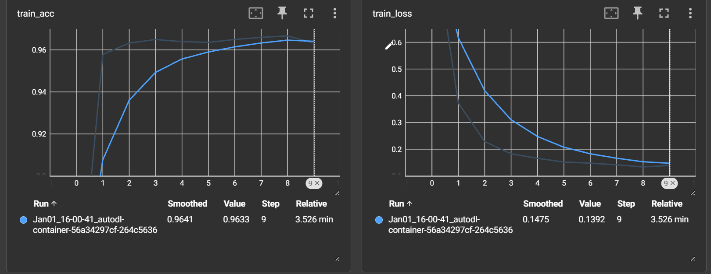
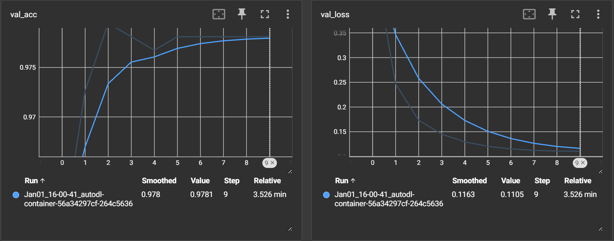

# 🌸 Vision Transformer 花卉分类项目

基于 Hugging Face ViT 模型的花卉图像分类微调与预测项目。

## 📁 项目结构

```
ViT/
├── vision_transformers/
│   ├── train.py              # 训练脚本（PyTorch）
│   ├── predict.py            # 预测脚本
│   ├── train.sh              # Linux训练启动脚本
│   ├── utils.py              # 工具函数（训练、评估）
│   ├── my_dataset.py         # 自定义数据集
│   ├── class_indices.json    # 类别映射文件
│   ├── vit_model.py          # 本地ViT模型定义
│   ├── weights/              # 训练保存的权重目录
│   ├── prediction_results/   # 预测结果图像
│   └── dataset/
│       └── flower_photos/    # 花卉数据集
│           ├── daisy/        # 雏菊
│           ├── dandelion/    # 蒲公英
│           ├── roses/        # 玫瑰
│           ├── sunflowers/   # 向日葵
│           └── tulips/       # 郁金香
├── images/
│   ├── train_loss.png        # 训练损失曲线
│   ├── valid_loss.png        # 验证损失曲线
│   └── ...
└── README.md
```

## 🌐 项目概述

本项目使用 **Vision Transformer (ViT)** 模型对5种花卉进行图像分类：

| 类别 | 名称 | 样本数 |
|------|------|--------|
| 0 | Daisy (雏菊) | ~630张 |
| 1 | Dandelion (蒲公英) | ~890张 |
| 2 | Roses (玫瑰) | ~640张 |
| 3 | Sunflowers (向日葵) | ~690张 |
| 4 | Tulips (郁金香) | ~800张 |

### 模型配置

- **预训练模型**: `google/vit-base-patch16-224-in21k` (Hugging Face)
- **输入尺寸**: 224 × 224 像素
- **Patch Size**: 16 × 16
- **序列长度**: 14 × 14 = 196 个 patches + 1 cls_token = 197
- **隐藏维度**: 768
- **Attention Heads**: 12
- **层数**: 12

## 🚀 快速开始

### 环境依赖

#### 方式一：使用 Conda 环境（推荐）

项目提供了完整的 `environment.yaml` 配置文件：

```bash
# 创建环境
conda env create -f vision_transformers/environment.yaml

# 激活环境
conda activate VLM
```

#### 方式二：pip 安装

```bash
pip install torch torchvision
pip install transformers
pip install pillow matplotlib tensorboard
```

### Conda 环境配置详情

| 软件 | 版本 |
|------|------|
| Python | 3.10.19 |
| PyTorch | 2.6.0+cu126 |
| TorchVision | 0.21.0+cu126 |
| Hugging Face Transformers | 4.57.3 |
| TensorBoard | 2.20.0 |
| Pillow | 12.0.0 |
| Matplotlib | 3.10.8 |
| NumPy | 2.2.6 |
| Tokenizers | 0.22.1 |

完整依赖见 `vision_transformers/environment.yaml`

### 数据集准备

将花卉数据集放在 `vision_transformers/dataset/flower_photos/` 目录下：

```
flower_photos/
├── daisy/
├── dandelion/
├── roses/
├── sunflowers/
└── tulips/
```

---

## 📚 训练指南

### 方式一：使用 Shell 脚本（推荐）

```bash
cd vision_transformers
chmod +x train.sh
./train.sh
```

### 方式二：直接运行 Python

```bash
cd vision_transformers
python train.py \
    --model_path google/vit-base-patch16-224-in21k \
    --num_classes 5 \
    --epochs 10 \
    --batch-size 16 \
    --lr 0.001 \
    --data-path dataset/flower_photos \
    --freeze-layers true \
    --device cuda:0
```

### 训练参数说明

| 参数 | 默认值 | 说明 |
|------|--------|------|
| `--model_path` | `google/vit-base-patch16-224-in21k` | 模型路径（Hugging Face仓库名或本地路径） |
| `--num_classes` | 5 | 分类类别数 |
| `--epochs` | 10 | 训练轮数 |
| `--batch-size` | 8 | 批次大小（根据GPU显存调整） |
| `--lr` | 0.001 | 初始学习率 |
| `--lrf` | 0.01 | 最终学习率比例（余弦退火） |
| `--data-path` | `./dataset/flower_photos` | 数据集路径 |
| `--freeze-layers` | `true` | 是否冻结backbone，只训练分类头 |
| `--device` | `cuda:0` | 训练设备 |

### 训练策略

1. **冻结训练** (`--freeze-layers true`): 只训练分类层，backbone权重冻结，适合快速适应新数据集
2. **全参数微调** (`--freeze-layers false`): 端到端训练所有参数，适合大数据集

### 学习率调度

使用余弦退火策略：
```python
lr_lambda = ((1 + cos(x * π / epochs)) / 2) * (1 - lrf) + lrf
```

---

## 🔮 预测指南

### 单张图像预测

```bash
cd vision_transformers
python predict.py --image_dir ./dataset/test_data/tulips1.png
```

### 批量预测（整个目录）

```bash
cd vision_transformers
python predict.py --image_dir ./dataset/test_data
```

### 预测参数说明

| 参数 | 默认值 | 说明 |
|------|--------|------|
| `--image_dir` | `./tulip.jpg` | 图像路径或包含图像的目录 |
| `--model_path` | `./weights/model-9.pth` | 模型权重路径 |
| `--num_classes` | 5 | 类别数 |

### 预测输出

预测结果保存在 `vision_transformers/prediction_results/` 目录：

```
prediction_results/
├── daisy1.png       # 预测结果标注在图像上
├── daisy2.png
├── dandelion1.png
├── dandelion2.png
├── rose1.png
├── rose2.png
├── sunflower1.png
├── sunflower2.png
├── tulips1.png
└── tuilps2.png
```

每张图像会显示：
- 预测类别名称
- 预测概率

---

## 📊 训练结果

### 损失曲线





### 最终性能

| 指标 | 训练集 | 验证集 |
|------|--------|--------|
| **准确率 (Acc)** | ~96.3% | ~97.8% |
| **损失值 (Loss)** | ~0.14 | ~0.11 |

### TensorBoard 日志

```bash
cd vision_transformers
tensorboard --logdir=./runs
```

训练过程中会记录以下指标：
- `train_loss` / `val_loss`: 训练/验证损失
- `train_acc` / `val_acc`: 训练/验证准确率
- `learning_rate`: 学习率变化

### 模型保存

训练过程中每个epoch会保存权重：
```
weights/
├── model-0.pth
├── model-1.pth
├── ...
└── model-9.pth   # 最终模型
```

---

## 🏗️ 模型架构

```
ViTForImageClassification
├── vit (VisionTransformer)
│   ├── embeddings: PatchEmbed + PositionEmbed + CLS Token
│   ├── encoder: 12× Layer
│   │   └── each Layer: MultiheadAttention + MLP + Layernorm
│   └── layernorm
└── classifier (Linear)
    └── 768 → 5 (num_classes)
```

### 关键组件

| 组件 | 说明 |
|------|------|
| **PatchEmbed** | 16×16卷积分块 + 线性投影 → [B, 196, 768] |
| **CLS Token** | 可学习分类标记 [1, 1, 768] |
| **Position Embedding** | 可学习位置编码 [1, 197, 768] |
| **MultiheadAttention** | 12头，768维，每头64维 |
| **MLP** | 768 → 3072 → 768，GELU激活 |
| **DropPath** | 随机深度正则化 |

---

## 💡 技术细节

### 数据增强

```python
# 训练集
transforms.RandomResizedCrop(224)    # 随机裁剪
transforms.RandomHorizontalFlip()     # 水平翻转
transforms.ToTensor()                 # 转为Tensor
transforms.Normalize([0.5, 0.5, 0.5], [0.5, 0.5, 0.5])  # 归一化

# 验证集
transforms.Resize(256)                # 缩放
transforms.CenterCrop(224)            # 中心裁剪
transforms.ToTensor()
transforms.Normalize([0.5, 0.5, 0.5], [0.5, 0.5, 0.5])
```

### 优化器配置

- **优化器**: SGD (momentum=0.9)
- **权重衰减**: 5E-5
- **学习率**: 余弦退火调度

### 冻结策略

```python
if freeze_layers:
    for name, para in model.named_parameters():
        if "classifier" not in name and "layernorm" not in name.lower():
            para.requires_grad_(False)  # 冻结backbone
```

---

## 📦 依赖包版本

### Conda 环境配置（推荐）

项目提供了完整的 `environment.yaml` 配置文件，位于 `vision_transformers/` 目录下。

```bash
# 创建 Conda 环境
conda env create -f vision_transformers/environment.yaml

# 激活环境
conda activate VLM
```

### 核心依赖版本

| 软件包 | 版本 | 说明 |
|--------|------|------|
| **Python** | 3.10.19 | 基础解释器 |
| **PyTorch** | 2.6.0+cu126 | CUDA 12.6 支持 |
| **TorchVision** | 0.21.0+cu126 | 图像处理 |
| **Transformers** | 4.57.3 | Hugging Face 库 |
| **TensorBoard** | 2.20.0 | 可视化工具 |
| **Pillow** | 12.0.0 | 图像处理 |
| **Matplotlib** | 3.10.8 | 绑图工具 |
| **NumPy** | 2.2.6 | 数值计算 |
| **Tokenizers** | 0.22.1 | 分词工具 |
| **HuggingFace Hub** | 0.36.0 | 模型下载 |

### 环境文件位置

```
vision_transformers/
└── environment.yaml    # 完整的 Conda 环境配置
```

---

## 🔧 常见问题

### 1. CUDA 内存不足

降低批次大小：
```bash
--batch-size 4
```

### 2. 预测结果异常

确保类别数与训练时一致：
```bash
--num_classes 5
```

### 3. 使用本地预训练模型

```bash
--model_path ./google/vit-base-patch16-224-in21k
```

---

## 📝 License

本项目仅供学习和研究使用。

---

## 📚 参考

- [ViT 论文](https://arxiv.org/abs/2010.11929): "An Image is Worth 16x16 Words"
- [Hugging Face ViT](https://huggingface.co/docs/transformers/model_doc/vit)
- [timm 库](https://github.com/rwightman/pytorch-image-models)
