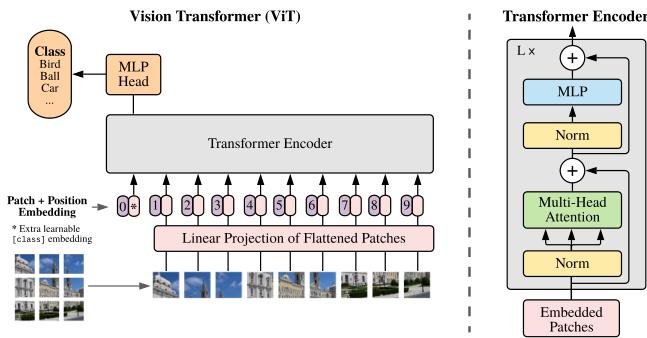
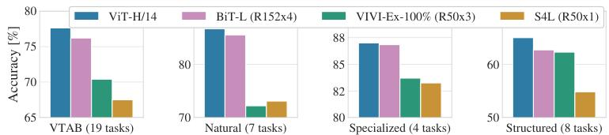
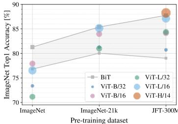
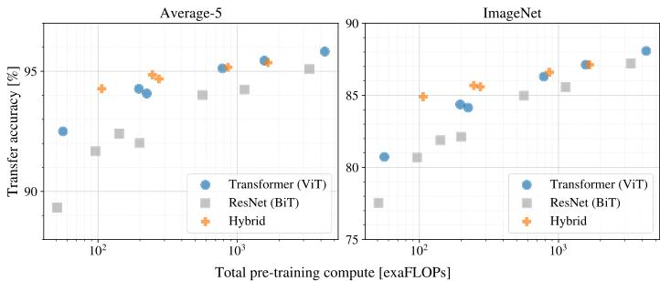

# Vision Transformer (ViT) 原理与代码详解

> 基于论文：《AN IMAGE IS WORTH 16X16 WORDS: TRANSFORMERS FOR IMAGE RECOGNITION AT SCALE》
> 
> Alexey Dosovitskiy et al., Google Research, 2020

---

## 一、为什么需要ViT？

### 1.1 背景与问题

| 领域 | 现状 |
|------|------|
| **NLP领域** | Transformer已成为标准架构，通过大规模预训练+微调范式取得巨大成功（BERT、GPT系列） |
| **CV领域** | 仍由CNN主导（ResNet、VGG等），Transformer仅作为辅助组件 |

**现有尝试的局限**：
- 将注意力机制与CNN结合，或用注意力替代CNN的某些组件
- 纯注意力模型理论上高效，但因特殊注意力模式难以在现代硬件上有效扩展
- 在大规模图像识别中，经典ResNet架构仍是SOTA

### 1.2 核心洞见

> **不需要依赖CNN，直接将标准Transformer应用于图像块序列就能在图像分类任务上表现优异。**

关键突破：
- **大规模预训练**：当在足够大的数据集（14M-300M图像）上预训练时，ViT能够达到或超越SOTA卷积网络
- **计算效率**：训练所需计算资源显著少于同类CNN模型

---

## 二、ViT基本构造

### 2.1 核心思想：将图像视为"词"序列

```
┌─────────────────────────────────────────────────────────────┐
│                    ViT核心创新                               │
├─────────────────────────────────────────────────────────────┤
│  输入图像 (H×W×C)                                           │
│        ↓                                                    │
│  分割为固定大小的块 (P×P像素)                                │
│        ↓                                                    │
│  每个块展平并线性投影到D维空间                                │
│        ↓                                                    │
│  序列向量 → 标准Transformer编码器                            │
│        ↓                                                    │
│  分类预测                                                   │
└─────────────────────────────────────────────────────────────┘
```

### 2.2 图像分块（Patch Embedding）

将输入图像 `x ∈ R^(H×W×C)` 分割为固定大小的块：

- 每个块大小为 `P × P` 像素（如16×16）
- 得到 `N = HW/P²` 个块（如224×224/16×16=196个块）
- 将每个块展平并线性投影到维度D的空间

```math
\mathbf{x}_p \in \mathbb{R}^{N \times (P^2 \cdot C)} \quad \text{投影后} \quad \mathbf{E} \in \mathbb{R}^{(P^2 \cdot C) \times D}
```

### 2.3 位置编码（Position Embedding）

- 为保留空间位置信息，添加可学习的位置嵌入 `E_pos ∈ R^(N+1)×D`
- 实验表明，简单的1D位置嵌入已足够，更复杂的2D感知嵌入并未带来显著提升

### 2.4 分类标记（Classification Token）

借鉴BERT的[class]标记：
- 在序列前添加一个可学习的嵌入
- 该标记在Transformer编码器输出端的状态作为图像的整体表示
- 分类头基于此表示进行预测

---

## 三、ViT整体架构

### 3.1 架构概览

<div align="center">
  
</div>

**数据流**：
```
输入图像 (3×224×224)
    ↓
Patch Embedding (Conv2d: 16×16, stride=16)
    ↓
[B, 196, 768] + cls_token + pos_embed → [B, 197, 768]
    ↓
Transformer Encoder (12层)
    ↓
LayerNorm → 提取cls_token
    ↓
分类头 (MLP/Linear)
    ↓
输出预测
```

### 3.2 数学公式

完整的前向传播过程：

```math
\begin{align*}
& \mathbf{z}_0 = [\mathbf{x}_{\text{class}}; \mathbf{x}_p^1\mathbf{E}; \cdots; \mathbf{x}_p^N\mathbf{E}] + \mathbf{E}_{\text{pos}} \\
& \mathbf{z'}_\ell = \text{MSA}(\text{LN}(\mathbf{z}_{\ell-1})) + \mathbf{z}_{\ell-1}, \quad \ell = 1\ldots L \\
& \mathbf{z}_\ell = \text{MLP}(\text{LN}(\mathbf{z'}_\ell)) + \mathbf{z'}_\ell \\
& \mathbf{y} = \text{LN}(\mathbf{z}_L^0)
\end{align*}
```

### 3.3 Transformer编码器层

每层包含两个核心模块：

| 模块 | 公式 | 功能 |
|------|------|------|
| **MSA（多头自注意力）** | `z'_ℓ = MSA(LN(z_{ℓ-1})) + z_{ℓ-1}` | 全局信息建模 |
| **MLP（前馈网络）** | `z_ℓ = MLP(LN(z'_ℓ)) + z'_ℓ` | 特征变换 |

**关键设计**：
- **LayerNorm**：在每个块之前应用（Pre-Norm，训练更稳定）
- **残差连接**：在每个块之后应用
- **GELU激活**：论文指定的非线性激活函数

---

## 四、模型变体配置

### 4.1 模型规模（对应论文Table 1）

| 模型 | 层数(L) | 隐藏维度(D) | MLP大小 | 注意力头数 | 参数量 |
|------|---------|-------------|---------|------------|--------|
| **ViT-Base** | 12 | 768 | 3072 | 12 | 86M |
| **ViT-Large** | 24 | 1024 | 4096 | 16 | 307M |
| **ViT-Huge** | 32 | 1280 | 5120 | 16 | 632M |

### 4.2 命名规则

`ViT-L/16` 表示：
- **L**：Large变体
- **16**：输入块大小为16×16像素

**计算复杂度注意**：序列长度与块大小的平方成反比，块越小计算成本越高。

### 4.3 归纳偏置对比

| 特性 | CNN | ViT |
|------|-----|-----|
| **局部性** | 卷积核关注局部区域 ✓ | 仅MLP层具有局部性 |
| **平移等变性** | 贯穿整个网络 ✓ | 仅MLP层具有 |
| **二维邻域结构** | 深层网络保持 ✓ | 仅在初始分块时使用 |
| **全局建模能力** | 需堆叠多层 ✓ | 自注意力天然全局 |

---

## 五、代码实现详解

### 5.1 核心类结构映射

| 代码类 | 论文组件 | 功能说明 |
|--------|----------|----------|
| `PatchEmbed` | Patch Embedding | 图像分块 + 线性投影 |
| `Attention` | Multi-Head Self-Attention | 多头自注意力机制 |
| `Mlp` | MLP Block | 前馈神经网络 |
| `Block` | Transformer Encoder Layer | 单层Transformer编码器 |
| `VisionTransformer` | 完整ViT模型 | 整体架构组装 |
| `DropPath` | Stochastic Depth | 随机深度正则化 |

### 5.2 PatchEmbed：图像分块与嵌入

```python
class PatchEmbed(nn.Module):
    """
    2D Image to Patch Embedding
    """
    def __init__(self, img_size=224, patch_size=16, in_c=3, embed_dim=768):
        super().__init__()
        img_size = (img_size, img_size)
        patch_size = (patch_size, patch_size)
        self.img_size = img_size
        self.patch_size = patch_size
        # 计算分块数量：224/16 = 14 → 14×14 = 196
        self.grid_size = (img_size[0] // patch_size[0], img_size[1] // patch_size[1])
        self.num_patches = self.grid_size[0] * self.grid_size[1]

        # 使用卷积实现分块+投影！工程优化技巧
        self.proj = nn.Conv2d(in_c, embed_dim, kernel_size=patch_size, stride=patch_size)
        self.norm = norm_layer(embed_dim) if norm_layer else nn.Identity()

    def forward(self, x):
        B, C, H, W = x.shape
        assert H == self.img_size[0] and W == self.img_size[1]

        # Conv2d: [B, 3, 224, 224] → [B, 768, 14, 14]
        # flatten + transpose: → [B, 196, 768]
        x = self.proj(x).flatten(2).transpose(1, 2)
        x = self.norm(x)
        return x
```

**实现亮点**：
- **卷积替代展平**：用 `Conv2d(kernel_size=16, stride=16)` 一次性完成分块和线性投影
- **计算效率**：相比先分块再全连接，卷积实现更高效且内存友好
- **输出维度**：`[B, 768, 14, 14]` → flatten → `[B, 196, 768]`

### 5.3 Attention：多头自注意力

```python
class Attention(nn.Module):
    def __init__(self,
                 dim,   # 输入token的dim
                 num_heads=8,
                 qkv_bias=False,
                 qk_scale=None,
                 attn_drop_ratio=0.,
                 proj_drop_ratio=0.):
        super(Attention, self).__init__()
        self.num_heads = num_heads
        head_dim = dim // num_heads
        self.scale = qk_scale or head_dim ** -0.5
        self.qkv = nn.Linear(dim, dim * 3, bias=qkv_bias)
        self.attn_drop = nn.Dropout(attn_drop_ratio)
        self.proj = nn.Linear(dim, dim)
        self.proj_drop = nn.Dropout(proj_drop_ratio)

    def forward(self, x):
        # [batch_size, num_patches + 1, total_embed_dim]
        B, N, C = x.shape

        # qkv(): -> [batch_size, num_patches + 1, 3 * total_embed_dim]
        # reshape: -> [batch_size, num_patches + 1, 3, num_heads, embed_dim_per_head]
        # permute: -> [3, batch_size, num_heads, num_patches + 1, embed_dim_per_head]
        qkv = self.qkv(x).reshape(B, N, 3, self.num_heads, C // self.num_heads).permute(2, 0, 3, 1, 4)
        # [batch_size, num_heads, num_patches + 1, embed_dim_per_head]
        q, k, v = qkv[0], qkv[1], qkv[2]  # make torchscript happy (cannot use tensor as tuple)

        # transpose: -> [batch_size, num_heads, embed_dim_per_head, num_patches + 1]
        # @: multiply -> [batch_size, num_heads, num_patches + 1, num_patches + 1]
        attn = (q @ k.transpose(-2, -1)) * self.scale
        attn = attn.softmax(dim=-1)
        attn = self.attn_drop(attn)

        # @: multiply -> [batch_size, num_heads, num_patches + 1, embed_dim_per_head]
        # transpose: -> [batch_size, num_patches + 1, num_heads, embed_dim_per_head]
        # reshape: -> [batch_size, num_patches + 1, total_embed_dim]
        x = (attn @ v).transpose(1, 2).reshape(B, N, C)
        x = self.proj(x)
        x = self.proj_drop(x)
        return x
```

### 5.4 Mlp：前馈网络

```python
class Mlp(nn.Module):
    """
    MLP as used in Vision Transformer
    """
    def __init__(self, in_features, hidden_features=None, out_features=None, 
                 act_layer=nn.GELU, drop=0.):
        super().__init__()
        out_features = out_features or in_features
        hidden_features = hidden_features or in_features
        # MLP比例：4×嵌入维度
        self.fc1 = nn.Linear(in_features, hidden_features)   # 768 → 3072
        self.act = act_layer()                               # GELU激活
        self.fc2 = nn.Linear(hidden_features, out_features)  # 3072 → 768
        self.drop = nn.Dropout(drop)

    def forward(self, x):
        x = self.fc1(x)
        x = self.act(x)
        x = self.drop(x)
        x = self.fc2(x)
        x = self.drop(x)
        return x
```

### 5.5 Block：Transformer编码器层

```python
class Block(nn.Module):
    def __init__(self, dim, num_heads, mlp_ratio=4., drop_path_ratio=0.):
        super(Block, self).__init__()
        self.norm1 = norm_layer(dim)  # 前置LayerNorm
        self.attn = Attention(dim, num_heads=num_heads, 
                             qkv_bias=qkv_bias, qk_scale=qk_scale,
                             attn_drop_ratio=attn_drop_ratio, 
                             proj_drop_ratio=drop_ratio)
        # 随机深度
        self.drop_path = DropPath(drop_path_ratio) if drop_path_ratio > 0. else nn.Identity()
        self.norm2 = norm_layer(dim)
        mlp_hidden_dim = int(dim * mlp_ratio)
        self.mlp = Mlp(in_features=dim, hidden_features=mlp_hidden_dim, 
                      act_layer=act_layer, drop=drop_ratio)

    def forward(self, x):
        # Pre-Norm结构 + 残差连接
        x = x + self.drop_path(self.attn(self.norm1(x)))
        x = x + self.drop_path(self.mlp(self.norm2(x)))
        return x
```

**对应论文公式**：
```math
\begin{align*}
& \mathbf{z'}_\ell = \text{MSA}(\text{LN}(\mathbf{z}_{\ell-1})) + \mathbf{z}_{\ell-1} \\
& \mathbf{z}_\ell = \text{MLP}(\text{LN}(\mathbf{z'}_\ell)) + \mathbf{z'}_\ell
\end{align*}
```

### 5.6 VisionTransformer：整体组装

```python
class VisionTransformer(nn.Module):
    def __init__(self, img_size=224, patch_size=16, in_c=3, num_classes=1000,
                 embed_dim=768, depth=12, num_heads=12, mlp_ratio=4.0, 
                 drop_ratio=0., attn_drop_ratio=0., drop_path_ratio=0.):
        
        super(VisionTransformer, self).__init__()
        self.num_classes = num_classes
        self.embed_dim = embed_dim
        
        # 1. Patch Embedding层
        self.patch_embed = PatchEmbed(img_size=img_size, patch_size=patch_size,
                                     in_c=in_c, embed_dim=embed_dim)
        num_patches = self.patch_embed.num_patches  # 196
        
        # 2. 可学习参数
        # 分类标记 [1, 1, 768]
        self.cls_token = nn.Parameter(torch.zeros(1, 1, embed_dim))
        # 位置编码 [1, 197, 768]
        self.pos_embed = nn.Parameter(torch.zeros(1, num_patches + 1, embed_dim))
        self.pos_drop = nn.Dropout(p=drop_ratio)

        # 3. 随机深度衰减规则
        dpr = [x.item() for x in torch.linspace(0, drop_path_ratio, depth)]
        
        # 4. Transformer编码器堆叠
        self.blocks = nn.Sequential(*[
            Block(dim=embed_dim, num_heads=num_heads, mlp_ratio=mlp_ratio,
                  drop_path_ratio=dpr[i], ...)
            for i in range(depth)
        ])
        
        # 5. 最终归一化
        self.norm = norm_layer(embed_dim)
        
        # 6. 分类头
        self.head = nn.Linear(embed_dim, num_classes) if num_classes > 0 else nn.Identity()

    def forward_features(self, x):
        # 1. Patch Embedding: [B, 3, 224, 224] → [B, 196, 768]
        x = self.patch_embed(x)
        
        # 2. 添加分类标记: [B, 196, 768] → [B, 197, 768]
        cls_token = self.cls_token.expand(x.shape[0], -1, -1)
        x = torch.cat((cls_token, x), dim=1)
        
        # 3. 添加位置编码 + Dropout
        x = self.pos_drop(x + self.pos_embed)
        
        # 4. 通过Transformer编码器堆叠
        x = self.blocks(x)
        
        # 5. 最终LayerNorm，提取分类标记
        x = self.norm(x)
        return x[:, 0]  # [B, 768]

    def forward(self, x):
        x = self.forward_features(x)
        x = self.head(x)
        return x
```

**数据流追踪**（以ViT-B/16为例）：

```
输入: [B, 3, 224, 224]
    ↓ PatchEmbed (Conv2d 16×16)
[B, 196, 768]  # 14×14=196个patch
    ↓ 添加cls_token
[B, 197, 768]  # 196+1=197个token
    ↓ + pos_embed + Dropout
[B, 197, 768]
    ↓ 12个Block (每个包含MSA + MLP)
[B, 197, 768]
    ↓ LayerNorm + 提取cls_token
[B, 768]
    ↓ 分类头 (Linear)
输出: [B, num_classes]
```

---

## 六、工程实现细节

### 6.1 权重初始化策略

```python
def _init_vit_weights(m):
    if isinstance(m, nn.Linear):
        nn.init.trunc_normal_(m.weight, std=.01)  # 截断正态分布
        if m.bias is not None:
            nn.init.zeros_(m.bias)
    elif isinstance(m, nn.Conv2d):
        nn.init.kaiming_normal_(m.weight, mode="fan_out")
        if m.bias is not None:
            nn.init.zeros_(m.bias)
    elif isinstance(m, nn.LayerNorm):
        nn.init.zeros_(m.bias)
        nn.init.ones_(m.weight)
```

### 6.2 随机深度（Stochastic Depth）

```python
def drop_path(x, drop_prob: float = 0., training: bool = False):
    if drop_prob == 0. or not training:
        return x
    keep_prob = 1 - drop_prob
    shape = (x.shape[0],) + (1,) * (x.ndim - 1)
    random_tensor = keep_prob + torch.rand(shape, dtype=x.dtype, device=x.device)
    random_tensor.floor_()
    output = x.div(keep_prob) * random_tensor
    return output

class DropPath(nn.Module):
    def __init__(self, drop_prob: float):
        super().__init__()
        self.drop_prob = drop_prob

    def forward(self, x):
        return drop_path(x, self.drop_prob, self.training)
```

**作用**：随机丢弃整个Transformer块，增强泛化能力，类似ResNet的随机深度

### 6.3 模型变体工厂函数

```python
def vit_base_patch16_224(num_classes=1000):
    """ViT-Base (86M参数)"""
    model = VisionTransformer(
        img_size=224, patch_size=16,
        embed_dim=768,      # Base
        depth=12,           # 12层
        num_heads=12,       # 12头
        num_classes=num_classes
    )
    return model

def vit_large_patch16_224(num_classes=1000):
    """ViT-Large (307M参数)"""
    model = VisionTransformer(
        embed_dim=1024,     # Large
        depth=24,           # 24层
        num_heads=16,       # 16头
        ...
    )
    return model
```

---

## 七、代码与论文的差异

| 特性 | 论文描述 | 代码实现 |
|------|----------|----------|
| **归一化位置** | Post-Norm（LayerNorm在残差后） | Pre-Norm（LayerNorm在注意力/MLP前） |
| **原因** | 原始Transformer设计 | Pre-Norm训练更稳定 |
| **分类头** | 预训练用MLP，微调用线性层 | 通过`representation_size`参数控制 |
| **位置编码** | 1D可学习 | 1D可学习参数 |


---

## 八、性能对比

### 8.1 实验结果

| 模型 | ImageNet | CIFAR-100 | VTAB | 预训练计算 |
|------|----------|-----------|------|------------|
| ViT-H/14 | 88.55% | 94.55% | 77.63% | 2.5k TPUv3-days |
| ViT-L/16 | 87.76% | 93.90% | 76.28% | 0.68k TPUv3-days |
| BiT-L | 87.54% | 93.51% | 76.29% | 9.9k TPUv3-days |
| Noisy Student | 88.5% | - | - | 12.3k TPUv3-days |

### 8.2 关键发现

1. **大数据集优势**：ViT在大规模数据集（JFT-300M）上预训练时显著优于CNN
2. **计算效率**：ViT使用约2-4倍更少的计算资源达到相同性能
3. **数据效率**：在小数据集上，CNN（ResNet）因归纳偏置表现更好


<div align="center">
  
  <p>VTAB性能分解</p>
</div>

### 8.3 预训练数据规模影响


<div align="center">
  
  
  <p>线性评估 vs 预训练数据规模（左）性能 vs 计算成本（右边）</p>
</div>

- ResNets在小数据集上表现更好，但很快达到瓶颈
- ViT在小数据集上因缺乏归纳偏置表现较差，但在大数据集上超越ResNet

---

## 九、总结

### 9.1 核心贡献

1. **纯Transformer应用于视觉**：证明直接应用标准Transformer到图像块序列即可达到SOTA
2. **简洁设计**：最小化图像特定修改，只需分块+位置编码
3. **规模效应**：大规模预训练是ViT成功的关键
4. **计算效率**：相比CNN，在相同性能下计算成本更低

### 9.2 架构映射总览

| 论文概念 | 代码实现 | 关键参数 |
|----------|----------|----------|
| 图像分块 | `PatchEmbed` + `Conv2d` | `patch_size=16` |
| 线性投影 | `nn.Linear` (通过卷积实现) | `embed_dim=768` |
| 位置编码 | `self.pos_embed` | 可学习参数 |
| 分类标记 | `self.cls_token` | `[1, 1, 768]` |
| Transformer层 | `Block` × 12/24/32 | `depth=12` |
| 多头注意力 | `Attention`类 | `num_heads=12` |
| MLP块 | `Mlp`类 | `mlp_ratio=4.0` |
| 残差连接 | `x + drop_path(...)` | 隐式实现 |
| 分类头 | `self.head` | `nn.Linear` |

### 9.3 设计哲学

- **模块化**：每个组件独立成类，便于调试和修改
- **可配置**：通过参数控制模型规模（Base/Large/Huge）
- **工程优化**：卷积实现分块、Pre-Norm结构、随机深度等
- **可扩展**：支持蒸馏（dist_token）、表征层（pre_logits）等扩展

---

## 参考

- 论文：Dosovitskiy et al., "An Image is Worth 16x16 Words: Transformers for Image Recognition at Scale", ICLR 2021
- 代码参考：https://github.com/rwightman/pytorch-image-models (timm)
- 训练参考：[vision transformer](https://github.com/WZMIAOMIAO/deep-learning-for-image-processing/tree/master/pytorch_classification/vision_transformer)
