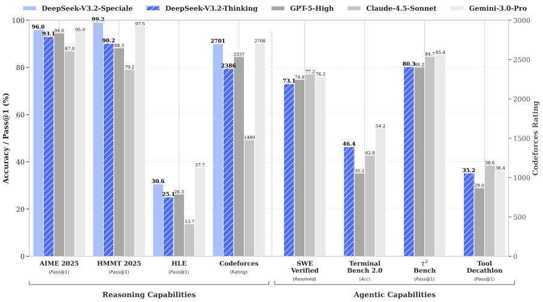
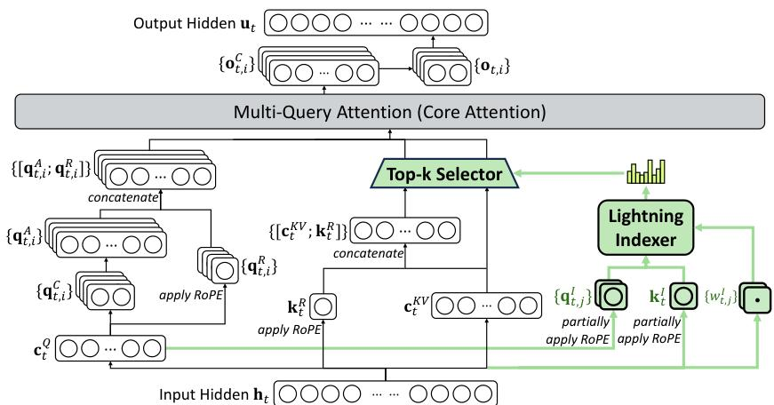
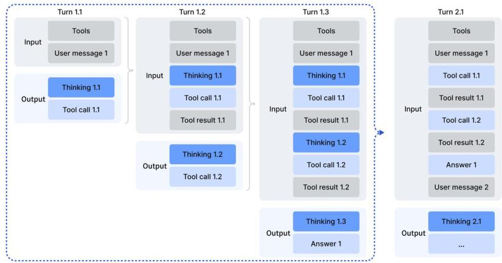

# DeepSeek-V3.2 技术架构深度解读

## 引言

DeepSeek-V3.2 是一个在计算效率与模型性能之间取得卓越平衡的大语言模型。其核心思想可以概括为 **“降本增效，再投资”**。首先，通过引入创新的 **DeepSeek 稀疏注意力 (DSA)** 机制，大幅降低长序列推理的计算复杂度；然后，将节省下来的计算资源“再投资”到更大规模、更稳定的强化学习后训练阶段，从而显著提升模型的推理和 Agent (智能体) 能力。

本报告将结合官方技术报告和模型代码，对该模型的技术架构，特别是其核心的 DSA 机制，进行深入解读。


*图 1: DeepSeek-V3.2 与其他主流模型的性能对比*

---

## 第 1 章: 核心架构演进：从 MLA 到 DSA

传统 Transformer 模型中的自注意力机制具有 $O(L^2)$ 的计算和存储复杂度（L为序列长度），这在处理长序列时会成为严重的性能瓶颈。

DeepSeek-V3.2 的前身 V3.1 采用了 **MLA (Multi-Head Latent Attention)** 机制，通过低秩分解等方式进行优化。而 V3.2 在此基础上引入了革命性的 **DSA (DeepSeek Sparse Attention)**，将复杂度进一步降低到 $O(L \cdot k)$，其中 $k$ 是一个远小于 $L$ 的常数。

## 第 2 章: DSA (DeepSeek Sparse Attention) 架构详解

DSA 的设计哲学并非完全抛弃我们熟悉的 Softmax 注意力，而是在其之上增加了一个高效的“预筛选”步骤。它由两大核心组件构成。

### 2.1. 闪电索引器 (Lightning Indexer)

这是 DSA 的灵魂，它的目标是在进行昂贵的完整注意力计算之前，快速地为每个查询（query）token 找出序列中最相关的 `k` 个键值（key-value）token。

#### 底层原理

索引器会计算一个索引分数 $I_{t,s}$，代表第 $t$ 个 query token $\mathbf{h}_t$ 和前面第 $s$ 个 key token $\mathbf{h}_s$ 的相关性。其计算公式如下（技术报告 Eq. 1）：

$$I_{t,s} = \sum_{j = 1}^{H^l}w_{t,j}^l\cdot \mathrm{ReLU}\left(\mathbf{q}_{t,j}^l\cdot \mathbf{k}_s^l\right)$$

- $H^l$ 是索引器的头数。
- $\mathbf{q}_{t,j}^l$ 和 $w_{t,j}^l$ 是从 query token $\mathbf{h}_t$ 衍生出的查询向量和头权重。
- $\mathbf{k}_s^l$ 是从 key token $\mathbf{h}_s$ 衍生出的键向量。

这个计算过程非常高效，因为它：
1.  使用了独立的、维度较低的 Q/K 投影。
2.  在实际工程中，大量计算是在 FP8 低精度下完成的。
3.  使用了计算开销极低的 ReLU 激活函数。

### 2.2. 细粒度 Token 选择 (Fine-grained Token Selection)

在索引器计算出所有 key token 的分数后，该机制只为每个 query token 挑选出分数最高的 `top-k` 个 key-value 对。随后的主注意力计算将只在这个稀疏的集合上进行。

$$ \mathbf{u}_t = \mathrm{Attn}\big(\mathbf{h}_t,\{\mathbf{c}_s\mid I_{t,s}\in \mathrm{Top - k}(I_{t,:})\}\big) $$
*技术报告 Eq. 2*

### 2.3. DSA 与 MLA 的集成

在 DeepSeek-V3.2 中，DSA 并非一个独立的层，而是被巧妙地**实例化在 MLA 模块内部**。这种设计使得模型可以从 V3.1 的检查点继续训练。


*图 2: DeepSeek-V3.2 的注意力架构，DSA（绿色部分）被集成在 MLA 内部，负责筛选出 top-k 的 key-value 条目*

---

## 第 3 章: 模型核心模块代码与 Shape 变化解析

下面我们结合简化版的模型代码，详细分析在前向传播过程中，`Indexer` 和 `MLA` 模块内部张量（Tensor）的形状（Shape）是如何变化的。

**设定**: 批大小(B)=2, 序列长度(L)=128, 模型维度(D)=512, Top-K(K)=128, Indexer头数(H_i)=8, Indexer头维度(d_i)=32, MLA头数(H_m)=8, MLA头维度(d_qk)=64。

### 3.1. Indexer 工作流程与 Shape 变化

`Indexer` 的目标是输出一个形状为 `[B, L, K]` 的“白名单”索引。

```python
class Indexer(torch.nn.Module):
    # ...
    def forward(self, x: torch.Tensor, qr: torch.Tensor, freqs_cis: torch.Tensor, mask: Optional[torch.Tensor]):
        # 输入 x shape: [B, L, D] -> [2, 128, 512]
        # 输入 qr shape: [B, L, R_q] -> [2, 128, 64] (假设R_q=64)
        bsz, seqlen, _ = x.size()

        # 1. 计算索引器的Q和K
        # q shape: [B, L, H_i, d_i] -> [2, 128, 8, 32]
        q = self.wq_b(qr).view(bsz, seqlen, self.n_heads, self.head_dim)
        # k shape: [B, L, d_i] -> [2, 128, 32]
        k = self.k_norm(self.wk(x))
        # ... 经过位置编码和旋转后，Shape不变 ...

        # 2. 索引分数计算 (替代fp8_index CUDA核)
        # q: [2, 128, 8, 32] (b, t, h, d)
        # k: [2, 128, 32]   (b, s, d)
        # scores_per_head shape: [b, t, s, h] -> [2, 128, 128, 8]
        scores_per_head = torch.einsum('bthd,bsd->btsh', q, k)
        scores_per_head = F.relu(scores_per_head)

        # weights shape: [b, t, h] -> [2, 128, 8]
        weights = self.weights_proj(x)
        
        # 加权求和得到最终分数
        # index_score shape: [b, t, s] -> [2, 128, 128]
        index_score = torch.einsum('btsh,bth->bts', scores_per_head, weights) * self.softmax_scale
        
        # ...

        # 3. 选出 top-k
        # topk_indices shape: [B, L, K] -> [2, 128, 128]
        topk_indices = index_score.topk(min(self.index_topk, seqlen), dim=-1)[1]
        
        return topk_indices
```

### 3.2. MLA 工作流程与 Shape 变化

`MLA` 作为主注意力模块，利用 `Indexer` 的结果来实现稀疏计算。

```python
class MLA(nn.Module):
    # ...
    def forward(self, x: torch.Tensor, freqs_cis: torch.Tensor, mask: Optional[torch.Tensor]):
        # 输入 x shape: [B, L, D] -> [2, 128, 512]
        bsz, seqlen, _ = x.size()

        # 1. 计算低秩表示 qr，并准备自己的 Q, K, V
        # qr shape: [B, L, R_q] -> [2, 128, 64]
        qr = self.q_norm(self.wq_a(x))
        # q shape: [B, L, H_m, d_qk] -> [2, 128, 8, 64]
        q = self.wq_b(qr).view(bsz, seqlen, self.n_heads, self.qk_head_dim)
        # k shape: [B, L, H_m, d_qk] -> [2, 128, 8, 64]
        # v shape: [B, L, H_m, d_v] -> [2, 128, 8, 64]
        
        # --- DSA 集成点 ---
        # 2. 调用 Indexer 获取 top-k 索引
        # topk_indices shape: [B, L, K] -> [2, 128, 128]
        topk_indices = self.indexer(x, qr, freqs_cis, mask)

        # 3. 根据索引创建稀疏注意力掩码
        # index_mask shape: [B, L, L] -> [2, 128, 128]
        # 掩码中，top-k位置为0，其余位置为-inf
        index_mask = torch.full((bsz, seqlen, seqlen), float("-inf"), device=x.device)
        index_mask.scatter_(-1, topk_indices, 0)
        
        if mask is not None:
            index_mask += mask # 加上上三角因果掩码

        # 4. 稀疏注意力计算
        # scores shape: [b, s, h, t] -> [2, 128, 8, 128]
        scores = torch.einsum("bshd,bthd->bsht", q, k) * self.softmax_scale
        
        # 5. 应用稀疏掩码
        # index_mask: [2, 128, 128] -> unsqueeze后 [2, 128, 1, 128]
        # 广播到所有注意力头 H_m
        scores += index_mask.unsqueeze(2) 
        scores = F.softmax(scores, dim=-1) # 非top-k位置权重变为0

        # 6. 加权求和，得到最终输出
        # output shape: [B, L, H_m, d_v] -> [2, 128, 8, 64]
        output = torch.einsum("bsht,bthd->bshd", scores, v)
        
        # 7. 最终投影回主维度
        # output shape: [B, L, D] -> [2, 128, 512]
        output = self.wo(output.flatten(2))

        return output
```

---

## 第 4 章: 后训练 (Post-Training) 框架

后训练是 DeepSeek-V3.2 实现强大推理和 Agent 能力的关键阶段，它将模型能力推向了新的高度。

### 4.1. 针对 DSA 的持续预训练

为了让模型从 DeepSeek-V3.1 的稠密注意力平滑过渡到 V3.2 的稀疏注意力，训练分为两个关键阶段：
1.  **稠密预热 (Dense Warm-up Stage)**: 冻结主模型，只训练 `Indexer`。目标是让 `Indexer` 的输出分布模仿 DeepSeek-V3.1 原有主注意力模块的分布。损失函数为：
    $$ \mathcal{L}^{I} = \sum_{t}\mathbb{D}_{\mathrm{KL}}(p_{t,:}\| \mathrm{Softmax}(I_{t,:})) $$
2.  **稀疏训练 (Sparse Training Stage)**: 激活 DSA 的 Top-K 选择机制，并训练所有参数。`Indexer` 的损失函数只在被选中的 token 集合 $S_t$ 上计算：
    $$ \mathcal{L}^{I} = \sum_{t}\mathbb{D}_{\mathrm{KL}}(p_{t,S_{t}}\| \mathrm{Softmax}(I_{t,S_{t}})) $$

### 4.2. 规模化强化学习 (Scaling RL)

模型在 RL 阶段投入了超过预训练成本 10% 的巨大算力，并发展出一套稳定扩展 RL 的方法论，主要包括：

*   **无偏 KL 估计**: 修正 KL 散度计算，提供更稳定的梯度。
*   **保持路由**: 针对 MoE 模型，强制训练时使用与数据生成时相同的专家路由路径，避免参数空间突变。
*   **保持采样掩码**: 在训练时应用数据生成阶段的 top-p/top-k 采样掩码，保证重要性采样的有效性。

#### 4.2.1. GRPO 中的“离策略序列掩码 (Off-Policy Sequence Masking)”

这个掩码机制是为提升强化学习（RL）**训练稳定性**而设计的一个精巧改进。

##### 问题背景：为何需要掩码？

在 RL 训练中，通常会用一个“旧”策略（`π_old`）生成一批数据，然后用这批数据对“新”策略（`π_θ`，即当前模型）进行多次梯度更新。随着 `π_θ` 被更新，它与 `π_old` 的差异会越来越大，但它仍在使用旧数据学习，这就是所谓的 **“离策略 (Off-Policy)”** 问题。

学习一个奖励为负（即“坏”的例子）的样本本身是没问题的，但如果这个样本对于当前的新策略来说又是一个极小概率事件（即离策略程度很高），那么模型为了拟合这个“又坏又怪”的样本，可能会产生一次非常大的、不稳定的梯度更新，好比为了纠正一个极端罕见的错误而矫枉过正，从而破坏整个训练过程。

##### 掩码机制的解决方案

该机制会精准地识别出同时满足以下两个条件的“有害序列”：

1.  **奖励为负**: 该序列的优势函数 $\hat{A}_{i,t} < 0$，意味着它是一个比平均水平要差的“坏答案”。
2.  **离策略程度高**: 当前策略 `π_θ` 与旧策略 `π_old` 的 KL 散度超过了预设的阈值 $\delta$，意味着这个“坏答案”对于当前模型来说非常“陌生”或“奇葩”。

当一个序列同时满足这两个条件时，掩码 $M_{i,t}$ 就被置为 0，这个序列对损失函数的贡献就**被忽略了**。

**直观理解**: 模型仿佛在说：“我需要从错误中学习，但如果某个错误实在太‘离谱’了（离策略程度高），那它可能只是个噪音，学习它反而有害无益。我暂时先忽略这个‘离谱的错误’，专注于学习那些更普遍、更有价值的错误。”

其损失函数公式中的应用如下：
$$ \mathcal{I}_{\mathrm{GRPO}}(\theta) = \mathbb{E}[\dots] \left[ \min(\dots)M_{i,t} - \beta \mathbb{D}_{\mathrm{KL}}(\dots) \right] $$
其中掩码 $M_{i,t}$ 的定义为：
$$ M_{i,t} = \begin{cases} 0 & \text{if } \hat{A}_{i,t}< 0 \text{ and } \frac{1}{|o_{i}|}\sum \log \frac{\pi_{\mathrm{old}}}{\pi_{\theta}} >\delta \\ 1 & \text{otherwise} \end{cases} $$

### 4.3. “在思考中工具使用” (Thinking in Tool-Use)

这是 Agent 能力构建的核心，通过“冷启动”和“大规模 Agent 任务合成”的流水线，系统性地将模型的推理能力（CoT）与 Agent 的工具调用能力相结合。


*图 4: 在工具调用场景下的思维链保留机制*

#### 4.3.1. Agent 能力的具体提升路径

Agent 能力的提升是一个系统工程，主要分为“冷启动”和“大规模合成”两个阶段，最终通过 RL 训练实现能力飞跃。

##### 第一步：冷启动 (Cold-Start) - 弥合能力鸿沟

*   **问题**: 模型已有的数据集中，“推理数据”（如数学题解答，包含 `<think>` 标签）和“工具使用数据”（调用 API）是相互独立的。模型并不知道如何在“思考”的过程中去“使用工具”。
*   **解决方案**: 通过**精心设计的混合式 Prompt** 来引导模型。具体做法是创建一个新的系统提示（System Prompt），明确指示模型：
    1.  你需要在 `<think>` 标签内进行思考。
    2.  你**可以在思考的过程中多次调用工具**来帮助你解决问题。
*   **效果**: 通过将两种任务的指令融合，模型即使没有见过这样的混合数据，也能够“蒙对”一些正确的轨迹，即生成了包含“思考+工具调用”的初始样本。这为后续的强化学习提供了宝贵的“种子数据”。

##### 第二步：大规模 Agent 任务合成 - 实现泛化与鲁棒

*   **问题**: 仅靠冷启动的少量数据不足以训练出强大的、能泛化的 Agent。模型需要海量、多样且复杂的任务来进行“刻意练习”。
*   **解决方案 (核心创新)**: 使用一个强大的模型（如 DeepSeek-V3.2 自身）作为 **“环境合成 Agent”**，自动化地生成数千个高质量、可自动验证的复杂任务。这个流程如下：
    1.  **构建环境**: Agent 使用真实工具（如 `bash`、网络搜索）为某个任务类别（如“旅行规划”）搜集相关数据，构建一个沙盒数据库。
    2.  **合成工具**: Agent 基于数据库，生成一套该任务专用的虚拟工具（如 `get_hotels_by_city(...)`, `get_weather(...)` 等 API）。
    3.  **合成任务与验证器 (最巧妙的一步)**:
        *   Agent 首先提出一个简单的任务，并同时生成一个**只能调用上述工具**的 `solution` 函数和一个能**自动检查答案**的 `verifier` 函数。
        *   然后，Agent 开始**迭代式地增加任务的难度和约束**（例如，在旅行规划中增加预算、评分、不重复等复杂限制），并同步更新 `solution` 和 `verifier`。
        *   这个过程确保了最终生成的任务都是“难于解决，但易于验证”的，非常适合作为 RL 的训练环境。
*   **效果**: 这条流水线成功地创造了数千个 `<环境, 工具, 任务, 验证器>` 的数据元组。

##### 第三步：强化学习

最后，模型在这海量的、多样化的、可自动验证的合成任务上进行大规模 RL 训练（使用 GRPO 算法）。由于验证器是自动的，奖励信号（成功或失败）非常清晰和客观。

经过这种“题海战术”般的刻意练习，模型学会了通用的问题分解、规划和工具使用策略，从而能够泛化到未曾见过的、真实的 Agent 测试基准上，并取得优异表现。

---

## 第 5 章: 总结

DeepSeek-V3.2 的成功并非单一技术的突破，而是一套系统性的方法论：
1.  **架构创新**: 通过 DSA 机制大幅降低了长序列场景的计算成本。
2.  **资源再投资**: 将节省的算力战略性地投入到更大规模、更稳定的强化学习后训练中。
3.  **能力融合**: 通过创新的后训练方法，将模型的推理能力与 Agent 的工具使用能力深度融合。

这种“通过架构创新节省成本，再将成本投入到高级能力训练中”的范式，为未来大语言模型的发展提供了宝贵的借鉴。
