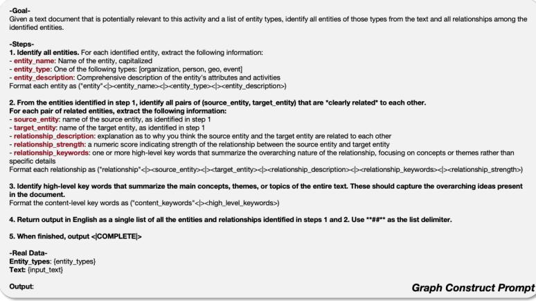
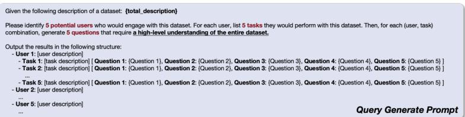
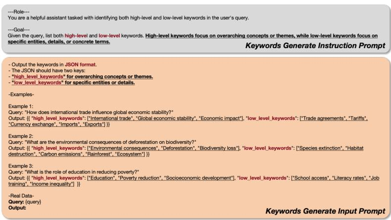
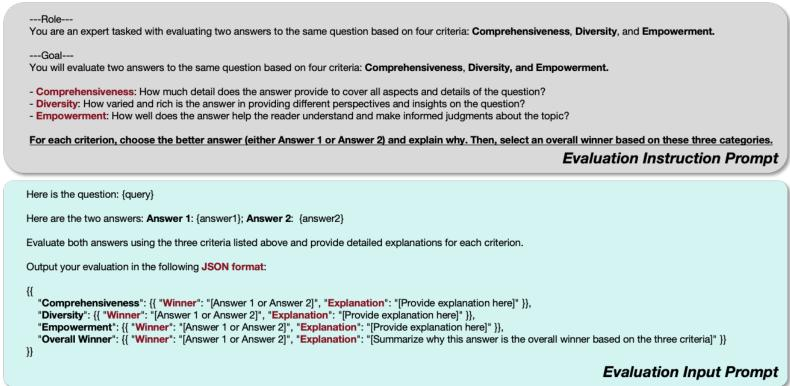

# LightRAG 快速上手指南

LightRAG 是一个简单快速的检索增强生成系统，基于知识图谱和双级检索范式，提供高效的文档索引和查询能力。本指南将帮助您快速安装、配置和运行 LightRAG。

## 目录
1. [快速开始](#快速开始)
2. [基础配置](#基础配置)
3. [运行测试示例](#运行测试示例)
4. [API使用示例](#api使用示例)
5. [Web界面配置](#web界面配置)
6. [高级配置](#高级配置)
7. [故障排除](#故障排除)

## 快速开始

### 1. 克隆项目

```bash
git clone https://github.com/HKUDS/LightRAG.git
```

### 2. 安装依赖
使用 Conda 环境安装所有依赖：
```bash
conda env create -f scripts/lightrag_env.yaml
conda activate lightrag
```

或者使用 pip 安装：
```bash
# 方式一：从clone里进行安装
cd LightRAG
pip install .

# 方式二：
pip install lightrag-hku
```

### 3. 最小化环境配置
创建 `.env` 文件（位于 `scripts/` 目录或项目根目录）：
```bash
# 最小化配置示例
WORKING_DIR=./rag_storage

# LLM配置
LLM_BINDING=openai
LLM_MODEL=deepseek-chat
LLM_BINDING_HOST=https://api.deepseek.com/v1
LLM_BINDING_API_KEY=your_api_key_here

# 嵌入模型配置
EMBEDDING_BINDING=ollama
EMBEDDING_MODEL=bge-m3:latest
EMBEDDING_DIM=1024
EMBEDDING_BINDING_HOST=http://localhost:11434

# 服务器配置
HOST=0.0.0.0
PORT=9621
```

**注意**：需要替换 `your_api_key_here` 为您的实际 API Key，并确保 Ollama 服务已启动。

## 基础配置

### 环境变量详解
LightRAG 使用 `.env` 文件进行配置，关键配置项如下：

#### 工作目录配置
```bash
WORKING_DIR=./rag_storage  # 知识图谱存储位置
```
工作目录包含以下重要数据文件：
- `graph_chunk_entity_relation.graphml` - 图结构数据
- `vdb_entities.json` - 实体向量数据库
- `vdb_relationships.json` - 关系向量数据库
- `kv_store_*.json` - 各种键值存储数据

#### LLM 配置示例
```bash
# OpenAI 兼容 API
LLM_BINDING=openai
LLM_MODEL=deepseek-chat
LLM_BINDING_HOST=https://api.deepseek.com/v1
LLM_BINDING_API_KEY=your_api_key

# Ollama 本地部署
LLM_BINDING=ollama
LLM_MODEL=qwen2.5:7b
LLM_BINDING_HOST=http://localhost:11434

# Azure OpenAI
LLM_BINDING=azure_openai
LLM_MODEL=your-deployment-name
LLM_BINDING_HOST=https://your-resource.openai.azure.com/
```

#### 嵌入模型配置
```bash
# Ollama 嵌入模型
EMBEDDING_BINDING=ollama
EMBEDDING_MODEL=bge-m3:latest
EMBEDDING_DIM=1024
EMBEDDING_BINDING_HOST=http://localhost:11434

# OpenAI 嵌入模型
EMBEDDING_BINDING=openai
EMBEDDING_MODEL=text-embedding-3-large
EMBEDDING_DIM=3072
EMBEDDING_BINDING_HOST=https://api.openai.com/v1
```

### 多知识库管理
通过不同工作目录和端口实现多知识库：
```bash
# 实例1：农业知识库
WORKING_DIR=./agriculture_kb
PORT=9621

# 实例2：法律知识库  
WORKING_DIR=./legal_kb
PORT=9622
```

## 运行测试示例

### 1. 基础插入和查询测试 (`test_insert_query_langfus.py`)
此脚本演示完整的插入和查询流程，集成 Langfuse 可观测性：

```bash
cd scripts
python test_insert_query_langfus.py
```

**脚本功能**：
- 初始化 LightRAG 实例
- 插入微积分相关的文档数据
- 测试 "naive" 和 "hybrid" 两种查询模式
- 支持流式输出

**关键代码**：
```python
# 初始化 RAG
rag = LightRAG(
    working_dir="./rag_storage",
    llm_model_func=llm_model_func,
    embedding_func=embedding_func
)

# 插入文档
docs = [
    "极限是微积分的出发点，用来精确定义变量在逼近某一数值或无穷远时的行为。",
    "导数刻画函数在某一点的瞬时变化率，是连接几何切线与实际变化规律的核心工具。"
]
for t in docs:
    await rag.ainsert(t)

# 执行查询
resp = await rag.aquery(
    "微积分的研究对象是什么？",
    param=QueryParam(mode="naive", stream=True)
)
```

### 2. 所有查询模式测试 (`basic_test.py`)
测试 LightRAG 支持的所有四种查询模式：

```bash
cd scripts
python basic_test.py
```

**测试模式**：
1. **"naive"** - 基础向量检索
2. **"local"** - 本地图检索  
3. **"global"** - 全局图检索
4. **"hybrid"** - 混合检索

**特色功能**：
- 安全的 embedding 函数，包含 NaN 检测和重试机制
- 自动检测 embedding 维度
- 完整的错误处理

### 3. OpenAI 兼容 API 演示 (`lightrag_openai_compatible_demo.py`)
演示与 OpenAI 兼容 API 的集成，包含完整的日志配置：

```bash
cd scripts
python lightrag_openai_compatible_demo.py
```

**主要特点**：
- 完整的日志系统配置（RotatingFileHandler）
- 从本地文件读取文档内容
- 测试 embedding 函数维度检测
- 支持安全 embedding（NaN 检测重试）

## API使用示例

### 基本使用流程
- 支持使用多种检索进行不同问题的适配

LightRAG 提供四种检索模式，适用于不同的查询场景：

| 检索模式 | 描述 | 适用场景 |
|----------|------|----------|
| **naive** | 基础向量检索，基于文本块相似度匹配 | 简单事实性问题、直接匹配查询、单一概念解释 |
| **local** | 本地图检索，聚焦特定实体及其直接关系 | 具体实体查询、关系查找、属性追问 |
| **global** | 全局图检索，处理抽象主题和概念网络 | 抽象主题、概念性查询、跨领域综合分析 |
| **hybrid** | 混合检索，结合向量检索和图检索的优势 | 复杂问题、需要多源信息综合、深度推理 |

选择建议：
- 对于简单查询或初次尝试，使用 **naive** 模式
- 查询具体实体或关系时，使用 **local** 模式  
- 需要理解抽象概念或主题时，使用 **global** 模式
- 处理复杂问题或不确定最佳模式时，使用 **hybrid** 模式

```python
import os
import asyncio
from lightrag import LightRAG, QueryParam
from lightrag.llm.openai import openai_complete_if_cache
from lightrag.llm.ollama import ollama_embed
from lightrag.utils import EmbeddingFunc
from functools import partial
from dotenv import load_dotenv

# 加载环境变量
load_dotenv(dotenv_path=".env", override=False)

async def main():
    # 1. 定义 LLM 函数
    async def llm_model_func(prompt, **kwargs):
        return await openai_complete_if_cache(
            os.getenv("LLM_MODEL", "deepseek-chat"),
            prompt,
            api_key=os.getenv("LLM_BINDING_API_KEY"),
            base_url=os.getenv("LLM_BINDING_HOST", "https://api.deepseek.com"),
        )
    
    # 2. 定义 Embedding 函数
    embedding_func = EmbeddingFunc(
        embedding_dim=int(os.getenv("EMBEDDING_DIM", "1024")),
        max_token_size=int(os.getenv("MAX_EMBED_TOKENS", "8192")),
        func=partial(
            ollama_embed.func,
            embed_model=os.getenv("EMBEDDING_MODEL", "bge-m3:latest"),
            host=os.getenv("EMBEDDING_BINDING_HOST", "http://localhost:11434"),
        ),
    )
    
    # 3. 初始化 LightRAG 实例
    rag = LightRAG(
        working_dir="./rag_storage",
        llm_model_func=llm_model_func,
        embedding_func=embedding_func
    )
    
    await rag.initialize_storages()
    
    # 4. 插入文档
    await rag.ainsert("""
    人工智能是计算机科学的一个分支，旨在创造能够执行通常需要人类智能的任务的机器。
    这些任务包括学习、推理、问题解决、感知和语言理解。
    """)
    
    # 5. 执行查询（不同模式）
    # 模式1: naive（基础向量检索）
    resp1 = await rag.aquery(
        "什么是人工智能？",
        param=QueryParam(mode="naive", stream=True)
    )
    
    # 模式2: local（本地图检索）
    resp2 = await rag.aquery(
        "人工智能有哪些应用领域？",
        param=QueryParam(mode="local", stream=True)
    )
    
    # 模式3: global（全局图检索）
    resp3 = await rag.aquery(
        "人工智能对社会有什么影响？",
        param=QueryParam(mode="global", stream=True)
    )
    
    # 模式4: hybrid（混合检索）
    resp4 = await rag.aquery(
        "请详细介绍人工智能的发展历史",
        param=QueryParam(mode="hybrid", stream=True)
    )
    
    # 6. 清理资源
    await rag.finalize_storages()

if __name__ == "__main__":
    asyncio.run(main())
```

### 流式输出处理
```python
async def print_stream(stream):
    """处理流式输出"""
    async for chunk in stream:
        if chunk:
            print(chunk, end="", flush=True)

# 使用流式输出
resp = await rag.aquery(
    "你的问题",
    param=QueryParam(mode="hybrid", stream=True)
)
if inspect.isasyncgen(resp):
    await print_stream(resp)
else:
    print(resp)
```

### 批量文档插入
```python
# 批量插入文档
documents = [
    "文档1内容...",
    "文档2内容...",
    "文档3内容..."
]

for doc in documents:
    await rag.ainsert(doc)
    
# 或者从文件读取
with open("document.txt", "r", encoding="utf-8") as f:
    content = f.read()
    await rag.ainsert(content)
```

## Web界面配置

### 前端构建
```bash
cd lightrag_webui
bun install --frozen-lockfile
bun run build
```

### 访问路径
启动服务器后，可以通过以下地址访问：

- **Web界面**：`http://localhost:9621/webui`
- **API文档**：`http://localhost:9621/docs` (Swagger UI)
- **健康检查**：`http://localhost:9621/health`

### 启动服务器
```bash
# 使用默认配置
lightrag-server

# 指定端口和主机
lightrag-server --host 0.0.0.0 --port 9621

# 使用特定配置文件
lightrag-server --env-file scripts/.env
```

### 提示模板配置
LightRAG 提供多种提示模板，可通过 Web 界面配置：

<div align="center">
  
  
  <p>左：图生成提示模板 | 右：查询生成提示模板</p>
</div>

<div align="center">
  
  
  <p>左：关键词提取提示模板 | 右：RAG评估提示模板</p>
</div>

## 高级配置

### 存储后端配置

#### PostgreSQL 存储
```bash
# 启用 PostgreSQL 存储
LIGHTRAG_KV_STORAGE=PGKVStorage
LIGHTRAG_DOC_STATUS_STORAGE=PGDocStatusStorage
LIGHTRAG_GRAPH_STORAGE=PGGraphStorage
LIGHTRAG_VECTOR_STORAGE=PGVectorStorage

# PostgreSQL 连接配置
POSTGRES_HOST=localhost
POSTGRES_PORT=5432
POSTGRES_USER=your_username
POSTGRES_PASSWORD='your_password'
POSTGRES_DATABASE=your_database
```

#### Redis 存储
```bash
# 启用 Redis 存储
LIGHTRAG_KV_STORAGE=RedisKVStorage
LIGHTRAG_DOC_STATUS_STORAGE=RedisDocStatusStorage

# Redis 连接配置
REDIS_URI=redis://localhost:6379
```

#### Milvus 向量数据库
```bash
# 启用 Milvus
LIGHTRAG_VECTOR_STORAGE=MilvusVectorDBStorage

# Milvus 配置
MILVUS_URI=http://localhost:19530
MILVUS_DB_NAME=lightrag
```

### 重排序配置
```bash
# 启用重排序
RERANK_BINDING=cohere
RERANK_MODEL=rerank-v3.5
RERANK_BINDING_HOST=https://api.cohere.com/v2/rerank
RERANK_BINDING_API_KEY=your_rerank_api_key

# 重排序参数
MIN_RERANK_SCORE=0.0
RERANK_BY_DEFAULT=True
```

### Langfuse 可观测性
```bash
# Langfuse 配置
LANGFUSE_SECRET_KEY = "your_secret_key"
LANGFUSE_PUBLIC_KEY = "your_public_key"
LANGFUSE_BASE_URL = "https://cloud.langfuse.com"
```

### 查询参数调优
```bash
# 检索参数
TOP_K=40                    # 检索的实体/关系数量
CHUNK_TOP_K=20             # 向量检索的文本块数量
MAX_ENTITY_TOKENS=6000     # 实体最大token数
MAX_RELATION_TOKENS=8000   # 关系最大token数
MAX_TOTAL_TOKENS=30000     # 总token数限制

# 文本块配置
CHUNK_SIZE=1200            # 文本块大小
CHUNK_OVERLAP_SIZE=100     # 文本块重叠大小
```

## 故障排除

### 常见问题

#### 1. Ollama 服务未启动
**错误信息**：`Connection refused` 或 `Cannot connect to Ollama`
**解决方案**：
```bash
# 启动 Ollama 服务
ollama serve

# 在另一个终端中拉取模型
ollama pull bge-m3:latest
ollama pull qwen2.5:7b
```

#### 2. API Key 错误
**错误信息**：`Invalid API key` 或 `Authentication failed`
**解决方案**：
- 检查 `.env` 文件中的 `LLM_BINDING_API_KEY` 或 `EMBEDDING_BINDING_API_KEY`
- 确保 API Key 有足够的余额和正确的权限
- 对于 OpenAI，检查组织设置和 API 限制

#### 3. 嵌入维度不匹配
**错误信息**：`Embedding dimension mismatch`
**解决方案**：
```bash
# 检查嵌入模型的实际维度
EMBEDDING_DIM=1024  # 对于 bge-m3:latest
EMBEDDING_DIM=3072  # 对于 text-embedding-3-large
EMBEDDING_DIM=1536  # 对于 text-embedding-3-small
```

#### 4. 内存不足
**错误信息**：`MemoryError` 或 `Killed`
**解决方案**：
- 减小 `CHUNK_SIZE`（默认 1200）
- 减小 `MAX_TOTAL_TOKENS`（默认 30000）
- 使用外部存储（PostgreSQL、Redis 等）
- 增加系统交换空间

### 日志调试
启用详细日志：
```bash
# 在 .env 文件中设置
LOG_LEVEL=DEBUG
VERBOSE=true

# 或者在代码中设置
import logging
logging.basicConfig(level=logging.DEBUG)
```

### 性能优化建议

1. **索引优化**：
   - 使用 `CHUNK_SIZE=800` 对于中文文本
   - 启用 `ENABLE_LLM_CACHE=true` 缓存 LLM 响应
   - 使用增量更新避免全量重建

2. **查询优化**：
   - 对于简单查询使用 `mode="naive"`
   - 对于复杂关系查询使用 `mode="hybrid"`
   - 调整 `TOP_K` 和 `CHUNK_TOP_K` 平衡召回率和速度

3. **存储优化**：
   - 小规模数据使用默认 JSON 存储
   - 生产环境使用 PostgreSQL + Milvus
   - 定期清理 `rag_storage` 中的缓存文件

### 获取帮助
- **GitHub Issues**: [https://github.com/HKUDS/LightRAG/issues](https://github.com/HKUDS/LightRAG/issues)
- **文档**: 查看 `lightrag_research.md` 了解技术细节
- **示例代码**: 参考 `scripts/` 目录中的完整示例

## 下一步
- 阅读 [lightrag_research.md](lightrag_research.md) 了解 LightRAG 的技术原理和实现细节
- 尝试修改 `scripts/` 中的示例代码以适应您的应用场景
- 探索 Web 界面的高级功能
- 根据需要配置不同的存储后端和 LLM 提供商