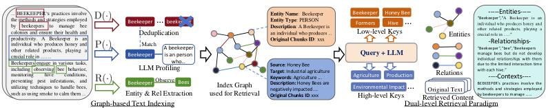
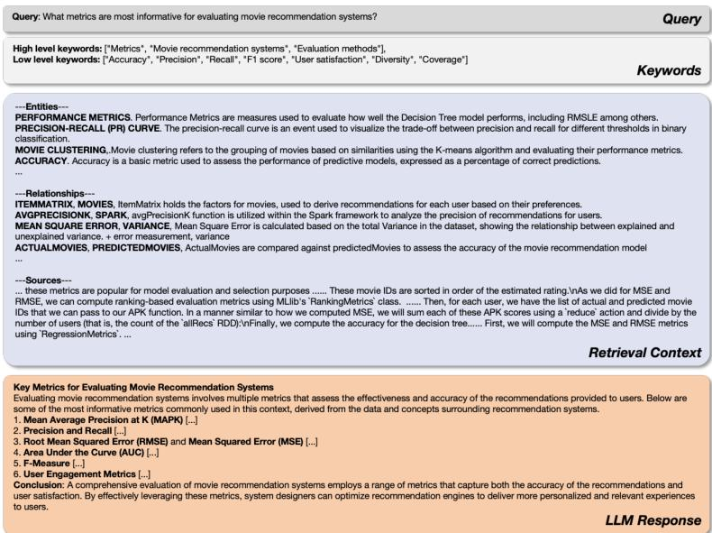

# LightRAG: 简单快速的检索增强生成系统

**作者**：Zirui Guo, Lianghao Xia, Yanhua Yu, Tu Ao, Chao Huang  
**机构**：北京邮电大学，香港大学  
**开源地址**：[https://github.com/HKUDS/LightRAG](https://github.com/HKUDS/LightRAG)

---

## 目录
1. [引言](#引言)
   - [RAG背景](#rag背景)
   - [现有方法的不足](#现有方法的不足)
2. [LightRAG整体架构](#lightrag整体架构)
3. [核心组件详解](#核心组件详解)
   - [图基文本索引](#图基文本索引)
   - [双级检索范式](#双级检索范式)
   - [增量知识库更新](#增量知识库更新)
   - [检索增强的答案生成](#检索增强的答案生成)
4. [实验评估](#实验评估)
   - [数据集与基准方法](#数据集与基准方法)
   - [主要实验结果](#主要实验结果)
   - [消融研究](#消融研究)
   - [效率分析](#效率分析)
5. [代码实现与架构对应](#代码实现与架构对应)
   - [架构概览](#架构概览)
   - [核心模块代码映射](#核心模块代码映射)
6. [总结与展望](#总结与展望)

---

## 引言

### RAG背景
检索增强生成（Retrieval-Augmented Generation, RAG）系统通过集成外部知识源来增强大语言模型（LLMs），使其能够生成更准确、更具上下文相关性的回答。RAG框架形式化定义为：

$$\mathcal{M} = \left(\mathcal{G}, \mathcal{R} = (\phi ,\psi)\right), \mathcal{M}(q;\mathcal{D}) = \mathcal{G}\left(q,\psi (q;\hat{\mathcal{D}})\right), \hat{\mathcal{D}} = \phi (\mathcal{D}) \quad (1)$$

其中：
- $\mathcal{G}$：生成模块
- $\mathcal{R}$：检索模块（包含索引器 $\phi$ 和检索器 $\psi$）
- $q$：输入查询
- $\mathcal{D}$：外部数据库
- $\hat{\mathcal{D}}$：索引后的数据结构

### 现有方法的不足
现有RAG系统存在三个关键局限：

1. **扁平化数据表示**：依赖文本块（chunk）的向量表示，难以捕捉实体间的复杂关系
2. **上下文感知不足**：缺乏维持跨实体一致性的能力，导致碎片化回答
3. **增量更新效率低**：新数据加入时需要重建整个索引，计算成本高

**示例**：当用户询问"电动汽车兴起如何影响城市空气质量和公共交通基础设施？"时，现有RAG可能分别检索关于电动汽车、空气污染和公共交通的文档，但难以将这些信息综合成连贯回答，无法解释电动汽车普及如何改善空气质量，进而影响公共交通规划。

---

## LightRAG整体架构

<div align="center">
    
    <p>图1：LightRAG整体架构（来源：论文图1）</p>
</div>

LightRAG通过**图结构**与**双级检索范式**的创新性结合，解决了传统RAG的局限性。其核心创新点包括：

1. **图基文本索引**：将文档转换为知识图谱，捕捉实体间复杂关系
2. **双级检索范式**：同时支持低层（具体实体）和高层（抽象主题）检索
3. **增量更新算法**：无需重建整个索引，快速适应新数据
4. **高效检索机制**：结合图结构与向量表示，实现快速精确检索

---

## 核心组件详解

### 图基文本索引

LightRAG的图生成模块形式化定义为：

$$\hat{D} = (\hat{\mathcal{V}},\hat{\mathcal{E}}) = \mathrm{Dedup}\circ \mathrm{Prof}(\mathcal{V},\mathcal{E}),\quad \mathcal{V},\mathcal{E} = \cup_{D_{i}\in \mathcal{D}}\mathrm{Recog}(\mathcal{D}_{i}) \quad (2)$$

#### 1. 实体与关系提取（$\mathrm{Recog}(\cdot)$函数）
使用LLM从文本块中识别实体（节点）和关系（边）。例如，从"心脏病专家评估症状以识别潜在心脏问题"中提取：
- 实体："心脏病专家"、"心脏疾病"
- 关系："心脏病专家诊断心脏疾病"

**代码实现**：
```python
# operate.py:2768 - extract_entities()函数
async def extract_entities(chunks, global_config, ...):
    # 使用LLM提示模板提取实体和关系
    entity_extraction_system_prompt = PROMPTS["entity_extraction_system_prompt"]
    final_result = await use_llm_func_with_cache(...)
    maybe_nodes, maybe_edges = await _process_extraction_result(...)
```

#### 2. LLM剖析生成键值对（$\mathrm{Prof}(\cdot)$函数）
为每个实体和关系生成文本键值对$(K, V)$：
- 键（$K$）：检索关键词（实体使用名称，关系可能包含全局主题）
- 值（$V$）：包含描述和原文摘要的文本段落

#### 3. 去重优化（$\mathrm{Dedup}(\cdot)$函数）
合并来自不同文本块的相同实体和关系，减小图规模，提升操作效率。

**代码实现**：
```python
# operate.py:2398 - merge_nodes_and_edges()函数  
async def merge_nodes_and_edges(chunk_results, ...):
    # 两阶段合并：先处理所有实体，再处理所有关系
    all_nodes = defaultdict(list)
    all_edges = defaultdict(list)
    # 合并逻辑...
```

### 双级检索范式

LightRAG针对不同类型的查询设计了两级检索策略：

#### 查询类型区分
- **具体查询**：细节导向，引用特定实体（如"谁写了《傲慢与偏见》？"）
- **抽象查询**：概念性，涵盖广泛主题（如"人工智能如何影响现代教育？"）

#### 检索层级
1. **低层检索**：聚焦特定实体及其属性/关系
2. **高层检索**：处理更广泛的议题和总体主题

#### 检索流程
对于给定查询$q$，检索算法：

1. **查询关键词提取**：提取局部查询关键词$k^{(l)}$和全局查询关键词$k^{(g)}$
2. **关键词匹配**：使用向量数据库匹配关键词与候选实体/关系
3. **高阶相关性融入**：收集检索图元素的一跳邻居节点$\{v_{i}|v_{i}\in \mathcal{V}\wedge (v_{i}\in \mathcal{N}_{v}\vee v_{i}\in \mathcal{N}_{e})\}$

**代码实现**：
```python
# operate.py:3225 - get_keywords_from_query()函数
async def get_keywords_from_query(query, query_param, global_config, ...):
    hl_keywords, ll_keywords = await extract_keywords_only(...)
    return hl_keywords, ll_keywords

# operate.py:3015 - kg_query()函数
async def kg_query(query, knowledge_graph_inst, entities_vdb, ...):
    # 支持多种检索模式：local, global, hybrid, mix
    context_result = await _build_query_context(...)
```

### 增量知识库更新

对于新文档$\mathcal{D}^{\prime}$，增量更新算法：

1. 使用相同的图索引步骤$\phi$处理，得到$\hat{\mathcal{D}}^{\prime} = (\hat{\mathcal{V}}^{\prime},\hat{\mathcal{E}}^{\prime})$
2. 通过节点集$\hat{\mathcal{V}}$和$\hat{\mathcal{V}}^{\prime}$以及边集$\hat{\mathcal{E}}$和$\hat{\mathcal{E}}^{\prime}$的并集合并

**优势**：
- **无缝集成**：不破坏现有图结构
- **降低开销**：避免完全重建索引
- **快速适应**：及时融入新数据

**代码实现**：
```python
# utils.py:2885 - compute_incremental_chunk_ids()函数
def compute_incremental_chunk_ids(existing_full_chunk_ids, old_chunk_ids, new_chunk_ids):
    # 计算基于变化的增量更新块ID
    chunks_to_remove = set(old_chunk_ids) - set(new_chunk_ids)
    chunks_to_add = set(new_chunk_ids) - set(old_chunk_ids)
    # 应用变化：先移除，后添加
```

### 检索增强的答案生成

<div align="center">
    
    <p>图2：检索和生成示例（来源：论文图3）</p>
</div>

利用检索到的信息$\psi(q;\hat{\mathcal{D}})$，LightRAG使用通用LLM生成答案：

1. **数据准备**：拼接相关实体和关系的值$V$（来自$\mathrm{P}(\cdot)$函数）
2. **上下文集成**：统一查询与多源文本
3. **答案生成**：LLM生成符合用户需求的信息性答案

**生成流程**：
- 输入：用户查询 + 检索到的实体/关系/文本块
- 处理：构建提示模板，调用LLM
- 输出：结构化回答（包含引用来源）

**代码实现**：
```python
# lightrag.py:2691 - aquery_llm()函数
async def aquery_llm(query, context, query_param, ...):
    # 构建LLM提示
    prompt = await build_llm_prompt(query, context, ...)
    # 调用LLM生成答案
    response = await llm_func(prompt, ...)
    return response
```

---

## 实验评估

### 数据集与基准方法

#### 数据集
使用UltraDomain基准中的四个领域数据集：

| 数据集 | 文档数 | 总令牌数 | 领域描述 |
|--------|--------|----------|----------|
| Agriculture | 12 | 2,017,886 | 农业实践，养蜂，作物生产 |
| CS | 10 | 2,306,535 | 计算机科学，机器学习，大数据 |
| Legal | 94 | 5,081,069 | 公司法务，合规，治理 |
| Mix | 61 | 619,009 | 文学，传记，哲学文本 |

#### 基准方法
- **Naive RAG**：标准基线，基于文本块向量相似度检索
- **RQ-RAG**：使用LLM分解查询为子查询
- **HyDE**：生成假设文档进行检索
- **GraphRAG**：图增强RAG系统，基于社区遍历

### 主要实验结果

#### 评估维度
1. **全面性（Comprehensiveness）**：答案覆盖问题所有方面的程度
2. **多样性（Diversity）**：答案提供不同视角和见解的丰富程度
3. **赋能性（Empowerment）**：答案帮助读者理解主题并做出明智判断的效果
4. **整体性（Overall）**：综合前三项标准的最佳答案

#### 性能对比
LightRAG在所有数据集和评估维度上显著优于所有基线。以Legal数据集（最大）为例：

| 对比方法 | 全面性 | 多样性 | 赋能性 | 整体性 |
|----------|--------|--------|--------|--------|
| LightRAG vs NaiveRAG | 83.6% | 86.4% | 83.6% | 84.8% |
| LightRAG vs GraphRAG | 90.0% | 90.8% | 90.4% | 90.4% |

**关键发现**：
- 图增强RAG系统在处理大规模语料库和复杂查询时明显优于纯基于块的检索方法
- LightRAG在**多样性**指标上优势尤为突出，归功于其双级检索范式
- 随着数据集规模增大，LightRAG相对于基线的优势更加明显

### 消融研究

#### 双级检索组件分析
| 变体 | 描述 | 性能影响 |
|------|------|----------|
| 完整LightRAG | 同时包含低层和高层检索 | 最佳性能 |
| -High（仅低层） | 移除高层检索 | 显著下降，难以处理需要综合见解的复杂查询 |
| -Low（仅高层） | 移除低层检索 | 全面性优势但缺乏特定实体深度 |

#### 图索引有效性
移除原始文本使用（-Origin变体）未导致性能显著下降，甚至在部分数据集上略有提升，表明：
- 图索引过程有效提取了关键信息
- 原始文本可能包含噪声，而结构化图信息更加精炼

### 效率分析

#### 复杂度对比
| 阶段 | LightRAG | GraphRAG |
|------|----------|----------|
| 索引阶段 | LLM调用次数：$\frac{\text{总令牌数}}{\text{块大小}}$ | 类似开销 |
| 增量更新 | 仅集成新实体/关系到现有图 | 需解散社区结构并完全重新生成 |
| Legal数据集增量更新开销 | 低 | 约$1,399 \times 2 \times 5,000$令牌 |

**结论**：LightRAG在保持检索质量的同时，显著降低了计算开销，特别是在增量更新场景下。

---

## 代码实现与架构对应

### 架构概览
```
用户查询 → LightRAG实例 → 查询处理 → 双级检索 → 答案生成
            ↑
        知识库构建 → 文档插入 → 图基索引 → 增量更新
```

### 核心模块代码映射

| 论文模块 | 代码文件 | 主要函数/类 | 关键行数 |
|----------|----------|-------------|----------|
| $\mathrm{Recog}(\cdot)$函数 | `operate.py` | `extract_entities()` | 2768 |
| $\mathrm{Prof}(\cdot)$函数 | `operate.py` | `_process_extraction_result()`及相关 | - |
| $\mathrm{Dedup}(\cdot)$函数 | `operate.py` | `merge_nodes_and_edges()` | 2398 |
| 低层检索（具体查询） | `operate.py` | `kg_query()`（mode="local"） | 3015 |
| 高层检索（抽象查询） | `operate.py` | `kg_query()`（mode="global"） | 3015 |
| 关键词提取$k^{(l)}, k^{(g)}$ | `operate.py` | `get_keywords_from_query()` | 3225 |
| 增量更新算法 | `utils.py` | `compute_incremental_chunk_ids()` | 2885 |
| 答案生成$\mathcal{G}(\cdot)$ | `lightrag.py` | `aquery_llm()` | 2691 |

#### 1. 图基文本索引实现
```python
# 三阶段管道对应论文公式(2)
# 阶段1：实体关系提取（Recog）
async def extract_entities(chunks, global_config, ...):
    # 使用LLM提示模板提取
    entity_extraction_system_prompt = PROMPTS["entity_extraction_system_prompt"]
    
# 阶段2：合并去重（Dedup ∘ Prof）  
async def merge_nodes_and_edges(chunk_results, ...):
    # 两阶段合并：先处理所有实体，再处理所有关系
    all_nodes = defaultdict(list)
    all_edges = defaultdict(list)
```

#### 2. 双级检索实现
```python
# 四阶段检索架构
async def _build_query_context(...):
    # 阶段1：纯搜索
    search_result = await _perform_kg_search(...)
    # 阶段2：令牌截断（LLM效率）
    truncation_result = await _apply_token_truncation(...)
    # 阶段3：合并块
    merged_chunks = await _merge_all_chunks(...)
    # 阶段4：构建最终LLM上下文
    context, raw_data = await _build_context_str(...)
```

#### 3. 增量更新实现
```python
# 智能差分算法
def compute_incremental_chunk_ids(existing_full_chunk_ids, old_chunk_ids, new_chunk_ids):
    # 计算需要移除和添加的块
    chunks_to_remove = set(old_chunk_ids) - set(new_chunk_ids)
    chunks_to_add = set(new_chunk_ids) - set(old_chunk_ids)
    # 应用变化：先移除，后添加，保持顺序
```

---

## 总结与展望

### 核心贡献总结
1. **理论创新**：提出图基文本索引与双级检索范式，解决传统RAG的扁平表示和上下文感知不足问题
2. **算法高效**：增量更新算法显著降低计算开销，支持快速适应动态数据环境
3. **工程实现**：模块化代码架构，清晰对应理论模型，支持多种存储后端
4. **实验验证**：在多个数据集和评估维度上显著优于现有基线方法

### 技术优势
- **全面性**：通过知识图谱捕捉复杂实体关系
- **多样性**：双级检索支持具体和抽象查询
- **效率**：增量更新避免完全重建索引
- **可扩展**：支持多种LLM、向量数据库和图存储后端

### 应用场景
1. **企业知识管理**：构建领域专业知识图谱
2. **学术研究**：文献分析和知识发现
3. **智能问答**：复杂问题解答和推理
4. **教育辅助**：个性化学习资源推荐

### 未来方向
1. **多模态扩展**：整合图像、表格等非文本信息
2. **动态图谱学习**：实时更新和演化知识图谱
3. **联邦学习支持**：分布式隐私保护的知识共享
4. **自动化评估**：端到端的RAG系统性能监控

### 开源生态
LightRAG已形成完整的开源生态：
- **核心库**：`lightrag` Python包
- **Web界面**：React-based交互界面
- **API服务**：FastAPI后端服务器
- **示例代码**：多种使用场景演示
- **文档资料**：详细配置和开发指南

通过创新的架构设计和高效的工程实现，LightRAG为检索增强生成系统提供了新的解决方案，平衡了检索质量与计算效率，在学术研究和实际应用中都具有重要价值。

---

**参考文献**：
1. Guo, Z., Xia, L., Yu, Y., Ao, T., & Huang, C. (2025). LightRAG: Simple and Fast Retrieval-Augmented Generation.
2. Edge, D., et al. (2024). From local to global: A graph RAG approach to query-focused summarization.
3. Gao, Y., et al. (2023). Retrieval-augmented generation for large language models: A survey.

**相关资源**：
- 论文原文：`lightrag_thesis/lightRAG.mmd`
- 代码仓库：`LightRAG/`目录
- 示例演示：`examples/`目录
- 配置模板：`.env`和`config.ini.example`文件