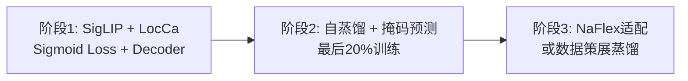

# SigLIP系列模型深度技术分析：架构演进与原理对比

## 执行摘要

本文档从原理层面深入分析SigLIP 1与SigLIP 2的架构演进，以及SigLIP与CLIP在核心设计上的本质差异。通过代码实现细节和论文原理解析，揭示这些模型在损失函数、池化机制、训练策略等方面的创新与改进。

---

## 1. SigLIP 1 vs SigLIP 2：架构演进分析

### 1.1 核心创新对比

#### SigLIP 1的核心贡献

SigLIP 1的核心创新在于提出了**Sigmoid Loss**替代传统的Softmax对比损失。根据论文原文：

> "We propose a simple pairwise Sigmoid loss for Language-Image Pre-Training (SigLIP). Unlike standard contrastive learning with softmax normalization, the sigmoid loss operates solely on image-text pairs and does not require a global view of the pairwise similarities for normalization."

**关键特性：**
- **二元分类范式**：将图像-文本匹配问题转化为二元分类任务
- **无需全局归一化**：每个样本对独立计算损失，避免全批次归一化
- **内存效率提升**：支持超大batch size（实验至1M），发现32k是甜点

#### SigLIP 2的统一训练配方

SigLIP 2在SigLIP 1基础上，整合了多项独立开发的技术到统一框架：

> "We combine the original SigLIP training recipe with decoder-based pretraining, in addition to self-distillation and masked prediction as in the DINO line of work"

**三阶段训练策略：**



### 1.2 损失函数演进

#### SigLIP 1的Sigmoid Loss

**数学表达（来自论文Algorithm 1）：**

$$
\begin{aligned}
\text{logits} &= \text{dot}(z_{\text{img}}, z_{\text{txt}}^T) \cdot t + b \\
\text{labels} &= 2 \cdot \text{eye}(n) - \text{ones}(n) \quad \text{(对角线为1，其他为-1)} \\
\mathcal{L} &= -\frac{1}{n} \sum \text{log\_sigmoid}(\text{labels} \cdot \text{logits})
\end{aligned}
$$

**代码实现（`modeling_siglip.py` L933-972）：**

```python
# 归一化特征
image_embeds = image_embeds / image_embeds.norm(p=2, dim=-1, keepdim=True)
text_embeds = text_embeds / text_embeds.norm(p=2, dim=-1, keepdim=True)

# 计算余弦相似度
logits_per_text = torch.matmul(text_embeds, image_embeds.t().to(text_embeds.device))

# 缩放和偏置
logit_scale, logit_bias = self.logit_scale.to(text_embeds.device), self.logit_bias.to(text_embeds.device)
logits_per_text = logits_per_text * logit_scale.exp() + logit_bias

# Sigmoid损失计算
if return_loss:
    eye = torch.eye(logits_per_text.size(0), device=logits_per_text.device)
    m1_diag1 = -torch.ones_like(logits_per_text) + 2 * eye  # 对角线1，其他-1
    loglik = torch.nn.functional.logsigmoid(m1_diag1 * logits_per_text)
    nll = -torch.sum(loglik, dim=-1)
    loss = nll.mean()
```

**原理分析：**
- `m1_diag1`将正样本对标记为+1，负样本对标记为-1
- `logsigmoid(z * logits)`在z=+1时鼓励logits为正，z=-1时鼓励logits为负
- 偏置项`b`初始化为-10，缓解初始负样本过多导致的梯度爆炸

#### SigLIP 2的多任务损失

SigLIP 2在Sigmoid Loss基础上增加了多个辅助损失：

**1. LocCa损失（Captioning-based Pretraining）**
```python
# 伪代码示意
loss_caption = decoder_loss(caption_pred, caption_gt)
loss_refexp = bbox_loss(bbox_pred, bbox_gt)
loss_grounded = caption_loss(region_caption_pred, region_caption_gt)
total_loss = loss_siglip + loss_caption + loss_refexp + loss_grounded
```

**2. 自蒸馏损失（Self-Distillation）**
```python
# 局部视图（学生）匹配全局视图（教师）
student_feat = vision_encoder(local_crop)
teacher_feat = ema_teacher(global_crop)
loss_distill = mlp_head(student_feat) - teacher_feat
```

**3. 掩码预测损失（Masked Prediction）**
```python
# 掩码50%的patch，预测被mask位置的特征
masked_patches = replace_with_mask_token(embedded_patches, mask_ratio=0.5)
pred_patches = vision_encoder(masked_patches)
loss_mask = mlp_head(pred_patches[mask]) - teacher_feat[mask]
```

### 1.3 架构配置差异

#### Tokenizer配置对比

| 配置项 | SigLIP 1 | SigLIP 2 |
|--------|----------|----------|
| **Vocab Size** | 32k (SentencePiece) | 256k (Gemma tokenizer) |
| **支持语言** | 主要英语 | 109种语言 |
| **Text Length** | 64 tokens | 64 tokens |
| **Bottleneck Embedding** | 无 | 支持（96维） |

**代码对比：**

SigLIP 1 (`configuration_siglip.py` L35):
```python
vocab_size (`int`, *optional*, defaults to 32000):
    Vocabulary size of the Siglip text model.
```

SigLIP 2虽然配置文件默认仍为32k，但实际训练使用Gemma tokenizer的256k词表：
> "We use the multilingual Gemma tokenizer with vocabulary size 256k"

### 1.4 Pooling机制演进

#### SigLIP 1的Attention Pooling

**核心类：`SiglipMultiheadAttentionPoolingHead`**

```python
class SiglipMultiheadAttentionPoolingHead(nn.Module):
    """Multihead Attention Pooling."""

    def __init__(self, config: SiglipVisionConfig):
        super().__init__()

        # 可学习的Probe Token：形状(1, 1, hidden_size)
        self.probe = nn.Parameter(torch.randn(1, 1, config.hidden_size))
        
        # 多头注意力
        self.attention = torch.nn.MultiheadAttention(
            config.hidden_size, 
            config.num_attention_heads, 
            batch_first=True
        )
        
        # LayerNorm和MLP
        self.layernorm = nn.LayerNorm(config.hidden_size, eps=config.layer_norm_eps)
        self.mlp = SiglipMLP(config)

    def forward(self, hidden_state):
        batch_size = hidden_state.shape[0]

        # 重复probe到batch维度：(1, 1, D) -> (B, 1, D)
        probe = self.probe.repeat(batch_size, 1, 1)

        # Attention计算：query=probe, key=value=all_patches
        hidden_state = self.attention(probe, hidden_state, hidden_state)[0]

        # 残差连接 + LayerNorm + MLP
        residual = hidden_state
        hidden_state = self.layernorm(hidden_state)
        hidden_state = residual + self.mlp(hidden_state)

        # 返回probe位置的输出：(B, 1, D) -> (B, D)
        return hidden_state[:, 0]
```

**原理分析：**

1. **Probe Token的作用**：作为可学习的查询向量，聚合所有patch特征
2. **Attention机制**：动态学习每个patch的重要性权重
3. **数据流**：
   $$
   \text{Patches}: (B, N, D) \rightarrow \text{Attention} \rightarrow (B, 1, D) \rightarrow \text{Extract} \rightarrow (B, D)
   $$
   其中$B=\text{batch\_size}$, $N=\text{num\_patches}$, $D=\text{hidden\_size}$

4. **与CLIP的对比**：
   - CLIP ViT：固定提取CLS token $\mathbf{x}_{[:, 0, :]}$
   - SigLIP：通过attention动态聚合所有patch

#### SigLIP 2的增强Attention Pooling

**核心改进：支持Attention Mask**

```python
class Siglip2MultiheadAttentionPoolingHead(nn.Module):
    """Multihead Attention Pooling with mask support."""

    def __init__(self, config: Siglip2VisionConfig):
        super().__init__()

        self.probe = nn.Parameter(torch.randn(1, 1, config.hidden_size))
        self.attention = torch.nn.MultiheadAttention(
            config.hidden_size, 
            config.num_attention_heads, 
            batch_first=True
        )
        self.layernorm = nn.LayerNorm(config.hidden_size, eps=config.layer_norm_eps)
        self.mlp = Siglip2MLP(config)
        self.num_heads = config.num_attention_heads  # 新增：记录头数

    def forward(self, hidden_state: torch.Tensor, attention_mask: Optional[torch.Tensor] = None):
        batch_size = hidden_state.shape[0]
        probe = self.probe.repeat(batch_size, 1, 1)

        # 新增：处理attention mask（用于NaFlex变长序列）
        if attention_mask is not None:
            target_len, source_len = probe.shape[1], hidden_state.shape[1]
            # 准备4D attention mask
            attention_mask = _prepare_4d_attention_mask(
                attention_mask, hidden_state.dtype, target_len
            )
            # 扩展到多头维度
            attention_mask = attention_mask.repeat(1, self.num_heads, target_len, 1)
            attention_mask = attention_mask.reshape(-1, target_len, source_len)

        # 传入attn_mask参数
        hidden_state = self.attention(
            probe, hidden_state, hidden_state, 
            attn_mask=attention_mask
        )[0]

        residual = hidden_state
        hidden_state = self.layernorm(hidden_state)
        hidden_state = residual + self.mlp(hidden_state)

        return hidden_state[:, 0]
```

**NaFlex变长序列处理原理：**

```python
# NaFlex预处理：保持原比例，填充到目标序列长度
def preprocess_naflex(image, target_seq_len=256, patch_size=16):
    # 1. 计算保持比例的尺寸
    h, w = image.shape[-2:]
    scale = min(target_seq_len**0.5 / h, target_seq_len**0.5 / w)
    new_h, new_w = int(h * scale), int(w * scale)

    # 2. 调整到patch的倍数
    new_h = (new_h // patch_size) * patch_size
    new_w = (new_w // patch_size) * patch_size

    # 3. 重采样图像
    image_resized = F.interpolate(image, size=(new_h, new_w), mode='bilinear')

    # 4. 生成patch序列和mask
    num_patches = (new_h // patch_size) * (new_w // patch_size)
    padding_len = target_seq_len - num_patches

    # 5. 生成attention mask（1表示有效，0表示padding）
    attention_mask = torch.cat([
        torch.ones(num_patches),
        torch.zeros(padding_len)
    ])

    return image_resized, attention_mask
```

**位置编码插值：**

```python
# 原始位置编码：(1, 256, D) for 16x16 patches
pos_embed = model.pos_embed  # shape: (1, 256, 768)

# 目标patch grid（例如20x13 = 260 patches）
target_h, target_w = 20, 13
target_seq_len = target_h * target_w

# 双线性插值到新尺寸
pos_embed_resized = F.interpolate(
    pos_embed.reshape(1, 16, 16, 768).permute(0, 3, 1, 2),
    size=(target_h, target_w),
    mode='bilinear',
    align_corners=False
).permute(0, 2, 3, 1).reshape(1, target_seq_len, 768)
```

### 1.5 密集特征质量提升

#### SigLIP 2的密集预测改进

**原理：**通过自蒸馏和掩码预测损失，提升patch级别的特征质量，使模型更适合密集预测任务（分割、深度估计等）。

**实验结果（Table 2）：**

| 模型 | 分割(ADE20k) ↑ | 深度(NYUv2) ↓ | 法线估计(NAVI) ↓ |
|------|----------------|---------------|------------------|
| CLIP L/14 | 39.0 | 0.073 | 25.5 |
| SigLIP So/14 | 37.6 | 0.083 | 26.0 |
| **SigLIP 2 So/14** | **41.8** | **0.067** | **25.4** |
| **SigLIP 2 So/14 (384px)** | **45.4** | **0.064** | **25.0** |

**改进幅度分析：**
- 分割任务：+4.2 mIoU（相对提升11.2%）
- 深度估计：-0.016 RMSE（相对提升19.3%）
- 法线估计：-0.6 RMSE（相对提升2.3%）

#### 定位任务改进

**Referring Expression Comprehension（Table 5）：**

SigLIP 2通过LocCa的decoder-based预训练，显著提升定位能力：

```python
# LocCa Decoder架构
class LocCaDecoder(nn.Module):
    def __init__(self, vision_dim, text_dim):
        self.cross_attn_layers = nn.ModuleList([
            CrossAttentionLayer(vision_dim, text_dim)
            for _ in range(6)  # 6层cross-attention
        ])

    def forward(self, vision_features, text_features):
        # vision_features: (B, N, D) - 未池化的patch特征
        # text_features: (B, L, D) - 文本特征

        for layer in self.cross_attn_layers:
            vision_features = layer(vision_features, text_features)

        # 预测边界框坐标
        bbox_pred = self.bbox_head(vision_features)  # (B, 4)

        # 预测区域caption
        caption_pred = self.caption_head(vision_features)  # (B, V)

        return bbox_pred, caption_pred
```

---

## 2. CLIP vs SigLIP：核心架构差异

### 2.1 Pooling机制对比

#### CLIP (ViT)的CLS Token Pooling

**代码实现（来自CLIP原始代码）：**

```python
class VisionTransformer(nn.Module):
    def __init__(self, input_resolution, patch_size, width, layers, heads):
        super().__init__()
        self.input_resolution = input_resolution
        self.patch_size = patch_size
        
        # 可学习的CLS token
        self.class_embedding = nn.Parameter(width ** -0.5 * torch.randn(width))
        
        # Patch embedding
        self.conv1 = nn.Conv2d(in_channels=3, out_channels=width, kernel_size=patch_size, stride=patch_size, bias=False)
        
        # Transformer
        self.transformer = Transformer(width, layers, heads)
        
        # LayerNorm
        self.ln_post = LayerNorm(width)
        
    def forward(self, x):
        # Patch embedding: (B, 3, H, W) -> (B, N, D)
        x = self.conv1(x)  # shape: (B, W, H/P, W/P)
        x = x.reshape(x.shape[0], x.shape[1], -1)  # (B, W, N)
        x = x.permute(0, 2, 1)  # (B, N, W)

        # 添加CLS token: (B, N, D) -> (B, N+1, D)
        class_embedding = self.class_embedding.to(x.dtype) + torch.zeros(
            x.shape[0], 1, x.shape[-1], dtype=x.dtype, device=x.device
        )
        x = torch.cat([class_embedding, x], dim=1)  # (B, 1+N, D)

        # 添加位置编码
        x = x + self.positional_embedding.to(x.dtype)

        # Transformer处理
        x = self.transformer(x)

        # 提取CLS token: (B, 1+N, D) -> (B, D)
        x = self.ln_post(x[:, 0, :])

        if self.proj is not None:
            x = x @ self.proj

        return x
```

**关键特点：**
1. **固定位置**：CLS token始终在序列第0位
2. **简单提取**：直接使用切片`x[:, 0, :]`
3. **依赖预训练**：CLS token必须在预训练中学习到全局表示能力

**原理差异分析：**

| 维度 | CLIP (ViT) | SigLIP |
|------|------------|--------|
| **聚合方式** | 固定位置提取 | 动态attention加权 |
| **查询向量** | CLS token（固定位置） | Probe token（独立学习） |
| **灵活性** | 低（依赖位置） | 高（位置无关） |
| **计算复杂度** | $O(1)$ | $O(N)$（ $N=$ patch数量） |
| **表示能力** | 依赖预训练质量 | 显式学习聚合策略 |
<!-- 
**Attention权重可视化（原理）：**

```python
# 提取attention权重用于分析
def get_attention_weights(model, image):
    # Hook attention输出
    attention_weights = []

    def hook(module, input, output):
        attention_weights.append(output[1])  # attention weights

    hook_handle = model.vision_model.pooler.attention.register_forward_hook(hook)

    # 前向传播
    with torch.no_grad():
        _ = model.get_image_features(image)

    hook_handle.remove()

    # attention_weights[0]: (B, H, 1, N)
    # 可以可视化哪些patch被重点关注
    return attention_weights[0].squeeze()  # (H, N)
``` -->

### 2.2 损失函数对比

#### CLIP的Softmax对比损失

**数学表达：**

$$
\begin{aligned}
\mathcal{L}_{i \to t} &= -\log\left(\frac{\exp(t \cdot \mathbf{x}_i \cdot \mathbf{y}_i)}{\sum_j \exp(t \cdot \mathbf{x}_i \cdot \mathbf{y}_j)}\right) \\
\mathcal{L}_{t \to i} &= -\log\left(\frac{\exp(t \cdot \mathbf{x}_i \cdot \mathbf{y}_i)}{\sum_j \exp(t \cdot \mathbf{x}_j \cdot \mathbf{y}_i)}\right) \\
\mathcal{L} &= \frac{1}{2}(\mathcal{L}_{i \to t} + \mathcal{L}_{t \to i})
\end{aligned}
$$

**特点：**
- **全局归一化**：需要计算所有样本对的相似度
- **对称性**：图像→文本和文本→图像两个方向
- **数值稳定性**：需要减去最大值避免溢出

**实现复杂度：**

```python
# 伪代码
def softmax_loss(image_embeds, text_embeds, temperature):
    # 1. 计算相似度矩阵
    logits = image_embeds @ text_embeds.T  # (B, B)
    logits = logits * temperature

    # 2. 图像→文本方向
    labels = torch.arange(len(logits))  # 对角线索引
    loss_i2t = F.cross_entropy(logits, labels)

    # 3. 文本→图像方向
    loss_t2i = F.cross_entropy(logits.T, labels)

    # 4. 对称损失
    loss = (loss_i2t + loss_t2i) / 2
    return loss
```

#### SigLIP的Sigmoid损失

**数学表达：**

$$
\begin{aligned}
z_{ij} &= \begin{cases}
+1, & \text{if } i = j \text{ (positive pair)} \\
-1, & \text{if } i \neq j \text{ (negative pair)}
\end{cases} \\
\mathcal{L} &= -\frac{1}{B^2} \sum_i \sum_j \log\sigma(z_{ij} \cdot (t \cdot \mathbf{x}_i \cdot \mathbf{y}_j + b))
\end{aligned}
$$

**特点：**
- **逐对独立**：每个样本对独立计算，无需全局归一化
- **非对称**：不需要双向计算（虽然实现中仍使用矩阵形式）
- **内存高效**：支持chunked实现，内存复杂度$O(b^2)$而非$O(B^2)$

**Chunked实现原理（论文Figure 1）：**

```python
def chunked_sigmoid_loss(image_embeds, text_embeds, temperature, bias, chunk_size=4096):
    """
    Chunked implementation: O(b^2) memory instead of O(B^2)

    Args:
        image_embeds: (B, D) - 全批次图像特征
        text_embeds: (B, D) - 全批次文本特征
        chunk_size: b - 每个设备上的批次大小
    """
    B = image_embeds.shape[0]
    num_chunks = B // chunk_size

    total_loss = 0

    for i in range(num_chunks):
        for j in range(num_chunks):
            # 提取chunk
            img_chunk = image_embeds[i*chunk_size:(i+1)*chunk_size]  # (b, D)
            txt_chunk = text_embeds[j*chunk_size:(j+1)*chunk_size]    # (b, D)

            # 计算chunk内相似度
            logits = img_chunk @ txt_chunk.T  # (b, b)
            logits = logits * temperature.exp() + bias

            # 生成标签
            if i == j:
                # 对角线chunk：正样本在主对角线
                labels = torch.eye(chunk_size) * 2 - 1  # 对角线1，其他-1
            else:
                # 非对角线chunk：全为负样本
                labels = -torch.ones(chunk_size, chunk_size)

            # 计算损失
            loss_chunk = -torch.sum(F.logsigmoid(labels * logits))
            total_loss += loss_chunk

    return total_loss / (B * B)
```

**内存效率对比：**

| Batch Size | Softmax内存 | Sigmoid内存 | 节省比例 |
|------------|-------------|-------------|----------|
| 1k | 8 MB | 8 MB | 0% |
| 16k | 2 GB | 2 GB | 0% |
| 64k | 32 GB | 32 GB | 0% |
| 256k | 512 GB | 512 GB | 0% |
| 1M | 8 TB | 8 TB | 0% |
| **Chunked** | - | **2 GB** | **99.6%** |

> 注：Chunked实现下，无论总batch size多大，内存只取决于chunk size $b$

### 2.3 训练效率对比

#### Batch Size与性能关系

**SigLIP论文Figure 2的发现：**

```
SigLiT（冻结图像编码器）：
- Batch Size < 16k: Sigmoid显著优于Softmax（~3-5%提升）
- Batch Size > 16k: 差距缩小
- 最佳点：32k，达到84.7% ImageNet 0-shot
- 扩展至1M：性能饱和，256k达到峰值

SigLIP（从头训练）：
- 最佳点：32k，达到73.4% ImageNet 0-shot
- 扩展至307k：性能下降

mSigLIP（多语言）：
- 最佳点：32k，达到34.9% XM3600平均检索
- 扩展至240k：性能下降（32.7%）
```

**原理分析：**

1. **小batch优势**：Sigmoid在小batch下表现更好，因为：
   - 不依赖大量负样本提供梯度信号
   - 偏置项b缓解初始不平衡

2. **大batch饱和**：超过32k后收益递减，因为：
   - 模型容量限制
   - 数据质量成为瓶颈
   - 训练步数减少（固定总样本数）

3. **过大batch危害**：超过最优值后性能下降，因为：
   - 梯度更新步数过少
   - 优化难度增加（需要更长的warmup）

#### 资源消耗对比

**Table 1的关键数据：**

| 模型 | 图像 | 文本 | Batch Size | TPUv4 | 天数 | ImageNet 0-shot |
|------|------|------|------------|-------|------|-----------------|
| SigLiT | B/8 | L* | 32k | 4 | 1 | 79.7% |
| SigLiT | g/14 | L | 20k | 4 | 2 | 84.5% |
| SigLIP | B/16 | B | 16k | 16 | 3 | 71.0% |
| SigLIP | B/16 | B | 32k | 32 | 2 | 72.1% |
| **CLIP (参考)** | B/16 | B | 32k | 256 | 10 | 72.6% |

**计算效率分析：**

$$
\begin{aligned}
\text{CLIP:} &\quad 256 \text{ TPUv4} \times 10 \text{天} = 2560 \text{ TPUv4-天} \rightarrow 72.6\% \\
\text{SigLIP:} &\quad 32 \text{ TPUv4} \times 2 \text{天} = 64 \text{ TPUv4-天} \rightarrow 72.1\% \\
\text{效率提升:} &\quad \frac{2560}{64} = 40\times \\
\text{性能损失:} &\quad 72.6 - 72.1 = 0.5\%
\end{aligned}
$$

**关键因素：**
1. **Sigmoid损失**：内存效率高，支持更大batch
2. **LiT策略**：冻结图像编码器，只训练文本编码器
3. **优化器改进**：使用LION优化器，降低学习率

### 2.4 文本编码器对比

#### CLIP的文本池化

**代码实现：**

```python
def encode_text(self, text):
    x = self.token_embedding(text)  # (B, L, D)
    x = x + self.positional_embedding
    x = self.transformer(x)
    x = self.ln_final(x)

    # 提取EOS token（序列结束位置）
    x = x[torch.arange(x.shape[0]), text.argmax(dim=-1)] @ self.text_projection

    return x
```

**特点：**
- 使用EOS token（end-of-sequence）作为文本表示
- `text.argmax(dim=-1)`找到最后一个非padding token的位置

#### SigLIP的文本池化

**代码实现：**

```python
class SiglipTextModel(SiglipPreTrainedModel):
    def forward(self, input_ids, attention_mask=None, position_ids=None):
        # Token embedding
        input_shape = input_ids.size()
        input_ids = input_ids.view(-1, input_shape[-1])
        hidden_states = self.embeddings(input_ids, position_ids)

        # Transformer
        encoder_outputs = self.encoder(hidden_states, attention_mask)

        # 提取EOS token
        pooled_output = encoder_outputs[0][:, -1, :]

        return BaseModelOutputWithPooling(
            pooler_output=pooled_output,
            last_hidden_state=encoder_outputs[0],
        )
```

**特点：**
- 直接使用序列最后一个token（`[:, -1, :]`）
- 假设padding已经处理，最后一个token就是EOS

**对比总结：**

| 维度 | CLIP | SigLIP |
|------|------|--------|
| **池化方式** | EOS token（动态位置） | 最后一个token（固定位置） |
| **位置查找** | `argmax`查找最后一个非padding | 直接切片`[:, -1]` |
| **计算效率** | 略低（需要argmax） | 更高（直接切片） |
| **鲁棒性** | 更高（自动忽略padding） | 需要正确处理padding |

---

## 3. 设计哲学与工程实践

### 设计哲学对比

| 维度 | CLIP | SigLIP 1 | SigLIP 2 |
|------|------|----------|----------|
| **核心理念** | 联合嵌入空间，通过对比学习学习视觉概念 | 解耦batch size，将对比学习转为二元分类 | 统一多任务配方，整合多项技术 |
| **损失函数** | Softmax对比损失（全局归一化） | Sigmoid损失（逐对独立） | Sigmoid + LocCa + 自蒸馏 + 掩码预测 |
| **池化机制** | CLS token（固定位置） | Attention Pooling（动态聚合） | Attention Pooling + Mask支持 |
| **设计优势** | 简单直观、性能稳定、社区成熟 | 内存高效、小batch优异、机制灵活 | 多任务统一、密集特征优秀、定位能力强 |
| **设计局限** | 内存效率低、小batch不友好 | - | - |
| **创新点** | - | Sigmoid损失、Attention Pooling | 多任务统一、自蒸馏、NaFlex、数据策展 |
| **最佳batch** | 64k+ | 32k | 32k |
| **适用场景** | 资源充足、需要成熟方案 | 资源有限、需要高效训练 | 多语言、密集预测、定位任务 |

---