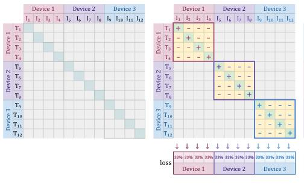
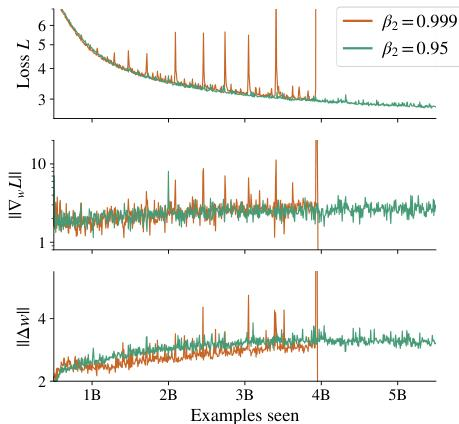
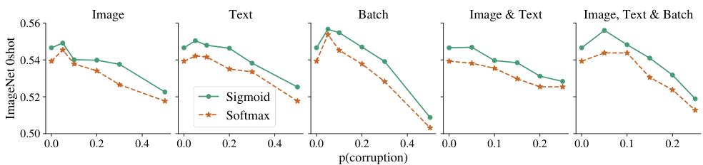
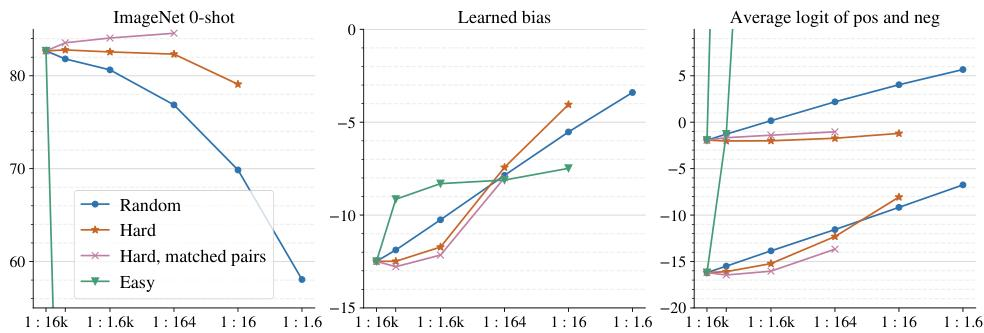
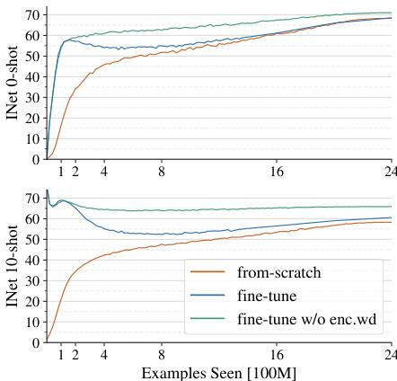
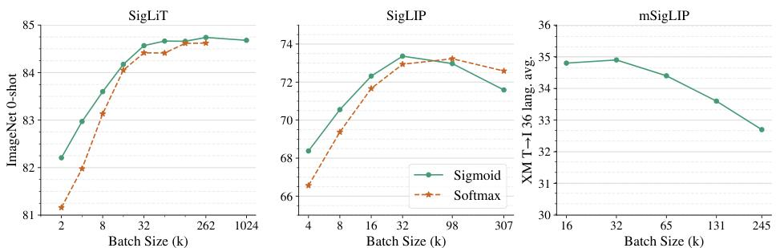
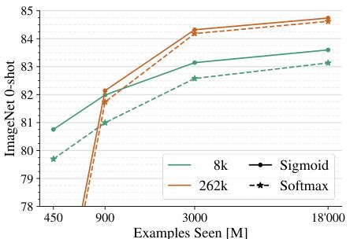

# SigLIP论文核心内容总结

## 摘要
SigLIP（Sigmoid Loss for Language Image Pre-Training）提出了一种基于sigmoid损失的视觉语言预训练方法，替代传统的softmax对比损失。该工作通过简单的pairwise sigmoid损失、高效的“分块”实现以及系统的batch size研究，在性能、内存效率和训练成本之间取得了优异平衡，尤其适合资源受限的研究与应用场景。

## 核心论点
1. **Softmax损失的局限性**：传统softmax对比损失需要全局归一化，计算复杂、内存效率低，且对小batch size不友好。
2. **Sigmoid损失的优势**：
   - 采用**二元分类视角**，每个图像-文本对独立处理，无需全局归一化。
   - **解耦batch size与损失定义**，允许更灵活的训练配置。
   - 在**小batch下性能更好**，同时**内存高效实现支持更大batch**。
3. **Batch size饱和现象**：通过实验首次系统揭示contrastive learning性能在batch size约32k时饱和，盲目增大batch size收益甚微。
4. **效率与可及性**：使研究者能在有限算力（如4个TPUv4芯片）下进行高质量视觉语言预训练。

## Sigmoid损失新设计

### 1. 损失函数
传统softmax对比损失：
$$
\mathcal{L}_{\text{softmax}} = -\frac{1}{2|\mathcal{B}|} \sum_{i=1}^{|\mathcal{B}|} \left( \log \frac{e^{t \mathbf{x}_i \cdot \mathbf{y}_i}}{\sum_j e^{t \mathbf{x}_i \cdot \mathbf{y}_j}} + \log \frac{e^{t \mathbf{x}_i \cdot \mathbf{y}_i}}{\sum_j e^{t \mathbf{x}_j \cdot \mathbf{y}_i}} \right)
$$

SigLIP提出的Sigmoid损失：
$$
\mathcal{L}_{\text{sigmoid}} = -\frac{1}{|\mathcal{B}|} \sum_{i=1}^{|\mathcal{B}|} \sum_{j=1}^{|\mathcal{B}|} \log \frac{1}{1 + e^{z_{ij}(-t \mathbf{x}_i \cdot \mathbf{y}_j + b)}}
$$
其中$z_{ij} = 1$当$(i,j)$是正对，否则$z_{ij} = -1$。

### 2. 核心不同点
| 方面 | Softmax损失 | Sigmoid损失 |
|------|-------------|-------------|
| **视角** | 多类选择问题 | 二元分类问题 |
| **归一化** | 需要全局归一化（两次） | 无需全局归一化 |
| **对称性** | 不对称（需分别对图像和文本归一化） | 对称 |
| **内存效率** | 需存储$|\mathcal{B}| \times |\mathcal{B}|$相似度矩阵 | 可分块计算，内存占用低 |
| **小batch性能** | 较差 | 更好 |

### 3. 可学习偏置项（Bias）
- 引入参数$b$，初始化为**-10**。
- **作用**：缓解初始时负样本远多于正样本导致的优化剧烈修正。
- 消融实验表明，使用$b=-10$初始化相比$b=0$或不用偏置，零样本准确率显著提升。

### 4. 温度参数初始化
- 温度$t = \exp(t')$，$t'$初始化为$\log 10$（即$t=10$）。
- 与偏置项配合，确保训练起点合理。

### 5. Chunked高效实现原理
1. 每设备持有本地batch $b$的图像和文本表示。
2. 首先计算与本地正对及$b-1$个负对的损失分量。
3. 通过collective permute交换表示，使每设备获取相邻设备的负样本。
4. 重复步骤2-3，累加损失。
5. **内存占用从$O(|\mathcal{B}|^2)$降至$O(b^2)$**，支持极大batch训练。

*图1: 高效的“分块”损失实现。通过在设备间轮换负样本，避免了代价高昂的全局all-gather操作，并显著降低了内存占用。*

## 深入分析：Sigmoid vs Softmax的核心差异

### 1. 数学本质：从"相对比较"到"绝对评分"
- **Softmax损失**：**竞争性比较**。正样本的得分要与batch内**所有负样本的得分竞争**。优化目标是让正样本得分在batch中**相对最高**。
- **Sigmoid损失**：**独立二元分类**。每个对的损失项**完全独立**，不受其他负样本影响。优化目标是让正样本相似度得分大于某个阈值，负样本小于某个阈值。

### 2. 训练稳定性
- **问题**：大batch训练时，语言-图像预训练变得不稳定，出现梯度尖峰。
- **解决方案**：降低Adam/AdaFactor的 $\beta_2$ 动量（从0.999 → 0.95）。
- **原理**：较小的 $\beta_2$ 使优化器能更快从梯度尖峰中恢复，稳定训练过程。

*图5: 通过降低优化器(Adam/Adafactor)的beta_2参数，可以有效抑制大batch训练中的梯度尖峰，从而稳定训练过程。*

### 3. 噪声鲁棒性
- Sigmoid损失对图像/文本替换、对齐扰乱等噪声更鲁棒。因为每个样本对独立计算损失，噪声的影响是局部的，不会像softmax那样通过全局归一化影响所有样本的梯度。

*图7: Sigmoid损失训练的模型（蓝色曲线）在各种数据噪声（如随机替换图像、文本或打乱配对）下，性能下降比Softmax损失（橙色曲线）更缓慢，表现出更好的鲁棒性。*

### 4. 负样本比例分析
- **实验发现**：**最难负样本（hard negatives）对学习最关键**。即使正负样本比例极度不平衡（如1:16k），模型仍能有效学习，表明比例本身并非主要问题。
- **对Sigmoid的意义**：由于sigmoid为每个负样本提供独立梯度，**hard negatives能获得强梯度信号**，促进学习。

*图6: 对负样本进行不同策略的masking实验。结果表明，保留最难的负样本（Hard）性能几乎不受影响，而随机masking或保留最简单的负样本（Easy）则会导致性能下降。*

## 主要创新点
| 创新点 | 描述 |
|--------|------|
| **1. Sigmoid损失引入** | 将二元分类的sigmoid损失引入图像-文本对比学习，替代softmax损失。 |
| **2. Chunked高效实现** | 通过跨设备交换表示的“分块”算法，内存占用从$O(|\mathcal{B}|^2)$降至$O(b^2)$，支持batch size高达100万的训练。 |
| **3. Batch size影响研究** | 首次在视觉语言预训练中系统探索batch size从512到100万的影响，发现32k已接近最优。 |
| **4. 有限资源训练方案** | SigLiT：冻结预训练图像编码器，仅训练文本编码器，4个TPUv4芯片1-2天达到接近SOTA性能。 |
| **5. 多语言扩展** | 将SigLIP扩展到100+语言，采用“瓶颈词嵌入”压缩大词汇表内存占用。 |
| **6. 训练稳定性优化** | 通过降低Adam/AdaFactor的$\beta_2$动量（0.999→0.95）稳定大batch训练。 |
| **7. 噪声鲁棒性** | 实验证明Sigmoid损失对图像/文本替换、对齐扰乱等噪声更鲁棒。 |
| **8. 偏置项设计** | 引入可学习偏置项$b$并初始化为-10，缓解初始正负样本不平衡导致的过度修正。 |
| **9. 负样本比例分析** | 通过masking实验揭示难负样本（hard negatives）对学习最关键。 |

## 模型层面优化

### 模型架构
- **图像编码器**：Vision Transformer (ViT)架构，包括ViT-B/8、ViT-B/16、ViT-g/14、ViT-L等变体。
- **文本编码器**：标准Transformer模型，规模与图像编码器匹配（Base、Large等）。
- **多语言扩展**：使用250k词汇的多语言tokenizer，通过**“瓶颈词嵌入”**（如96维瓶颈代替全768维嵌入）压缩参数量。

## 训练方式

### 1. SigLiT (Locked-image Tuning)
- **图像编码器预训练并冻结**，仅训练文本编码器。
- 使用预计算的图像特征加速训练。
- 适合资源受限场景。

### 2. SigLIP (从头或解锁微调)
- **从零训练**：图像与文本编码器均随机初始化。
- **解锁微调**：使用预训练ViT权重初始化图像编码器，但允许参数更新。
- **关键技巧**：在解锁微调时，**必须禁用预训练权重的权重衰减**，否则损害视觉表示质量。

*图4: 在使用预训练权重进行微调时（unlocked），禁用对预训练编码器的权重衰减（weight decay）至关重要。这能防止模型破坏预训练阶段学到的优质视觉表示，从而获得更好的零样本迁移性能。*

## 实验结果

### 1. Batch Size影响
- Sigmoid损失在**batch size < 16k时显著优于**softmax损失。
- 性能在**batch size ≈ 32k时饱和**，继续增大（甚至到100万）收益极小甚至有害。
- 该结论在单语（SigLIP）和多语言（mSigLIP）场景下均成立。

*图2: Sigmoid损失（蓝色/绿色）在不同batch size下的性能表现。左图和中图显示，在小batch size下，sigmoid显著优于softmax（红色/橙色），且性能在batch size约32k时达到饱和。*

### 2. 高效训练与性能
- **SigLiT**（冻结图像编码器）：
  - 4个TPUv4芯片训练1天：ImageNet零样本准确率 **79.7%**（ViT-B/8）
  - 4个TPUv4芯片训练2天：**84.5%**（ViT-g/14）
- **SigLIP**（从头训练）：
  - 16个TPUv4芯片训练3天：**71.0%**（ViT-B/16 + 文本B模型）
  - 32个TPUv4芯片训练5天：**73.4%**
  - 相比CLIP（约2500 TPUv3-天达到72.6%）大幅降低训练成本。

*图3: 不同batch size下，训练时长对性能的影响。大batch size（如262k）需要更长的训练时间才能发挥优势，而小batch size（8k）则能更快达到其性能瓶颈。*

### 3. 多语言预训练（mSigLIP）
- 在包含100+语言的WebLI数据上训练。
- **32k batch size已足够**，更大batch size反而降低跨语言检索性能。
- 在XM3600跨模态检索任务上，仅使用Base模型达到**34.9%**平均召回率，显著优于之前结果（28.5%）。

### 4. 与现有模型比较
- SigLIP在相同规模下（ViT-B/L）**全面优于CLIP、OpenCLIP、EVA-CLIP、CLIPA-v2等**，在ImageNet零样本分类和COCO检索任务上均取得更高分数。

## 总结
SigLIP/SigLiT通过简单的sigmoid损失及其高效实现，在视觉语言预训练领域提供了重要的效率与性能改进。其主要贡献包括：

1. **提出并验证sigmoid损失的优越性**，特别在小batch和噪声环境下。
2. **设计内存高效的chunked实现**，使极大batch训练成为可能。
3. **系统研究batch size影响**，发现32k的饱和点，为资源分配提供指导。
4. **提供有限资源下的高效训练方案**（SigLiT），降低研究门槛。
5. **成功扩展到多语言场景**，并解决大词汇表内存问题。
6. **深入分析负样本比例、偏置项、噪声鲁棒性等关键因素**。

这些工作使视觉语言预训练更加**可及**（accessible），为后续研究和应用奠定了重要基础。
