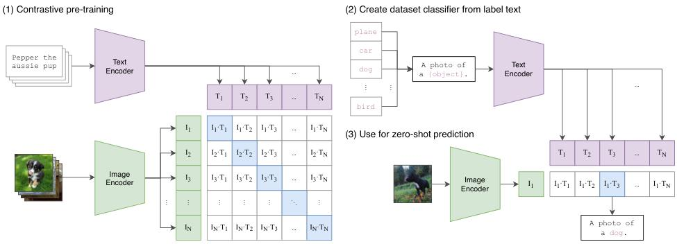
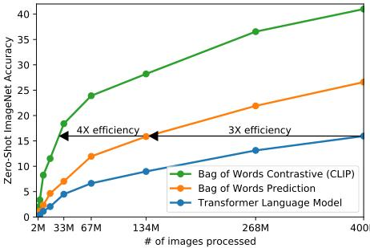

# CLIP（Contrastive Language-Image Pre-training）模型研究报告

## 摘要
CLIP（Contrastive Language-Image Pre-training）是由OpenAI提出的一种多模态预训练模型，其核心思想是利用大规模互联网图文对作为监督信号，通过对比学习将图像和文本映射到统一的语义空间。该模型突破了传统计算机视觉依赖于固定类别标签的局限性，实现了开放词汇的零样本视觉识别能力。本报告详细解析CLIP的技术原理、模型架构、创新点及其在多模态学习领域的意义。

## 1. 引言

### 1.1 研究背景
传统计算机视觉系统通常基于固定类别的监督学习（如ImageNet的1000类），这种范式存在两个主要局限：
1. **泛化能力受限**：模型只能识别训练时见过的类别
2. **标注成本高昂**：为新的视觉概念收集标注数据代价巨大

与此同时，自然语言处理领域通过大规模无监督预训练取得了突破性进展（如GPT系列），这启发研究者思考：**能否将类似的预训练范式应用于计算机视觉？**

### 1.2 CLIP的核心贡献
CLIP首次系统地证明了：
- 从海量互联网图文对中学习视觉概念是可行的
- 通过简单的对比学习目标，可以实现图像与文本的跨模态对齐
- 零样本迁移能力达到了与有监督模型相当的水平

## 2. 方法

### 2.1 整体框架
CLIP采用双塔架构，分别对图像和文本进行编码，然后通过对比学习将它们对齐到同一语义空间。

<center>

<figcaption>图1：CLIP三阶段工作流程：(1) 对比预训练 (2) 从标签文本创建分类器 (3) 零样本预测</figcaption>
</center>

### 2.2 模型架构

#### 2.2.1 视觉编码器
CLIP支持两种视觉编码器架构：

**改进的ResNet（ModifiedResNet）**
- 采用3层stem卷积替代原始的1层卷积
- 使用抗锯齿下采样（在卷积前加入平均池化）
- **关键创新**：用注意力池化（`AttentionPool2d`）替代全局平均池化

```python
class AttentionPool2d(nn.Module):
    def __init__(self, spacial_dim: int, embed_dim: int, num_heads: int, output_dim: int = None):
        self.positional_embedding = nn.Parameter(torch.randn(spacial_dim ** 2 + 1, embed_dim) / embed_dim ** 0.5)
        self.k_proj = nn.Linear(embed_dim, embed_dim)
        self.q_proj = nn.Linear(embed_dim, embed_dim)
        self.v_proj = nn.Linear(embed_dim, embed_dim)
        self.c_proj = nn.Linear(embed_dim, output_dim or embed_dim)
```

**Vision Transformer（ViT）**
- 将图像分割为固定大小的patch（如16×16）
- 通过线性投影和位置编码转换为序列
- 使用标准的Transformer编码器处理

#### 2.2.2 文本编码器
- 基于Transformer解码器架构（与GPT-2类似）
- 使用因果注意力掩码（causal attention mask）
- 从`[EOS]`（end-of-text）token位置提取特征

```python
def encode_text(self, text):
    x = self.token_embedding(text).type(self.dtype)  # [batch_size, n_ctx, d_model]
    x = x + self.positional_embedding.type(self.dtype)
    x = x.permute(1, 0, 2)  # NLD -> LND
    x = self.transformer(x)
    x = x.permute(1, 0, 2)  # LND -> NLD
    x = self.ln_final(x).type(self.dtype)
    # 从[EOS]位置提取特征
    x = x[torch.arange(x.shape[0]), text.argmax(dim=-1)] @ self.text_projection
    return x
```

### 2.3 对比学习机制

#### 2.3.1 前向传播流程
```python
def forward(self, image, text):
    # 编码图像和文本
    image_features = self.encode_image(image)  # shape: [N, D]
    text_features = self.encode_text(text)     # shape: [N, D]
    
    # L2归一化
    image_features = image_features / image_features.norm(dim=1, keepdim=True)
    text_features = text_features / text_features.norm(dim=1, keepdim=True)
    
    # 计算余弦相似度并应用温度缩放
    logit_scale = self.logit_scale.exp()  # 可学习温度参数τ
    logits_per_image = logit_scale * image_features @ text_features.t()  # [N, N]
    logits_per_text = logits_per_image.t()  # [N, N]
    
    return logits_per_image, logits_per_text
```

#### 2.3.2 对称对比损失
对于批次大小$N$，模型输出相似度矩阵$S \in \mathbb{R}^{N \times N}$，其中$S_{ij} = \tau \cdot \cos(f_i^{img}, f_j^{txt})$，$\tau$为温度参数。

损失函数定义为：
$$
\mathcal{L} = \frac{1}{2}(\mathcal{L}_{i2t} + \mathcal{L}_{t2i})
$$

其中：
$$
\mathcal{L}_{i2t} = -\frac{1}{N}\sum_{i=1}^N \log \frac{\exp(S_{ii})}{\sum_{j=1}^N \exp(S_{ij})}
$$
$$
\mathcal{L}_{t2i} = -\frac{1}{N}\sum_{i=1}^N \log \frac{\exp(S_{ii})}{\sum_{j=1}^N \exp(S_{ji})}
$$

### 2.4 零样本推理
在推理阶段，CLIP将分类任务转化为图像-文本匹配问题：

1. **构建文本分类器**：将类别名称填入Prompt模板，如`"A photo of a {label}."`
2. **编码文本分类器**：使用文本编码器得到每个类别的文本特征$t_1, t_2, ..., t_K$
3. **预测**：对于测试图像$x$，计算其图像特征$f^{img}$与所有文本特征的相似度：
   $$
   p(y=k|x) = \frac{\exp(\tau \cdot \cos(f^{img}, t_k))}{\sum_{j=1}^K \exp(\tau \cdot \cos(f^{img}, t_j))}
   $$

### 2.5 训练策略：完全从头训练
CLIP的一个关键设计选择是**完全从头开始训练**，没有使用任何预训练的ImageNet权重初始化视觉编码器，也没有使用预训练的语言模型权重初始化文本编码器。

#### 为什么从头训练？
1. **数据规模足够大**：WIT数据集包含4亿个（图像，文本）对，比ImageNet（130万标注图像）大300多倍，足以支持从头训练。
2. **任务本质差异**：
   - ImageNet：1000类分类任务
   - CLIP：图像-文本匹配（对比学习）
   两个任务的目标函数和表示空间不同，迁移学习可能不是最优的。
3. **架构修改**：CLIP对ResNet进行了重要修改（注意力池化、抗锯齿下采样等），与标准ResNet不兼容。
4. **跨模态对齐需求**：CLIP需要图像和文本编码器协同训练以在共享嵌入空间中对齐，预训练权重可能阻碍这种对齐。

#### 训练配置支持
- **大批次训练**：32,768（需要海量数据支持）
- **长训练周期**：32个epoch（从头训练需要更多迭代）
- **学习率调度**：余弦退火（从头训练的典型配置）
- **混合精度**：减少内存占用，支持更大模型

#### 与微调方法的对比
| 方法 | 预训练权重 | 数据需求 | 训练成本 | 优势 |
|------|------------|----------|----------|------|
| **CLIP（从头训练）** | 无 | 极大（4亿对） | 极高（数百GPU天） | 学习跨模态对齐；表示更通用 |
| **微调方法** | ImageNet权重 | 较小 | 较低 | 收敛快；在小数据集上表现好 |

#### 文本编码器的设计考虑
尽管文本编码器也是从头训练，但其架构设计保留了兼容性：
> "Masked self-attention was used in the text encoder to preserve the ability to initialize with a pre-trained language model or add language modeling as an auxiliary objective, though exploration of this is left as future work."

（文本编码器使用了掩码自注意力，**保留了使用预训练语言模型初始化或添加语言建模辅助目标的可能性**，但这方面的探索留作未来工作。）

## 3. 关键创新点

| 创新点 | 核心内容与技术意义 |
|--------|-------------------|
| **自然语言作为通用监督信号** | - **突破固定类别限制**：利用互联网上自由形态的文本描述，而非预定义的固定类别标签<br>- **可扩展性强**：数据获取成本远低于人工标注，支持大规模数据收集<br>- **语义信息丰富**：文本描述包含物体、属性、关系、场景等丰富信息，监督信号比类别ID更具信息量 |
| **高效的对比学习框架** | - **代理任务简单**：仅需判断图像-文本是否匹配，无需生成详细描述，降低学习难度<br>- **训练效率高**：相比生成式目标（如图像描述生成），对比学习效率提升4倍<br>- **表示质量优**：学习到的特征具有强泛化能力，支持多种下游任务 |
| **注意力池化机制（针对ResNet）** | - **架构改进**：用单层多头注意力（`AttentionPool2d`）替代全局平均池化<br>- **自适应关注**：使模型能够根据语义重要性自适应关注图像中的关键区域<br>- **特征质量提升**：相比平等对待所有位置的池化方法，注意力池化产生更具语义意义的全局特征 |
| **零样本迁移能力** | - **动态分类器生成**：文本编码器根据类别描述即时生成分类器权重，无需训练数据<br>- **开放词汇识别**：支持训练时未见过的新概念，突破封闭世界假设<br>- **无需微调**：直接应用于下游任务，显著降低应用成本和时间 |
| **规模化的系统验证** | - **数据集规模**：构建了4亿图文对（WIT数据集），远超此前工作<br>- **模型系列**：训练了从RN50到RN50x64的8个不同规模模型，系统研究缩放效应<br>- **计算规模**：最大模型在592块V100上训练18天，验证大规模训练的可行性<br>- **缩放定律验证**：性能随计算量平滑增长，遵循幂律关系，为后续扩展提供指导 |

## 4. 实验结果

### 4.1 零样本性能
- **ImageNet**：76.2% top-1准确率（ViT-L/14），与全监督ResNet-50（76.6%）相当
- **跨数据集泛化**：在30多个数据集上验证，多数任务表现接近有监督基线
- **分布外鲁棒性**：在ImageNet变体（如ImageNet-A、ImageNet-R）上优于同等准确率的监督模型

### 4.2 提示工程的影响
<center>

<figcaption>图2：对比学习相比生成式目标训练效率提升4倍</figcaption>
</center>

使用Prompt模板显著提升零样本性能：
- 原始标签：`"dog"` → 准确率较低
- Prompt模板：`"A photo of a dog."` → 准确率显著提升
- 最佳模板可提升5-10个百分点

### 4.3 缩放定律
模型性能与计算量呈平滑的幂律关系：
$$
\text{准确率} \propto (\text{计算量})^\alpha
$$
其中$\alpha$约为0.15，表明继续扩大规模有望进一步提升性能。

## 5. 讨论与局限性

### 5.1 技术优势
1. **泛化能力强**：支持开放词汇、零样本、少样本等多种场景
2. **多任务统一**：单一模型处理多种视觉任务（分类、检索、OCR等）
3. **表示质量高**：学习的特征具有强语义信息

### 5.2 局限性
1. **计算成本高**：预训练需要大量GPU资源
2. **细粒度识别不足**：在需要精细区分的任务上表现欠佳
3. **抽象推理有限**：难以处理计数、逻辑推理等复杂任务
4. **数据偏见问题**：继承互联网数据中的社会偏见（性别、种族等）
5. **评估基准不完善**：现有数据集未能充分反映真实世界的复杂性

### 5.3 社会影响
- **正面**：降低视觉应用开发门槛，促进AI民主化
- **负面**：可能被滥用于监控、深度伪造等
- **伦理考量**：需关注模型偏见、公平性、透明度等问题

## 6. 与后续工作的关系

### 6.1 直接影响
- **OpenCLIP**：开源社区复现并扩展了更大规模的CLIP模型
- **ALIGN**：使用更大规模（18亿图文对）数据训练，验证了缩放效应
- **Florence**：扩展到视频、3D等多模态任务

### 6.2 范式影响
CLIP奠定了多模态预训练的基本范式：
1. **双塔架构**：分别编码不同模态，后期交互
2. **对比学习目标**：InfoNCE损失成为标准选择
3. **零样本评估**：成为衡量多模态模型泛化能力的重要指标

## 7. 结论

CLIP代表了计算机视觉从**封闭世界监督学习**向**开放世界多模态学习**的重要转变。通过将自然语言作为监督信号，CLIP证明了：

1. **大规模预训练的有效性**：从海量互联网数据中学习通用视觉概念是可行的
2. **对比学习的高效性**：简单的图像-文本匹配任务足以学习高质量表示
3. **零样本迁移的实用性**：无需下游任务微调即可达到有竞争力性能

CLIP不仅是一个强大的视觉模型，更重要的是它开辟了新的研究方向：
- **多模态基础模型**：为后续的Flamingo、BLIP、DALL-E等模型奠定基础
- **视觉-语言统一**：推动多模态人工智能的发展
- **自监督学习**：验证了从原始数据中学习复杂概念的潜力

随着模型规模、数据质量和训练技术的进一步发展，CLIP所代表的范式有望在更广泛的多模态任务中发挥作用，推动人工智能向更通用、更灵活的方向演进。

---

## 附录：关键公式总结

1. **余弦相似度计算**：
   $$
   \text{sim}(f^{img}, f^{txt}) = \frac{f^{img} \cdot f^{txt}}{\|f^{img}\|\|f^{txt}\|}
   $$

2. **温度缩放相似度**：
   $$
   S_{ij} = \tau \cdot \text{sim}(f_i^{img}, f_j^{txt})
   $$

3. **对称对比损失**：
   $$
   \mathcal{L} = \frac{1}{2N}\left[ \sum_{i=1}^N \left( -\log \frac{\exp(S_{ii})}{\sum_{j=1}^N \exp(S_{ij})} - \log \frac{\exp(S_{ii})}{\sum_{j=1}^N \exp(S_{ji})} \right) \right]
   $$

4. **零样本预测概率**：
   $$
   p(y=k|x) = \frac{\exp(\tau \cdot \cos(f^{img}, t_k))}{\sum_{j=1}^K \exp(\tau \cdot \cos(f^{img}, t_j))}
   $$

*报告基于论文《Learning Transferable Visual Models From Natural Language Supervision》及对OpenAI官方代码的分析完成*