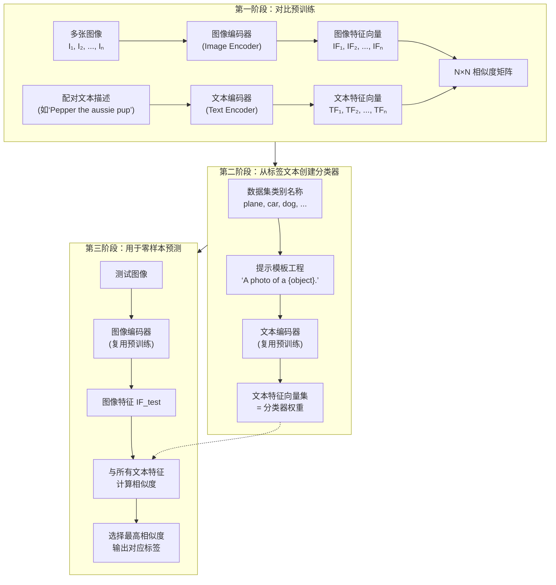

```mermaid
flowchart TD
    %% ==========================================
    %% 阶段 A
    %% ==========================================
    subgraph A [第一阶段：对比预训练]
        direction LR
        I["多张图像<br>I₁, I₂, ..., Iₙ"] --> IE["图像编码器<br>(Image Encoder)"]
        T["配对文本描述<br>(如‘Pepper the aussie pup’)" ] --> TE["文本编码器<br>(Text Encoder)"]
        
        IE --> IF["图像特征向量<br>IF₁, IF₂, ..., IFₙ"]
        TE --> TF["文本特征向量<br>TF₁, TF₂, ..., TFₙ"]
        
        IF & TF --> Sim["N×N 相似度矩阵"]
    end

    %% ==========================================
    %% 阶段 B
    %% ==========================================
    subgraph B [第二阶段：从标签文本创建分类器]
        direction TB
        Labels["数据集类别名称<br>plane, car, dog, ..."] --> Prompt["提示模板工程<br>‘A photo of a {object}.’"]
        Prompt --> TE2["文本编码器<br>(复用预训练)"]
        TE2 --> Classifier["文本特征向量集<br>= 分类器权重"]
    end

    %% ==========================================
    %% 阶段 C
    %% ==========================================
    subgraph C [第三阶段：用于零样本预测]
        direction LR
        TestImg["测试图像"] --> IE2["图像编码器<br>(复用预训练)"]
        IE2 --> ImgFeat["图像特征 IF_test"]
        
        ImgFeat --> Compare["与所有文本特征<br>计算相似度"]
        Classifier -.-> Compare
        Compare --> Pred["选择最高相似度<br>输出对应标签"]
    end

    %% 阶段间的逻辑流
    A --> B --> C
```