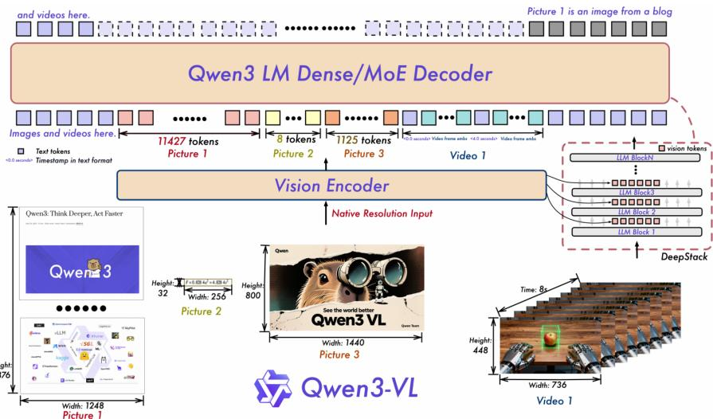

# Qwen3-VL 技术报告深度解读

## 概述

本文档基于对 **Qwen3-VL 技术报告**、**🤗 Transformers 实现代码** 以及相关技术资料的分析，系统总结了 Qwen3-VL 相对于 Qwen2.5-VL 的核心改进、架构创新及其在代码中的具体体现，并对关键组件（SigLIP-2、DeepStack）进行详细解析。

---

## 一、Qwen3-VL 与 Qwen2.5-VL 核心改进对比

| 维度 | Qwen2.5-VL | Qwen3-VL | 改进说明 |
|------|------------|----------|----------|
| **整体架构** | 三模块：ViT + MLP Merger + LLM | **继承三模块设计**，但内部组件升级 | 保持架构一致性，便于迁移与扩展 |
| **位置编码** | MRoPE（分块式：T, H, W 维度分组） | **Interleaved MRoPE**（交错式） | 将 T、H、W 分量交错嵌入，平衡频率谱，提升长视频时空建模 |
| **视觉‑语言融合** | 单层 MLP Merger（仅最后一层特征） | **DeepStack 集成**（多层特征融合） | 从 ViT 多个中间层提取特征，注入 LLM 前几层，增强细粒度对齐 |
| **视频时间表示** | T‑RoPE（通过绝对时间戳对齐的 MRoPE） | **文本时间戳**（显式文本 token，如 `<3.0 seconds>`） | 避免长视频中位置 ID 稀疏问题，简化时间表示，提升时间 grounding |
| **训练目标平衡** | per‑sample loss | **平方根重加权**（per‑token loss 并平方根归一化） | 更好平衡纯文本与多模态数据的贡献，防止文本能力退化 |
| **预训练阶段** | 3 阶段（视觉预训练 → 多模态预训练 → 长上下文预训练） | **4 阶段**（S0‑S3，逐步扩展上下文至 256K） | 更精细的训练流程，支持极长上下文适应 |
| **后训练策略** | SFT + DPO（冻结 ViT） | SFT + **强到弱蒸馏** + RL（仍可冻结 ViT） | 引入知识蒸馏与强化学习，进一步提升推理与对齐能力 |
| **模型变体** | 密集模型（如 72B） | 密集模型（2B/4B/8B/32B） + **MoE 模型**（30B‑A3B/235B‑A22B） | 提供更灵活的效率‑性能权衡 |
| **上下文长度** | 32K token | **256K token**（原生支持） | 可处理数百页文档、数小时视频 |
| **多语言 OCR** | 10 种非中/英文语言 | **39 种语言**（32 种准确率 >70%） | 大幅扩展实用语言覆盖 |

<div align="center">
  
</div>

---

## 二、核心创新点在 Transformers 代码中的体现

### 1. Interleaved MRoPE（交错的多模态旋转位置编码）

- **代码位置**：`Qwen3VLTextRotaryEmbedding.apply_interleaved_mrope`（`modeling_qwen3_vl.py` L352‑L364）
- **关键参数**：`mrope_section = [24, 20, 20]`（默认）
- **核心逻辑**：
  ```python
  def apply_interleaved_mrope(self, freqs, mrope_section):
      """将频率布局从分块 [TTT...HHH...WWW] 重组为交错 [THWTHWTHW...TT]"""
      freqs_t = freqs[0]  # 以 T 维度为基础
      for dim, offset in enumerate((1, 2), start=1):  # H, W
          length = mrope_section[dim] * 3
          idx = slice(offset, length, 3)
          freqs_t[..., idx] = freqs[dim, ..., idx]
      return freqs_t
  ```
- **与 Qwen2.5‑VL 的区别**：Qwen2.5‑VL 的 `apply_multimodal_rotary_pos_emb` 在 **`cos`/`sin` 计算完成后**对其进行分块与交错拼接；而 Qwen3‑VL 在 **频率计算阶段** 直接对 `freqs` 进行重组，**保持频率连续性**，改善长视频建模。

### 2. DeepStack 多层特征融合

- **配置参数**：`deepstack_visual_indexes = [8, 16, 24]`（在 `Qwen3VLVisionConfig` 中定义）
- **实现流程**：
  1.  **视觉特征提取**：在 `Qwen3VLVisionModel.forward` 中，当 ViT 层编号属于 `deepstack_visual_indexes` 时，使用对应的 `deepstack_merger_list` 对当前层特征进行投影，并存入列表。
  2.  **特征注入 LLM**：在 `Qwen3VLTextModel.forward` 中，若当前层索引在 `deepstack_visual_embeds` 范围内，则调用 `_deepstack_process` 将视觉特征以**残差方式**加到隐藏状态上：
      ```python
      def _deepstack_process(self, hidden_states, visual_pos_masks, visual_embeds):
          hidden_states = hidden_states.clone()
          hidden_states[visual_pos_masks, :] += visual_embeds  # 直接相加
          return hidden_states
      ```
- **效果**：实现**多层次视觉‑语言融合**（低层边缘/纹理 → 中层物体部件 → 高层语义概念），增强细粒度感知与推理。

### 3. 文本时间戳（Text‑based Time Alignment）

- **代码注释**：在 `_prepare_4d_attention_mask` 函数开头明确说明：
  ```python
  """Different from the original implementation, Qwen3VL use timestamps rather than absolute time position ids."""
  # Since we use timestamps to separate videos, like <t1> <vision_start> <frame1> <vision_end> <t2> ...
  ```
- **关键处理**：视频的 `llm_grid_t` 始终为 **1**（L1034），因为时间信息已由插入序列的文本时间戳 token（如 `<3.0 seconds>`）携带，不再需要多帧的时间维度位置 ID。

### 4. 256K 上下文支持

- **配置**：`max_position_embeddings = 128000`（默认），通过 **RoPE 缩放**（`rope_parameters` 可配置 `rope_type` 如 `"dynamic"`）实现实际 256K 支持。
- **训练阶段**：专门的 **S3 阶段**（序列长度 262,144）用于极长上下文适应，数据包含长文档、长视频。

### 5. 平方根重加权（Square‑root Reweighting）

- **说明**：该策略为**训练技巧**，在损失计算阶段对每个 token 的损失进行平方根归一化，以平衡不同长度样本的贡献。**不在模型架构代码中体现**，需查看训练脚本或自定义训练循环。

---

## 三、关键组件技术详解

### 1. SigLIP‑2 视觉编码器

#### 背景
由 Google DeepMind 于 2025 年 2 月发布，是 SigLIP 架构的升级版，专注于提升语义理解、定位能力和密集特征提取。

#### 核心架构
- **基础骨架**：标准 Vision Transformer (ViT)，提供四种规模：
  | 名称 | 参数 | 层数 | Patch Size | 说明 |
  |------|------|------|------------|------|
  | ViT‑B/16 | 86M | 12 | 16×16 | 基础版 |
  | ViT‑L/16 | 303M | 24 | 16×16 | 大型版 |
  | **ViT‑So400m/14** | **400M** | **27** | **14×14** | **Qwen3‑VL 默认使用** |
  | ViT‑g/16 | ≈1B | 28+ | 16×16 | 巨型版 |

#### 两种变体
1.  **固定分辨率 (FixRes)**：向后兼容，图像缩放到固定正方形尺寸。
2.  **原生宽高比与可变分辨率 (NaFlex)**：**保留输入图像原生宽高比**，通过调整使高、宽为 patch size 的倍数，最小化形变，特别适合 OCR、文档理解等任务。

#### 训练策略（多任务融合）
1.  **Sigmoid Loss**（来自 SigLIP）：构建图像‑文本匹配的二分类问题。
2.  **Decoder‑Based Pretraining**（来自 LocCa）：添加 Transformer 解码器，同时训练图像描述、自动参考表达式预测、基础描述三项任务。
3.  **Self‑Distillation and Masked Prediction**（来自 SILC/TIPS）：训练后期引入自监督学习，包括局部‑全局一致性损失和掩码预测。

#### 多语言与公平性
- 使用 **Gemma tokenizer**（词汇量 256k），在 **WebLI 数据集**（109 种语言）上训练。
- 数据混合：90% 英语 + 10% 非英语，平衡性能。
- 应用数据去偏技术，减少敏感属性偏差。

#### 性能
在零样本分类、图文检索、密集预测（分割、深度估计）和定位任务上全面超越 SigLIP。

### 2. DeepStack 技术

#### 核心思想
传统 LMM 将所有视觉 token 输入 LLM **第一层**，计算开销大。DeepStack 将视觉 token 分成 **N 组**（N 为 LLM 层数），每组注入**对应的 LLM 层**，实现“深度堆叠”的跨模态融合。

#### 在 Qwen3‑VL 中的具体实现
- **特征来源**：从 ViT 的**多个中间层**（`deepstack_visual_indexes` 指定）提取特征。
- **注入方式**：投影后的特征作为**残差**加到 LLM **前几层**的隐藏状态。
- **优势**：
  - **成本极低**：不增加额外 token 数量。
  - **增强层间交互**：视觉信息在 LLM 多层中逐步融合。
  - **高分辨率任务表现突出**：在 TextVQA、DocVQA 等需要细粒度视觉理解的任务上提升显著。

#### 与原始 DeepStack 论文的差异
- 原始 DeepStack：将视觉 token **均匀分组**并注入**所有 LLM 层**。
- Qwen3‑VL 实现：从 ViT **选定层**提取特征，仅注入 LLM **前几层**（对应索引），更注重**多层次视觉语义的早期融合**。

---

## 四、多维位置编码（MRoPE）的应用位置

### 问题：多维位置编码应用在视觉部分还是语言部分？
**答案：在语言模型（LLM）部分实现，但主要为视觉 token 服务。**

### 详细说明：
1.  **视觉编码器（ViT）**：使用 **2D RoPE**（仅空间维度 H, W），帮助 ViT 理解图像 patch 的相对位置。
2.  **语言模型（LLM）**：使用 **Interleaved MRoPE**（三维 T, H, W），为**视觉 token** 提供其在原始图像/视频中的空间（H,W）和时间（T）位置信息。
3.  **工作流程**：
    ```
    图像/视频 → ViT（2D RoPE） → 视觉特征 → MLP Merger → 视觉 token
                                              ↓
    文本 token + 视觉 token → LLM（Interleaved MRoPE）→ 注意力计算
    ```
4.  **设计动机**：在 LLM 内部统一处理文本和视觉 token 的位置信息，使 LLM 在推理时不仅能理解文本序列关系，还能“感知”视觉内容的空间布局（如“左上角的猫”）和时间顺序（如“第3秒的画面”），从而实现更准确的视觉‑语言对齐与跨模态推理。

---

## 五、总结

Qwen3‑VL 在 Qwen2.5‑VL 坚实的基础上，通过 **三大架构升级**（Interleaved MRoPE、DeepStack、文本时间戳）、**训练策略优化**（平方根重加权、四阶段预训练、强到弱蒸馏）以及 **数据体系全方位扩展**，实现了全方位的性能提升：

1.  **更平衡的时空编码**：Interleaved MRoPE 改善长视频理解。
2.  **更深层的视觉‑语言融合**：DeepStack 实现多层次特征注入，增强细粒度感知。
3.  **更直观的时间表示**：文本时间戳简化视频时序建模，提升时间 grounding。
4.  **更广泛的任务支持**：通过 SigLIP‑2 增强多语言、多分辨率能力；扩展代码、STEM、3D、智能体等数据域。
5.  **极长的上下文处理**：原生 256K 上下文，支持整本书、长视频的连贯理解。

这些改进在 🤗 Transformers 的代码中得到了清晰、模块化的实现，为研究者和开发者提供了强大的开源多模态基础模型。

---

## 参考资料
1.  Qwen3‑VL Technical Report (`qwen3VL.mmd`)
2.  Qwen2.5‑VL Technical Report (`Qwen2.5-VL_Technical_Report.md`)
3.  🤗 Transformers 源码：`src/transformers/models/qwen3_vl/`
