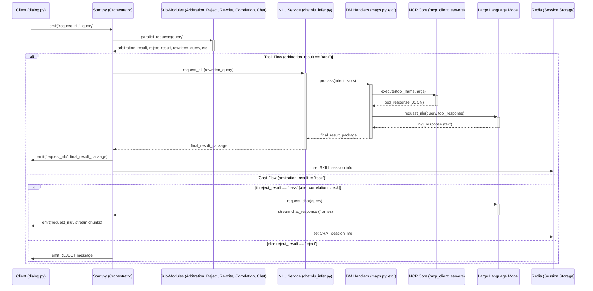

# 车载助手 Agent 运行流程详解

## 1. 概述

本文档将详细拆解车载助手 Agent 的完整运行流程，从启动项目服务到完成一次对话交互的全过程。旨在帮助开发者深入理解各个模块之间是如何协同工作的。

## 2. 启动流程 (`server.sh`)

项目的启动入口是 `server.sh` 脚本。该脚本负责按顺序、在后台启动构成 Agent 所需的全部微服务。这是一个典型的微服务架构启动方式，保证了各个组件的独立性。

启动顺序如下：

1.  **Redis 数据库 (`redis-server`):**
    *   **作用:** 作为系统的“短期记忆中心”。它被用于缓存会话信息，例如多轮对话的上下文、用户上一次的交互结果等。
    *   **启动方式:** 脚本会自动下载、编译并启动 Redis 服务，日志输出到 `log/redis.log`。

2.  **拒识服务 (`reject_infer.py`):**
    *   **作用:** 一个独立的推理服务，用于判断用户输入是否属于应该被拒绝的范畴（如黄、赌、毒、不文明用语等）。这是保障 Agent 安全性的第一道防线。
    *   **启动方式:** 在 `train` 目录下启动，日志输出到 `log/reject.log`。

3.  **意图召回服务 (`intent_infer.py`):**
    *   **作用:** 负责 NLU 的第一阶段——“召回”。它接收用户查询，并快速从海量的意图集合中，返回最可能匹配的 Top-K 个候选意图。这大大缩小了后续大模型处理的范围，是性能优化的关键一步。
    *   **启动方式:** 在 `train` 目录下启动，日志输出到 `log/intent.log`。

4.  **NLU 服务 (`chatnlu_infer.py`):**
    *   **作用:** 这是 NLU 和 DM（对话管理）的核心服务。它负责接收“召回”的意图，利用大模型的 Function Calling 能力进行“精排”，最终确定用户的精确意图和槽位。同时，它也集成了 DM 逻辑，负责调用工具并返回结果。
    *   **启动方式:** 在 `function_call` 目录下启动，日志输出到 `log/nlu.log`。

5.  **入口服务 (`start.py`):**
    *   **作用:** 项目的总入口和中央协调器。它是一个基于 Flask-SocketIO 的实时服务，负责接收客户端连接，并编排整个对话流程。
    *   **启动方式:** 在项目根目录下启动，日志输出到 `log/start.log`。

## 3. 对话交互流程

一次完整的对话交互是从客户端（如 `dialog.py`）发起，由 `start.py` 接收并精心编排，最终将结果返回给客户端的闭环。

### 3.1. 客户端 (`dialog.py`)

*   `dialog.py` 是一个简单的命令行客户端，用于模拟用户与 Agent 的交互。
*   它通过 Socket.IO 连接到 `start.py` 提供的服务。
*   在一个无限循环中，它接收用户从键盘输入的内容，并将其封装成一个 JSON 对象，通过 `sio.emit("request_nlu", ...)` 发送给 `start.py`。
*   同时，它也监听 `request_nlu` 事件，用于接收并打印 Agent 返回的最终结果。

### 3.2. 中央协调器 (`start.py`)

`start.py` 是整个流程的核心，其设计精妙之处在于**大规模的并行处理**，以实现最低的响应延迟。

1.  **接收请求:** 当 `@socketio.on('request_nlu')` 事件处理器接收到来自客户端的请求后，流程开始。

2.  **并行派发任务:** 系统不会串行地一步步执行，而是使用 `ThreadPoolExecutor` **同时**向各个子模块发出请求：
    *   `request_rewrite`: 请求 **改写模块**，结合 Redis 中的历史信息，对当前 query 进行澄清和补全。
    *   `request_arbitration`: 请求 **仲裁模块**，判断 query 的宏观意图（任务/闲聊）。
    *   `request_reject`: 请求 **拒识模块**，进行安全和能力边界检查。
    *   `request_correlation`: 请求 **关联模块**，判断 query 与上一轮对话的关联性。
    *   `request_nlu`: 请求 **NLU 服务** (`chatnlu_infer.py`)，开始进行意图和槽位识别。
    *   `request_chat`: 请求 **闲聊模块**，提前准备好一个闲聊的回复，以备“兜底”之用。

3.  **仲裁与决策:**
    *   系统首先等待**仲裁模块** (`request_arbitration`) 的返回结果。
    *   **Case 1: 如果结果是 `task` (任务型)**
        *   系统会等待 **NLU 服务** (`handler_nlu`) 的返回结果。
        *   如果 NLU 成功识别出意图和功能（`function` 不为 `Unknown`），则将完整的 NLU 结果（包含意图、槽位、工具执行结果和 NLG 回复）通过 `emit` 发送回客户端。
        *   如果 NLU 结果为 `Unknown`，则认为无法处理，向客户端发送拒识信息。
    *   **Case 2: 如果结果是 `chat` 或 `faq` (闲聊或问答型)**
        *   系统会先检查**拒识模块** (`handler_reject`) 的结果。
        *   如果 query 被拒绝，则直接向客户端发送拒识信息。
        *   如果 query 未被拒绝，则进入闲聊流程 (`handle_chat`)。
        *   `handle_chat` 会处理**闲聊模块** (`handler_bot`) 返回的流式结果，并通过 `emit` 将回复（可能分成多段）流式地发送回客户端，实现打字机效果。

4.  **状态更新:** 在每次交互的最后，系统会将本次交互的关键信息（领域、query、拒识结果、最终回复）存入 Redis，为下一次的 `rewrite` 和 `correlation` 提供上下文。

### 3.3. NLU 与工具调用 (`chatnlu_infer.py`)

当 `start.py` 请求 NLU 服务时，`chatnlu_infer.py` 内部的流程如下：

1.  **意图召回:** 调用 `intent_infer.py` 服务，获取候选意图列表。
2.  **效率优化：高置信度未知意图跳过**：在此阶段，如果意图召回模型返回的最高分意图是“未知” (`Unknown`，ID 为 "3") 且其置信度极高（`max_score > 0.98`），系统会直接返回“未知-无”，跳过后续昂贵的大模型 Function Calling 步骤，从而提高响应效率。
3.  **工具筛选:** 根据召回的意图（如果未被跳过），从 `function.py` 中定义的庞大工具列表中筛选出相关的工具。
4.  **LLM Function Calling:** 将用户 query 和筛选后的工具列表一起发送给豆包（Doubao）大模型，进行精确的意图和槽位识别。
5.  **DM 分发:** 大模型返回要调用的函数名和参数后，`DMFactory` 会根据函数名（领域）将任务分发给对应的 DM 处理器（`maps.py`, `music.py`, `weather.py`）。
6.  **工具执行:** DM 处理器会初始化 `mcp_client`，并调用其 `execute` 方法。`mcp_client` 负责与真正的能力服务器（`amp_server.py`, `music_server.py`）通信，执行工具并返回结果。
7.  **NLG 生成:** DM 处理器拿到工具执行结果后，会调用 `client/nlg.py` 中的 `request_nlg`，让大模型将结构化的结果（如 JSON）转换成自然语言。
8.  **返回结果:** 最终，包含 NLU 结果、工具执行结果和 NLG 回复的完整 JSON 对象被返回给 `start.py`。

## 4. 流程总结

这个流程展示了一个高度工程化和优化的对话 Agent 设计。其核心优势在于通过微服务化和大规模并行处理，实现了功能的解耦和性能的最大化，为用户提供了流畅、智能的交互体验。

**特别说明：闲聊流程中的拒识判断**

值得注意的是，在上面的“Chat Flow”分支中，增加了一个关键的 `if/else` 判断。这正是我们之前讨论的**拒识环节**。

*   **目的：** 防止系统对无关的背景人声、噪音或其他非指向车载助手的对话进行响应。
*   **流程：** 在仲裁模块判断为“闲聊”后，系统并不会立刻调用 LLM。它会先检查并行返回的**拒识模块 (`reject_result`)** 的结果。
    *   只有当拒识结果为“通过” (`pass`) 时，系统才会继续调用 LLM 进行闲聊，并将结果返回用户。
    *   如果拒识结果为“拒绝” (`reject`)，流程会在此处被**静默中断 (Silent, no response)**，不会有任何回复。
*   **意义：** 这个设计极大地节省了计算资源（避免了不必要的 LLM 调用），并显著提升了用户体验，让车载助手显得更“智能”，不会随意“插嘴”。

**关于 NLG 与 Chat 模型的区分：**

值得强调的是，系统在处理任务型回复和闲聊型回复时，采用了不同的策略和模型：

*   **任务型回复:** 经过 NLU 和 DM 模块处理后，由 `client/nlg.py` 调用一个通用 LLM (如 `ep-` 系列模型) 将结构化的工具执行结果转化为自然语言。
*   **闲聊型回复:** 由 `client/stream_chat.py` 直接调用一个对话专用 LLM (如 `bot-` 系列模型) 生成，并以流式方式实时返回给客户端。**闲聊回复不会再经过 `client/nlg.py` 进行二次处理**。
