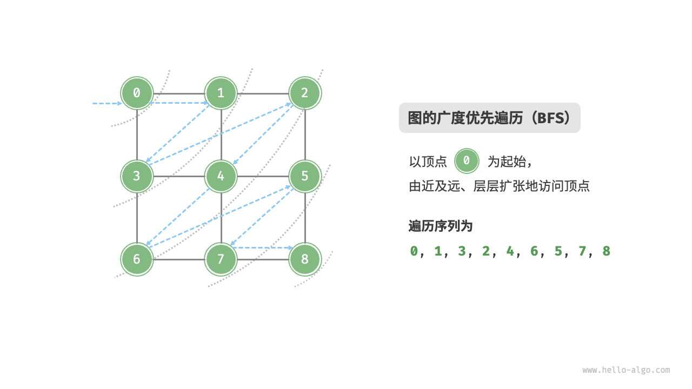

# 图的遍历

> 树代表的是“一对多”的关系，而图则具有更高的自由度，可以表示任意的“多对多”关系。因此，我们可以把树看作图的一种特例。显然，树的遍历操作也是图的遍历操作的一种特例。



```python
# BFS
def graph_bfs(graph: GraphAdjList, start_vet: Vertex) -> list[Vertex]:
    """广度优先遍历"""
    # 使用邻接表来表示图，以便获取指定顶点的所有邻接顶点
    # 顶点遍历序列
    res = []
    # 哈希集合，用于记录已被访问过的顶点
    visited = set[Vertex]([start_vet])
    # 队列用于实现 BFS
    que = deque[Vertex]([start_vet])
    # 以顶点 vet 为起点，循环直至访问完所有顶点
    while len(que) > 0:
        vet = que.popleft()  # 队首顶点出队
        res.append(vet)  # 记录访问顶点
        # 遍历该顶点的所有邻接顶点
        for adj_vet in graph.adj_list[vet]:
            if adj_vet in visited:
                continue  # 跳过已被访问的顶点
            que.append(adj_vet)  # 只入队未访问的顶点
            visited.add(adj_vet)  # 标记该顶点已被访问
    # 返回顶点遍历序列
    return res
```

---

## 🧩 一、BFS的核心思想

**广度优先搜索**的核心思想是：

> 从一个起点开始，先访问“所有邻居”，再访问“邻居的邻居”，像水波一样一层层扩散。

你可以把 BFS 理解为一个“分层访问”的过程：
第一层：起点
第二层：起点的所有邻接点
第三层：第二层顶点的邻接点（未访问过的）
……

它通过**队列（queue）**实现这种“先进先出”的层级扩展。

---

## 🚀 二、核心代码结构（逐行讲解）

```python
def graph_bfs(graph: GraphAdjList, start_vet: Vertex) -> list[Vertex]:
```

函数输入：

* `graph`: 一个使用邻接表实现的无向图；
* `start_vet`: 起始顶点；
  输出：
* `res`: 按照 BFS 顺序访问的顶点序列。

---

### 1️⃣ 初始化阶段

```python
res = []                      # 记录遍历顺序
visited = set([start_vet])    # 记录已访问顶点
que = deque([start_vet])      # 初始化队列（先进先出）
```

队列初始状态：

```
队列： [start_vet]
已访问： {start_vet}
结果： []
```

---

### 2️⃣ 主循环：队列不空就继续访问

```python
while len(que) > 0:
    vet = que.popleft()       # 队首元素出队
    res.append(vet)           # 记录访问结果
```

* 每次取出一个顶点（队首）；
* 将其加入遍历序列。

---

### 3️⃣ 遍历当前顶点的所有邻接点

```python
for adj_vet in graph.adj_list[vet]:
    if adj_vet in visited:
        continue
    que.append(adj_vet)       # 入队未访问的邻居
    visited.add(adj_vet)      # 标记已访问
```

这就是 BFS 的扩展关键：

* 对当前顶点 `vet` 的每一个邻接顶点 `adj_vet`：

  * 如果它没被访问过，就：

    * 放入队列；
    * 标记为已访问。

这一步使得算法能层层“扩散”出去。

---

### 4️⃣ 最后返回结果

```python
return res
```

---

## 🧠 三、举例说明

假设图为：

```
A —— B —— C
│    │
D —— E
```

邻接表：

```python
A: [B, D]
B: [A, C, E]
C: [B]
D: [A, E]
E: [B, D]
```

---

### ▶ 从 A 开始 BFS

初始：

```
visited = {A}
queue = [A]
res = []
```

#### 第1轮：

出队 A

```
res = [A]
A 的邻居 = [B, D]
→ B、D 未访问，入队
```

结果：

```
visited = {A, B, D}
queue = [B, D]
```

#### 第2轮：

出队 B

```
res = [A, B]
B 的邻居 = [A, C, E]
→ A 已访问，跳过
→ C、E 未访问，入队
```

结果：

```
visited = {A, B, D, C, E}
queue = [D, C, E]
```

#### 第3轮：

出队 D

```
res = [A, B, D]
D 的邻居 = [A, E]
→ A 已访问，跳过
→ E 已访问，跳过
```

#### 第4轮：

出队 C

```
res = [A, B, D, C]
C 的邻居 = [B]
→ B 已访问
```

#### 第5轮：

出队 E

```
res = [A, B, D, C, E]
E 的邻居 = [B, D]
→ 均已访问
```

队列清空，结束。

最终结果：

```
BFS遍历顺序: A → B → D → C → E
```

## DFS

深度优先遍历是一种优先走到底、无路可走再回头的遍历方式。


```python
def dfs(graph: GraphAdjList, visited: set[Vertex], res: list[Vertex], vet: Vertex):
    """深度优先遍历辅助函数"""
    res.append(vet)  # 记录访问顶点
    visited.add(vet)  # 标记该顶点已被访问
    # 遍历该顶点的所有邻接顶点
    for adjVet in graph.adj_list[vet]:
        if adjVet in visited:
            continue  # 跳过已被访问的顶点
        # 递归访问邻接顶点
        dfs(graph, visited, res, adjVet)

def graph_dfs(graph: GraphAdjList, start_vet: Vertex) -> list[Vertex]:
    """深度优先遍历"""
    # 使用邻接表来表示图，以便获取指定顶点的所有邻接顶点
    # 顶点遍历序列
    res = []
    # 哈希集合，用于记录已被访问过的顶点
    visited = set[Vertex]()
    dfs(graph, visited, res, start_vet)
    return res
```

好的，我们先一步步看这段 DFS（深度优先搜索）代码在做什么，然后再结合一个简单例子来直观理解。

---

## 一、代码逐行解析

### 1️⃣ 辅助函数 `dfs(...)`

```python
def dfs(graph: GraphAdjList, visited: set[Vertex], res: list[Vertex], vet: Vertex):
    """深度优先遍历辅助函数"""
    res.append(vet)  # 记录访问顶点
    visited.add(vet)  # 标记该顶点已被访问
```

* 当我们访问到某个顶点 `vet` 时：

  * 把它加入结果列表 `res`；
  * 同时在 `visited` 集合中做标记，避免重复访问。

---

### 2️⃣ 遍历邻居节点

```python
    for adjVet in graph.adj_list[vet]:
        if adjVet in visited:
            continue  # 跳过已被访问的顶点
        dfs(graph, visited, res, adjVet)
```

* 取出当前顶点 `vet` 的所有相邻顶点 `adjVet`；
* 如果某个相邻顶点还没访问过，就**递归调用 `dfs`**；
* 递归会不断深入，直到所有路径都走到底为止。

👉 这就是“深度优先”的含义：**先一条路走到头，再回溯。**

---

### 3️⃣ 封装函数 `graph_dfs(...)`

```python
def graph_dfs(graph: GraphAdjList, start_vet: Vertex) -> list[Vertex]:
    res = []
    visited = set[Vertex]()
    dfs(graph, visited, res, start_vet)
    return res
```

* 这是 DFS 的主函数；
* 它初始化：

  * `res`：存储遍历顺序；
  * `visited`：记录访问过的顶点；
* 然后从起点 `start_vet` 开始递归搜索。

---

## 二、DFS 的核心思想

DFS 的核心思想是 **递归地“沿着路径向下”探索**，直到无法继续为止，然后回溯并探索新的路径。

这个过程就像是：

> 一棵树的深度优先遍历：先走到叶子节点，再返回上一层，继续走别的分支。

DFS 可以用**递归**或**显式栈**实现，这里使用的是递归方式（更自然）。

---

## 三、举个例子

我们来构造一个简单的**有环无向图**，然后完整地演示 DFS 是如何一步步遍历的。

---

假设图结构如下：

```
   A
  / \
 B---C
  \ /
   D
```

这张图存在多个环，比如：

* A → B → C → A
* B → C → D → B

对应的邻接表（`GraphAdjList`）是：

```python
graph.adj_list = {
    'A': ['B', 'C'],
    'B': ['A', 'C', 'D'],
    'C': ['A', 'B', 'D'],
    'D': ['B', 'C']
}
```
---

## 🚀 从 A 开始 DFS（详细过程）

初始化：

```
res = []
visited = {}
stack = 调用栈（由递归隐式维护）
```

---

### Step 1️⃣ 访问 A

* `res = [A]`
* `visited = {A}`
* A 的邻居是：B、C

进入第一个邻居 **B**

---

### Step 2️⃣ 访问 B

* `res = [A, B]`
* `visited = {A, B}`
* B 的邻居是：A、C、D

邻居 A 已访问 → 跳过
下一个邻居：C

---

### Step 3️⃣ 访问 C

* `res = [A, B, C]`
* `visited = {A, B, C}`
* C 的邻居：A、B、D

邻居 A、B 都访问过 → 跳过
访问 **D**

---

### Step 4️⃣ 访问 D

* `res = [A, B, C, D]`
* `visited = {A, B, C, D}`
* D 的邻居：B、C 都访问过 → 无新顶点

返回到 C

---

### Step 5️⃣ 回溯

* C 没有新的邻居 → 返回到 B
* B 没有新的邻居 → 返回到 A
* A 的另一个邻居 C 已访问过 → 结束

---

✅ **最终遍历顺序：**

```
res = [A, B, C, D]
```

---
