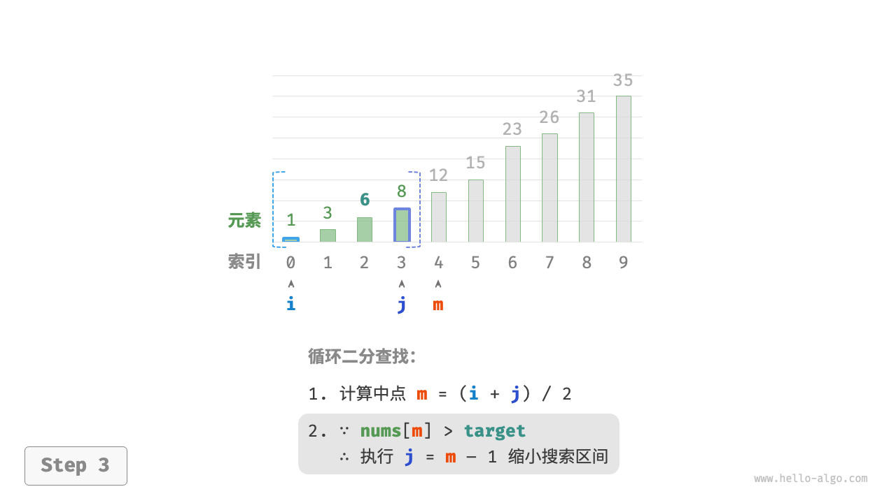

# 搜索

## 1. 二分查找

二分查找（binary search）是一种基于分治策略的高效搜索算法。它利用数据的有序性，每轮缩小一半搜索范围，直至找到目标元素或搜索区间为空为止。



```
question：
给定一个长度为 k 的数组 nums ，元素按从小到大的顺序排列且不重复。请查找并返回元素 target 在该数组中的索引。若数组不包含该元素，则返回 -1。
```

```python
def binary_search(nums: list[int], target: int) -> int:
    """二分查找（双闭区间）"""
    # 初始化双闭区间 [0, n-1] ，即 i, j 分别指向数组首元素、尾元素
    i, j = 0, len(nums) - 1
    # 循环，当搜索区间为空时跳出（当 i > j 时为空）
    while i <= j:
        # 理论上 Python 的数字可以无限大（取决于内存大小），无须考虑大数越界问题
        m = (i + j) // 2  # 计算中点索引 m
        if nums[m] < target:
            i = m + 1  # 此情况说明 target 在区间 [m+1, j] 中
        elif nums[m] > target:
            j = m - 1  # 此情况说明 target 在区间 [i, m-1] 中
        else:
            return m  # 找到目标元素，返回其索引
    return -1  # 未找到目标元素，返回 -1
```

## 2. 二分查找插入点

```md
qustion:
给定一个长度为 n 的有序数组 nums 和一个元素 target ，若数组存在重复元素。现将 target 插入数组 nums 中，并保持其有序性。若数组中已存在元素 target ，则插入到其左方。请返回插入后 target 在数组中的索引。
```

## 一、问题分析

假设数组 `nums` 是有序的，但可能存在重复元素：

```text
nums = [1, 3, 5, 5, 5, 7]
target = 5
```

要求：

* 插入 target 后仍保持有序；
* 如果 target 已存在，插入到最左侧的 target 前面；
* 返回插入后的索引。

这等价于：**寻找数组中第一个大于等于 target 的位置（lower bound）**。

---

## 二、二分查找优化

### 1️⃣ 初始化

```python
left, right = 0, len(nums) - 1
```

### 2️⃣ 循环条件

```python
while left <= right:
    mid = (left + right) // 2
    if nums[mid] >= target:
        right = mid - 1  # 往左边继续找
    else:
        left = mid + 1   # 往右边找
```

### 3️⃣ 返回值

```python
return left
```

---

## 三、解释优化点

1. `nums[mid] >= target`：

   * 不管 nums[mid] 是等于还是大于 target，都往左查找，确保找到**最左侧的 target**。
2. `left` 最终指向**第一个大于等于 target 的位置**：

   * 如果 target 存在 → 指向最左侧 target
   * 如果 target 不存在 → 指向第一个比 target 大的位置
   * 刚好满足左插入规则。

---

## 四、Python实现

```python
from typing import List

def insert_position_with_duplicates(nums: List[int], target: int) -> int:
    left, right = 0, len(nums) - 1
    while left <= right:
        mid = (left + right) // 2
        if nums[mid] >= target:
            right = mid - 1
        else:
            left = mid + 1
    return left
```


非常好，这是“**查找最左边 target 的二分查找（Left Bound Search）**”版本。
我们来完整拆解这段代码的逻辑与思想。

---

## 3. 查找最左边 target 的二分查找

```python
# 它依赖于前面定义的 `binary_search_insertion()`：
def binary_search_insertion(nums: list[int], target: int) -> int:
    left, right = 0, len(nums) - 1
    while left <= right:
        mid = (left + right) // 2
        if nums[mid] >= target:
            right = mid - 1
        else:
            left = mid + 1
    return left

def binary_search_left_edge(nums: list[int], target: int) -> int:
    """二分查找最左一个 target"""
    # 等价于查找 target 的插入点
    i = binary_search_insertion(nums, target)
    # 未找到 target ，返回 -1
    if i == len(nums) or nums[i] != target:
        return -1
    # 找到 target ，返回索引 i
    return i

```

---

## 🧩 一步步解析逻辑

### ① `binary_search_insertion(nums, target)`

这个函数的作用是：

> 返回“第一个 **大于等于 target**”的元素位置（即左边界）。

例如：

| nums               | target | 返回值 | 含义           |
| ------------------ | ------ | --- | ------------ |
| [1, 3, 5, 5, 5, 7] | 5      | 2   | 第一个等于5的位置    |
| [1, 3, 5, 5, 5, 7] | 4      | 2   | 第一个≥4的位置（5）  |
| [1, 3, 5, 5, 5, 7] | 8      | 6   | 超过数组长度（插入末尾） |

---

### ② 在 `binary_search_left_edge()` 里

```python
i = binary_search_insertion(nums, target)
```

这一步找到了 target **可能的最左插入点**，也就是最左边“≥ target”的位置。
但是这个位置的元素可能不是 target，而是更大的数（如果 target 不存在）。

---

### ③ 检查是否真找到目标

```python
if i == len(nums) or nums[i] != target:
    return -1
```

这里的逻辑判断两种“没找到”的情况：

1. **越界情况**：
   若 `i == len(nums)`，说明 target 比所有元素都大，没有匹配值。
2. **值不匹配**：
   若 `nums[i] != target`，说明虽然找到一个 ≥ target 的位置，但值不是 target（即 target 不在数组中）。

---

### ④ 若通过检查，说明 nums[i] == target

此时，`i` 就是 **最左边的 target 索引**，直接返回。

---

## 🧠 举例说明

### 例1：target 存在且重复

```python
nums = [1, 3, 5, 5, 5, 7]
target = 5
```

执行：

1. `binary_search_insertion()` → `i = 2`
2. 检查：

   * `i != len(nums)` ✅
   * `nums[i] == 5` ✅
3. 返回 `2`

✅ 最左的 target = 5 的索引是 `2`。

---

### 例2：target 不存在（插在中间）

```python
nums = [1, 3, 5, 5, 5, 7]
target = 4
```

1. `binary_search_insertion()` → `i = 2`
2. 检查：

   * `nums[2] == 5` ≠ 4 ❌
3. 返回 `-1`

✅ 表示没有找到。

---

### 例3：target 大于所有元素

```python
nums = [1, 3, 5]
target = 8
```

1. `binary_search_insertion()` → `i = 3`
2. `i == len(nums)` ✅
3. 返回 `-1`

## 🧩 查找最右边 target 的二分查找

```python
def binary_search_right_edge(nums: list[int], target: int) -> int:
    """二分查找最右一个 target"""
    # 转化为查找最左一个 target + 1
    i = binary_search_insertion(nums, target + 1)
    # j 指向最右一个 target ，i 指向首个大于 target 的元素
    j = i - 1
    # 未找到 target ，返回 -1
    if j == -1 or nums[j] != target:
        return -1
    # 找到 target ，返回索引 j
    return j
```

---

## 🌱 核心思想：**用左边界查右边界**

我们本来想找：

> “数组中最后一个等于 target 的元素的索引”。

但是右边界不太好直接用常规二分写。
作者用了一个巧思：

> “最右的 target”
> = “第一个 **大于 target** 的位置的左边那个元素”。

换句话说：

* `i = binary_search_insertion(nums, target + 1)`
  得到第一个 ≥ (target + 1) 的索引（即第一个比 target 大的元素）；
* `j = i - 1`
  就是 **最后一个 ≤ target 的位置**；
* 如果该元素真的等于 target，那它就是我们要的“最右 target”。

---

## 📘 举个例子

假设：

```python
nums = [1, 3, 5, 5, 5, 7]
target = 5
```

1️⃣ 执行

```python
i = binary_search_insertion(nums, target + 1)
```

即 `binary_search_insertion(nums, 6)`。

我们知道 insertion 查找第一个 ≥6 的位置。
在 `[1,3,5,5,5,7]` 里，第一个 ≥6 的元素是 `7`，索引为 `5`。
所以：

```python
i = 5
j = 4
```

2️⃣ 检查 `nums[j] == target` 吗？
`nums[4] == 5 ✅`

因此返回 `4`。
✅ 最右的 5 在索引 4。

---

## 🧠 再看一个没有 target 的例子

```python
nums = [1, 3, 5, 5, 5, 7]
target = 6
```

执行：

```python
i = binary_search_insertion(nums, 7)
```

第一个 ≥7 的元素在索引 `5`。
→ `j = 4`
但 `nums[4] = 5 ≠ 6` ❌
所以返回 `-1`。

> ✅ **技巧总结一句话：**
> > “右边界 = 左边界(target + 1) - 1”
