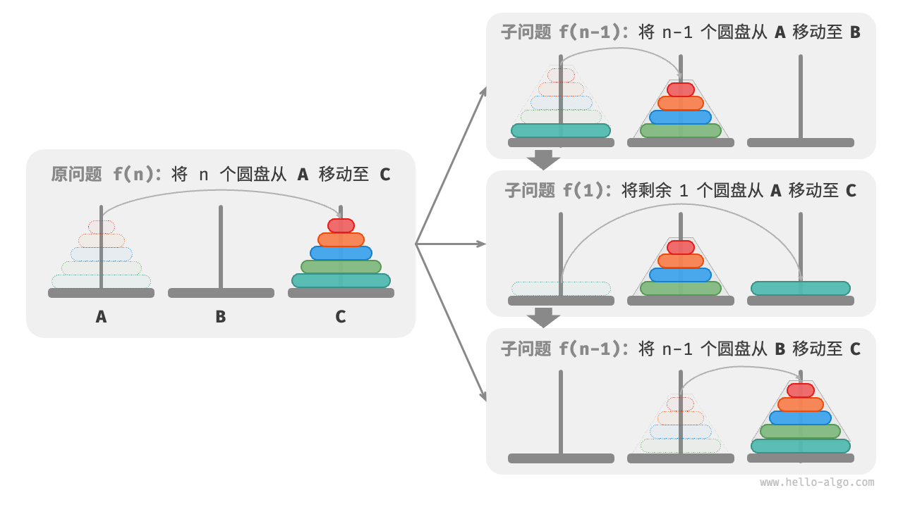

# 分治算法

分治（divide and conquer），全称分而治之，是一种非常重要且常见的算法策略。分治通常基于递归实现，包括“分”和“治”两个步骤。

## 分治搜索

- 实现：

```python
def dfs(nums: list[int], target: int, i: int, j: int) -> int:
    """二分查找：问题 f(i, j)"""
    # 若区间为空，代表无目标元素，则返回 -1
    if i > j:
        return -1
    # 计算中点索引 m
    m = (i + j) // 2
    if nums[m] < target:
        # 递归子问题 f(m+1, j)
        return dfs(nums, target, m + 1, j)
    elif nums[m] > target:
        # 递归子问题 f(i, m-1)
        return dfs(nums, target, i, m - 1)
    else:
        # 找到目标元素，返回其索引
        return m

def binary_search(nums: list[int], target: int) -> int:
    """二分查找"""
    n = len(nums)
    # 求解问题 f(0, n-1)
    return dfs(nums, target, 0, n - 1)
```
---

## 一、问题的定义与分治思想

`dfs(nums, target, i, j)` 表示一个**子问题**：

> 在有序数组 `nums[i..j]` 中查找目标值 `target` 的索引。

整个过程符合**分治算法（Divide and Conquer）**的三步逻辑：

1. **分解（Divide）**：
   将搜索区间 `[i, j]` 分为两半。
2. **解决（Conquer）**：
   在其中一个子区间递归查找。
3. **合并（Combine）**：
   因为二分查找只会递归进入一个分支，所以不需要“合并”，而是直接返回结果。

---

## 二、运行过程详解

以一个例子说明：

```python
nums = [1, 3, 5, 7, 9]
target = 7
binary_search(nums, target)
```

### 步骤 1：初始调用

```python
dfs(nums, 7, 0, 4)
```

此时区间 `[0,4]`，即 `[1,3,5,7,9]`

计算中点：

```python
m = (0 + 4) // 2 = 2
nums[m] = 5
```

比较：

```
nums[m] < target → 5 < 7
```

于是进入右半区间：

```python
dfs(nums, 7, 3, 4)
```

---

### 步骤 2：递归右半区间

区间 `[3,4]` → `[7,9]`

计算中点：

```python
m = (3 + 4) // 2 = 3
nums[m] = 7
```

匹配成功：

```python
return m  # 返回 3
```

递归回溯到上一层，得到最终结果：

```
binary_search 返回 3
```

---

## 三、分治结构可视化

调用树结构如下：

```
f(0, 4)
 ├─ 左半区：[0, 1]   (若目标较小)
 └─ 右半区：[3, 4]   (目标较大 → 实际进入这里)
      ├─ f(3, 4)
      │    └─ 找到目标，返回 3
```

你可以看到，这个递归调用树的**每一层只处理一个子区间**，因此空间复杂度仅取决于递归深度。

---

## 四、复杂度分析

| 项目         | 分析                                             |
| ---------- | ---------------------------------------------- |
| **时间复杂度**  | ( O(\log n) )，每次递归都将区间长度减半。                    |
| **空间复杂度**  | ( O(\log n) )，由递归调用栈深度决定。若改为循环形式，可降为 ( O(1) )。 |
| **递归结束条件** | 当 `i > j`，表示区间为空 → 查找失败返回 `-1`。                |

---

## 五、对比迭代版

递归版的核心逻辑其实就是迭代版的结构化重写：

```python
def binary_search_iter(nums, target):
    i, j = 0, len(nums) - 1
    while i <= j:
        m = (i + j) // 2
        if nums[m] < target:
            i = m + 1
        elif nums[m] > target:
            j = m - 1
        else:
            return m
    return -1
```

两者在逻辑上完全等价，只是**递归版体现了清晰的分治递归关系**：

> `f(i, j) = f(m+1, j)` 或 `f(i, m-1)`。

---

## 构建二叉树

给定一棵二叉树的前序遍历 preorder 和中序遍历 inorder ，请从中构建二叉树，返回二叉树的根节点。假设二叉树中没有值重复的节点
```python
def dfs(
    preorder: list[int],
    inorder_map: dict[int, int],
    i: int,
    l: int,
    r: int,
) -> TreeNode | None:
    """构建二叉树：分治"""
    # 子树区间为空时终止
    if r - l < 0:
        return None
    # 初始化根节点
    root = TreeNode(preorder[i])
    # 查询 m ，从而划分左右子树
    m = inorder_map[preorder[i]]
    # 子问题：构建左子树
    root.left = dfs(preorder, inorder_map, i + 1, l, m - 1)
    # 子问题：构建右子树
    root.right = dfs(preorder, inorder_map, i + 1 + m - l, m + 1, r)
    # 返回根节点
    return root

def build_tree(preorder: list[int], inorder: list[int]) -> TreeNode | None:
    """构建二叉树"""
    # 初始化哈希表，存储 inorder 元素到索引的映射
    inorder_map = {val: i for i, val in enumerate(inorder)}
    root = dfs(preorder, inorder_map, 0, 0, len(inorder) - 1)
    return root
```

非常好，这个问题是**典型的分治（Divide and Conquer）构建问题**之一：

> **由前序遍历（preorder）和中序遍历（inorder）唯一确定一棵二叉树。**

这段代码正是利用了二叉树遍历规律，通过分治（递归）地构造出整棵树。
下面我将从算法思想、每层递归含义、运行流程与分治结构几个维度详细拆解。

---

## 一、核心思路回顾

二叉树的遍历规律：

| 遍历方式          | 访问顺序          |
| ------------- | ------------- |
| 前序遍历 preorder | **根 → 左 → 右** |
| 中序遍历 inorder  | **左 → 根 → 右** |

由此得出关键性质：

> 在前序遍历中，第一个节点一定是当前子树的根节点。
> 在中序遍历中，根节点左边部分属于左子树，右边部分属于右子树。

---

## 二、问题建模（分治思想）

我们定义递归函数：

```python
dfs(preorder, inorder_map, i, l, r)
```

表示：

> 从前序遍历中索引 `i` 开始的节点为当前子树的根节点，
> 在中序遍历的区间 `[l, r]` 内构建这棵子树。

这就是一个典型的**“子问题定义”**，分治的核心在于——
将「整棵树的构建」分解为「左子树 + 右子树」两个子问题。

---

## 三、分治三步结构

### 1️⃣ 分解（Divide）

找到当前根节点，并确定左右子树的中序区间：

```python
root_val = preorder[i]
m = inorder_map[root_val]
```

则：

* 左子树的中序区间为 `[l, m-1]`
* 右子树的中序区间为 `[m+1, r]`

---

### 2️⃣ 递归求解（Conquer）

根据前序遍历的性质（根→左→右），
根节点之后的第一个元素就是**左子树的根**。

但要注意：
我们必须计算“右子树的根”在前序序列中的起始位置，
即要跳过整个左子树的节点数量（`m - l` 个）。

```python
root.left = dfs(preorder, inorder_map, i + 1, l, m - 1)
root.right = dfs(preorder, inorder_map, i + 1 + (m - l), m + 1, r)
```

---

### 3️⃣ 合并结果（Combine）

递归构建完左右子树后，连接到当前根节点：

```python
root.left = ...
root.right = ...
return root
```

此时就返回完整的子树结构。

---

## 四、递归过程示例

假设：
非常好，我们就用一个具体的、长度为 9 的示例，完整演示这段分治递归算法是如何一步步构建二叉树的。

---

## 🌳 示例输入

假设我们要重建下面这棵二叉树：

```
          1
        /   \
       2     3
      / \   / \
     4  5  6   7
       /
      8
           \
            9
```

---

### 对应的遍历序列：

* **前序遍历 preorder（根 → 左 → 右）：**

  ```
  [1, 2, 4, 5, 8, 9, 3, 6, 7]
  ```
* **中序遍历 inorder（左 → 根 → 右）：**

  ```
  [4, 2, 8, 9, 5, 1, 6, 3, 7]
  ```

---

## 🧩 构建过程（分治拆解）

我们调用：

```python
build_tree(preorder, inorder)
```

初始化：

```python
inorder_map = {4:0, 2:1, 8:2, 9:3, 5:4, 1:5, 6:6, 3:7, 7:8}
dfs(preorder, inorder_map, i=0, l=0, r=8)
```

---

### 第 1 层（根节点）

`preorder[i=0] = 1`
`m = inorder_map[1] = 5`

中序被划分为：

```
左子树 inorder = [4, 2, 8, 9, 5]  # 索引 [0..4]
右子树 inorder = [6, 3, 7]        # 索引 [6..8]
```

递归调用：

```
root.left  = dfs(i+1=1, l=0, r=4)
root.right = dfs(i+1+(m-l)=6, l=6, r=8)
```

---

### 第 2 层（左子树根 2）

`preorder[1] = 2`
`m = inorder_map[2] = 1`

```
左子树 inorder = [4]         # [0..0]
右子树 inorder = [8,9,5]     # [2..4]
```

递归：

```
root.left  = dfs(i+1=2, l=0, r=0)
root.right = dfs(i+1+(m-l)=3, l=2, r=4)
```

---

#### 第 3 层（节点 4）

`preorder[2] = 4`
`m = inorder_map[4] = 0`

```
左区间 [0,-1] → None
右区间 [1,0]  → None
```

→ 生成叶节点 `4`

---

#### 第 3 层（节点 5）

`preorder[3] = 5`
`m = inorder_map[5] = 4`

```
左区间 [2,3] → 对应 [8,9]
右区间 [5,4] → None
```

左子树递归：

```
root.left = dfs(i+1=4, l=2, r=3)
```

---

##### 第 4 层（节点 8）

`preorder[4] = 8`
`m = inorder_map[8] = 2`

```
左区间 [2,1] → None
右区间 [3,3] → [9]
```

右子树递归：

```
root.right = dfs(i+1+(m-l)=5, l=3, r=3)
```

---

###### 第 5 层（节点 9）

`preorder[5] = 9`
`m = inorder_map[9] = 3`
无左右子区间 → 返回叶节点 9

---

回溯：

```
节点 8 -> right = 9
节点 5 -> left = 8
节点 2 -> left = 4, right = 5
```

---

### 第 2 层（右子树根 3）

`preorder[6] = 3`
`m = inorder_map[3] = 7`

```
左子树 inorder = [6] → [6..6]
右子树 inorder = [7] → [8..8]
```

```
root.left  = dfs(i+1=7, l=6, r=6)
root.right = dfs(i+1+(m-l)=8, l=8, r=8)
```

---

#### 第 3 层（节点 6）

`preorder[7] = 6`
无左右子区间 → 叶节点 6

#### 第 3 层（节点 7）

`preorder[8] = 7`
无左右子区间 → 叶节点 7

---

## 🪄 最终构建结果

根据递归回溯，得到整棵树：

```
              1
            /   \
           2     3
          / \   / \
         4   5 6   7
            /
           8
            \
             9
```

---

## 五、时间与空间复杂度分析

| 项目        | 复杂度                                               |
| --------- | ------------------------------------------------- |
| **时间复杂度** | (O(n))：每个节点访问一次。哈希表 `inorder_map` 让查找根索引为 (O(1))。 |
| **空间复杂度** | (O(n))：哈希表 + 递归调用栈（最坏为 O(n) 高度的树）。                |

---

## 六、分治结构总结

| 阶段        | 内容                                                         |
| --------- | ---------------------------------------------------------- |
| **划分依据**  | 根据 `preorder[i]` 将 `inorder` 划分为左右子区间                      |
| **子问题定义** | `dfs(preorder, inorder_map, i, l, r)` 表示构建中序 `[l,r]` 范围的子树 |
| **组合结果**  | 将左右子树递归结果连接到当前根节点上                                         |
| **终止条件**  | `if r - l < 0:` → 区间为空                                     |

---

## 七、递归树（分治结构图）

```
build_tree(pre, in)
└── dfs(0, 0, n-1)
    ├── dfs(i+1, l, m-1)      # 左子树
    └── dfs(i+1+m-l, m+1, r)  # 右子树
```

每一层代表一个根节点，分裂为两个子树问题，直到区间为空为止。

---

## hanno tower

```python
def move(src: list[int], tar: list[int]):
    """移动一个圆盘"""
    # 从 src 顶部拿出一个圆盘
    pan = src.pop()
    # 将圆盘放入 tar 顶部
    tar.append(pan)

def dfs(i: int, src: list[int], buf: list[int], tar: list[int]):
    """求解汉诺塔问题 f(i)"""
    # 若 src 只剩下一个圆盘，则直接将其移到 tar
    if i == 1:
        move(src, tar)
        return
    # 子问题 f(i-1) ：将 src 顶部 i-1 个圆盘借助 tar 移到 buf
    dfs(i - 1, src, tar, buf)
    # 子问题 f(1) ：将 src 剩余一个圆盘移到 tar
    move(src, tar)
    # 子问题 f(i-1) ：将 buf 顶部 i-1 个圆盘借助 src 移到 tar
    dfs(i - 1, buf, src, tar)

def solve_hanota(A: list[int], B: list[int], C: list[int]):
    """求解汉诺塔问题"""
    n = len(A)
    # 将 A 顶部 n 个圆盘借助 B 移到 C
    dfs(n, A, B, C)
```

---

## 🧩 一、问题定义

我们定义递归函数：

```python
dfs(i, src, buf, tar)
```

表示：

> 将 `src` 上的前 `i` 个圆盘（从大到小）借助辅助柱 `buf`，移动到目标柱 `tar`。



---

## 🧠 二、分治思想（Divide and Conquer）

汉诺塔问题的本质是典型的分治结构：

| 阶段               | 操作                                              |
| ---------------- | ----------------------------------------------- |
| **分解 (Divide)**  | 将 `i` 个圆盘分成两部分：上面的 `i-1` 个和最底下的 1 个。            |
| **解决 (Conquer)** | 递归解决两个子问题：把 `i-1` 个圆盘先挪开，再移最后一个，再把那 `i-1` 个挪回来。 |
| **合并 (Combine)** | 最终目标柱 `tar` 上形成有序堆叠。                            |

伪公式：

```
f(i, src, buf, tar):
    f(i-1, src, tar, buf)
    move(1, src → tar)
    f(i-1, buf, src, tar)
```

---

## 🔁 三、递归展开过程（以 3 个圆盘为例）

初始状态：

```
A = [3, 2, 1]   # 从底到顶
B = []
C = []
```

调用：

```
dfs(3, A, B, C)
```

---

### 第 1 层（i=3）

目标：把 A 的 3 个圆盘移动到 C。

1️⃣ 调用 `dfs(2, A, C, B)` → 把上面 2 个盘借助 C 移到 B
2️⃣ `move(A → C)` → 把最底下的盘（3）移到 C
3️⃣ 调用 `dfs(2, B, A, C)` → 把 B 上的 2 个盘移到 C

---

### 第 2 层（i=2，第一次调用）

目标：把 A 的前 2 个圆盘借助 C 移到 B。

1️⃣ 调用 `dfs(1, A, B, C)` → 把最上面 1 个盘移到 C
2️⃣ `move(A → B)` → 把盘 2 移到 B
3️⃣ 调用 `dfs(1, C, A, B)` → 把盘 1 移到 B

---

### 第 3 层（i=1）

目标：直接移动一个盘。

```
move(src, tar)
```

这是递归的**基底条件**。

---

## 🪄 四、完整递归执行顺序（i=3）

展开的调用顺序：

```
dfs(3, A, B, C)
├─ dfs(2, A, C, B)
│   ├─ dfs(1, A, B, C)   → move 1: A → C
│   ├─ move 2: A → B
│   └─ dfs(1, C, A, B)   → move 3: C → B
├─ move 4: A → C
└─ dfs(2, B, A, C)
    ├─ dfs(1, B, C, A)   → move 5: B → A
    ├─ move 6: B → C
    └─ dfs(1, A, B, C)   → move 7: A → C
```

---

## 📈 五、分治树结构

```
             f(3, A, B, C)
            /       |       \
     f(2,A,C,B)   move(3)   f(2,B,A,C)
      / | \                    / | \
   f(1) move f(1)          f(1) move f(1)
```

每一层都是对上一层问题的分解，直到最底层只剩下一个圆盘（递归终止）。

---

## ⚙️ 六、递归特征总结

| 结构要素      | 含义                            |
| --------- | ----------------------------- |
| **子问题规模** | 从 `i` 递减到 `1`                 |
| **终止条件**  | `i == 1`                      |
| **分治关系式** | `f(i) = 2 * f(i-1) + 1`（移动次数） |
| **递归深度**  | `n` 层（每一层少一个圆盘）               |
| **总移动次数** | $2^n - 1$                     |

---

