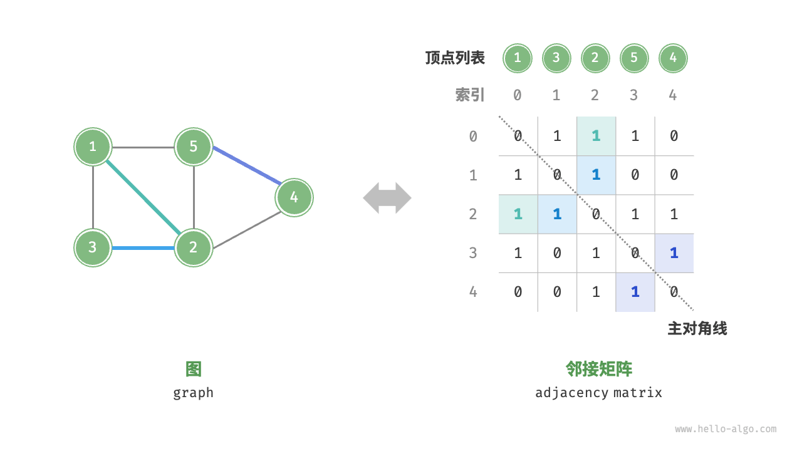

# 9.1 图

“图（graph）”是一种非线性数据结构，由顶点（vertex）与边（edge）组成。
可抽象表示为集合 (G = {V, E})，例如：

$
\begin{aligned}
V &= {1,2,3,4,5} \\
E &= {(1,2), (1,3), (1,5), (2,3), (2,4), (2,5), (4,5)}
\end{aligned}
$

相比于链表（线性结构）或树（分层结构），图具有更高的自由度。

---

## 9.1.1 图的常见类型与术语

### 类型

* **无向图（Undirected Graph）**：边没有方向，表示为“顶点之间的双向连接”，如微信好友关系。
* **有向图（Directed Graph）**：边有方向，(A $\to$ B) 与 (B $\to$ A) 是不同的关系，如微博中的“关注”关系。
* **连通图（Connected Graph）**：从某一顶点出发，可以到达图中的任意其他顶点。
* **非连通图（Disconnected Graph）**：存在至少一个顶点，从其出发无法到达某些顶点。
* **有权图（Weighted Graph）**：每条边附带一个权重（cost/weight），如社交系统中玩家间“亲密度”关系。

### 术语

* **邻接（Adjacency）**：两个顶点之间若存在边相连，则称它们互为邻接。
* **路径（Path）**：从顶点 A 到顶点 B 所经过的边构成的顶点序列。
* **度（Degree）**：顶点拥有的边数。对于有向图：

  * 入度（in-degree）：指向该顶点的边数
  * 出度（out-degree）：该顶点指向别人的边数

---

## 9.1.2 图的表示

以下以无向图为例介绍两种经典表示方式：

### 邻接矩阵（Adjacency Matrix）

设图中有 (n) 个顶点，则用一个 (n \times n) 矩阵 (M) 表示：

* 行、列分别对应顶点
* (M[i,j] = 1) 表示顶点 (i) 与顶点 (j) 之间有边； 0 表示无边
* 对无向图，矩阵关于主对角线对称
* 可扩展为有权图，将 1/0 换成具体权重

优缺点：

* **优**：可以 (O(1)) 时间判断任意两顶点是否有边
* **缺**：空间复杂度为 (O(n^2))，当边远少于 (n^2) 时浪费严重

### 邻接表（Adjacency List）

用 (n) 个链表（或数组/容器）表示：第 i 个表存储与顶点 i 相连的所有邻接顶点。
优缺点：

* **优**：仅存储实际存在的边，节省空间
* **缺**：要判断两顶点是否有边，或遍历所有邻接顶点，时间可能更高

优化思路：当链表过长时，可用平衡树（AVL／红黑树）或哈希表提升查找效率。

---

## 9.1.3 图的常见应用

许多现实系统可抽象为图模型，对应算法问题如下（见表 9-1）：

| 现实系统     | 顶点 | 边       | 图计算问题  |
| -------- | -- | ------- | ------ |
| 社交网络     | 用户 | 好友关系    | 潜在好友推荐 |
| 地铁线路     | 站点 | 站点间连通   | 最短路线推荐 |
| 太阳系／天体系统 | 星体 | 万有引力／轨道 | 行星轨道计算 |

---

## 小结

* 图是顶点与边组成的、比树结构更一般的网络结构。
* 图按是否有方向、是否连通、是否有权，可分多种类型。
* 图可用“邻接矩阵”“邻接表”等方式表示，各有优劣。
* 很多现实问题都能建模为图，再通过图算法求解。