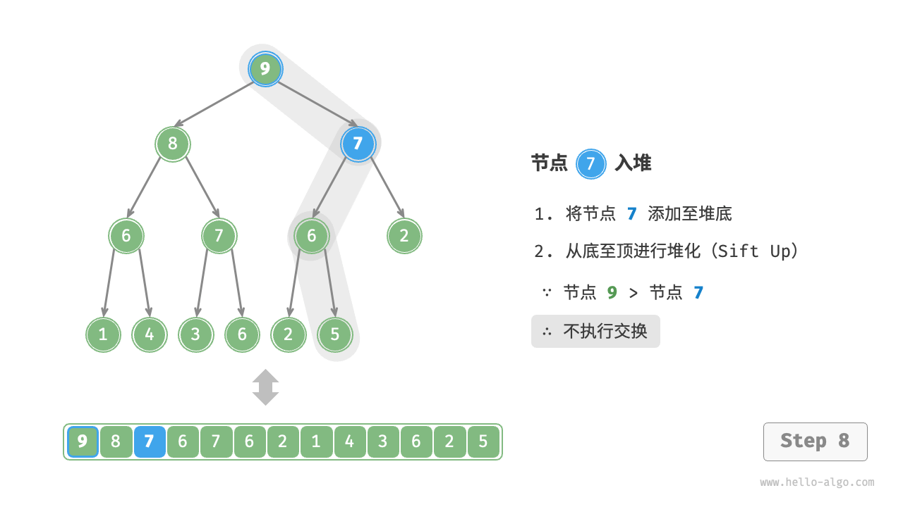
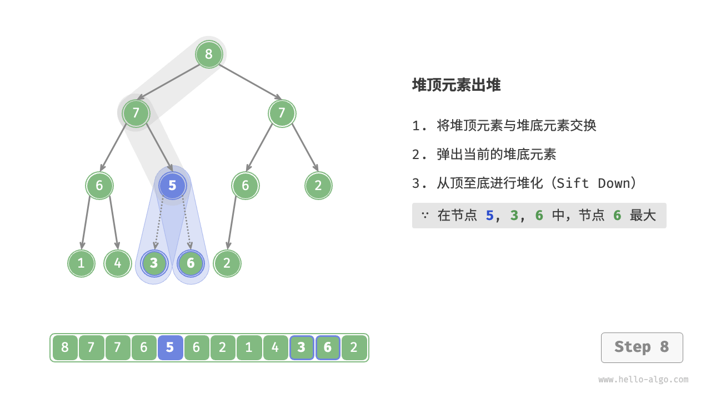

```python
# 初始化小顶堆
min_heap, flag = [], 1
# 初始化大顶堆
max_heap, flag = [], -1

# Python 的 heapq 模块默认实现小顶堆
# 考虑将“元素取负”后再入堆，这样就可以将大小关系颠倒，从而实现大顶堆
# 在本示例中，flag = 1 时对应小顶堆，flag = -1 时对应大顶堆

# 元素入堆
heapq.heappush(max_heap, flag * 1)
heapq.heappush(max_heap, flag * 3)
heapq.heappush(max_heap, flag * 2)
heapq.heappush(max_heap, flag * 5)
heapq.heappush(max_heap, flag * 4)

# 获取堆顶元素
peek: int = flag * max_heap[0] # 5

# 堆顶元素出堆
# 出堆元素会形成一个从大到小的序列
val = flag * heapq.heappop(max_heap) # 5
val = flag * heapq.heappop(max_heap) # 4
val = flag * heapq.heappop(max_heap) # 3
val = flag * heapq.heappop(max_heap) # 2
val = flag * heapq.heappop(max_heap) # 1

# 获取堆大小
size: int = len(max_heap)

# 判断堆是否为空
is_empty: bool = not max_heap

# 输入列表并建堆
min_heap: list[int] = [1, 3, 2, 5, 4]
heapq.heapify(min_heap)
```

## 一、核心概念

`heapq` 模块只实现了**小顶堆（min heap）**，也就是说：

> 堆顶（heap[0]）永远是最小的元素。

如果我们想要实现**大顶堆（max heap）**，就需要“反转”元素的大小关系。
最简单的办法：**把所有元素都乘以 -1（或用一个符号变量 flag 来控制）**。

---

## 二、小顶堆实现（flag = +1）

```python
min_heap, flag = [], 1
```

此时 `flag = 1`，表示我们直接往堆里放入真实值。

```python
heapq.heappush(min_heap, flag * 1)
heapq.heappush(min_heap, flag * 3)
heapq.heappush(min_heap, flag * 2)
```

内部堆存储的就是 `[1, 3, 2]`，自动维护成小顶堆结构：

```
      1
     / \
    3   2
```

堆顶 `min_heap[0] = 1`，是最小值。

---

## 三、大顶堆实现（flag = -1）

```python
max_heap, flag = [], -1
```

此时我们入堆时把元素乘上 -1：

```python
heapq.heappush(max_heap, flag * 1)  # 入堆 -1
heapq.heappush(max_heap, flag * 3)  # 入堆 -3
heapq.heappush(max_heap, flag * 2)  # 入堆 -2
heapq.heappush(max_heap, flag * 5)  # 入堆 -5
heapq.heappush(max_heap, flag * 4)  # 入堆 -4
```

虽然底层结构是小顶堆，但因为存放的是负数：

```
堆结构（内部存储） = [-5, -4, -2, -1, -3]
```

堆顶元素是最小的那个（即 -5），但乘上 flag（即 -1）后，就变成了最大的原始值 `5`。

---

## 四、取堆顶和出堆操作

```python
peek = flag * max_heap[0]
```

* 实际堆顶是 -5
* `flag * -5 = (-1) * (-5) = 5`
  → 堆顶原始最大值为 5。

出堆时同理：

```python
val = flag * heapq.heappop(max_heap)
```

内部出堆顺序（负数）：`-5, -4, -3, -2, -1`
转换回正数后输出顺序：`5, 4, 3, 2, 1`

这就是一个**从大到小排序**的序列，符合大顶堆性质。

---

## 五、总结原理

| 类型  | flag | 实际存储 | 堆顶值 (heap[0]) | 输出值 (flag * heap[0]) | 顺序   |
| --- | ---- | ---- | ------------- | -------------------- | ---- |
| 小顶堆 | 1    | 原值   | 最小值           | 最小值                  | 从小到大 |
| 大顶堆 | -1   | 取负值  | 最小的负数（即最大原值）  | 最大值                  | 从大到小 |

---

## 六、额外说明

用 `heapify()` 可以把一个列表直接变成堆：

```python
min_heap = [1, 3, 2, 5, 4]
heapq.heapify(min_heap)
```

此时 `min_heap[0] == 1`，内部重排为合法的小顶堆。

> 


## 一、堆的本质：树用数组存储

堆（heap）是一棵**完全二叉树（complete binary tree）**，但我们不需要真的用“链式结构（左右子指针）”去存。

> 我们直接用 **数组下标关系** 来隐式地表达树的父子结构。

对任意节点索引 `i`：

| 操作   | 数组公式                       | 含义       |
| ---- | -------------------------- | -------- |
| 左子节点 | `left(i) = 2 * i + 1`      | 完全二叉树的左子 |
| 右子节点 | `right(i) = 2 * i + 2`     | 完全二叉树的右子 |
| 父节点  | `parent(i) = (i - 1) // 2` | 向上取整除    |

举个例子：
假设堆数组是 `[50, 30, 45, 10, 25, 40, 35]`

```
           50(0)
          /     \
      30(1)     45(2)
     /   \      /   \
 10(3) 25(4) 40(5) 35(6)
```

可以看到：

* `left(0)=1, right(0)=2`
* `parent(4)=(4-1)//2=1`

数组索引即是“树的位置”。

---

## 二、堆的性质

最大堆满足：

> 任意节点的值 ≥ 其左右子节点的值。

（小顶堆则反过来）

堆主要有两个基本操作：

1. **上浮（sift up）**：当新节点插入时，从底部向上修复堆。
2. **下沉（sift down）**：当堆顶被移除时，从顶部向下修复堆。

> 

> 
---

## 三、核心操作讲解

### 1️⃣ 插入元素：`push(val)`

```python
self.max_heap.append(val)
self.sift_up(self.size() - 1)
```

步骤：

1. 把新元素加到数组末尾（树的最右叶）。
2. 执行“上浮”操作，从底向上修复堆结构。

例如插入 `55` 到 `[50, 30, 45, 10, 25, 40, 35]`：

```
数组: [50, 30, 45, 10, 25, 40, 35, 55]
索引:                           ↑
```

上浮过程：

* 55 的父节点是 10 → 55 > 10，交换。
* 新父节点是 30 → 55 > 30，交换。
* 新父节点是 50 → 55 > 50，交换。
* 到根节点，结束。

最后变成：

```
[55, 50, 45, 30, 25, 40, 35, 10]
```

---

### 2️⃣ 上浮：`sift_up(i)`

```python
while True:
    p = self.parent(i)
    if p < 0 or self.max_heap[i] <= self.max_heap[p]:
        break
    self.swap(i, p)
    i = p
```

逻辑：

* 比较当前节点和父节点的值；
* 若当前节点更大，交换；
* 直到到达根节点或堆序恢复。

---

### 3️⃣ 删除堆顶（最大值）：`pop()`

```python
self.swap(0, self.size() - 1)
val = self.max_heap.pop()
self.sift_down(0)
```

步骤：

1. 交换堆顶和最后一个元素；
2. 删除最后一个元素（原堆顶）；
3. 从根开始执行“下沉”操作，修复堆。

例如：

```
[55, 50, 45, 30, 25, 40, 35, 10]
删除堆顶 55
交换堆顶与尾部 → [10, 50, 45, 30, 25, 40, 35]
```

下沉过程：

* 10 与 50、45 比，最大的是 50，交换；
* 新位置 1，与子节点 30、25 比，最大是 30，交换；
* 到叶子，结束。

结果：

```
[50, 30, 45, 10, 25, 40, 35]
```

---

### 4️⃣ 下沉：`sift_down(i)`

```python
while True:
    l, r, ma = self.left(i), self.right(i), i
    if l < self.size() and self.max_heap[l] > self.max_heap[ma]:
        ma = l
    if r < self.size() and self.max_heap[r] > self.max_heap[ma]:
        ma = r
    if ma == i:
        break
    self.swap(i, ma)
    i = ma
```

逻辑：

* 比较当前节点和左右子节点；
* 若某个子节点更大，则交换；
* 继续向下递归。

---

## 四、完整类实现结构（简化示例）

```python
class MaxHeap:
    def __init__(self):
        self.max_heap = []

    def left(self, i): return 2*i + 1
    def right(self, i): return 2*i + 2
    def parent(self, i): return (i - 1) // 2
    def size(self): return len(self.max_heap)
    def is_empty(self): return not self.max_heap

    def swap(self, i, j):
        self.max_heap[i], self.max_heap[j] = self.max_heap[j], self.max_heap[i]

    def peek(self): return self.max_heap[0]

    def push(self, val):
        self.max_heap.append(val)
        self.sift_up(self.size() - 1)

    def sift_up(self, i):
        while i > 0 and self.max_heap[i] > self.max_heap[self.parent(i)]:
            self.swap(i, self.parent(i))
            i = self.parent(i)

    def pop(self):
        if self.is_empty():
            raise IndexError("堆为空")
        self.swap(0, self.size() - 1)
        val = self.max_heap.pop()
        self.sift_down(0)
        return val

    def sift_down(self, i):
        while True:
            l, r, ma = self.left(i), self.right(i), i
            if l < self.size() and self.max_heap[l] > self.max_heap[ma]: ma = l
            if r < self.size() and self.max_heap[r] > self.max_heap[ma]: ma = r
            if ma == i: break
            self.swap(i, ma)
            i = ma
```

---

## 五、复杂度分析

| 操作          | 时间复杂度    | 说明       |
| ----------- | -------- | -------- |
| 插入（push）    | O(log n) | 取决于堆高度   |
| 删除堆顶（pop）   | O(log n) | 同上       |
| 取堆顶（peek）   | O(1)     | 直接访问数组首位 |
| 建堆（heapify） | O(n)     | 从底向上堆化   |


> **建堆（heapify / build heap）** 的实现原理与复杂度为什么是 O(n)，而不是 O(n log n)。

---

## 一、建堆（heapify）的目标

给定一个无序数组，例如：

```
[5, 2, 7, 3, 1, 4, 6]
```

我们希望在原地把它调整成一个 **堆（heap）**：

* 最大堆（max heap）：每个父节点 ≥ 子节点；
* 最小堆（min heap）：每个父节点 ≤ 子节点。

最终结构例如（最大堆）：

```
          7
        /   \
       3     6
      / \   / \
     2  1  4  5
```

内部数组对应存储为：

```
[7, 3, 6, 2, 1, 4, 5]
```

---

## 二、建堆的两种方式

### ✅ 方式一：**逐个插入（上浮法）**

思路：从空堆开始，依次把元素插入，每次执行一次上浮（`sift_up`）。

```python
heap = []
for x in arr:
    heap.append(x)
    sift_up(heap, len(heap)-1)
```

* 每插入一个元素上浮 `O(log k)`。
* 插入 n 个元素 → 总复杂度 **O(n log n)**。

> 这种方法简单直观，但效率不是最优。

---

### ✅ 方式二：**原地堆化（下沉法）** ← 真正的“建堆”算法

堆的核心性质：
只有 **非叶子节点** 需要进行堆化操作（因为叶子没有子节点）。

对于数组索引 `[0..n-1]`：

* 最后一个非叶节点索引是：

  ```python
  last_non_leaf = (n - 2) // 2
  ```

算法从这里**逆序**向前遍历：

```python
def heapify(arr):
    n = len(arr)
    for i in range((n - 2) // 2, -1, -1):
        sift_down(arr, i, n)
```

也就是：

> 从最后一个非叶节点开始，一路“向上”执行 `sift_down`，修复局部堆序，最终形成一个整体堆。

---

## 三、核心函数：sift_down（下沉）

```python
def sift_down(arr, i, n):
    """从节点 i 开始向下堆化，n 为堆大小"""
    while True:
        l, r, ma = 2*i + 1, 2*i + 2, i
        if l < n and arr[l] > arr[ma]:
            ma = l
        if r < n and arr[r] > arr[ma]:
            ma = r
        if ma == i:
            break
        arr[i], arr[ma] = arr[ma], arr[i]
        i = ma
```

* 每次比较节点与左右子节点；
* 若子节点较大，则交换并继续向下；
* 直到没有更大的子节点为止。

---

## 四、堆化过程示例

以 `[5, 2, 7, 3, 1, 4, 6]` 为例：

```
索引:  0  1  2  3  4  5  6
值:   [5, 2, 7, 3, 1, 4, 6]
```

最后一个非叶节点：`(7-2)//2 = 2`

从 `i=2` 开始：

| i | 节点值 | 子节点 | 操作                         |
| - | --- | --- | -------------------------- |
| 2 | 7   | 4,6 | 已满足堆序                      |
| 1 | 2   | 3,1 | 交换 2 ↔ 3 → [5,3,7,2,1,4,6] |
| 0 | 5   | 3,7 | 交换 5 ↔ 7 → [7,3,5,2,1,4,6] |

最终堆：

```
[7, 3, 5, 2, 1, 4, 6]
```

---

## 五、时间复杂度分析 — 为什么是 O(n) 而不是 O(n log n)

表面上看：

* 每个节点执行一次 `sift_down`；
* `sift_down` 最坏是 O(log n)；
* 所以似乎 O(n log n)。

但关键在于：

> 大多数节点都在底层，堆化距离（下沉高度）非常小。

---

### 🌳 举例说明：

假设堆共有 `n` 个节点。

| 层级    | 节点数 | 每个节点的最大下沉高度 | 总操作量          |
| ----- | --- | ----------- | ------------- |
| 最底层   | n/2 | 0           | (n/2) * 0 = 0 |
| 倒数第二层 | n/4 | 1           | (n/4) * 1     |
| 倒数第三层 | n/8 | 2           | (n/8) * 2     |
| ...   | ... | ...         | ...           |
| 根节点   | 1   | log n       | 1 * log n     |

总操作 ≈

```
n/2*0 + n/4*1 + n/8*2 + n/16*3 + ... + 1*log n
```

这是一个收敛级数：

$$\sum_{k=0}^{\log n} \frac{n}{2^{k+1}} k \approx 2n$$

➡️ 所以总复杂度是 **O(n)**，而不是 O(n log n)。

---

## 六、完整实现（最大堆建堆）

```python
def heapify(arr):
    """原地建最大堆"""
    n = len(arr)
    for i in range((n - 2)//2, -1, -1):
        sift_down(arr, i, n)

def sift_down(arr, i, n):
    while True:
        l, r, ma = 2*i + 1, 2*i + 2, i
        if l < n and arr[l] > arr[ma]:
            ma = l
        if r < n and arr[r] > arr[ma]:
            ma = r
        if ma == i:
            break
        arr[i], arr[ma] = arr[ma], arr[i]
        i = ma
```

---
## 八、总结

| 方法   | 思路          | 时间复杂度      |
| ---- | ----------- | ---------- |
| 逐个插入 | 每次插入执行上浮    | O(n log n) |
| 原地堆化 | 从最后非叶节点开始下沉 | ✅ O(n)     |

---

💡 **直觉解释**：

> 堆的底层节点太多，而它们几乎不需要移动，所以总体操作量远低于 n log n。
> “少数节点动得远，多数节点动得少” → 平摊复杂度为 O(n)。

