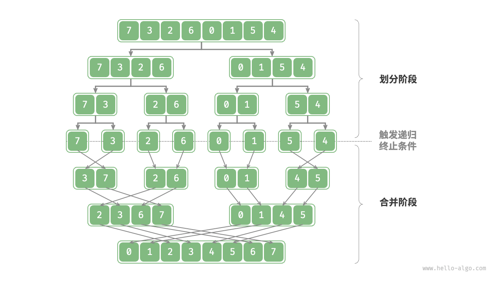
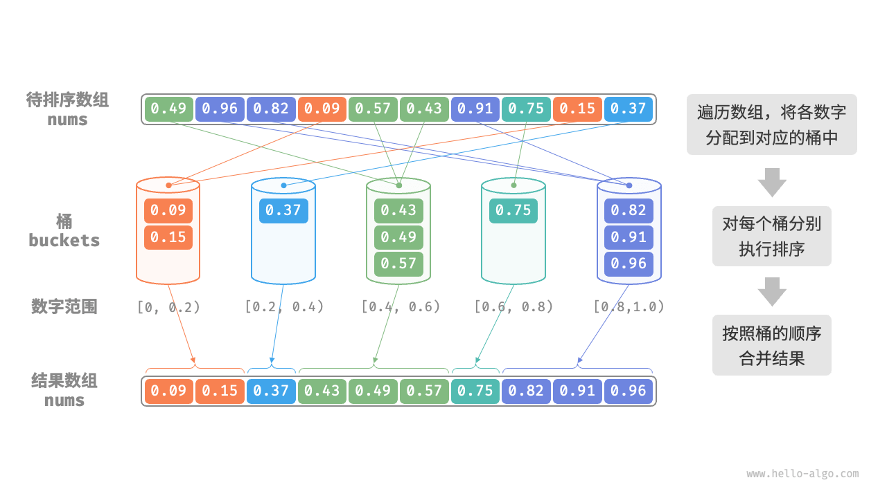

## 归并算法（merge_sort）



## 🌱 一、归并排序的核心思想

> **Divide and Conquer（分治法）**
> 归并排序分为两个阶段：

1. **划分阶段（Divide）**：
   不断把数组一分为二，直到每个子数组的长度为 1（即天然有序）。
2. **合并阶段（Conquer / Merge）**：
   将两个有序的子数组合并成一个更大的有序数组，逐层向上合并。

最终得到一个整体有序的数组。

---

## 🧩 二、以示例演示排序全过程

我们用例子来走完整个流程：

```python
nums = [3, 1, 4, 2]
merge_sort(nums, 0, 3)
```

---

### 第 1 层划分

```
merge_sort(nums, 0, 3)
→ mid = 1
→ 分成 [0,1] 和 [2,3]
```

即：

* 左半部分：[3, 1]
* 右半部分：[4, 2]

---

### 第 2 层划分（左侧）

```
merge_sort(nums, 0, 1)
→ mid = 0
→ 分成 [0,0] 和 [1,1]
```

即：

* 左子数组：[3]
* 右子数组：[1]

然后两边都只有 1 个元素，递归停止。

---

### 第 2 层划分（右侧）

```
merge_sort(nums, 2, 3)
→ mid = 2
→ 分成 [2,2] 和 [3,3]
```

即：

* 左子数组：[4]
* 右子数组：[2]
  同样长度为 1，停止递归。

---

### 第 3 层开始合并（从底向上）

#### 合并左半部分 [3] 和 [1]

```
merge(nums, 0, 0, 1)
```

* 左子数组：nums[0..0] → [3]
* 右子数组：nums[1..1] → [1]
* 比较：

  * 1 < 3 → 放入 tmp → [1, 3]
* 写回原数组：

  ```
  nums = [1, 3, 4, 2]
  ```

---

#### 合并右半部分 [4] 和 [2]

```
merge(nums, 2, 2, 3)
```

* 左子数组：nums[2..2] → [4]
* 右子数组：nums[3..3] → [2]
* 比较：

  * 2 < 4 → tmp = [2, 4]
* 写回原数组：

  ```
  nums = [1, 3, 2, 4]
  ```

---

### 第 4 层最终合并 [1, 3] 和 [2, 4]

```
merge(nums, 0, 1, 3)
```

* 左子数组：nums[0..1] → [1, 3]
* 右子数组：nums[2..3] → [2, 4]
* 逐个比较：

  * 1 < 2 → tmp = [1]
  * 2 < 3 → tmp = [1, 2]
  * 3 < 4 → tmp = [1, 2, 3]
  * 右子数组剩余 4 → tmp = [1, 2, 3, 4]
* 写回：

  ```
  nums = [1, 2, 3, 4]
  ```

---

## 🔁 三、完整的递归调用树

```
merge_sort(0,3)
├─ merge_sort(0,1)
│  ├─ merge_sort(0,0)
│  ├─ merge_sort(1,1)
│  └─ merge(0,0,1)
├─ merge_sort(2,3)
│  ├─ merge_sort(2,2)
│  ├─ merge_sort(3,3)
│  └─ merge(2,2,3)
└─ merge(0,1,3)
```

---

## ⚙️ 四、归并排序的特性总结

| 属性    | 说明                         |
| ----- | -------------------------- |
| 时间复杂度 | `O(n log n)`（稳定的分治结构）      |
| 空间复杂度 | `O(n)`（需要临时数组）             |
| 稳定性   | ✅ 稳定（不会打乱相等元素的原顺序）         |
| 适合场景  | 大数据排序，尤其是**外部排序**（如磁盘文件排序） |


## 边界问题

## 🌱 一、首先明确当前状态

当执行到这一段：

```python
while i <= mid and j <= right:
    if nums[i] <= nums[j]:
        tmp[k] = nums[i]
        i += 1
    else:
        tmp[k] = nums[j]
        j += 1
    k += 1
```

之后，意味着：

* 左右子数组至少有**一方已经完全用尽**。
* 另一方可能还有“剩余”元素没有复制到 `tmp`。

---

## 🧭 二、边界判断原理

### 1️⃣ `while i <= mid:`

```python
while i <= mid:
    tmp[k] = nums[i]
    i += 1
    k += 1
```

表示：

* 左子数组的索引范围是 `[left, mid]`
* 如果此时 `i` 还没超过 `mid`，说明左子数组还没用完。

**右子数组此时一定用完了**，因为主循环退出的条件是：

```python
while i <= mid and j <= right
```

→ 只要有一方“越界”，循环就结束。

所以这里单独把左边剩下的依次复制到 `tmp` 后面。

---

### 2️⃣ `while j <= right:`

```python
while j <= right:
    tmp[k] = nums[j]
    j += 1
    k += 1
```

逻辑完全对称：

* 如果 `j` 还没超过右边界 `right`，说明右子数组还有剩余。
* 把这些剩余的元素逐个填入 `tmp`。

---

### ✅ 边界判断条件总结：

| 循环                  | 判断条件    | 何时执行    | 意义      |
| ------------------- | ------- | ------- | ------- |
| `while i <= mid:`   | 左子数组未耗尽 | 右子数组已用完 | 把左边剩余补上 |
| `while j <= right:` | 右子数组未耗尽 | 左子数组已用完 | 把右边剩余补上 |

这两者中最多只会执行一个（因为主循环退出时恰有一方耗尽）。

---

## 🧠 整体边界逻辑可视化

假设当前：

```
nums = [1, 4, 5 | 2, 3]
left = 0, mid = 2, right = 4
```

比较过程后：

* `i = 2, j = 3`，此时右半部分 `[2,3]` 可能还有剩余；
* 主循环退出；
* 执行 `while j <= right:` → 把 `[3]` 加到 `tmp`；
* 左半 `[1,4,5]` 已完全处理，所以 `while i <= mid:` 不会执行；
* 最后 `tmp` 覆盖 `[0..4]`。

每一步的边界都被 `(<= mid)` 和 `(<= right)` 精确地控制，不会溢出。

---

## 🧩 六、简要总结

| 步骤    | 循环条件                      | 作用             |
| ----- | ------------------------- | -------------- |
| 主循环   | `i <= mid and j <= right` | 同时处理左右还都有元素的情况 |
| 左残余处理 | `i <= mid`                | 右边空了，把左边剩余的拷过去 |
| 右残余处理 | `j <= right`              | 左边空了，把右边剩余的拷过去 |
| 写回原数组 | `[left + k]`              | 覆盖原位置，保证就地更新   |


# 堆排序（heap sort）

```python
def sift_down(nums: list[int], n: int, i: int):
    """堆的长度为 n ，从节点 i 开始，从顶至底堆化"""
    while True:
        # 判断节点 i, l, r 中值最大的节点，记为 ma
        l = 2 * i + 1
        r = 2 * i + 2
        ma = i
        if l < n and nums[l] > nums[ma]:
            ma = l
        if r < n and nums[r] > nums[ma]:
            ma = r
        # 若节点 i 最大或索引 l, r 越界，则无须继续堆化，跳出
        if ma == i:
            break
        # 交换两节点
        nums[i], nums[ma] = nums[ma], nums[i]
        # 循环向下堆化
        i = ma

def heap_sort(nums: list[int]):
    """堆排序"""
    # 建堆操作：堆化除叶节点以外的其他所有节点
    for i in range(len(nums) // 2 - 1, -1, -1):
        sift_down(nums, len(nums), i)
    # 从堆中提取最大元素，循环 n-1 轮
    for i in range(len(nums) - 1, 0, -1):
        # 交换根节点与最右叶节点（交换首元素与尾元素）
        nums[0], nums[i] = nums[i], nums[0]
        # 以根节点为起点，从顶至底进行堆化
        sift_down(nums, i, 0)
```

---

## 🌲 一、堆排序的核心思想

堆排序（Heap Sort）是一种基于**二叉堆（Binary Heap）**结构的排序算法。
其核心思想是：

1. **建堆（heapify）**：
   把整个数组视为一个**最大堆（max-heap）**，堆顶是最大元素。
   （堆的定义：任意节点的值 ≥ 其左右子节点的值。）

2. **排序阶段**：

   * 每次将堆顶（最大值）与堆尾交换；
   * 然后让堆的有效长度 `n-1`；
   * 再从根节点开始「下沉」（sift down），重新维持最大堆性质。

重复此操作，直到所有元素有序。

---

## ⚙️ 二、代码整体结构拆解

```python
def heap_sort(nums: list[int]):
    # 1️⃣ 建堆阶段
    for i in range(len(nums)//2 - 1, -1, -1):
        sift_down(nums, len(nums), i)
    
    # 2️⃣ 排序阶段
    for i in range(len(nums)-1, 0, -1):
        nums[0], nums[i] = nums[i], nums[0]   # 堆顶最大元素放到尾部
        sift_down(nums, i, 0)                 # 恢复堆结构
```

---

## 🔩 三、辅助函数：`sift_down()` 的逻辑

```python
def sift_down(nums, n, i):
    while True:
        l = 2*i + 1
        r = 2*i + 2
        ma = i
        if l < n and nums[l] > nums[ma]:
            ma = l
        if r < n and nums[r] > nums[ma]:
            ma = r
        if ma == i:
            break
        nums[i], nums[ma] = nums[ma], nums[i]
        i = ma
```

这是标准的**“下沉”操作**：

* 取出节点 `i`；
* 与它的左右孩子比较；
* 若孩子更大，就交换；
* 然后继续向下“堆化”，直到堆性质恢复。

`l < n` 和 `r < n` 是**边界判断**，防止访问越界。

---

## 🧮 四、举例演示全过程

假设我们要排序：

```
nums = [4, 10, 3, 5, 1]
```

### 步骤1️⃣：建堆阶段

堆的索引结构（0-based）如下：

```
           4(0)
         /     \
      10(1)    3(2)
     /    \
   5(3)   1(4)
```

建堆从最后一个非叶子节点开始：

* 最后非叶子节点索引 = `len(nums)//2 - 1 = 1`

#### (1) i = 1

* 节点：nums[1] = 10
* 左右孩子：nums[3]=5, nums[4]=1
* 10 已经是最大的，不动。

#### (2) i = 0

* 节点：nums[0] = 4
* 左右孩子：nums[1]=10, nums[2]=3
* 最大的是 10（index 1），交换：

  ```
  [10, 4, 3, 5, 1]
  ```
* 继续向下堆化 i=1：

  * 左右孩子：nums[3]=5, nums[4]=1 → 最大5 → 交换：

    ```
    [10, 5, 3, 4, 1]
    ```

完成建堆后得到最大堆：

```
[10, 5, 3, 4, 1]
```

---

### 步骤2️⃣：排序阶段

我们依次将堆顶（最大值）交换到数组末尾，并缩短堆。

#### 第1轮

交换 `nums[0]` 与 `nums[4]`：

```
[1, 5, 3, 4, 10]
```

堆长 n=4，堆化 `i=0`：

* 左右孩子：5, 3 → 最大5 → 交换：

  ```
  [5, 1, 3, 4, 10]
  ```
* i=1：左右孩子：4 → 交换：

  ```
  [5, 4, 3, 1, 10]
  ```

✅ 堆恢复：[5,4,3,1]（有序区：[10]）

---

#### 第2轮

交换堆顶与堆尾（index 3）：

```
[1, 4, 3, 5, 10]
```

堆长 n=3：

* 堆化 i=0：

  * 左右孩子：4,3 → 最大4 → 交换：

    ```
    [4, 1, 3, 5, 10]
    ```

✅ 堆：[4,1,3]，有序区：[5,10]

---

#### 第3轮

交换堆顶与堆尾（index 2）：

```
[3, 1, 4, 5, 10]
```

堆长 n=2：

* 堆化 i=0：

  * 左右孩子：1 → 无变化。
    ✅ 堆：[3,1]，有序区：[4,5,10]

---

#### 第4轮

交换堆顶与堆尾（index 1）：

```
[1, 3, 4, 5, 10]
```

---

### ✅ 最终结果：

```
[1, 3, 4, 5, 10]
```

排序完成。

---

## 🔍 五、堆排序的关键特征

| 特性    | 说明                                  |
| ----- | ----------------------------------- |
| 时间复杂度 | `O(n log n)`（建堆 O(n)，每轮堆化 O(log n)） |
| 空间复杂度 | `O(1)`（原地排序）                        |
| 稳定性   | ❌ 不稳定（交换可能打乱相同元素相对位置）               |
| 适用场景  | 内存可容纳数组的大规模排序，尤其适合需要原地排序的场合         |

---


# 桶排序（bucket sort）

```python
def bucket_sort(nums: list[float]):
    """桶排序"""
    # 初始化 k = n/2 个桶，预期向每个桶分配 2 个元素
    k = len(nums) // 2
    buckets = [[] for _ in range(k)]
    # 1. 将数组元素分配到各个桶中
    for num in nums:
        # 输入数据范围为 [0, 1)，使用 num * k 映射到索引范围 [0, k-1]
        i = int(num * k)
        # 将 num 添加进桶 i
        buckets[i].append(num)
    # 2. 对各个桶执行排序
    for bucket in buckets:
        # 使用内置排序函数，也可以替换成其他排序算法
        bucket.sort()
    # 3. 遍历桶合并结果
    i = 0
    for bucket in buckets:
        for num in bucket:
            nums[i] = num
            i += 1
```

这段代码是一个**典型的桶排序（Bucket Sort）**实现，用于对浮点数列表进行排序，尤其适合输入数据**均匀分布在 [0, 1)** 区间的情况。



---

## 🧩 一、算法思想

桶排序是一种**分治思想**(divide and conquer)的排序方法。

> 核心思路：
> 把原始数据按照数值范围分配到若干个“桶”中，然后对每个桶分别排序，最后再把桶里的结果合并成有序数组。

桶排序的优势在于：

* 当数据分布**比较均匀**时，排序效率极高；
* 理论平均时间复杂度为 **O(n)**。

---

## 🪣 二、代码流程详解

### 1️⃣ 初始化桶

```python
k = len(nums) // 2
buckets = [[] for _ in range(k)]
```

* 把元素平均分配到 `k` 个桶中。
* `k = len(nums) // 2` 表示期望每个桶里大约有 2 个元素（只是一个经验设定）。
* 每个桶本身是一个列表（`[]`），用来存放属于该区间的元素。

---

### 2️⃣ 元素分配到桶中

```python
for num in nums:
    i = int(num * k)
    buckets[i].append(num)
```

这行是**映射函数**的关键所在：

* 输入假设在区间 `[0, 1)`。
* 乘上桶的数量 `k` 后，`num * k` 落在 `[0, k)`。
* `int(num * k)` 就是桶的索引，即该数属于第几个桶。

举个例子👇：

| num  | num*k  | 桶索引 i | 放入的桶   |
| ---- | ------ | ----- | ------ |
| 0.12 | 0.12*k | 0     | 第 0 个桶 |
| 0.56 | 0.56*k | 5     | 第 5 个桶 |
| 0.98 | 0.98*k | k-1   | 最后一个桶  |

这样数据被“粗略分层”，大数值进靠后的桶，小数值进前面的桶。

---

### 3️⃣ 对每个桶内部排序

```python
for bucket in buckets:
    bucket.sort()
```

* 每个桶内部的元素数量通常不多，可以使用任意排序算法；
* Python 内置的 `sort()` 基于 Timsort，效率高且稳定；
* 理论上每个桶内的排序复杂度是 **O(m log m)**（m 为桶内元素数），
  但由于 m 很小，总体仍然接近 **O(n)**。

---

### 4️⃣ 合并结果

```python
i = 0
for bucket in buckets:
    for num in bucket:
        nums[i] = num
        i += 1
```

* 依次从第一个桶到最后一个桶，把桶里的有序元素写回原数组；
* 因为桶的顺序已经代表了数据区间顺序，桶间不需要再比较。

---

## ⏱️ 三、时间复杂度分析

| 情况    | 复杂度            | 说明                   |
| ----- | -------------- | -------------------- |
| 平均情况  | **O(n)**       | 数据分布均匀，每个桶只需少量内部排序   |
| 最坏情况  | **O(n log n)** | 所有元素都集中到同一个桶，退化为普通排序 |
| 空间复杂度 | **O(n)**       | 需要额外存储桶内容            |

---

## 📈 四、适用场景

桶排序非常适合：

* 输入数据是**浮点数**或**连续型数值**；
* 数据分布大致**均匀**；
* 希望线性时间排序。

例如：

* 排序概率密度函数采样结果；
* 排序 [0,1) 区间的随机浮点数；
* 对大规模连续数据做预分桶。

---

## 🌰 五、示例

```python
nums = [0.12, 0.43, 0.21, 0.89, 0.34, 0.56]
bucket_sort(nums)
print(nums)
```

输出：

```
[0.12, 0.21, 0.34, 0.43, 0.56, 0.89]
```

