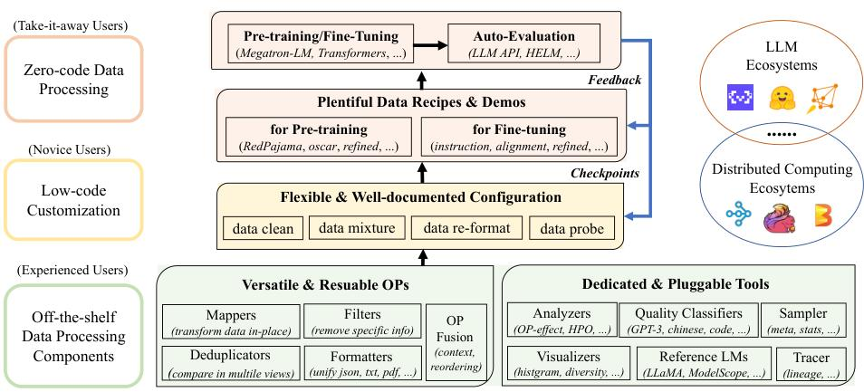
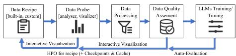
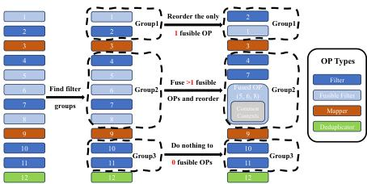
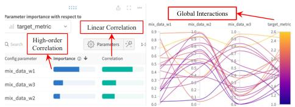
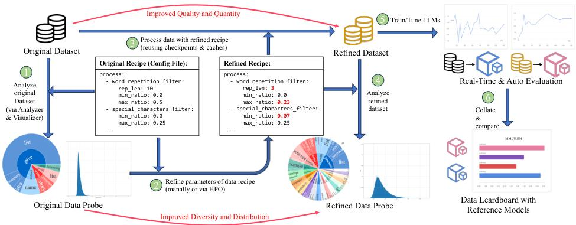
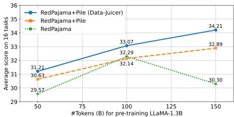
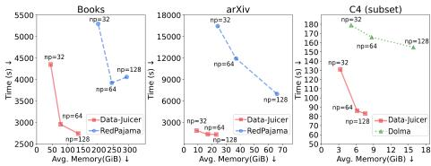
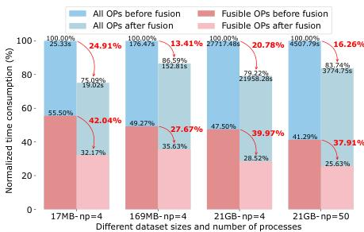
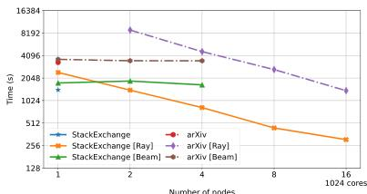

# Data-Juicer 工作原理详解

本文档基于 Data-Juicer 的两篇技术报告，详细阐述其工作原理、核心流程、基本组件以及关键特性，并重点梳理其从 v1 到 v2 的演进。

---

## 第一部分：Data-Juicer v1 —— 为LLM设计的数据处理系统

Data-Juicer 1.0 版本是一个为大语言模型（LLM）设计的一站式、开源数据处理系统，旨在解决 LLM 开发中数据处理的痛点。

### 1.1 v1 面临的核心挑战

在 Data-Juicer v1 诞生之初，LLM 的数据处理普遍面临四大挑战，具体如下表所示：

| 挑战 (Challenge) | 核心问题 (Core Problem) | 主要影响 (Impact) |
| :--- | :--- | :--- |
| **1. 高度异构性** | 数据来源、格式、质量、类型千差万别。 | 现有脚本为特定场景定制，缺乏通用性和模块化，难以扩展。 |
| **2. 缺乏及时反馈** | 依赖模型训练进行评估，成本高、周期长。 | 数据处理过程不透明，如同“黑盒”，难以调试和快速迭代。 |
| **3. 可用性与定制化不足** | 技术细节复杂，对不同技能水平的用户不友好。 | 工具链僵化，缺乏灵活配置和扩展能力，限制了用户的探索。 |
| **4. 海量数据处理效率瓶颈** | 数据量达到TB/PB级别，远超单机处理能力。 | 传统脚本在速度、内存和稳定性上都存在巨大瓶颈，且缺乏分布式支持。 |

### 1.2 v1 的研究背景与相关工作

#### 1.2.1 LLM 数据处理现状
*   **预训练数据 (Pre-training Data)**: 目标是让LLM掌握基础的语言能力。数据来源多样，包括网页、书籍、代码等，但普遍存在噪声、冗余和有害内容，需要仔细清洗。
*   **微调数据 (Fine-tuning Data)**: 目标是激发模型的特定能力或使其与人类价值观对齐。分为指令微调（IFT）和对话微调（CFT）等。其数据处理更强调多样性而非数量，并需要注意“对齐税”（即过度对齐可能损害模型的通用能力）问题。
*   **共性**：无论是预训练还是微调，数据处理都围绕着**质量 (Quality)**、**多样性 (Diversity)** 和 **体量 (Volume)** 三个核心要素，需要进行清洗、去重和混合。

#### 1.2.2 已有解决方案的局限
*   **封闭性**: 当时，许多知名的LLM（如GPT系列）其数据处理流程并不开源。
*   **范围局限**: 开源的工具（如RedPajama, Alpaca）通常只针对**特定的数据集或用途**，缺乏管理异构数据的系统性、模块化能力。
*   **可用性差**: 大多只提供处理好的数据和僵化的代码，缺少灵活的配置和分析工具，难以被不同水平的用户复用和定制。
*   **效率低下**: 普遍依赖单机Python脚本，在处理海量数据时，性能、内存和扩展性方面都存在巨大瓶颈。

### 1.3 v1 的核心架构与组件

为应对上述挑战，Data-Juicer v1 设计了一套以“反馈驱动”为核心的模块化架构。

#### 1.3.1 核心流程：反馈驱动的闭环

v1 的工作流程是一个闭环，集成了数据处理、分析、可视化和模型评估，以实现快速迭代。

1.  **配置与加载 (Configure & Load)**: 用户通过配置文件定义流程，`Formatter` 组件将不同来源和格式的数据统一加载为标准格式。
2.  **处理与转换 (Process & Transform)**: 数据流经由多个 `Operator` (OP) 组成的管道，进行清洗、过滤、去重等操作。
3.  **分析与洞察 (Analyze & Visualize)**: `Analyzer` 和 `Tracer` 等工具对数据进行统计分析和可视化，让数据变化和样本轨迹清晰可见。
4.  **输出与应用 (Export & Apply)**: 处理完成的数据被导出，用于 LLM 训练。
5.  **评估与反馈 (Evaluate & Feedback)**: 集成 HELM 等评测工具评估模型性能，指导下一轮数据配方的优化。

#### 1.3.2 标准化的算子池：应对异构性的基石

为了应对数据的高度异构性，v1架构的核心是构建一个标准、可解耦、可组合的算子（Operator, OP）池。

Data-Juicer v1 的算子池主要包含四大类算子，它们共同构成了数据处理管道的核心构建块：

| 类别 (Category) | 功能 (Function) | 输入 (Input) | 处理级别 (Process Level) | 输出 (Output) | 算子示例 (OP Usage Examples) |
| :--- | :--- | :--- | :--- | :--- | :--- |
| **Formatters** | 统一数据格式 | Dataset | Dataset | Dataset | 加载并统一 dataset-hub, txt, json, md, codes, html, pdf, docx 等多种格式 |
| **Mappers** | 原位文本编辑 | Sample | Single-sample; Multi-samples | Sample; Samples | 转换指定头信息、文本元素；修复乱码；文本增强 |
| **Filters** | 条件性移除文本 | Sample | Single-sample; Dataset | Boolean | 基于元信息、统计数据（如行数）、模型分数或外部资源（如敏感词）进行过滤 |
| **Deduplicators** | 移除重复内容 | Single or Paired Dataset | Dataset | Dataset | 基于哈希（Hash-based）和向量（Vector-based）进行去重 |

##### 1. Formatters (格式化算子)
这是构建整个算子体系的基础，负责数据的统一表示。
*   **作用**：作为数据处理的入口，负责将各种异构数据源（本地文件、Huggingface Hub）和格式（txt, json, pdf, docx, code files...）转换为系统内部统一的 Dataset 对象。
*   **特点**：屏蔽了数据源的复杂性，为后续所有 OP 提供了标准化的输入。每个样本（Sample）都包含 `text`（原始文本）、`meta`（元数据）和 `stats`（统计信息）三个核心部分。

##### 2. Mappers (映射算子)
*   **作用**：对单个或多个样本进行内容级别的修改和编辑。
*   **特点**：功能丰富，可用于清理特定文件头、修复代码中的乱码、文本增强（如大小写转换）等。

##### 3. Filters (过滤算子)
*   **作用**：根据一系列条件判断是否保留一个样本，是保证数据质量的核心组件。
*   **特点**：设计巧妙，将**统计计算 (`compute_stats`)** 和 **过滤决策 (`process`)** 分离。`compute_stats` 负责计算样本的各项统计特征（如文本长度、语言、有害词汇比例、模型打分等）并存入 `stats` 字段，而 `process` 仅根据这些统计值和设定的阈值返回一个布尔值来决定是否保留。这种解耦使得统计结果可以被 `Analyzer` 工具复用。

##### 4. Deduplicators (去重算子)
*   **作用**：移除数据集内部或数据集之间的重复样本，以避免模型过拟合和数据泄露。
*   **特点**：支持基于哈希的精确去重和基于 SimHash/MinHash 的近似去重，并针对大规模数据进行了优化。

##### 算子的可组合性 (Composability)
Data-Juicer 的强大之处在于 OP 的高度可组合性。用户可以在配置文件中像搭积木一样自由地组合、排序这些 OP，并为每个 OP 指定超参数（如过滤的文本长度阈值、去重的相似度阈值等），从而灵活地构建出千变万化的数据处理流程。

#### 1.3.3 系统优化与用户体验

为确保海量数据处理的效率和易用性，v1版本内置了多项关键设计。

##### 系统优化

*   **计算优化**：
    *   **上下文管理器 (Context Management)**: 在多个OP之间共享分词、分句等中间计算结果，避免重复计算。
    *   **算子融合与重排 (OP Fusion & Reordering)**: 如下图所示，系统能自动将可融合的多个Filter合并成一个大算子，并将其后置，以减少进程初始化开销和待处理数据量。
        
*   **空间优化**:
    *   **缓存 (Caching)**: 对每个OP的处理结果进行缓存，配置不变时无需重复运行。
    *   **压缩 (Compression)**: 支持对缓存文件使用 `zstd` 或 `LZ4` 等高效压缩算法，显著减少磁盘空间占用。
*   **可扩展性优化**:
    *   **分布式处理**: 通过适配 Ray 和 Apache Beam 等框架，可将单机处理流程无缝扩展到分布式集群上并行执行。

##### 用户体验

Data-Juicer为不同水平的用户提供了差异化的使用路径，降低了上手门槛：

| 用户水平 | 使用方式 | 说明 |
| :--- | :--- | :--- |
| **初学者 (零代码)** | 使用预置配方 | 直接使用官方提供的二十多种config文件，开箱即用。 |
| **中级用户 (低代码)** | 修改配置文件 | 在预置配方基础上，调整OP顺序、修改参数或替换自定义资源。 |
| **高级用户 (高级扩展)** | 继承基类创建新OP | 只需实现核心的`process`或`compute_stats`方法，即可创建全新算子。 |

#### 1.4 反馈驱动的数据处理 (Feedback-Driven Processing)

Data-Juicer v1 的一个核心创新是将数据处理过程视为一个反馈驱动的闭环，其中超参数优化（HPO）扮演了关键角色，旨在自动寻找最佳数据配方。

##### 1.4.1 超参数优化（HPO）在数据配方中的应用

Data-Juicer 通过将数据处理流程参数化、优化目标函数化，并借助成熟的HPO框架，将传统上依赖人工经验和反复试错的数据调参过程，转变为一个自动、高效、有明确优化目标的搜索过程。

*图3：数据配方超参数优化演示。该图展示了HPO如何通过迭代试错，在定义的搜索空间中寻找最优参数组合，以最大化预设的优化目标。*

**HPO工作流程详解：**

1.  **定义可优化的“超参数空间”**：
    *   **数据混合比例**：例如，不同数据集（C4, The Pile, GitHub）的采样比例。
    *   **算子（OP）的关键参数**：例如，`Filter`算子的过滤阈值（如文本最小长度、困惑度分数上限）。
    这些参数及其搜索范围在配置文件中定义。

2.  **定义优化的“目标函数”**：
    *   目标函数是评价一个“数据配方”好坏的量化标准，通常是多个数据指标（如总Token数、平均文本长度、文本多样性等）的加权和。
    *   用户可以根据需求定制目标函数，为HPO提供明确的优化方向。

3.  **执行自动优化**：
    *   Data-Juicer 集成现有HPO框架（如Optuna）。
    *   **试算循环**：HPO框架生成一组超参数，Data-Juicer执行数据处理，`Analyzer`计算目标值并反馈给HPO框架。
    *   **智能搜索**：HPO框架根据历史得分，智能地生成下一组参数，重复迭代。
    *   **产出**：最终返回得分最高的那组超参数组合，即“最佳数据配方”。

##### 1.4.2 其他反馈机制 (Other Feedback Mechanisms)
除了HPO，Data-Juicer还提供了其他反馈机制来帮助用户理解和优化数据处理过程，例如`Analyzer`和`Tracer`工具，它们提供数据统计分析和样本轨迹追踪，让处理过程不再是黑盒。

#### 1.5 反馈驱动闭环展示 (Feedback Loop Showcase)

v1 的工作流程以一个具体的开发示例进行展示，旨在通过一个反馈驱动的闭环来持续优化数据配方，最终提升LLM性能。

*图5：Data-Juicer数据处理反馈流程展示。*

整个流程可以细化为以下六个步骤：

1.  **分析原始数据集 (Analyze Original Dataset)**
    *   **目标**：深入理解原始数据的特性和潜在缺陷。
    *   **流程**：用户首先选择一个初始的数据处理配方（config文件），然后使用内置的`Analyzer`工具对原始数据集进行分析。
    *   **产出**：生成一份“数据探针”（Data Probe）报告。如图中左上角的饼图所示，它可以分析文本中具体的语言学特征，例如最常见的动词及其直接宾语，从而揭示数据的多样性、偏见或领域特征。

2.  **优化配方参数 (Refine Parameters)**
    *   **目标**：根据第一步的分析洞察，针对性地调整数据处理策略。
    *   **流程**：用户根据“数据探针”发现的问题（如表达方式单一、文本长度呈长尾分布等），在配置文件中修改配方。这可能包括增加/删除某些OP，或者调整过滤器的阈值。在调整过程中，可以利用`Tracer`工具交互式地观察单个样本在流过每个OP后的变化，确保调整符合预期。

3.  **处理数据集 (Process Dataset)**
    *   **目标**：应用优化后的配方来处理原始数据集。
    *   **流程**：使用Data-Juicer运行新的config文件，对数据集执行完整的处理流程。
    *   **产出**：生成一个经过优化的“精炼数据集”（Refined Dataset）。得益于缓存和检查点机制，如果只是微调了流程后部的OP，前面的步骤无需重复计算，大大加快了这一过程。

4.  **分析精炼数据集 (Analyze Refined Dataset)**
    *   **目标**：验证第二步的优化是否达到了预期效果。
    *   **流程**：再次使用`Analyzer`工具对“精炼数据集”进行分析，生成一份新的“数据探针”报告。
    *   **决策**：通过对比新旧两份报告，评估数据质量的改善程度。如果结果不满意，可以返回第二步继续手动优化配方，或者启用HPO工具（见1.4节）进行自动搜索。

5.  **训练/微调LLM (Get LLMs with Refined Dataset)**
    *   **目标**：使用精炼后的数据来训练或微调一个LLM，以检验数据的最终效果。
    *   **流程**：Data-Juicer与主流训练框架无缝集成，用户可以一键式地将精炼数据集用于LLM训练。在训练过程中，自动评估工具会定时在多个评测基准上评估模型的性能。
    *   **优势**：这种及时的评估使得用户可以尽早发现坏的数据配方（例如，发现模型性能不升反降），从而提前中止训练，避免不必要的计算资源浪费。

6.  **整理结果并与参考模型对比 (Collate Results & Compare)**
    *   **目标**：量化数据配方的优劣，并为下一轮优化提供指导。
    *   **流程**：训练结束后，Data-Juicer会自动整理所有评测结果，并将其与一系列“参考模型”（Reference Models）在排行榜（Leaderboard）上进行对比。
    *   **产出**：
        *   如果新模型的性能超越了之前的参考模型，那么它本身就可以被注册为一个新的、更强的参考模型。
        *   如果性能未达预期，评测结果也能从模型的角度为下一轮的数据配方优化提供更深层次的指导（例如，发现模型在代码能力上有所下降，可能是在数据处理中过多地过滤了代码相关的语料）。

通过这六个步骤，Data-Juicer将数据处理从一个孤立的任务，转变为一个与模型训练、评估紧密结合、持续迭代优化的科学的系统工程。

### 1.7 可用性与系统优化

为解决可用性、定制化不足（C3）和海量数据处理效率（C4）的挑战，Data-Juicer v1 在易用性和系统性能上做了深度设计。

#### 1.7.1 提升可用性的内置设计 (Sec. 5)

*   **灵活的配方配置**：
    *   整个数据处理流程可通过统一的配置文件（如 `yaml`）进行端到端管理，保证了可复现性。
    *   支持“减法”（从包含所有OP的模板开始删减）和“加法”（从零开始构建）两种模式，并预置了超过20种高质量数据配方，极大降低了上手难度。

*   **专用的可插拔工具**：
    *   **质量分类器**：内置了复现自GPT-3的文本质量分类器，并扩展至中文和代码场景，可有效筛除低质量数据。
    *   **增强采样器**：提供针对LLM的先进采样工具，如基于元数据或统计特征的分层采样，以构建更具代表性的数据集。
    *   **分析与追踪工具**：`Analyzer` 和 `Tracer` 等工具让数据处理的每一步都清晰可见。

*   **分层用户体验**：
    *   **零代码**：初学者可直接使用预置配方。
    *   **低代码**：中级用户可通过修改配置文件来调整流程和参数。
    *   **高级扩展**：高级用户可通过继承基类轻松创建自定义算子。

#### 1.7.2 全面的系统优化 (Sec. 6)

*   **计算优化**：
    *   **上下文管理**：在不同算子间共享分词等中间结果，避免重复计算。
    *   **算子融合与重排**：自动将可融合的算子（如多个Filter）合并，并后置执行，以减少进程开销和待处理数据量。

        

        *图：算子融合与重排流程，可显著提升计算效率。*

*   **空间优化**：
    *   **缓存与压缩**：对每个算子的结果进行缓存，并支持使用 `zstd` 等高效算法进行压缩，大幅减少磁盘占用。

*   **扩展性优化**：
    *   **分布式处理**：无缝集成 Ray、Apache Beam 等框架，可将单机流程轻松扩展至分布式集群，实现大规模数据的高效并行处理。

### 1.8 实验评估 (Sec. 7)

通过一系列广泛的实验，Data-Juicer v1 的有效性得到了充分验证。

#### 1.8.1 数据配方质量评估

*   **评估方法**：
    1.  **预训练**：使用 Data-Juicer 精炼后的公开数据集（RedPajama + Pile）与原始数据集分别预训练 LLaMA-1.3B 模型。在16个核心HELM任务上进行模型评测。
    2.  **微调**：使用 Data-Juicer 生成的微调数据与原始数据（如 Alpaca, Belle）分别微调 LLaMA-7B 等模型。使用 GPT-4 进行成对打分比对。

*   **评估结果**：
    *   **预训练性能显著提升**：如下图所示，使用 Data-Juicer 配方训练的模型在消耗相同数量（Tokens）的情况下，性能持续优于基线。仅用 **150B Tokens** 训练的模型，其 HELM 平均分（34.21）便超越了使用 **350B Tokens** 训练的 Falcon-1.3B（33.97）。

        

    *   **微调效果更优**：使用 Data-Juicer 配方进行微调，在数据量远少于竞品的情况下（例如，中文场景下数据量减少90.4%），模型在 GPT-4 评估中的胜率反而更高（最高提升17.5%）。

#### 1.8.2 系统性能与效率评估

*   **评估方法**：
    1.  **端到端性能**：在相同硬件上，与 SOTA 工具 RedPajama 和 Dolma 对比处理相同数据集（Books, arXiv, C4）时的耗时和内存占用。
    2.  **优化效果**：对比开启/关闭“算子融合与重排”优化时的处理时间。
    3.  **扩展性**：在多节点集群上，测试 Data-Juicer 在 Ray 和 Beam 后端上的处理时间随节点数量的变化。

*   **评估结果**：
    *   **端到端性能优越**：如下图所示，在不同进程数和数据集上，Data-Juicer 的处理时间平均减少 **50.6%**，内存使用平均减少 **55.1%**。

        

    *   **优化效果显著**：算子融合与重排优化平均可节省 **24.91%** 的总处理时间。

        

    *   **分布式扩展性良好**：如下图所示，在 Ray 后端上，Data-Juicer 展现了近线性的加速比，8节点时最高加速 **7.91倍**。

        

### 1.9 v1 结论 (Sec. 8)

Data-Juicer v1 作为一个用户友好、功能全面且高效的开源LLM数据处理系统，成功解决了数据处理中的多个核心痛点。它通过模块化的算子、反馈驱动的闭环以及全面的系统优化，不仅提升了数据处理的效率和灵活性，更重要的是，其实验结果雄辩地证明：**由Data-Juicer产出的高质量数据配方能显著增强LLM的性能**，为以数据为中心的LLM研发范式铺平了道路。
