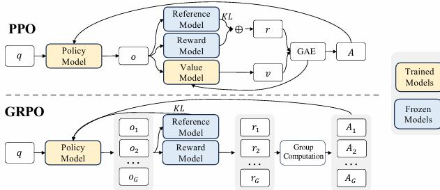

Figure 4 | Demonstration of PPO and our GRPO. GRPO foregoes the value model, instead estimating the baseline from group scores, significantly reducing training resources. 
  

on the rewards \($\{r_{\geq t}\}$\) and a learned value function \($V_{\psi}$\) . Thus, in PPO, a value function needs to be trained alongside the policy model and to mitigate over- optimization of the reward model, the standard approach is to add a per- token KL penalty from a reference model in the reward at each token (Ouyang et al., 2022), i.e.,  

\[$$r_{t} = r_{\phi}(q,o_{\leq t}) - \beta \log \frac{\pi_{\theta}(o_{t}|q,o_{< t})}{\pi_{ref}(o_{t}|q,o_{< t})}, \quad (2)$$\]  

where \($r_{\phi}$\) is the reward model, \($\pi_{ref}$\) is the reference model, which is usually the initial SFT model, and \($\beta$\) is the coefficient of the KL penalty.  

As the value function employed in PPO is typically another model of comparable size as the policy model, it brings a substantial memory and computational burden. Additionally, during RL training, the value function is treated as a baseline in the calculation of the advantage for variance reduction. While in the LLM context, usually only the last token is assigned a reward score by the reward model, which may complicate the training of a value function that is accurate at each token. To address this, as shown in Figure 4, we propose Group Relative Policy Optimization (GRPO), which obviates the need for additional value function approximation as in PPO, and instead uses the average reward of multiple sampled outputs, produced in response to the same question, as the baseline. More specifically, for each question \($q$\) , GRPO samples a group of outputs \($\{o_{1}, o_{2}, \dots , o_{G}\}$\) from the old policy \(\pi_{\theta_{old}}\) and then optimizes the policy model by maximizing the following objective:  

\[$$\begin{array}{l}{\mathcal{I}_{GRPO}(\theta) = \mathbb{E}[q\sim P(Q),\{o_{i}\}_{i = 1}^{G}\sim \pi_{\theta_{old}}(O|q)]}\\ {\frac{1}{G}\sum_{i = 1}^{G}\frac{1}{|o_{i}|}\sum_{t = 1}^{|o_{i}|}\Big\{\min \Big[\frac{\pi_{\theta}(o_{i,t}|q,o_{i,< t})}{\pi_{\theta_{old}}(o_{i,t}|q,o_{i,< t})}\hat{A}_{i,t},\mathrm{clip}\Big(\frac{\pi_{\theta}(o_{i,t}|q,o_{i,< t},}{\pi_{\theta_{old}}(o_{i,t}|q,o_{i,< \epsilon})},1 - \epsilon ,1 + \epsilon \Big)\hat{A}_{i,t}\Big] - \beta \mathbb{D}_{KL}\big[\pi_{\theta}||\pi_{ref}\big]\Big\} ,} \end{array} \quad (3)$$\]  

where \($\epsilon$\) and \($\beta$\) are hyper- parameters, and \($\hat{A}_{i,t}$\) is the advantage calculated based on relative rewards of the outputs inside each group only, which will be detailed in the following subsections. The group relative way that GRPO leverages to calculate the advantages, aligns well with the comparative nature of rewards models, as reward models are typically trained on datasets of comparisons between outputs on the same question. Also note that, instead of adding KL penalty in the reward, GRPO regularizes by directly adding the KL divergence between the trained policy and the reference policy to the loss, avoiding complicating the calculation of \($\hat{A}_{i,t}$\) .