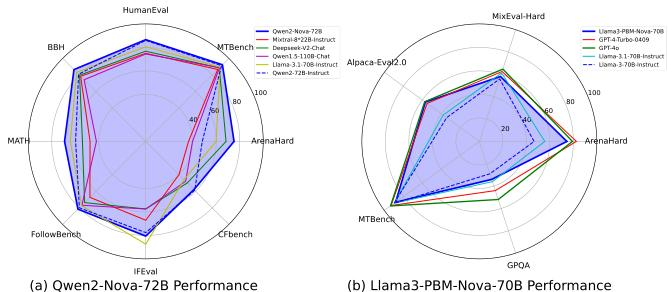
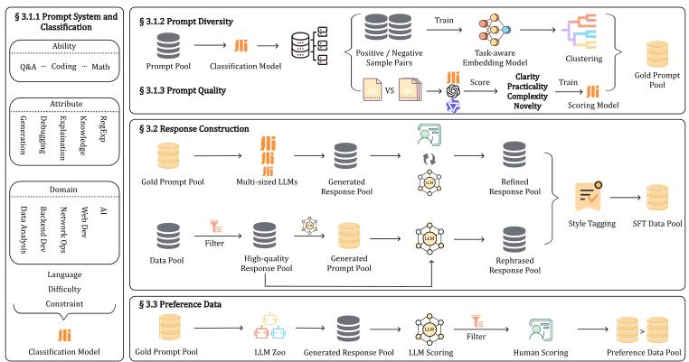
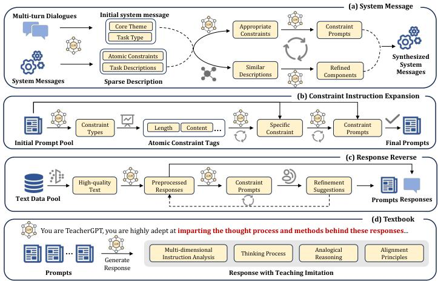
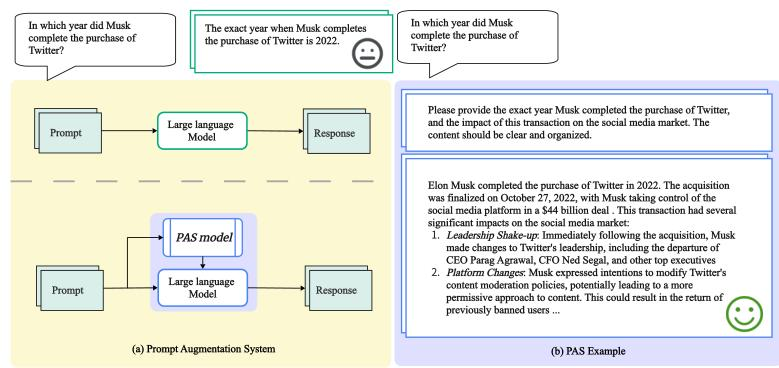
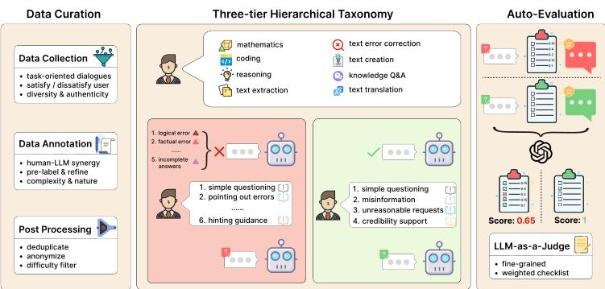

# Summary and Analysis of the Baichuan Alignment Technical Report

This document provides a detailed summary and analysis of the "Baichuan Alignment Technical Report," focusing on the post-training alignment methodologies, innovative techniques, and key improvements as described in the paper.

## 1. Abstract Overview

The report is the industry's first comprehensive look at the alignment techniques used for the Baichuan series of large language models (LLMs). It details a three-stage process—**Prompt Augmentation System (PAS)**, **Supervised Fine-Tuning (SFT)**, and **Preference Alignment (RLHF)**—that significantly enhances model performance. The authors apply these "Baichuan Alignment" techniques to other base models like Qwen2-72B and Llama-3-70B, demonstrating consistent and significant improvements over their official instruction-tuned versions. The report's goal is to share their methodologies, challenges, and insights to foster community advancement toward AGI.

*Figure 1: Performance comparison of models fine-tuned with Baichuan Alignment against others.*

---

## 2. Core Post-Training Alignment Pipeline

Baichuan's alignment process is a sophisticated, multi-stage pipeline designed to make base models more helpful, harmless, and aligned with user intent.

*Figure 2: The overall pipeline for creating alignment data.*

The core stages are:

1.  **Prompt Augmentation System (PAS):** An automated system that refines user prompts *before* they are fed to the main LLM. It adds contextual supplements, style requirements, and format constraints to make the prompt more detailed and actionable for the model.
2.  **Supervised Fine-Tuning (SFT):** The model is trained on a massive, high-quality, and diverse dataset of instruction-response pairs to learn dialogue, instruction following, and task execution.
3.  **Preference Alignment (RLHF):** The model's behavior is further refined to align with human preferences using Reinforcement Learning from Human Feedback (RLHF).

---

## 3. Deep Dive into Post-Training Methodologies

The report provides significant detail on the SFT and RLHF stages, highlighting several innovations.

### 3.1. Supervised Fine-Tuning (SFT)

The quality of SFT is heavily dependent on the data. Baichuan's data strategy is a cornerstone of their success:

*   **Prompt System & Classification:** They developed a multi-dimensional prompt labeling system (covering ability, domain, language, difficulty, etc.) and trained a classifier to automatically label all incoming data. This allows for precise data management, diversity analysis, and targeted data selection.
*   **Prompt Diversity:** To avoid data repetition, they developed a **task-aware embedding model**. Unlike standard embedding models that capture general semantics, this model is trained with contrastive learning (Triplet Loss) to specifically identify and differentiate between task *instructions*. This allows them to select a more diverse set of prompts for training.
*   **Prompt Quality:** They trained a specialized model, **Quality-7B**, to automatically score the quality of prompts along dimensions like Clarity, Practicality, and Complexity. This model, fine-tuned on pairwise comparisons judged by multiple LLMs, outperformed GPT-4 in their tests and is used to filter for high-quality training data.
*   **Response Construction:**
    *   **Response Reversal:** A clever technique to create high-quality, complex instruction data. Instead of writing a response for a complex prompt, they take high-quality, well-structured text (e.g., from the web) and use an LLM to "reverse-engineer" a prompt that would generate it, treating the text's inherent attributes as constraints for the prompt.
    *   **Textbook Learning:** To move beyond simple imitation, they create training data that explicitly teaches the model *how* to think. For a complex instruction, they generate responses that explain the reasoning process, break down the instruction's intent, and discuss alignment principles (e.g., "avoid jargon," "consider user's emotional state").

*Figure 3: Techniques used to improve instruction following, including Response Reversal and Textbook Learning.*

### 3.2. Preference Alignment (RLHF)

Baichuan's RLHF process includes an innovative Reward Model (RM) and a pragmatic choice of RL algorithm.

#### **Reward Model (RM) Innovation**

Standard reward models are trained on preference pairs (chosen vs. rejected) using a pairwise ranking loss, which only captures relative preferences. This can lead to "reward hacking," where the model finds shortcuts to maximize the score without genuinely improving.

Baichuan's innovation is to **combine the standard pairwise ranking loss with a pointwise Mean Squared Error (MSE) loss**.

The final objective function is:
\[ \mathcal{L}_{\theta} = E_{(x,y_{w},y_{l})}[-\log \left(\sigma (r_{\theta}(x,y_{w}) - r_{\theta}(x,y_{l}))\right) +\alpha \left((r_{\theta}(x,y_{w}) - \hat{r}_{x}^{y_{w}})^{2} + (r_{\theta}(x,y_{l}) - \hat{r}_{x}^{y_{l}})^{2}\right)] \]

*   The first term is the standard ranking loss for the winning (\(y_w\)) and losing (\(y_l\)) responses.
*   The second term (the innovation) forces the model's reward score (\(r_{\theta}\)) to also match a **normalized absolute score** (\(\hat{r}\)) provided by human annotators.

This hybrid approach makes the reward model more robust and ensures the reward scores better reflect true human feelings about response quality, not just relative rankings.

#### **Reinforcement Learning Algorithm: GRPO**

The team experimented with both Proximal Policy Optimization (PPO) and **GRPO (Generalized Reward-free Policy Optimization)**.

*   **GRPO** was found to achieve comparable or slightly better performance than PPO on their key benchmarks.
*   Crucially, GRPO **does not require a separate critic model**, which saves nearly half of the training resources compared to PPO.
*   It also outperformed direct optimization methods like DPO.

For these reasons, **GRPO was chosen as their primary RL algorithm.** They also made a modification to the KL-divergence calculation during RL to ensure it remains non-negative and accurate by computing it only on the top-500 logits from the reference model.

---

## 4. Other Innovations and Improvements

### 4.1. Prompt Augmentation System (PAS)

This is a plug-and-play module that sits between the user and the LLM. It automatically enhances a user's query by adding supplementary information, such as:
*   Response style requirements (e.g., "be empathetic," "be authoritative").
*   Extensions based on inferred user intent.
*   Formatting constraints (e.g., "use markdown," "be logically clear").

This decouples the model's core capabilities from its response style, allowing for more flexible and context-appropriate interactions without needing to retrain the main model for every style.

*Figure 4: The PAS pipeline and its impact on response quality.*

### 4.2. Efficient Training Techniques

*   **Packing:** They use Flash Attention v2's `cu_seqlens` feature to pack multiple short samples into a single sequence without the risk of attention bleeding between them. This increased effective token utilization from 10% to 98%, resulting in a nearly 10x efficiency improvement.
*   **Multi-layer Gradient Checkpointing:** Instead of checkpointing every single decoder layer, they group `k` layers together. This reduces the memory required for storing activations, allowing them to train a 70B+ model with a 16K sequence length on 40 GPUs instead of 128.

### 4.3. Model Merging

To combat the "seesaw effect" where fine-tuning on one domain degrades performance on another, they use model merging techniques. They take the best-performing model checkpoints from different domains and merge their weights using algorithms like Linear, Task Arithmetic, and **Model Stock** (which they found performed best). This creates a single, more balanced model that performs well across multiple domains.

---

## 5. Evaluation

The report emphasizes a comprehensive, multi-faceted evaluation strategy:
*   **User Experience Evaluation:** Using third-party experts to score model outputs on dimensions like intent comprehension, accuracy, and language quality.
*   **Open-Source Benchmarks:** Testing on a wide array of public benchmarks (Arena-Hard, MT-Bench, MMLU, etc.) to show consistent gains.
*   **Key Ability Evaluation:** Using custom-built, high-quality benchmarks to test specific, challenging capabilities:
    *   **CFBench:** For following complex, multi-part constraints.
    *   **SysBench:** For adhering to system messages over multi-turn conversations.
    *   **FB-Bench:** For correctly responding to user feedback (both error correction and maintaining a correct stance against misleading feedback).

*Figure 5: The process for constructing FB-Bench to evaluate responsiveness to human feedback.*

---

## 6. Conclusion

The Baichuan Alignment technical report provides a rare, in-depth look into the engineering and methodology behind creating state-of-the-art aligned LLMs. The key takeaways are:

*   **Data is Paramount:** A sophisticated, automated, and quality-driven data pipeline is the foundation of their success. Techniques like task-aware diversity filtering, response reversal, and textbook learning are highly innovative.
*   **Smarter Reward Modeling:** Their hybrid (pairwise + pointwise) loss function for the reward model is a significant improvement that leads to more robust and meaningful rewards.
*   **Pragmatic RL:** Their choice of GRPO over PPO highlights a focus on resource efficiency without sacrificing performance.
*   **Systematic Engineering:** The entire process, from the Prompt Augmentation System to model merging and specialized evaluation, is a testament to a systematic and engineering-driven approach to alignment.

By sharing their methods, Baichuan provides a valuable blueprint for the community, demonstrating that a combination of data-centricity, algorithmic innovation, and rigorous evaluation is key to advancing the capabilities of large language models.
