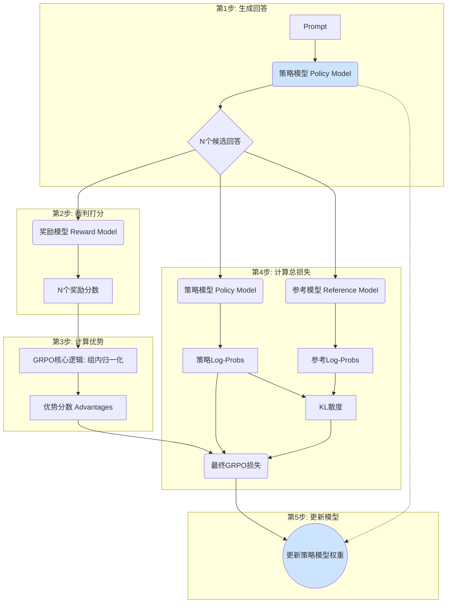

# GRPO 训练过程详解 (代码级拆解)

本文档详细拆解了 `train_grpo.py` 脚本中 GRPO (Group Relative Policy Optimization) 的训练过程，旨在清晰地展示其内部工作流和核心模型的相互关系。

## 核心模型角色 (Core Model Roles)

GRPO的训练流程涉及三个关键模型，它们各自扮演着不可或缺的角色：

### 1. 策略模型 (Policy Model)
- **它是什么？** 这就是我们**真正要训练和优化的主模型**。在脚本里，它被命名为 `model`。
- **它的作用？** 负责根据输入的`prompt`（提示），生成多个候选的`response`（回答）。在训练的每一步，它的参数都会被更新。
- **目标？** 学会如何生成能获得“奖励模型”更高分数的回答。

### 2. 参考模型 (Reference Model)
- **它是什么？** 它是训练开始前，策略模型的一个**完全相同的、但权重被冻结的副本**。在脚本里，它被命名为 `ref_model`。
- **它的作用？** 作为一个“锚点”或“参照物”。它的主要功能是计算KL散度（KL Divergence），用来衡量“策略模型”的输出分布与“原始模型”的输出分布之间的差异。
- **目标？** 防止“策略模型”在追逐高奖励的过程中“跑偏”太远，忘记了语言模型的本职工作（例如，生成流畅、通顺、有逻辑的文本），起到一个稳定器的作用。

### 3. 奖励模型 (Reward Model)
- **它是什么？** 一个**完全独立、权重被冻结的裁判模型**。它的任务不是生成文本，而是给文本打分。在脚本里，它通过 `reward_model_path` 加载。
- **它的作用？** 扮演“老师”或“裁判”的角色。它会评估“策略模型”生成的每一个回答，并给出一个分数（`reward`），这个分数代表了这个回答有多“好”。
- **目标？** 为“策略模型”的学习提供一个明确的优化方向和信号。

## 训练流程关系图 (Training Process Diagram)

下面是这三个模型在一个训练步（Training Step）中如何协同工作的流程图：



## 训练循环代码拆解 (`grpo_train_epoch` 函数)

整个GRPO的核心逻辑都封装在 `grpo_train_epoch` 函数里。下面是详细的、带注释的代码分析。

---

### 第1步: 生成回答 (Generation)

**目标**：让当前正在训练的**策略模型(Policy Model)**，根据一个`prompt`，生成`N`个不同的候选回答。

```python
# train_grpo.py -> grpo_train_epoch()

# ... 从数据加载器中获取一个批次的 prompts ...
prompts = batch['prompt']
prompt_inputs = tokenizer(prompts, ...).to(args.device)

# --- 核心代码 ---
with torch.no_grad():
    # 获取策略模型（如果是DDP模式，需要用 .module 访问）
    model_for_gen = model.module if isinstance(model, DistributedDataParallel) else model
    
    # 调用 generate 函数进行采样生成
    outputs = model_for_gen.generate(
        **prompt_inputs, 
        max_new_tokens=args.max_gen_len,      # 每个回答的最大长度
        do_sample=True,                       # 开启采样模式，确保生成多样性
        temperature=0.8,                      # 温度参数，控制生成的多样性
        num_return_sequences=args.num_generations, # <-- 关键：让模型为每个prompt生成N个回答
        pad_token_id=tokenizer.pad_token_id
    )

# 从生成结果中，分离出回答部分
completion_ids = outputs[:, prompt_inputs["input_ids"].size(1):]
```
**代码解读**：
*   `model.generate` 是整个流程的起点。通过设置 `num_return_sequences=args.num_generations`（默认是8），我们命令策略模型为批次中的每一个 `prompt` 都创造出8个可能的“未来”。
*   `completion_ids` 保存了这8个回答的token ID。

---

### 第2步: 裁判打分 (Scoring)

**目标**：让**奖励模型(Reward Model)** 为上一步生成的每个回答打一个分数。

```python
# train_grpo.py -> grpo_train_epoch()

# --- 核心代码 ---
# 将回答的token ID解码成文本字符串
completions = tokenizer.batch_decode(completion_ids, skip_special_tokens=True)

# 调用奖励函数，为所有生成的回答计算奖励分数
rewards = calculate_rewards(prompts, completions, reward_model, reward_tokenizer).to(args.device)
```
**代码解读**：
*   `calculate_rewards` 是一个辅助函数，它内部做了两件事：
    1.  调用**奖励模型** (`reward_model`)，对每个回答的语义质量打分。
    2.  （在推理模式下）检查回答是否符合 `<think>`/`<answer>` 格式，并给予额外的格式分。
*   最终得到的 `rewards` 张量包含了对所有生成回答的综合评分。

---

### 第3步: 计算优势 (Advantage Calculation)

**目标**：计算每个回答相比于“平均水平”的“优势分数”，这是GRPO算法的精髓。

```python
# train_grpo.py -> grpo_train_epoch()

# --- 核心代码 ---
# 将一维的奖励分数列表，重塑为 (批次大小, N) 的二维矩阵
grouped_rewards = rewards.view(-1, args.num_generations)

# 沿着维度1（N个回答）计算每个prompt组的平均奖励和标准差
mean_r = grouped_rewards.mean(dim=1).repeat_interleave(args.num_generations)
std_r = grouped_rewards.std(dim=1).repeat_interleave(args.num_generations)

# 计算优势分数：(当前回答的奖励 - 组内平均奖励) / 组内标准差
advantages = torch.clamp((rewards - mean_r) / (std_r + 1e-4), -10, 10)

# 对优势分数本身再做一次全局归一化，使训练更稳定
advantages = (advantages - advantages.mean()) / (advantages.std() + 1e-8)
```
**代码解读**：
*   这段代码完美实现了GRPO的“组内相对策略优化”。它不关心奖励的绝对值（比如是5分还是-5分），只关心一个回答在它自己的“兄弟姐妹”（同个prompt生成的其他回答）中排第几。
*   得分高于平均值的回答，其`advantages`为正；低于平均值的为负。

---

### 第4步: 计算总损失 (Loss Calculation)

**目标**：结合“优势分数”和“KL散度惩罚”，构建最终的损失函数。

```python
# train_grpo.py -> grpo_train_epoch()

# --- 核心代码 (1/3): 计算策略模型和参考模型的 Log-Probs ---
# get_per_token_logps 是一个辅助函数，用于获取模型在给定序列上每个token的对数概率
per_token_logps = get_per_token_logps(model, outputs, completion_ids.size(1))
with torch.no_grad():
    ref_per_token_logps = get_per_token_logps(ref_model, outputs, completion_ids.size(1))

# --- 核心代码 (2/3): 计算KL散度 ---
# KL散度 ≈ 参考模型的log_prob - 策略模型的log_prob
kl_div = ref_per_token_logps - per_token_logps
# 这是一个更精确的KL散度计算公式，用于惩罚
per_token_kl = torch.exp(kl_div) - kl_div - 1

# --- 核心代码 (3/3): 计算最终的 GRPO Loss ---
# torch.exp(per_token_logps - per_token_logps.detach()) 是一种计算策略比率(policy ratio)的技巧
# advantages.unsqueeze(1) 是优势分数
# args.beta * per_token_kl 是KL惩罚项
per_token_loss = -(torch.exp(per_token_logps - per_token_logps.detach()) * advantages.unsqueeze(1) - args.beta * per_token_kl)

# --- 聚合Loss ---
# completion_mask 用于忽略padding部分的影响
# 将每个token的loss加权求和，然后取批次的平均值
loss = ((per_token_loss * completion_mask).sum(dim=1) / completion_mask.sum(dim=1)).mean() / args.accumulation_steps
```
**代码解读**：
*   这是整个算法最核心的数学实现。
*   `per_token_loss` 的公式是GRPO损失函数在代码层面的直接体现。它的目标是：
    *   对于`advantages`为正的回答，通过梯度下降，**提高**其 `per_token_logps`（即增大生成这个回答的概率）。
    *   对于`advantages`为负的回答，**降低**其 `per_token_logps`。
    *   同时，通过 `beta * per_token_kl` 这一项，确保上述调整不会让 `model` 和 `ref_model` 的行为差异过大，防止模型“跑偏”。

---

### 第5步: 更新模型 (Update)

**目标**：将计算出的loss应用到**策略模型**上，更新其权重。

```python
# train_grpo.py -> grpo_train_epoch()

# --- 核心代码 ---
# 反向传播
loss.backward()

if (step + 1) % args.accumulation_steps == 0:
    # （可选）梯度裁剪，防止梯度爆炸
    if args.grad_clip > 0:
        torch.nn.utils.clip_grad_norm_(model.parameters(), args.grad_clip)
    
    # 更新优化器，应用梯度
    optimizer.step()
    # 更新学习率
    scheduler.step()
    # 清空梯度，为下一次计算做准备
    optimizer.zero_grad()
```
**代码解读**：
*   这是标准的PyTorch训练流程。计算出的 `loss` 通过 `.backward()` 产生梯度，`optimizer.step()` 则将这些梯度应用到**策略模型**的参数上，完成一次学习。

### 总结
通过以上五个步骤的循环，策略模型就能在奖励模型的指导下，在参考模型的约束下，逐步进化，学会生成更高质量的回答。
