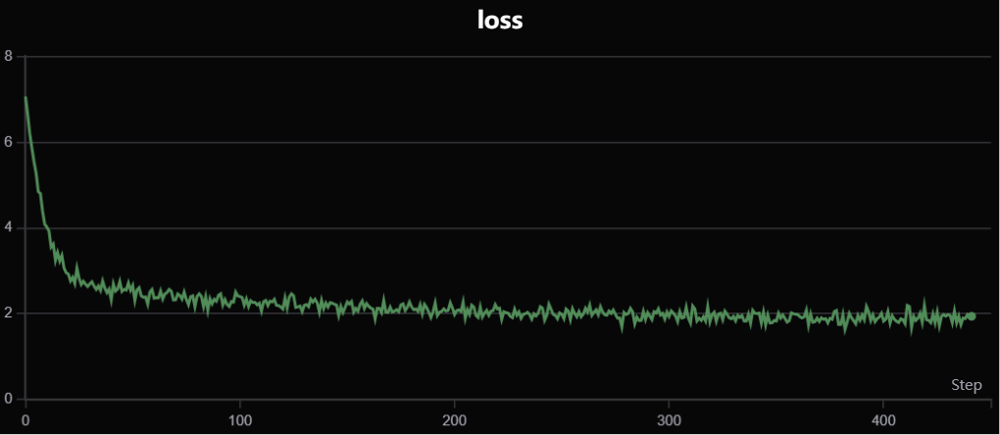
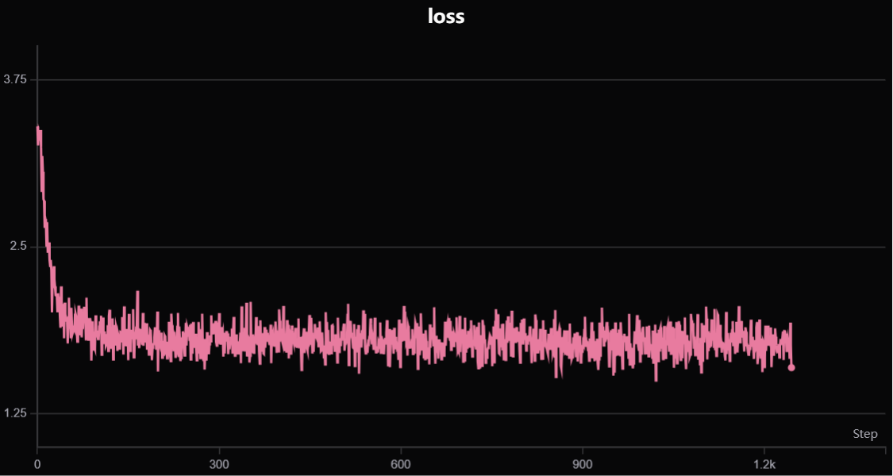
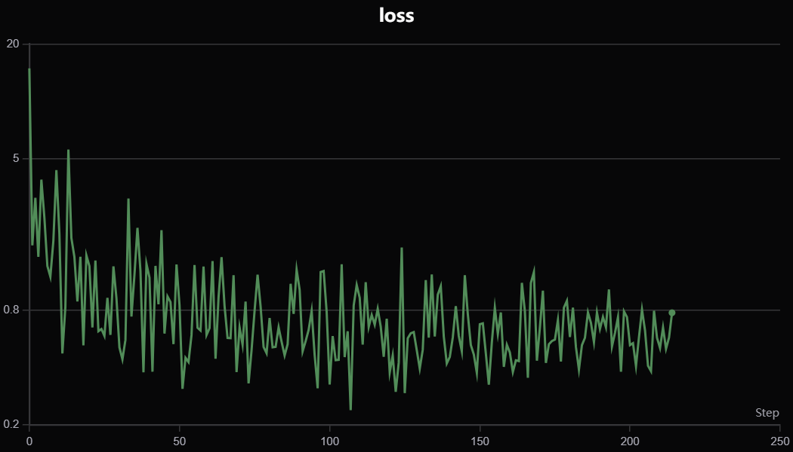
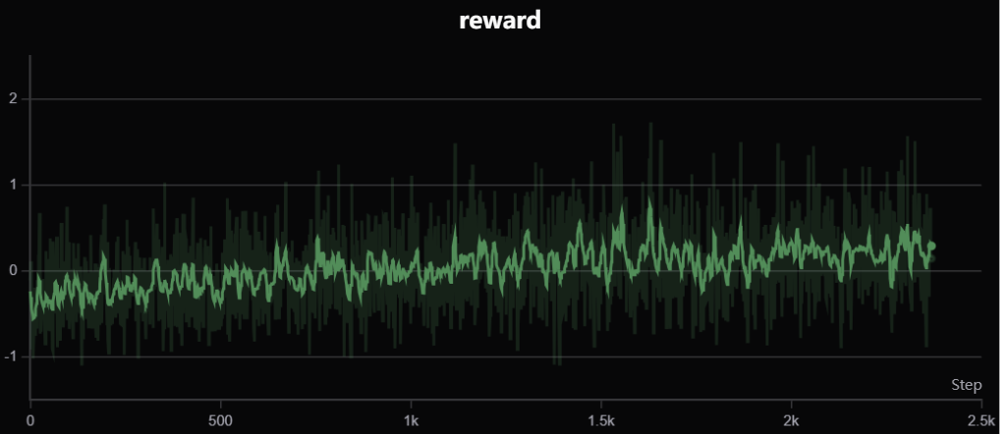

# MiniMind 训练全流程总结

---

# 阶段一：预训练 (Pre-training)

本文档结合 `minimind-master` 项目的官方 `README.md` 指南和在 `minimind` 文件夹中的实际训练日志 (`pretrain.txt`)，详细解析 MiniMind 模型的预训练阶段。

## 1. 预训练的目标 (Purpose of Pre-training)

根据 `README.md` 的描述，预训练是让大语言模型（LLM）学习基础知识的阶段。在这个阶段，模型会“阅读”海量的文本资料（如百科、新闻、书籍），目标只有一个：**学会词语接龙**。

这个过程是“无监督”的，模型从大量文本中自己总结规律。例如，当输入“秦始皇”时，一个好的预训练模型应该能接上“是中国的第一位皇帝”。这个阶段的模型还不具备对话能力，但为后续的微调奠定了知识基础。

## 2. 预训练的准备 (Preparation)

### a. 数据集
- **需要文件**: `pretrain_hq.jsonl`
- **存放位置**: 需要放在项目根目录下的 `dataset` 文件夹中。
- **数据来源**: `README.md` 指出，该数据是从 [匠数大模型数据集](https://www.modelscope.cn/datasets/deepctrl/deepctrl-sft-data) 中提取并清洗得到的，包含了约 1.6GB 的高质量语料。
- **数据格式**: `jsonl` 格式，每一行是一个 JSON 对象，包含一个 `text` 字段。
  ```json
  {"text": "如何才能摆脱拖延症？ 治愈拖延症并不容易，但以下建议可能有所帮助..."}
  ```

### b. 环境
- 需要安装 `requirements.txt` 中的所有依赖。

## 3. 预训练的执行 (Execution)

`pretrain.txt` 文件记录了一次实际的预训练过程。

### a. 训练命令
执行预训练的脚本位于 `trainer/` 目录下。实际使用的命令如下：

```bash
python train_pretrain.py \
    --hidden_size 768 \
    --num_hidden_layers 16 \
    --use_wandb \
    --epochs 1 \
    --batch_size 32 \
    --accumulation_steps 4 \
    --num_workers 8 \
    --dtype bfloat16 \
    --learning_rate 5e-4 \
    --grad_clip 1.0 \
    --max_seq_len 512
```

**参数解析**:
- `--hidden_size 768 --num_hidden_layers 16`: 定义了模型的架构，对应 `README.md` 中的 `MiniMind2` (104M) 版本。
- `--use_wandb`: 使用 `wandb` (或其兼容替代品 `swanlab`) 来记录和可视化训练过程。
- `--epochs 1`: 只对数据集进行一轮完整的训练。
- `--batch_size 32 --accumulation_steps 4`: 实际的批次大小是 `32 * 4 = 128`。梯度累积是一种在显存有限的情况下模拟大批量训练的技巧。
- `--learning_rate 5e-4`: 设置初始学习率。
- `--max_seq_len 512`: 模型处理的序列最大长度为 512 个 token。

### b. 训练过程
从 `pretrain.txt` 的日志可以看出，`loss` 值随着训练的进行而稳步下降：
- **初期**: `loss: 7.066367`
- **末期**: `loss: 1.939027`

<p align="center">
  
</p>


## 4. 预训练模型评估 (Evaluation)

训练完成后，`pretrain.txt` 中记录了对生成的 `pretrain.pth` 权重文件的评估结果。

### a. 评估命令
```bash
python eval_llm.py --weight pretrain --hidden_size 768 --num_hidden_layers 16 --repetition_penalty 1.1
```

### b. 结果分析
从评估结果可以看出预训练模型的典型特征：

- **具备基本知识，但缺乏对话能力**:
  - **问**: `你有什么特长？` -> **答**: `我是计算机程序，没有个人特点和技能...` (回答生硬)
  - **问**: `为什么天空是蓝色的` -> **答**: `？天空呈现出蓝色是因为大气散射后，蓝光波长短，散射较少，所以天空变成了橙红色或红色。` (事实性错误)

- **强大的“接龙”倾向**:
  - **输入**: `床前明月光，疑是` -> **输出**: `地上霜。举头望明月，低头思故乡。这首诗的题目是《登高》...` (成功接龙，但附加信息错误)
  - **输入**: `我说道：“爸爸，你走吧。”...` -> **输出**: `他问我：“爸爸，你为什么要走呢？”...` (开始续写故事)

- **无法遵循指令**:
  - **问**: `请用Python写一个计算斐波那契数列的函数` -> **答**: `。使用Python编写一个计算斐波那契数列的函数，可以利用Python的查询语句实现...` (未提供代码，解释错误)

## 5. 总结

预训练阶段成功地让模型学习了大量的语言知识和模式。然而，此时的模型就像一个知识渊博但不懂如何交流的书呆子。下一步的**监督微调 (SFT)** 阶段，将是教会模型如何“说人话”的关键。

---

# 阶段二：监督微调 (SFT)

本文档紧接预训练阶段的总结，旨在详解 MiniMind 项目的**监督微调 (Supervised Fine-Tuning, SFT)** 阶段。

## 1. SFT 的目标 (Purpose of SFT)

根据 `README.md`，SFT 阶段的目标就是**教会模型对话的方式**。通过使用大量的【问题 -> 回答】格式的对话数据进行训练，模型能学会识别对话模式，并按照指定的模板生成符合逻辑、有帮助的回复。

## 2. SFT 的准备 (Preparation)

### a. 模型
- **需要模型**: `pretrain_*.pth`。SFT 是在预训练模型的基础上进行的。

### b. 数据集
- **推荐文件**: `sft_mini_512.jsonl` (用于快速复现)。
- **存放位置**: `dataset/` 目录。
- **数据格式**: `jsonl` 格式，每一行是一个 JSON 对象，包含一个 `conversations` 列表。
  ```json
  {
      "conversations": [
          {"role": "user", "content": "你好"},
          {"role": "assistant", "content": "你好！"},
          {"role": "user", "content": "再见"},
          {"role": "assistant", "content": "再见！"}
      ]
  }
  ```

## 3. SFT 的执行 (Execution)

### a. 训练命令
```bash
python train_full_sft.py
```
此命令会加载最新的预训练权重，并使用 SFT 数据集进行全参数微调。

### b. 训练过程
根据 `minimind_reproduction_summary1.md` 的实践经验，SFT 阶段通常只训练 **一个 Epoch**，这是一种有效的**抑制过拟合**的策略，防止模型“背诵”对话样本。
<p align="center">
  
</p>


## 4. SFT 模型评估 (Evaluation)

`minimind/train_sft.txt` 提供了对 SFT 模型的详细评估结果。

### a. 评估命令
```bash
python eval_llm.py --weight full_sft --hidden_size 768 --num_hidden_layers 16 --repetition_penalty 1.2
```

### b. 结果分析
与预训练模型相比，SFT 模型的回答质量有了**质的飞跃**：

- **具备了优秀的对话和指令遵循能力**:
  - **问**: `用不超过 20 个字总结牛顿第一定律。` -> **答**: `牛顿第一定律，也称为惯性定律，是指：当一个物体没有受到外力作用时，它将保持静止或匀速直线运动的状态。` (准确完成总结)

- **幻觉和“接龙”现象显著减少**:
  - **问**: `为什么天空是蓝色的` -> **答**: `当太阳光穿过大气层时，它会被散射...` (解释基本正确)

- **能够处理更复杂的指令**:
  - **问**: `请用正式的语气写一封邮件...` -> **答**: (模型生成了一封结构完整、语气正式的邮件)
  - **问**: `以“清晨的森林”为题，写一段 50 字左右的描写。` -> **答**: (模型生成了一段符合要求的优美文字)

- **仍有局限**:
  - 在处理 JSON 格式输出、数学计算等任务上能力依然有限。

## 5. 总结

SFT 阶段是模型从“知识库”转变为“对话助手”的关键一步。模型学会了理解人类指令并生成流畅、相关、有帮助的回答，具备了聊天机器人的基本雏形。后续的强化学习阶段将在此基础上进一步优化。

---

# 阶段三：直接偏好优化 (DPO)

在 SFT 之后，模型已经可以很好地对话，但它的回答不一定符合人类的偏好（比如是否安全、有帮助、无害）。DPO (Direct Preference Optimization) 是一种 RLHF (基于人类反馈的强化学习) 技术，旨在让模型的输出更符合人类的价值观。

## 1. DPO 的目标 (Purpose of DPO)

`README.md` 指出，DPO 的目标是**让模型学会什么是“好”的回答，什么是“坏”的回答**。它通过学习一个包含“更受偏好的回答 (chosen)”和“被拒绝的回答 (rejected)”的数据集，直接优化模型，使其生成 chosen 回答的概率高于 rejected 回答。

这个过程就像是给模型看“优秀范文”和“错误范文”，让它学习如何写出更好的文章。

## 2. DPO 的准备 (Preparation)

### a. 模型
- **需要模型**: `full_sft_*.pth`。DPO 训练通常在 SFT 模型的基础上进行。

### b. 数据集
- **需要文件**: `dpo.jsonl`
- **存放位置**: `dataset/` 目录。
- **数据格式**: `jsonl` 格式，每行包含一对 `chosen` 和 `rejected` 的对话历史。
  ```json
  {
    "chosen": [
      {"content": "Q", "role": "user"}, 
      {"content": "good answer", "role": "assistant"}
    ], 
    "rejected": [
      {"content": "Q", "role": "user"}, 
      {"content": "bad answer", "role": "assistant"}
    ]
  }
  ```

## 3. DPO 的执行 (Execution)

### a. 训练命令
`README.md` 中给出的训练命令如下：

```bash
python train_dpo.py
```
该脚本会加载 SFT 模型，并使用 `dpo.jsonl` 数据集进行偏好对齐训练。

## 4. DPO 模型评估 (Evaluation)

`minimind/dpo1.txt` 记录了对 DPO 训练后的模型 (`dpo1`) 的评估结果。

<p align="center">
  
</p>


### a. 评估命令
```bash
python eval_llm.py --hidden_size 768 --num_hidden_layers 16 --weight dpo1 --repetition_penalty 1.15
```

### b. 结果分析
与 SFT 模型相比，DPO 模型的行为模式发生了一些变化：

- **回答更谨慎，有时会拒绝**:
  - **问**: `请用Python写一个计算斐波那契数列的函数`
  - **答**: `很抱歉，我无法提供代码。但是，您可以使用Python中的numpy库或其他编程语言来编写计算斐波那契数列的函数。` (SFT 模型会尝试解释，但 DPO 模型直接、礼貌地拒绝了它无法做好的任务，这可能是一种更安全的行为)

- **风格变化**:
  - **问**: `比较一下猫和狗作为宠物的优缺点`
  - **答**: (回答变得有些混乱和矛盾，例如“猫是肉食性动物，但它们更容易被训练来执行复杂任务...狗更独立...”，这表明 DPO 训练可能在某些方面损害了模型原有的事实性，或者数据集的偏好导致了这种风格)

- **信息准确性**:
  - `README.md` 在 RLHF 对比部分总结道：“RLHF后的模型倾向于学习：说更多有礼貌但无用的废话讨好‘对话’本身，而对信息准确性则有轻微损失。” `dpo1.txt` 中的结果部分印证了这一点。

## 5. 总结

DPO 阶段成功地将人类的偏好注入模型中，使其行为更加谨慎和“对齐”。模型学会了在不确定的情况下拒绝回答，这在安全性和可靠性上是一个进步。

然而，这也可能带来一些副作用，如在某些主题上回答质量下降或产生新的幻觉。这凸显了偏好数据集质量的重要性。

---

# 阶段四：推理模型训练 (知识蒸馏)

在模型具备了对话能力和人类偏好对齐后，`MiniMind` 项目探索了通过**知识蒸馏**方法来提升其**推理能力**，使其生成带有 `<think>...</think>` 标签的思考过程。

---

## 1. 目标
通过使用由强大教师模型（如 Qwen2.5）生成、并带有 `<think>`/`<answer>` 结构的“推理数据”进行监督微调（SFT），让学生模型模仿教师模型的思考和回答模式。这本质上是一种**黑盒蒸馏**。

## 2. 准备
- **模型**: `dpo_*.pth` (通常在 DPO 模型基础上进一步微调)
- **数据**: `r1_mix_1024.jsonl`，包含了带有思考链的对话数据。
- **数据格式**: `jsonl` 格式，与 SFT 阶段一致，但 `assistant` 的 `content` 中包含了 `<think>` 和 `<answer>` 标签。
  ```json
  {
    "conversations": [
      {
        "role": "user",
        "content": "你好，我是小芳，很高兴认识你。"
      },
      {
        "role": "assistant",
        "content": "<think>\n你好！我是由中国的个人开发者独立开发的智能助手MiniMind-R1-Lite-Preview，很高兴为您提供服务！\n</think>\n<answer>\n你好！我是由中国的个人开发者独立开发的智能助手MiniMind-R1-Lite-Preview，很高兴为您提供服务！\n</answer>"
      }
    ]
  }
  ```

## 3. 执行
- **训练命令** (来自 `reasoning.txt`):
  ```bash
  python train_distill_reason.py --from_weight dpo1 --hidden_size 768 ...
  ```
- **核心技巧**: `README.md` 提到，为了让模型严格遵守 `<think>`/`<answer>` 格式，训练脚本 `train_distill_reason.py` 对这些特殊标签 token 的 `loss` 施加了更高的惩罚权重，确保模型学会这个结构。

> 
## 4. 评估
`reasoning.txt` 中的评估结果显示，模型已经能够稳定地生成带有思考过程的回复。
- **问**: `你有什么特长？`
- **答**: `<think>您好！我是由中国的个人开发者独立开发的智能助手MiniMind-R1...</think><answer>您好！我是由中国的个人开发者独立开发的智能助手MiniMind-R1...</answer>` (思考和回答内容一致，表明模型在简单问题上直接输出了答案)

## 5. 总结
知识蒸馏方法更稳定，能快速让模型学会特定的输出格式，但上限受限于教师数据的质量和多样性。

---

# 阶段五：基于 AI 反馈的强化学习 (RLAIF - GRPO)

在模型具备了对话能力和人类偏好对齐后，`MiniMind` 项目还探索了使用 **GRPO 强化学习算法**来提升其**推理能力**。这是一种更接近 `DeepSeek` 论文的“真正”的强化学习方法，模型通过在线试错来学习。

## 1. 目标
使用 GRPO (Group Relative Policy Optimization) 算法，通过 AI 奖励模型 (Reward Model) 的反馈，直接激励策略模型生成更高质量、更符合推理格式的回答。

## 2. 数据准备
- **需要文件**: `rlaif-mini.jsonl`
- **存放位置**: `dataset/` 目录。
- **数据格式**: `jsonl` 格式，与 SFT 阶段一致，但 `assistant` 的 `content` 是无用的（例如 "无"），因为在训练时会由模型实时生成。
  ```json
  {
      "conversations": [
          {"role": "user", "content": "请解释一下什么是光合作用？"},
          {"role": "assistant", "content": "无"}
      ]
  }
  ```

## 3. 原理 (源自 `GRPO_training_breakdown.md`)
GRPO 的训练过程可以精炼为五个步骤：
1.  **生成 (Generation)**: **策略模型** (policy model) 针对一个问题，生成 N 个不同的候选回答。
2.  **打分 (Scoring)**: 一个独立的**奖励模型** (reward model) 为这 N 个回答打分。
3.  **计算优势 (Advantage Calculation)**: GRPO 的核心。通过将每个回答的分数与其所在组的“平均分”和“标准差”进行比较，计算出相对“优势分数”。这避免了训练一个复杂的 Critic 网络。
4.  **计算损失 (Loss Calculation)**: 结合“优势分数”和用于稳定训练的“KL散度惩罚”，构建最终的 GRPO 损失函数。
5.  **更新 (Update)**: 将损失反向传播，只更新**策略模型**的权重。

整个过程中，还有一个**参考模型** (reference model, 策略模型的冻结副本) 用来计算 KL 散度，防止策略模型在优化过程中“跑偏”。

## 4. 执行
- **训练命令** (来自 `grpo.txt`):
  ```bash
  python train_grpo.py --hidden_size 768 ... --reasoning 1 --use_wandb
  ```
  `--reasoning 1` 参数用于启用特定的奖励函数，比如对是否生成 `<think>` 标签进行额外奖励。

  <p align="center">
  
  
  </p>


## 5. 评估
`grpo.txt` 的评估结果显示，GRPO 训练后的模型同样掌握了思考链的能力。
- **问**: `你有什么特长？`
- **答**: `<think>嗯，用户问的是“你有什么特长”这个问题。我需要先理解他的具体情况...</think><answer>作为一名AI助手，我可以模拟人类的思考过程...</answer>` (思考过程更像“内心独白”，而最终答案更简洁，体现了思考和回答的分离)

## 6. 总结
GRPO 方法让模型具备了在线探索和自我优化的能力，理论上有可能发现超越教师数据的更优策略，但训练过程更复杂，对奖励函数的设计要求更高。

---

# 阶段六：模型蒸馏原理 (Knowledge Distillation)

`distillation_analysis.md` 文件详细阐述了知识蒸馏的原理。在 MiniMind 项目的实践中，主要应用的是**黑盒蒸馏**。

- **黑盒蒸馏**: 指的是从一个强大的、但无法访问其内部参数的“教师模型”（如 GPT-4, Qwen）学习。我们只能获取其最终的文本输出。
- **核心思想**: 通过收集由教师模型生成的大量高质量问答对，然后用这些数据对我们自己的“学生模型”进行标准的**监督微调 (SFT)**。
- **项目应用**:
    - `train_full_sft.py` 脚本配合 `sft_1024.jsonl` 等数据集（数据源于 Qwen2.5）进行训练，就是典型的黑盒蒸馏。
    - `train_distill_reason.py` 脚本使用从推理模型蒸馏出的数据进行训练，也是同理。
    - 这种方法将知识的“蒸馏”体现在了**数据层面**。

- **白盒蒸馏**: `train_distillation.py` 脚本提供了白盒蒸馏的实现代码，它要求能够同时访问教师和学生模型的内部 `logits`，并通过 KL 散度损失来指导学生。这在 MiniMind 项目中主要作为学习参考。

---

# 阶段七：客观性能评测 (Benchmark)

`benchmark.txt` 文件记录了使用 `lm-evaluation-harness` 框架对模型进行的客观性能评测结果。

- **测试框架**: `lm-evaluation-harness`
- **测试集**: `ceval-valid` (一个综合性的中文评测基准)
- **测试命令示例**:
  ```bash
  lm_eval --model hf --model_args pretrained=./MiniMind2R1,device=cuda,dtype=auto --tasks ceval-valid* --batch_size 16 --trust_remote_code
  ```
- **结果解读**:
  - `acc` (Accuracy): 模型的准确率。
  - `ceval-valid` 的总分 `acc: 0.2556` 表明模型在多项选择题上的平均正确率约为 25.6%。
  - `README.md` 中也提到，对于这个量级的模型，得分在 25%（即随机猜测的概率）附近是正常现象，表明模型在处理复杂的、需要精确知识的选择题方面能力有限。

  测试结果`benchmark`:
  hf (pretrained=./MiniMind2R1,device=cuda,dtype=auto,trust_remote_code=True), gen_kwargs: (None), limit: None, num_fewshot: None, batch_size: 16
  |                       Tasks                        |Version|Filter|n-shot| Metric |   |Value |   |Stderr|
  |----------------------------------------------------|------:|------|-----:|--------|---|-----:|---|-----:|
  |ceval-valid                                         |      2|none  |      |acc     |↑  |0.2556|±  |0.0119|
  |                                                    |       |none  |      |acc_norm|↑  |0.2556|±  |0.0119|
  |ceval-valid_accountant                              |      2|none  |     0|acc     |↑  |0.3469|±  |0.0687|
  |                                                    |       |none  |     0|acc_norm|↑  |0.3469|±  |0.0687|
  |ceval-valid_advanced_mathematics                    |      2|none  |     0|acc     |↑  |0.2105|±  |0.0961|
  |                                                    |       |none  |     0|acc_norm|↑  |0.2105|±  |0.0961|
  |ceval-valid_art_studies                             |      2|none  |     0|acc     |↑  |0.1818|±  |0.0682|
  |                                                    |       |none  |     0|acc_norm|↑  |0.1818|±  |0.0682|
  |ceval-valid_basic_medicine                          |      2|none  |     0|acc     |↑  |0.1053|±  |0.0723|
  |                                                    |       |none  |     0|acc_norm|↑  |0.1053|±  |0.0723|
  |ceval-valid_business_administration                 |      2|none  |     0|acc     |↑  |0.4242|±  |0.0874|
  |                                                    |       |none  |     0|acc_norm|↑  |0.4242|±  |0.0874|
  ......
  
  |  Groups   |Version|Filter|n-shot| Metric |   |Value |   |Stderr|
  |-----------|------:|------|------|--------|---|-----:|---|-----:|
  |ceval-valid|      2|none  |      |acc     |↑  |0.2556|±  |0.0119|
  |           |       |none  |      |acc_norm|↑  |0.2556|±  |0.0119|

---

# 附录：部署与调试技巧

`minimind_reproduction_summary1.md` 提供了一些非常有用的工程实践技巧。

### 1. 启动 Web UI (Streamlit)
- **正确命令**: 必须使用 `streamlit run web_demo.py`，而不是 `python web_demo.py`。
- **远程访问问题**: 如果在云服务器上部署，公网 IP 可能无法直接访问。
- **解决方案**: 使用 **SSH 端口转发**。在本地电脑执行以下命令，即可通过访问 `http://localhost:8501` 来使用云端的 Web Demo。
  ```powershell
  # ssh -L [本地端口]:localhost:[服务器端口] [SSH登录信息]
  ssh -L 8501:localhost:8501 root@your_server_ip -p your_ssh_port
  ```

### 2. 启动 API 服务
- **后台运行 (Linux)**: 使用 `nohup` 和 `&` 可以让 API 服务在关闭终端后依然持续运行。
  ```bash
  nohup python serve_openai_api.py --load_from ../MiniMind2 > server.log 2>&1 &
  ```