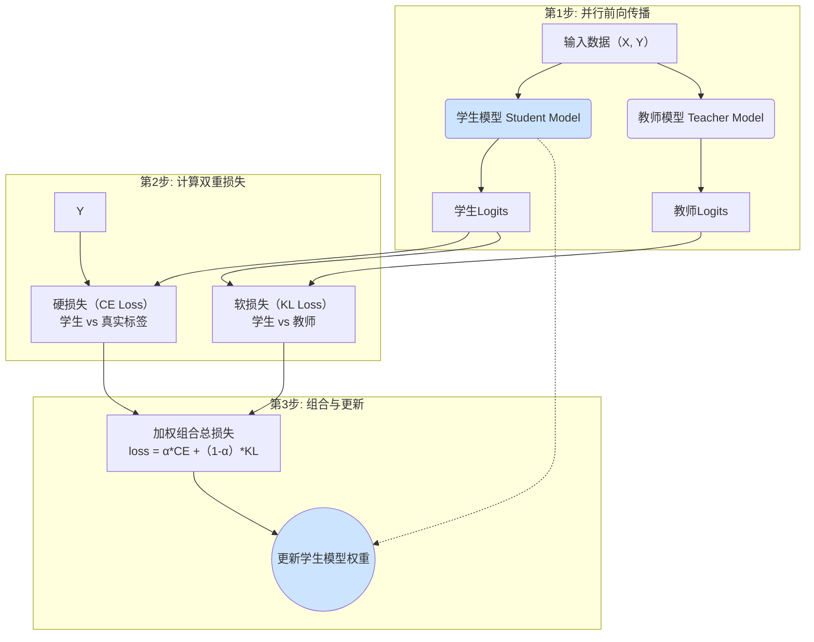

# 知识蒸馏 (Knowledge Distillation) 原理解析

本文档深入解析知识蒸馏的两种主要类型：**黑盒蒸馏**与**白盒蒸馏**，并结合本项目中的代码 `trainer/train_full_sft.py` 和 `trainer/train_distillation.py` 进行说明。

---

## 蒸馏的两种主要类型

### 1. 黑盒蒸馏 (Black-box Distillation)

黑盒蒸馏是当前大模型时代**最主流、最实用**的知识迁移方法。

- **适用场景**: 当教师模型是一个无法访问其内部结构和参数的“黑盒”时，例如通过API调用的闭源大模型（如GPT-4、Qwen-Max）。我们只能获取其最终的文本输出，而无法得到其内部的`logits`。

- **核心思想**: 既然无法模仿老师的“思考过程”，那就退而求其次，去模仿老师产出的“最终成果”。通过让学生模型学习海量由教师模型生成的高质量问答对，从而模仿其知识、风格和推理能力。

- **实现流程**:
  1.  **生成数据**: 准备一个包含多样化指令（Prompt）的数据集。
  2.  **教师推理**: 调用强大的教师模型API，让其对每一个指令进行回答，并收集这些高质量的回答。
  3.  **构建SFT数据集**: 将原始指令和教师模型生成的回答配对，组合成一个新的 `(prompt, response)` 格式的监督微调（SFT）数据集。
  4.  **学生SFT训练**: 使用这个新构建的数据集，对我们自己的学生模型（小模型）进行标准的监督微调。

- **优化目标**:
  黑盒蒸馏的优化过程与标准的SFT完全一致，其损失函数就是**交叉熵损失 (Cross-Entropy Loss)**。知识的“蒸馏”体现在**数据层面**，而非损失函数层面。

- **在本项目中的对应**:
  - **代码**: `trainer/train_full_sft.py`
  - **数据集**: `README.md` 中提到的 `sft_1024.jsonl` 和 `sft_2048.jsonl` 等，它们的数据来源于 `Qwen2.5` 模型的输出，正是黑盒蒸馏的典型实践。

---

### 2. 白盒蒸馏 (White-box Distillation)

白盒蒸馏是一种更深入、更底层的蒸馏方法，是知识蒸馏最初被提出时的经典形式。它要求我们能够完全访问教师和学生两个模型，并在同一个训练流程中协同工作。

#### **核心模型角色 (Core Model Roles)**

白盒蒸馏的流程涉及两个核心模型：

1.  **学生模型 (Student Model)**
    -   **它是什么？** 这就是我们**真正要训练和优化的主模型**。在脚本里，它被命名为 `model`。
    -   **它的作用？** 负责根据输入`X`，生成预测的`logits`。它的参数在训练的每一步都会被更新。
    -   **目标？** 同时从“真实标签”和“教师模型的指导”中学习，最终以更小的体积达到接近教师模型的效果。

2.  **教师模型 (Teacher Model)**
    -   **它是什么？** 一个更大、更强、但**权重被完全冻结的指导模型**。在脚本里，它被命名为 `teacher_model`。
    -   **它的作用？** 扮演“老师”的角色。它不参与训练，只负责对同样的输入`X`，生成一套“软标签”（即`logits`），用来指导学生模型的学习。
    -   **目标？** 将自己对于数据内在结构的“暗知识”传递给学生模型。

#### **训练流程关系图 (Training Process Diagram)**

下面是这两个模型在一个训练步（Training Step）中如何协同工作的流程图：



#### **训练循环代码拆解 (`train_epoch` 函数)**

整个白盒蒸馏的核心逻辑都封装在 `train_epoch` 函数里。下面是详细的、带注释的代码分析。

---

##### 第1步: 并行前向传播 (Parallel Forward Pass)

**目标**：让**学生模型**和**教师模型**分别对同一批输入数据 `X` 进行计算，得到各自的 `logits`。

```python
# trainer/train_distillation.py -> train_epoch()

# ... 从数据加载器中获取一批数据 (X, Y, loss_mask) ...

# --- 核心代码 (学生) ---
with autocast_ctx:
    res = model(X) # model 是学生模型
    student_logits = res.logits

# --- 核心代码 (教师) ---
if teacher_model is not None:
    with torch.no_grad(): # 教师不计算梯度
        teacher_logits = teacher_model(X).logits
```
**代码解读**：
*   学生模型 `model(X)` 在混合精度上下文 `autocast_ctx` 中正常执行前向传播。
*   教师模型 `teacher_model(X)` 在 `torch.no_grad()` 上下文中执行，确保其参数保持冻结，不参与反向传播，纯粹作为指导者。

---

##### 第2步: 计算硬损失 (Hard Loss - CE)

**目标**：计算**学生模型**的预测与**真实标签 `Y`** 之间的差距，即标准的监督学习损失。

```python
# trainer/train_distillation.py -> train_epoch()

# --- 核心代码 ---
ce_loss = F.cross_entropy(
    student_logits.view(-1, student_logits.size(-1)),
    Y.view(-1), # Y 是数据集中的真实标签
    ignore_index=0,
    reduction='none'
)
ce_loss = torch.sum(ce_loss * loss_mask_flat) / loss_mask_flat.sum()
```
**代码解读**：
*   这部分和标准的SFT训练完全相同，它确保学生模型能学会最基本的“正确答案”。

---

##### 第3步: 计算软损失 (Soft Loss - KL)

**目标**：计算**学生模型**的`logits`分布与**教师模型**的`logits`分布之间的差异，即KL散度。

```python
# trainer/train_distillation.py -> train_epoch()

# --- 核心代码 ---
if teacher_model is not None:
    distill_loss = distillation_loss(
        student_logits.view(-1, student_logits.size(-1))[loss_mask_flat == 1],
        teacher_logits.view(-1, teacher_logits.size(-1))[loss_mask_flat == 1],
        temperature=temperature
    )

# --- distillation_loss 函数内部 ---
def distillation_loss(student_logits, teacher_logits, temperature=1.0, ...):
    teacher_probs = F.softmax(teacher_logits / temperature, dim=-1).detach()
    student_log_probs = F.log_softmax(student_logits / temperature, dim=-1)
    kl = F.kl_div(student_log_probs, teacher_probs, ...)
    return (temperature ** 2) * kl
```
**代码解读**：
*   `distillation_loss` 函数是白盒蒸馏的精髓。
*   它首先用 `temperature` 参数软化教师和学生的 `logits`，然后计算两者概率分布的KL散度。
*   这个损失会“拉动”学生的`logits`分布，使其形状逼近教师的分布，从而学习“暗知识”。

**关于KL散度的方向性（Mode-seeking vs. Mean-seeking）**

值得注意的是，`torch.nn.functional.kl_div(input, target)` 函数计算的是 `KL(target || input_from_log)`。
在本代码中，`target` 是 `teacher_probs` (教师模型的概率分布 P)，`input` 是 `student_log_probs` (学生模型的对数概率分布 Q)。

因此，这里计算的是 **`KL(P_teacher || Q_student)`**，这属于 **Forward KL (前向KL散度)**。

Forward KL 具有 **“均值寻求 (Mean-seeking)”** 的特性：它会惩罚学生模型 `Q` 在教师模型 `P` 具有高概率的区域（即教师认为的“正确”或“可能”的答案）上赋予低概率。为了避免巨大的惩罚，学生模型 `Q` 倾向于变得更“平滑”和“宽广”，覆盖教师模型 `P` 的所有模式（即所有可能的答案）的平均位置。

这意味着学生模型不仅学习教师模型最看好的答案，还会学习教师模型认为“次优”或“可能”的答案，从而更好地捕捉教师模型的“暗知识”和泛化能力。

---

##### 第4步: 组合总损失 (Combine Losses)

**目标**：将“硬损失”和“软损失”按照权重 `alpha` 加权求和，得到最终的总损失。

```python
# trainer/train_distillation.py -> train_epoch()

# --- 核心代码 ---
# 总损失 = alpha * CE + (1-alpha) * Distill
loss = (alpha * ce_loss + (1 - alpha) * distill_loss) / args.accumulation_steps
```
**代码解读**：
*   `alpha` 参数（`--alpha`）控制了两种学习信号的平衡。`alpha=1` 等同于SFT，`alpha=0` 则是纯粹模仿教师。

---

##### 第5步: 更新模型 (Update)

**目标**：将计算出的 `loss` 应用到**学生模型**上，更新其权重。

```python
# trainer/train_distillation.py -> train_epoch()

# --- 核心代码 ---
# 反向传播
scaler.scale(loss).backward()

if (step + 1) % args.accumulation_steps == 0:
    # （可选）梯度裁剪
    torch.nn.utils.clip_grad_norm_(model.parameters(), args.grad_clip)
    
    # 更新优化器，应用梯度
    scaler.step(optimizer)
    scaler.update()
    
    # 清空梯度
    optimizer.zero_grad(set_to_none=True)
```
**代码解读**：
*   这是标准的PyTorch训练流程。计算出的 `loss` 通过 `.backward()` 产生梯度，`optimizer.step()` 则将这些梯度应用到**学生模型**的参数上，完成一次学习。教师模型因为不在计算图中，所以不会被更新。