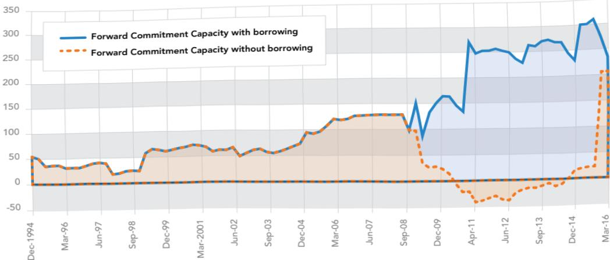
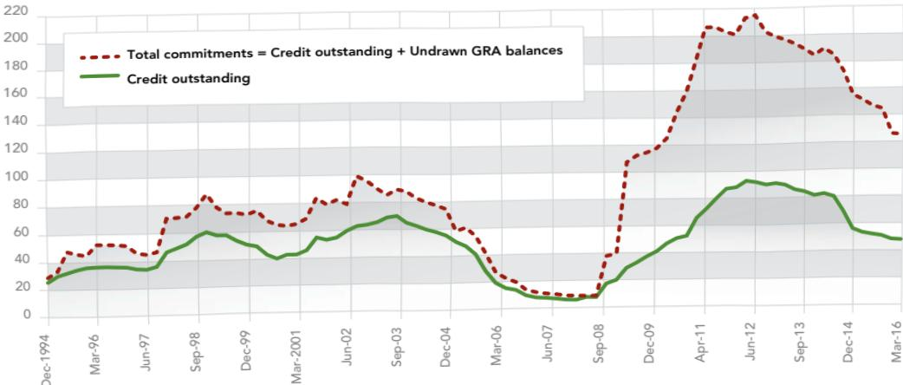
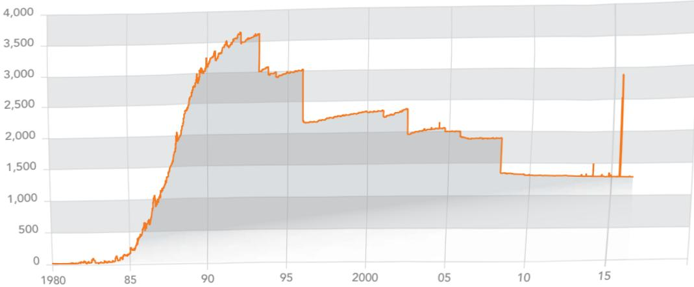
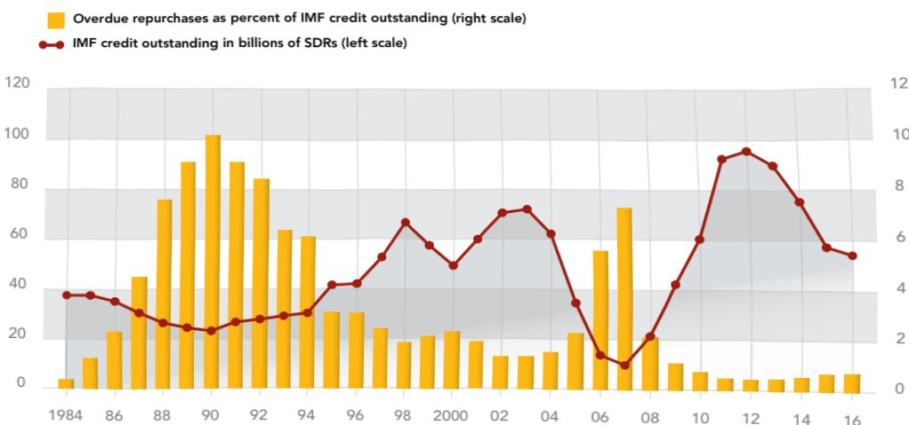
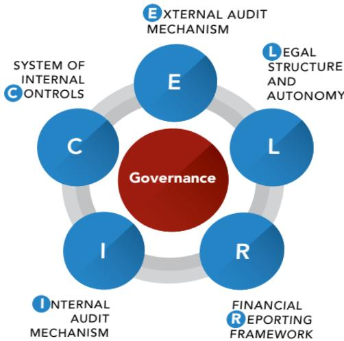
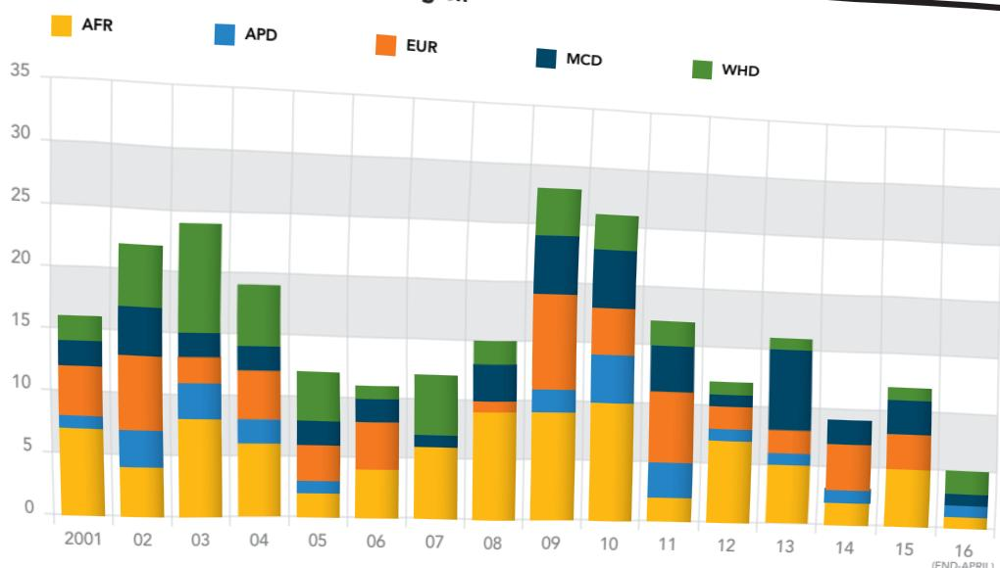

# 6  Financial Risk  Management 

T he IMF's Articles of Agreement call for adequate safe-guards for the temporary use of its resources. Risks stem from interactions with the membership in fulfillment of the IMF's mandate as a cooperative international organization that makes its general resources available temporarily to its members. The IMF has an extensive risk-management framework in place, including procedures to mitigate traditional financial risks as well as strategic and operational risks. The latter risks are addressed by a variety of processes, including surveillance reviews, lending policies and operations, capacity building, standards and codes of conduct for economic policies, the communications strategy, and others.

Financial risks are mitigated by a multilayered framework reflective of the IMF's unique financial structure. Key elements include the IMF's lending policies (program design and monitoring, conditionality and phasing, access policies as well as the exceptional access framework), investment guidelines, internal control structures, financial reporting, audit systems, and the IMF's preferred creditor status. The Fund also utilizes precautionary balances to absorb the impact of risks once they crystallize.In addition, the IMF conducts safeguards assessments of central banks to ensure that their governance and control systems,auditing, financial reporting, legal structures, and autonomy are Article l, paragraph V:"To give confidence to members by making the general resources of the Fund temporarily available to them under adequate safeguards, thus providing them with opportunity to correct maladjustments in their balance of payments without resorting to measures destructive of national or international prosperity."

adequate to maintain the integrity of operations and minimize the risk of any misuse of IMF resources.

This chapter provides an overview of the financial riskmanagement framework and control structure of the IMF. A detailed description of financial risk mitigation follows, covering credit, liquidity, income, and market risks (interest rate and exchange rate risk controls). The balance of the chapter details the IMF's strategy for handling overdue financial obligations, safeguards assessments of central banks, and the IMF's audit framework and financial reporting and risk-disclosure mechanisms.

### 6.1 Financial Risk: Sources and Mitigation Framework 

The monetary character of the IMF and the need for its resources to revolve require that members with financial obligations to the institution repay them as they fall due so that resources can be made available to other members. The IMF faces a range of financial risks in fulflingitsmandaerlating to creditliquidity,income, and market risk, and has developed a multilayered financial risk-mitigation framework (Box 6.1).

• Credit risk typically dominates, reflecting the IMF's core role as a provider of balance of payments support to members when other financing sources may not be readily available. Credit risk can fluctuate widely since the IMF does not target a particular level of lending or lending growth. Since lending needs may arise from global developments, IMF lending can be highly concentrated and subject to correlated 

risks. While credit risk is inherent in the IMF's unique role, it employs a comprehensive set of measures to mitigate such risk and safeguard the resources members provide to the IMF.

Related to credit risk is liquidity risk—the risk that the IMF's resources will be insufficient to meet members'financing needs and its own obligations. Members may make additional demands for credit and may also draw on their reserve tranche positions and draw suddenly and in large amounts from their precautionary arrangements. In addition, under the terms of the New Arrangements to Borrow (NAB) and borrowing agreements, lenders may encash their claims against the IMF if they face balance of payments difficulties.

The IMF also faces income risk—the risk of a shorfall in the ratio of annual income to expenses. This risk has been significant in the past—for example, when lending fell to low levels during the mid-2000s, before the recent global financial crisis. There has been significant progress in implementing the IMF's new income model, which aims to mitigate this risk.

•The IMF does not face significant market (exchange rate and interest rate) risk in its lending and funding operations with members, since the same floating interest rate determines both the rate of charge payable to the IMF by borrowing members and the rate of remuneration paid by the IMF to creditor members. In addition, the IMF's balance sheet is denominated in SDRs. The IMF faces market risks on its investment portfolios, though these risks are contained by the adoption of relatively conservative strategies (see Chapter 5).

• The IMF also self-insures for certain risks (for example, to cover losses of a capital nature) and has strong internal controls to address operational risks.

The IMF works to mitigate credit risk in several ways, including through policies on access, limits on financing, and incentives to contain excessively long and heavy use of its resources.It also mitigates credit risk through program design and conditionality,safeguard assessments of central banks, post-program monitoring, measures to deal with misreporting, and an arrears strateg.Liquidity risk is managed through regular quota reviews, as well as maintaining a 20 percent liquidity cushion called the prudential balance, and implemented through the Forward Commitment Capacity and the Financial Transactions Plan2 (see Chapter 2). In addition, the IMF may borrow temporarily to supplement quota resources. The IMF's new income model aims to mitigate income risk and fluctuations. Precautionary balances are an important element of this model, because they generate investment income for the IMF and are a critical part of the risk management framework. The sections that follow discuss these risk-mitigation factors in more detail.

#### 6.1.1 Credit Risks 

##### 6.1.1.1 LENDING POLICIES 

Credit risk refers to potential losses on credit outstanding due to the inability or unwillingness of member countries to make repurchases (that is, to repay credit extended to them). Credit risk is inherent in the IMF's unique role in the international monetary system given that the IMF has limited ability to diversify its loan portfolio and generally provides financing when other sources are not available to a member. In addition, the IMF's credit concentration is generally high due to the nature of its lending.

The IMF employs a comprehensive set of measures to mitigate credit risk. The primary tools for credit risk mitigation are the strength of IMF lending policies on access—phasing, program design, and conditionality—which are critical to enuring that IMF financial support helps members resolve their balance of payments difficulties (see Chapter 2 for a more detailed discussion of the IMF's lending policies). These policies include assessments of members' capacity to implement adjustment policies and repay the IMF including the exceptional access policy for large commitments. This policy subjects potential users of Fund resources to a higher level of scrutiny, including review of compliance with substantive criteria and early involvement of the Executive Board including through a discussion of risks to the IMF if proposed access exceeds 145 percent of their quota annually or 435 percent cumulatively, net of scheduled repurchases.

Credit risks are also mitigated by the structure of charges and maturities, adequate junior cofinancing from other official lenders, and the IMF's preferred creditor status (Box 6.2). The IMF passes its low cost of funding to borrowers to assist with their adjustment but adds a level- and time-based surcharge premium to moderate large and/or prolonged use of resources and encourage prompt repayment when access to market financing is restored.

In addition, the IMF has systems in place to assess safeguard procedures at members'central banks and to address overdue financial obligations. In the event of arrears, the IMF has a financial strategy for addressing overdue obligations, including a burden-sharing mechanism (Box 6.3). This mechanism aims to cover income losses related to arrears charges (see Section 6.2);it can also contribute to the accumulation of precautionary balances (see Section 6.1.1.2).

Furthermore, the Fund normally employs a system of postprogram monitoring with members that have substantial outstanding credit to the Fund but are no longer in a program relationship. Post-program monitoring enhances the Fund's ability to detect risks to the member's repayment capacity and thus safeguard the Fund's resources. In July 2016, the Executive Board adopted changes to the post-program monitoring framework to 

Table 6.1 Level of Precautionary Balances in the General Resources Account (Billions of SDRs; as of April 30 each year) 

<html><body><table border="1"><tr><td rowspan="2"></td><td colspan="8">End of Financial Year</td></tr><tr><td>2008</td><td>2009</td><td>2010</td><td>2011</td><td>2012</td><td>2013</td><td>2014</td><td>2015 2016</td></tr><tr><td>Precautionary balances</td><td>6.9</td><td>7.1</td><td>7.3</td><td>8.1</td><td>9.5</td><td>11.5</td><td>12.7</td><td>14.2 15.2</td></tr><tr><td>Reserves</td><td>5.8</td><td>5.9</td><td>6.1</td><td>6.9</td><td>8.3</td><td>10.3 11.5</td><td>13.0</td><td>14.0</td></tr><tr><td>General</td><td>3.5</td><td>3.5</td><td>3.5</td><td>4.0</td><td>4.9</td><td>6.1 7.6</td><td>9.0</td><td>9.5</td></tr><tr><td>Special</td><td>2.2</td><td>2.4</td><td>2.6</td><td>2.9</td><td>3.4</td><td>4.2 4.0</td><td>4.0</td><td>4.5</td></tr><tr><td>SCA-1</td><td>1.2</td><td>1.2</td><td>1.2</td><td>1.2</td><td>1.2</td><td>1.2 1.2</td><td>1.2</td><td>1.2</td></tr><tr><td>Memorandum items:</td><td></td><td></td><td></td><td></td><td></td><td></td><td></td><td></td></tr><tr><td>Credit outstanding</td><td>5.9</td><td>20.4</td><td>41.2</td><td>65.5</td><td>94.2</td><td>90.2</td><td>81.2 55.2</td><td>47.8</td></tr><tr><td>Arrears2</td><td>1.1</td><td>1.1</td><td>1.1</td><td>1.1</td><td>1.1</td><td>1.1</td><td>1.1 1.1</td><td>1.1</td></tr><tr><td>Principal</td><td>0.3</td><td>0.3</td><td>0.3</td><td>0.3</td><td>0.3</td><td>0.3</td><td>0.3 0.3</td><td>0.3</td></tr><tr><td>Charges</td><td>0.8</td><td>0.8</td><td>0.8</td><td>0.8</td><td>0.8</td><td>0.8 0.8</td><td>0.8</td><td>0.8</td></tr><tr><td>Precautionary balances to Credit outstanding</td><td>117.7</td><td>34.7</td><td>17.8</td><td>12.4</td><td>10.1</td><td>12.8</td><td>15.7 25.7</td><td>31.8</td></tr></table></body></html>

Source: Finance Department, International Monetary Fund.

Note: SCA= Special Contingent Account.

1Precautionary balances as of the end of FY2011 and for subsequent periods exclude pro ts from gold sales.

2ObliRrrulurieralAjlitiGowG)Trust, and the Trust Fund.

make it more risk based and focused. The Board established absolute-size thresholds that would trigger post-program monitoring set at SDR 1.5 billion for GRA credit and SDR 0.38 billion for PRGT credit, to help ensure adequate monitoring of large exposures to the Fund's resources.3 As a backstop, a quota-based threshold of 200 percent of quota in outstanding Fund credit also applies. A post-program monitoring report is expected to be prepared once a year, based on a mission scheduled between annual Article IV consultations. The report should examine in depth the full range of risks to members' capacity to repay, with the analysis tailored to a country's specific circumstances.

##### 6.1.1.2 PRECAUTIONARY BALANCES 

Precautionary balances strengthen the IMF's balance sheet, help to ensure the value of members' reserve positions, and safeguard the IMF's financing mechanism (Box 6.4). IMF financial assistance can result in large exposures, and high credit concentration is a likely consequence of the IMF's mandate to respond to members' balance of payments needs. Precautionary balances address residual risks after applying other elements of the multilayered risk-management framework and protect the IMF's balance sheet in the event that it suffers losses as a result of credit or other financial risks (Box 6.1). This function is critical to protecting the value of members' reserve assets and promotes confidence that members' reserve positions are safe and liquid from a balance sheet perspective.

The IMF's precautionary balances consist of reserves held in the General and Special Reserves and the balance in the Special Contingent Account, or SCA-1 (Box 6.4). Additions to reserves come through net income allocations determined annually by the Executive Board (including from surcharges), while the SCA-1has been built up mainly by contributions from IMF debtors and creditors under the burden-sharing mechanism, which are potentially refundable. As of April 30, 2016, precautionary balances amounted to SDR 15.2 billion (Table 6.1).

##### 6.1.1.3 REVIEWOFTHEADEQUACY 

## OFPRECAUTIONARYBALANCES 

The IMF conducts regular reviews of the adequacy of precautionary balances. At the 2002 review, a target for precautionary balances of SDR 10 billion was established. This figure took into account a number of considerations, including the possibility of imminent risk to the IMF's credit portfolio, the need to ensure continued compliance with International Financial Reporting Standards (IFRS), and the need to raise the IMF's reserve ratio closer to those of other international financial institutions. The IMF staff also considered it reasonable to double precautionary balances to at least 6 percent of the IMF's credit capacity. The 

target was subsequently reaffirmed on three occasions (in 2004,2006, and 2008).

During the 2008 review of precautionary balances, the Executive Directors asked the IMF staff to develop a more transparent and rules-based framework for reserve accumulation, with forward-looking elements to account for the volatility of IMF lending. They noted that this framework should cover how the reserves target would be set and adjusted over time, the modalities for accumulating reserves, and how reserves in excess of the target would be handled. The Directors emphasized that credit risk should be the primary consideration in assessing reserve adequacy under the new income model (see Chapter 5),since this model is expected to significantly mitigate the IMF's overall income risk. They also supported use of a variety of forward-looking indicators and further development of scenario analyses and stress tests.

In response to this request, the IMF staff proposed a new framework for assessing reserve adequacy in 2010. Under the framework, the target for precautionary balances would be broadly maintained within a range linked to developments in total credit outstanding. The framework consists of four main elements:

• Reserve coverage ratio: The reserve coverage ratio would be set within a range of 20 to 30 percent of a forward-looking measure of credit outstanding, subject to a minimum floor (see below). This proposal draws on approaches of other international financial institutions but seeks to adapt them to the specific circumstances of the IMF.

Forward-looking credit measure to anchor the range:The credit measure used to determine the range would include a strong forward-looking element while also seeking to smooth some of the year-to-year volatility of credit movement. Specifically, it would comprise a 3-year average of credit outstanding covering the previous 12 months and projections for the next 2 years, taking into account scheduled disbursements and repayments under all approved nonprecautionary arrangements.

Treatment of precautionary arrangements: The framework currently does not explicitly include commitments under precautionary arrangements in determination of the range, but allows for these commitments to be taken into account when the Executive Board decides where to set the target.

• A minimum floor for the target: The framework includes a minimum floor for precautionary balances to protect against an unexpected increase in credit risk and ensure a sustainable income position.

Most Directors supported this framework at the 2010 review.They agreed to raise the medium-term target for precautionary balances to SDR 15 billion. They also generally supported setting a minimum floor for precautionary balances at SDR 10 billion,while highlighting the need to keep this under review. Consistent with the framework, the medium-term target was subsequently increased to SDR 20 billion at the time of the review in April 2012(Table 6.1). At the most recent review in February 2016, Directors supported retaining the medium-term indicative target for precautionary balances of SDR 20 billion. The minimum floor for precautionary balances was raised to SDR 15 billion, a level deemed more consistent with maintaining a long-term sustainable income position and one that would provide a larger buffer to protect against unexpected increases in credit in a future environment of low-lending by the IMF.

#### 6.1.2 Liquidity Risks 

Liquidity risk is the risk that the IMF's resources may not be sufficient to meet the financing needs of members and its own obligations. The IMF must have adequate usable resources available to meet members' demand for IMF financing. While the IMF's resources are largely of a revolving nature, uncertainties in the timing and amount of credit extended to members during financial crises expose the IMF to liquidity risk. Moreover, the IMF must also stand ready to (1) meet, upon a member's representation of need, demands for a drawing of a member's reserve tranche position, which is part of the member's reserves, and (2) make drawings under borrowing agreements to fund encashment requests from lenders under bilateral borrowing agreements or the NAB in case of balance of payments need of the relevant creditor member.

The IMF's financial structure helps mitigate liquidity risk, but the volatility and uncertainty in the timing and size of members'needs for financing, as well as the potential demands from members to draw on their reserve tranche positions, require appropriate management of that liquidity risk. The IMF does not use market financing to cover unanticipated liquidity needs, but rather takes a multifaceted approach to ensure sufficient financial resources to cover its members' financing needs:

• The IMF's main measure of its capacity to make new GRA resources available to its members—the Forward Commitment Capacity (FCC)—is closely monitored by the Executive Board, management, and staff. The FCC equals uncommitted usable resources from quota and IMF borrowing, plus repurchases l year forward, minus repayment on borrowing 1 year forward, minus the prudential balance, minus undrawn balances under existing arrangements (Box 6.6).A modified FCC has been developed to take into account shorter-term availability of resources under the amended and expanded NAB—see Chapter 2. The maximum activation period within which the IMF can make commitments funded with NAB resources is 6 months.

IMFlending is based on an exchange of assets.Members whose currencies are used in GRA lending operations are reviewed and approved by the Executive Board on a quarterly basis in the Financial Transactions Plan (FTP). In the FTP, the IMF staff specifies the amount of SDRs and selected 

member currencies to be used in transfers and receipts expected to be conducted through the GRA during that period. The selection of members to participate in financing IMF lending transactions takes into account recent and prospective developments in balance of payments and reserves,trends in exchange rates, and the size and duration of external debt obligations. Use of the IMF's holdings of these currencies in lending operations results in FTP members receiving, in exchange, a liquid claim on the IMF (reserve tranche position) that earns interest based on the SDR interest rate.5 The NAB employs a similar quarterly liquidity review called the Resource Mobilization Plan (RMP) (see Chapter 2).

Longer-term resource needs are assessed in General Quota Reviews of the adequacy of members' quotas for meeting the demand for IMF financing that take place at least every 5years. The methodology is not defined under the Articles,but the size of the IMF in terms of quota has been assessed historically against global economic indicators such as GDP,trade and capital flows, and estimates of members' needs (see Chapter 2).

The IMF may borrow to supplement its quota resources.It has two standing borrowing arrangements—the NAB,which is the main backstop for quota resources, and the General Arrangements to Borrow (GAB), which can be used in limited cases. The IMF has also employed ad hoc bilateral borrowing with official lenders, and may borrow from the private markets, although it has never done so (see Chapter 2).

The prudential balance is intended to safeguard the liquidity of creditors' claims and take account of the potential erosion of the IMF's resource base. The prudential ratio of 20percent set by the IMF's Executive Board reflects historical experience and judgments on the indicative level of uncommitted usable resources that the IMF would normally not use to make financial commitments (see Box 6.6).

• Level- and time-based surcharges mitigate large and long use of IMF credit, supporting the revolving nature of IMF resources by providing an incentive to repurchase IMF credit when market access is regained.

• Commitment fees also help contain risks to the Fund's liquidity. The current upward sloping fee structure was introduced as part of the broader reforms to the GRA lending toolkit in 2009 with the aim of discouraging unnecessarily high precautionary access (see Box 5.3).

• Access limits are a further element of the Fund's risk management framework to help preserve Fund liquidity and the revolving character of Fund resources (see Access Policy Chapter 2).

#### 6.1.3 Income Risk 

The IMF also faces income risk—the risk of a shortfall in annual income relative to expenses. This risk has occurred at certain times in the past, including when lending fell to very low levels during the run-up to the global financial crisis. Chapter 5 explains how the IMF generates income to finance its administrative expenditures, highlighting the ways in which the IMF has adapted the financial structure in order to broaden its sources of income. The new income model is intended to mitigate income risk associated with decreased lending and is based on more diverse sources of revenue that are appropriate to support the IMF's mandated broad range of activities. In addition, precautionary balances—which also generate investment income—add further protection to the Fund's income. Other measures to mitigate income risk include changes in the margin on the basic rate of charge and surcharges as well as the burden-sharing mechanism.

##### 6.1.3.1 INTERESTRATE RISK 

Interest rate risk is the risk that the future cash flows will fluctuate because of changes in market interest rates. The IMF mitigates interest rate risk primarily by linking the rate of charge to the rate of remuneration. To minimize the effect of interest rate fluctuations on income, the IMF links the rate of charge directly to the SDR interest rate (and thus to the rate of remuneration, which has often been set at 100 percent of the SDR interest rate before burden-sharing adjustments).

Interest rate risk related to bilateral borrowings, issued notes,and borrowings under the enlarged and amended NAB is limited since claims from drawings are currently remunerated at the SDR interest rate. The proceeds from borrowings are used to extend credit to member countries at the rate of charge, which is based on the SDR interest rate plus a margin, or to repay borrowings under bilateral borrowing agreements and the enlarged and amended NAB.

Interest rate risk on investments is limited by prudent limits on duration. In the case of the Fixed-Income Subaccount of the Investment Account, interest rate risk is controlled by the short duration of portfolios. In the case of trust assets, the duration of the investment portfolio is limited to a weighted average effective duration that does not exceed 3 years (see Chapter 5).

Figure 6.1 Forward Commitment Capacity: How the IMF Augments Quota Resources  through Borrowing, December 1994–April 2016 (Billions of SDRs)  

Forward Commitment Capacity 

GRA Total Commitments and Credit Outstanding 

Source: Finance Department, International Monetary Fund.Note: GRA = General Resources Account.

Table 6.2 The IMF's Liquidity, 2010–16(Billions of SDRs; as of April 30 each year)

<html><body><table border="1"><thead><tr><td></td><td>2010</td><td>2011</td><td>2012</td><td>2013</td><td>2014</td><td>2015</td><td>2016</td></tr></thead><tbody><tr><td>End of Period</td><td></td><td></td><td></td><td></td><td></td><td></td><td></td></tr><tr><td>Usable Resources1</td><td>314.2</td><td>423.4</td><td>396.4</td><td>397.3</td><td>408.7</td><td>435.7</td><td>430.3</td></tr><tr><td>Of Which: Available Borrowing to Finance Pre-NAB Commitments2</td><td>166.3</td><td>58.0</td><td>43.2</td><td></td><td></td><td></td><td></td></tr><tr><td>Available Borrowingto Finance Pre/Post-NAB Commitments2</td><td></td><td>1.5</td><td>1.4</td><td></td><td></td><td></td><td></td></tr><tr><td>Available under NAB Activations3</td><td></td><td>211.0</td><td>206.3</td><td>242.0</td><td>242.8</td><td>252.3</td><td>38.4</td></tr><tr><td>Less: Undrawn Balances under GRA Arrangements</td><td>76.3</td><td>115.9</td><td>121.6</td><td>108.0</td><td>113.3</td><td>99.1</td><td>77.6</td></tr><tr><td>Plus: Repurchases Due in Next 12 Months</td><td>1.9</td><td>3.3</td><td>13.7</td><td>20.4</td><td>16.9</td><td>8.9</td><td>2.2</td></tr><tr><td>Less: Repayments of Borrowing Due 1-Year Forward</td><td></td><td></td><td>1.1</td><td>5.4</td><td>8.3</td><td>4.5</td><td>2.6</td></tr><tr><td>Less: Prudential Balance</td><td>70.7</td><td>40.1</td><td>40.0</td><td>39.7</td><td>39.7</td><td>39.7</td><td>79.6</td></tr><tr><td>Equals: 1-Year Forward Commitment Capacity</td><td>169.1</td><td>270.7</td><td>247.4</td><td>264.7</td><td>264.3</td><td>301.4</td><td>272.8</td></tr><tr><td>Memorandum Items, End of Period:</td><td></td><td></td><td></td><td></td><td></td><td></td><td></td></tr><tr><td>Flows During the Period</td><td></td><td></td><td></td><td></td><td></td><td></td><td></td></tr><tr><td>New Commitments4</td><td>77.6</td><td>142.2</td><td>52.6</td><td>75.1</td><td>24.2</td><td>79.8</td><td>5.6</td></tr><tr><td>Purchases</td><td>21.1</td><td>26.6</td><td>32.2</td><td>10.6</td><td>11.7</td><td>12.0</td><td>4.7</td></tr><tr><td>Repurchases</td><td>0.3</td><td>2.3</td><td>3.6</td><td>14.6</td><td>20.6</td><td>38.0</td><td>12.1</td></tr><tr><td>Total Credit Lines under GAB/NAB</td><td>34.0</td><td>367.5</td><td>370.0</td><td>370.0</td><td>370.0</td><td>370.0</td><td>182.4</td></tr><tr><td>Quotas of Members in Financial Transactions Plan</td><td>179.9</td><td>198.7</td><td>198.4</td><td>198.3</td><td>198.3</td><td>198.3</td><td>396.6</td></tr><tr><td>GRA Credit Outstanding</td><td>41.2</td><td>65.5</td><td>94.2</td><td>90.2</td><td>81.2</td><td>55.2</td><td>47.8</td></tr><tr><td>Active Borrowing Agreements5</td><td>172.6</td><td>169.3</td><td>169.7</td><td></td><td></td><td></td><td></td></tr><tr><td>Outstanding Borrowing by the IMF</td><td>6.4</td><td>19.7</td><td>40.0</td><td>45.5</td><td>47.3</td><td>36.8</td><td>47.8</td></tr></tbody></table></body></html>

Source: Finance Department, International Monetary Fund.

Note: Columns may not add up due to rounding.

1Usable resourcesconsistof:(1)theIMFholdingsofthecurrenciesofFinancialTransactionsPlan(FTP)members,(2)holdingsofDRs,and(3)unused amounts availableunderactivated bilateral loanandnote purchaseagreements,andunused amounts availableundertheNewArrangementstoBorrow/General Arrangements to Borrow (NAB/GAB) when these have been activated.

2Effective April 1,2013,the Board approved termination of any further drawings under these Fund bilateral borrowing and note purchase agreements, which were concluded in 2009/2010 prior to activation of the NAB.

3Re ects activation of the enlarged NAB for successive 6-month periods since April 1, 2011, until February 25, 2016.

4Gross amounts of new commitments not netted for undrawn balances under expired/cancelled arrangements. Includes disbursements under Emergency Assistance.5Total amount made available under active borrowing agreements, including amounts already disbursed: only available for pre-NAB purchases.

Due to its return objective, the investments of the Endowment Subaccount are exposed to a larger set of risks, including interest rate risk. The conservative and diversified nature of the Endowment Subaccount asset allocation ensures that these risks are limited and balanced. Its relatively small size also limits the impact of adverse market movements on the IMF's overall balance sheet.

Procedures are in place to periodically review the strategy of the Investment Account, including the adequacy of risk limits.Within the scope of the investment authority under the Articles,the Executive Board endorses the investment objective, strategic benchmark, and main risk control procedures for all IA investments through the adoption of the Rules and Regulations for the IA.6 Formal agreements with managers and custodians bind them to act within the IMF's risk approach (see Chapter 5).

##### 6.1.3.2 EXCHANGE RATE RISK 

Exchange rate risk is the exposure to the effects of fluctuations in foreign currency exchange rates on an entity's financial position and cash flows. The IMF has no exchange rate risk exposure on its holdings of members' currencies in the GRA since, under the Articles of Agreement, members are required to maintain the value of such holdings in terms of the SDR. Any depreciation/appreciation in a member's currency vis-a-vis the SDR gives rise to a currency valuation adjustment receivable or payable that must be settled by the member promptly after the end of the financial year or at other times as requested by the IMF or the member. The IMF has other assets and liabilities, such as trade receivables and payables, denominated in currencies other than SDRs and makes administrative payments largely in U.S. dollars,but the exchange rate risk exposure from these other assets and liabilities is limited.

Investments of the Fixed-Income Subaccount and the trusts are exposed to very limited exchange rate risk. The portfolios include securities—Bank for International Settlements (BIS) MediumTerm Instruments and government bonds—denominated in 

the constituent currencies of the SDR based on the weight of each currency in the SDR basket. However, because securities included in the portoliochange in value over time and genertecashflows,the weight of each currency in the portfolio differs slightly from the weights in the SDR basket, generating some rsidual exchange rate risk. This risk is mitigated by regular (at least monthly) rebalancing of the portfolio. Regarding the Endowment Subaccount,the impact of foreign exchange volatility is controlled through mandatory hedging of part of the assets back to the base currency, the U.S. dollar (see Chapter 5).

### 6.2 Overdue Financial Obligations 

#### 6.2.1 Overview 

In its first four decades, the IMF's experience with member countries in making timely payments was generally satisfactory. However, beginning in the early 1980s, the number and amount of late payments increased significantly.Overdue obligations to the IMF rose from SDR 178 million at the end of 1984 to a peak of SDR 3.6 billion at the end of 1991 (Box 6.10). Although most delays were temporary and quickly corrected, the increase in protracted arrears (defined as overdue financial obligations of 6 months or more) raised serious concerns and highlighted the need for procedures to deal systematically with arrears (Box 6.7).

In the late 1980s and early 1990s, the IMF strengthened its procedures for dealing with overdue obligations with the aim of preventing the emergence of additional overdue financial obligations and eliminating existing ones. This culminated in the establishment of the Strengthened Cooperative Strategy on Overdue Financial Obligations in the early 1990s.The strengthened cooperative arrears strategy comprises thre elements:(1) the prevention of arrears, (2) collaboration in clearing arrears,and (3) remedial measures against continuing arrears. To further encourage members in protracted arrears to cooperate, the IMF established a policy in mid-1999 on the de-escalation of remedial measures. This policy lifted some remedial measures if the member established a solid record of cooperation with the IMF on policies and payments.

The cooperative arrears strategy has been broadly successful in helping to resolve the cases of protracted arrears that existed at the end of the 1980s and preventing new cases of protracted arrears from emerging. Of the 1l cases of protracted arrears at the end of 1989, 8 were resolved by the mid-1990s; another case (Liberia) was resolved in 2008. Nine new cases of protracted arrears emerged since the establishment of the arrears strategy.As of the end of April 2016, only three cases of protracted arrears remained—Somalia, Sudan, and Zimbabwe (Table 6.3). Clearing these arrears is complicated by domestic conflict, international sanctions, or both. Sudan accounts for about three-quarters of the total (Table 6.4).

Reflecting success in resolving past cases of arrears and preventing the emergence of new cases, the level of overdue financial obligations to the IMF has declined sharply, from its peak of SDR 3.6 billion at the end of 1991 to SDR 1.3 billion at the end of April 2016 (Figure 6.2).In addition, as of end-April 2016, as a percent of credit outstanding, arrears were at their lowest level in 27 years (Figure 6.3). The largest share of the arrears to the IMF was to the GRA (87 percent), with the balance due to the Trust Fund, the Special Disbursement Account, and the Poverty Reduction and Growth Trust—overdue charges and interest accounted for about two-thirds of the total. On June 30 and July 13, 2015,Greece did not settle repurchase obligations falling due amounting to SDR 1,232 million and SDR 360 million, respectively.While the overdue financial obligations were outstanding, Greece was not permitted to receive any further Fund financing. Greece subsequently settled these overdue obligations on July 20, 2015.

#### 6.2.2 Cooperative Strategy on Overdue Financial Obligations 

The Strengthened Cooperative Strategy consists of three elements: (1) preventive measures to avoid new arrears from emerging, (2) intensified collaboration with members in arrears,and (3) remedial measures of increasing intensity to encourage members to cooperate with the IMF in seeking a solution to their arrears.

##### 6.2.2.1 PREVENTION 

The IMF's best safeguard against the emergence of arrears is the quality of IMF supported programs. In this context, the IMF places priority on (1) assisting members in designing strong and comprehensive economic programs; (2) carefully assessing the access of members to IMF financial support and the phasing of such support; (3) conducting an explicit assessment of a member's capacity and willingness to repay the IMF; and (4) ensuring adequate balance of payments financing during the IMF arrangement. The IMF also introduced the safeguards policy in 2000 to obtain reasonable assurance that central banks of member countries using IMF resources have appropriate control systems in place to manage the resources adequately and to provide reliable information. In addition, the IMF continues to emphasize the importance of remaining current with the IMF. In some cases,specific financial or administrative arrangements can be used to ensure timely repayments to the IMF, including through the advance purchase of SDRs to provide for the settlement of forthcoming obligations.

##### 6.2.2.2 COLLABORATION 

To normalize relations with the IMF, the collaborative element of the arrears strategy provides a framework for cooperating members in arrears to establish a strong track record of policy performance and payments to the IMF. Accordingly, members use their own financial resources, or support from creditors, in order to clear their arrears to the IMF and regain access to IMF financial support (see Section 6.2.3). In this context the IMF developed the Staff-Monitored Program (SMP) and Rights Accumulation 

Table 6.3 History of Protracted Arrears to the IMF 

<html><body><table border="1"><tr><td rowspan="2">Country</td><td colspan="4">Arrears</td></tr><tr><td>Period</td><td>Duration (years)</td><td>SDR millions</td><td>Percent of Quota</td></tr><tr><td colspan="6">Up to 1979</td></tr><tr><td>Cuba</td><td>1959 64</td><td>5.0</td><td>.</td><td></td></tr><tr><td>Egypt</td><td>1966 68</td><td>2.0</td><td>.</td><td>.</td></tr><tr><td>Cambodia</td><td>Mar. 1975 Oct. 92</td><td>18.6</td><td>36.9</td><td>147.6</td></tr><tr><td colspan="6">1980 89</td></tr><tr><td>Nicaragua</td><td>Feb.1983 Apr. 85</td><td>2.2</td><td>14.4</td><td>21.0</td></tr><tr><td>Guyana</td><td>Apr. 1983 Jun.90</td><td>7.2</td><td>107.7</td><td>217.7</td></tr><tr><td>Chad</td><td>Jan.1984 Nov.94</td><td>10.8</td><td>4.1</td><td>13.4</td></tr><tr><td>Vietnam</td><td>Feb.1984 Oct. 93</td><td>9.7</td><td>100.2</td><td>41.5</td></tr><tr><td>Sierra Leone</td><td>Nov. 1984 Sep. 86</td><td>1.8</td><td>25.1</td><td>43.3</td></tr><tr><td>Sudan</td><td>Jul. 1984 present</td><td></td><td>970.11</td><td>571.7</td></tr><tr><td>Liberia</td><td>Dec.1984Mar.2008</td><td>23.3</td><td>543.0</td><td>761.6</td></tr><tr><td>Tanzania</td><td>Mar. 1985 Jul.86</td><td>1.3</td><td>22.9</td><td>21.4</td></tr><tr><td>Zambia</td><td>Apr. 1985 Jan.86</td><td>0.8</td><td>115.1</td><td>42.6</td></tr><tr><td>Gambia, The</td><td>Jun.1985 Jul.86</td><td>1.1</td><td>10.6</td><td>62.0</td></tr><tr><td>Peru</td><td>Sep. 1985 Mar. 93</td><td>7.5</td><td>621.0</td><td>187.7</td></tr><tr><td>Jamaica</td><td>Apr. 1986 Jan.87</td><td>0.8</td><td>50.0</td><td>34.4</td></tr><tr><td>Zambia</td><td>Apr. 1986 Dec. 95</td><td>9.7</td><td>830.2</td><td>307.1</td></tr><tr><td>Sierra Leone</td><td>Jan.1987 Mar.94</td><td>7.2</td><td>85.5</td><td>147.7</td></tr><tr><td>Somalia</td><td>Jul. 1987 present</td><td></td><td>236.81</td><td>535.7</td></tr><tr><td>Honduras</td><td>Oct. 1987 Nov. 88</td><td></td><td>3.3</td><td>4.9</td></tr><tr><td>Panama</td><td>Dec.1987 Feb.92</td><td>4.2</td><td>180.9</td><td>177.0</td></tr><tr><td>Congo, Democratic Republic of the</td><td>Jun.1988 May 89</td><td>0.9</td><td>115.4</td><td>39.6</td></tr><tr><td>Haiti</td><td>Oct.1988 Sep.89</td><td>0.9</td><td>9.2</td><td>20.9</td></tr><tr><td>Honduras</td><td>Nov. 1988 Jun. 90</td><td>1.6</td><td>27.5</td><td>40.6</td></tr><tr><td colspan="6">1990 present</td></tr><tr><td>lraq</td><td>May.1990 Sep.2004</td><td>14.3</td><td>55.3</td><td>11.0</td></tr><tr><td>Dominican Republic</td><td>Aug. 1990 Apr. 91</td><td>0.7</td><td>24.3</td><td>21.6</td></tr><tr><td>Congo, Democratic Republic of the</td><td>Nov.1990 Jun.2002</td><td>11.6</td><td>403.6</td><td>138.8</td></tr><tr><td>Haiti</td><td>Nov. 1991 Dec.94</td><td>10</td><td>24.8</td><td>40.9</td></tr><tr><td>Bosnia and Herzegovina</td><td>Sep.1992 Dec.95</td><td>3.3</td><td>25.1</td><td>20.7</td></tr><tr><td>Yugoslavia</td><td>Sep.1992 Dec.2000</td><td>8.3</td><td>101.1</td><td>21.6</td></tr><tr><td>Central African Republic</td><td>Jun. 1993 Mar. 94</td><td>0.8</td><td>1.6</td><td>3.8</td></tr><tr><td>Afghanistan</td><td>Nov. 1995 Feb.2003</td><td>7.3</td><td>8.1</td><td>6.7</td></tr><tr><td>Zimbabwe</td><td>Feb. 2001 present</td><td></td><td>78.812</td><td>11.1</td></tr></table></body></html>

Source: Finance Department, International Monetary Fund.

1As of April 30, 2016.

2Arrears to thePoverty Reductionand Growth Trust.Zimbabwesarrears to the General Resources Account were clearedin February200.

Table 6.4 Arrears to the IMF of Countries with Obligations Overdue by Six Months or More, by Type and Duration  

(Millions of SDRs; as of April 30, 2016)

<html><body><table border="1"><tr><td rowspan="2"></td><td colspan="4">By Type</td><td colspan="3">By Duration</td></tr><tr><td>Total</td><td>General Department1</td><td>Trust Fund</td><td>PRGT</td><td>Less than 6 months</td><td>Over 6 months</td><td>3 years or more</td></tr><tr><td>Somalia</td><td>236.8</td><td>228.5</td><td>8.3</td><td></td><td>0.5</td><td>236.2</td><td>233.5</td></tr><tr><td>Sudan</td><td>970.1</td><td>887.7</td><td>82.4</td><td></td><td>1.1</td><td>969.1</td><td>963.7</td></tr><tr><td>Zimbabwe</td><td>78.8</td><td></td><td></td><td>78.8</td><td>0.0</td><td>78.8</td><td>78.6</td></tr><tr><td>Total</td><td>1,285.7</td><td>1,116.2</td><td>90.7</td><td>78.8</td><td>1.6</td><td>1,284.1</td><td>1,275.7</td></tr></table></body></html>

Source: Finance Department, International Monetary Fund.Note: Numbers may not add up to totals due to rounding.1Includes Structural Adjustment Facility.

Figure 6.2 Overdue Financial Obligations to the IMF, 1980–2016(Millions of SDRs; as of April 30, 2016) 

Source: Finance Department, International Monetary Fund.

Noe:c 

Democratic Republic of the Congo, and Liberia, respectively.

Figure 6.3 IMF Credit Outstanding and Overdue Obligations, 1984–2016(As of April 30,2016) 

Source: Finance Department, International Monetary Fund.

Program (RAP) to help members in arears establish the required track record.

## THE RIGHTS ACCUMULATION PROGRAM 

The rights approach was established in 1990 with eligibility limited to the 1l members in protracted arrears to the IMF at the end of 1989. Under the RAP, a member in arrears may earn a "right"—that is, a claim toward a future disbursement from the IMF in a future arrangement. This future disbursement is conditioned on establishing a track record on policies and payments to the IMF in the context of an adjustment program monitored by the IMF, clearance of the member's overdue obligations, and approval of a successor arrangement by the IMF. The rights approach facilitated the clearance of arrears and normalization of financial relations with Peru (1993), Sierra Leone (1994), and Zambia (1995), and remains available to Somalia and Sudan.9

All RAPs involve upper credit tranche conditionality and require modified financing assurances.10 Under these programs,members are expected to adopt and implement strong adjustment programs that establish a credible track record of policy implementation and help create conditions for sustained growth and substantial progress toward external viability. Such programs should adhere to the macroeconomic and structural policy standards associated with programs in the upper credit tranches and the PRGT. To support the member's adjustment efforts, adequate external financing is required for the program, including debt rescheduling and relief from bilateral and private creditors and new financing from various sources. Under the RAPs members are expected, at a minimum, to remain current with the IMF and the World Bank on obligations falling due during the period of the program. RAPs are normally 3 years in duration, although there is flexibility to tailor the length of the track record to the member's specific circumstances.1

## STAFF-MONITOREDPROGRAMS 

Staff-Monitored Programs (SMPs) may be used in arrears cases if capacity constraints and/or insufficient financing assurances make it difficult for a member with protracted arrears to adopt and implement programs that meet the standards of upper credit tranche conditionality.2 In such circumstances, informal staff monitoring has allowed the IMF staf to engage in intensive policy dialogue, helping establish or reestablish a track record on policies and payments to the IMF that can also be informative to creditors and donors as to the member's commitment to credible and sound policies. As regards payments to the IMF, it is expected that the member will make payments at least equal to newly maturing obligations. The arrears of Vietnam (1993), the Democratic Republic of the Congo (2002), and Liberia (2008)were cleared under this approach.

## POST-CONFLICT CASES 

In the late 1990s, the IMF's Executive Board noted the special challenges possed by large protracted arrears in postconflict countries. Noting that the IMF's arrears strategy had been effective in restoring relations with countries in a wide range of situations,the Executive Board in 199 agreed to relax its call for payments as a test of cooperation, provided a member is judged cooperative on policies and provided all other multilateral creditors take at least comparable action.13

##### 6.2.2.3 REMEDIAL MEASURES 

Remedial measures are applied to member countries with overdue obligations to the IMF that are not actively cooperating with the IMF in seeking a solution to their arrears problem (Box 6.8).Since arrears to the Poverty Reduction and Growth Trust (PRGT) are not a breach of obligations under the IMF's Articles of Agreement, the Executive Board in August 2001 adopted a timetable of remedial measures for arrears to the PRGT. This timetable parallels to the extent possible the timetable of remedial measures for arrears to the General Resources Account (Box 6.9). Remedial measures are applied under an escalating time schedule. The timetable guides Executive Board consideration of remedial measures of increassing intensity, although the application of each particular step is considered in light of the individual circumstances of the member concerned.

A member's cooperation with the IMF is reviewed periodically.Once a member is declared ineligible to use the IMF's general 

resources or, in the case of the PRGT, once the Executive Board has limited a member's use of such resources, the Board reviews the member's situation every year.Incases where civil conflic,the absence of a functioning overnment, or international santions prevent the IMF from making a judgment regarding a member's cooperation on olicies and payments,the application of these measures is dlayed or suspended until such a judgment can be reached.

A number of remedial measures have been applied against the countries that remain in protracted arears to the IMF or PRGT.As of April 2016, Somalia and Sudan remained ineligible to use the general resources of the Fund. Zimbabwe was removed from the list of PRGT-eligible countries in September 2001. The June 2002 declaration of noncooperation and suspension of technical assistance (TA) also remains outstanding against Zimbabwe,though the suspensionof TA was partiallylifted in targed areas in 2009, and further in 2012.

To further encourage members in protracted arrears to cooperate with the IMF in solving their arrears problems, the Executive Board in 1999 established understandings regarding the de-escalation of certain remedial measures (see Box 6.10). The de-escalation policy outlines the principles and the sequence of remedial measures withdrawal. The de-escalation process aims to encourage members in arrears to initiate economic reforms and establish a strong payment record with the IMF, culminating in the full clearance of arrears and restoration of access to the IMF's financial resources. Basic steps in the de-escalation process include:(1) adetermination by the Executive Board that the member has begun to cooperate with the Fund; (2) the establishment of an evaluation period during which the member's commitment to resuming a normal relationship with the Fund would be assessed and the sustainability of the member's cooperation would be tested; and (3) the phased lifting of remedial measures including a declaration of noncooperation and measures under Article XXVI of the IMF's Articles of Agreement (for example,lifting of the suspension of voting rights). The de-escalation policy was applied for the first time in August 199 in the case of Sudan and again to Liberia, in October 2006.

#### 6.2.3 Arrears Clearance Modalities 

A number of modalities allow members with overdue financial obligations to the IMF to clear their arrears, including using their own financial resources, grants from donors, or a bridge loan from key creditors.In thecaseof the later, the IMF can assist the member in arranging for an intraday bridge loan from key creditors without interest, charge, or other cost.Following clearance of its arrears to the IMF and the Executive Board's approval of a new IMF financial arrangement, the member uses the proceeds of the first disbursement, made available on the same day as the arrears clearance, to settle the outstanding bridge loan. Historically, the bridge loan modality has been used in most arrears clerance.Most recently, Afghanistan (03) used grantcontribution from a group of creditors to clear its arrears to the IMF, Iraq (2004)used its own financial resources, and Liberia (2008) used an intraday bridge loan from another member.

#### 6.2.4 Special Charges 

The IMF levies special charges on overdue repurchases or repayments. For overdue obligations to the GRA, special charges apply only to arrears of less than 6 months duration. The IMF currently sets the special rate of charge on overdue repurchases at zero. The special charge on overdue charges, levied for 6 months in the GRA, is set equal to the SDR interest rate.1 Overdue repayments or interest to the PRGT are charged interest at the SDR interest rate instead of the usual concessional rates on PRGT loans.

Historically, the IMF accumulated reserves to protect against the risk of administrative deficits and capital loss. When overdue financial obligations became significant in theearly1980s,it affected the IMF's income. To avoid an overstatement of actual income, the Executive Board decided in March 1985 that charges due but not settled from members in arrears to the IMF for 6 months or more were to be reported as deferred, rather than current, income. Since that time, charges accrued from those members and not paid are excluded from income unless the member becomes current in paying its charges. Since May 1986, the financial consequences of overdue obligations to the IMF have, to the extent possible, been shared equally between debtor and creditor member countries through the burden-sharing mechanism (Box 6.3). When deferred charges are settled by members clearing protracted arrears, equivalent amounts are distributed to members that previously paid higher charges or received reduced remuneration.

To safeguard itself against potential losses resulting from the ultimate failure of members in protracted arrears to settle their financial obligations to the IMF, the First Special Contingent Account (SCA-1) was established in 1987 (Box 6.4). After an initial placement of SDR 26.5 million of excess income in that year,the additions to the SCA-1 have primarily been funded through burden-sharing adjustments to the rate of charge and the rate of remuneration. The IMF Executive Board suspended further accumulation in the SCA-1 effective November 2006, and in March 2008 refunded SDR 0.5 billion to contributors as part of a comprehensive financing package for debt relief for Liberia. Balances in the SCA-l are refundable to the contributing creditor and debtor member countries when all overdue obligations have been settled, or earlier if the IMF so decides. As of April 30, 2016,the balance in the SCA-1 was SDR 1.2 billion.

### 6.3 Safeguards Assessments of Central Banks 

#### 6.3.1 History and Objectives 

The safeguards policy applies to members seeking financing from the IMF (Box 6.11).Its main objective is mitigation of the potential risk of misuse of resources and misreporting of monetary program data. The policy complements the IMF's other safeguards, which include limits on access, program design and conditionality, measures to address misreporting (Box 6.12), and post-program monitoring.

The specific objective of safeguards assessments is to provide reasonable assurances to the IMF that central banks of members using IMF resources have governance, control, reporting, and auditing systems in place to ensure the integrity of operations and to manage resources, including IMF disbursements. Assessments involve a diagnostic evaluation of these systems, followed by monitoring activities for as long as IMF credit is outstanding.A cornerstone of the safeguards policy is that central banks publish financial statements that have been independently audited by external auditors in accordance with international standards. Safeguards assessments are distinct from audits in that they entail highlevel diagnostic reviews of the structures and mechanisms in place rather than a detailed test of transactions or verification of assets.

The safeguards policy was introduced in March 2000 and is subject to periodic reviews by the Executive Board, most recently concluded in October 2015.16 The 2015 review, which involved consultations with various stakeholders and central banks, reaffirmed the importance of the safeguards assessment policy in helping to mitigate the risks of misreporting and misuse of IMF resources, and in maintaining the IMF's reputation as a prudent lender. It also noted that the safeguards process has helped central banks improve their control, audit, and reporting practices.Overall, the Executive Board found the framework for conducting safeguards assessments relevant and adequate and streamlined some applicability requirements (Box 6.11). Fiscal safeguards reviews of state treasuries were introduced as a new element to the safeguards policy for Fund arrangements that involve direct budget support (see Section 6.3.4).

#### 6.3.2 Conceptual Framework:Governance and Controls 

A safeguards assessment is a diagnostic review of a central bank's governance and control framework carried out by IMF staff. The assessments evaluate the adequacy of five key areas of control and governance within a central bank. These areas are denoted by the 

Figure 6.4 Safeguards Analytical Framework and Governance Focus 

Source: Finance Department, International Monetary Fund.

acronym ELRIC, and its pillars are explained below (Figure 6.4).Governance is an overarching principle of the ELRIC framework,and the assessments consider the following key attributes of good governance relevant to central banks:

• Discipline, represented by senior management's commitment to promoting good governance.

• Transparency, necessary to facilitate effective communication to, and meaningful analysis and decision making by,third parties.

• Autonomy, which is essential for a top decision-making body—for example, a central bank board—to operate without risk of undue influence or conflict of interest.

• Accountability, under which decision makers have effective mechanisms for reporting to a designated public authority,such as the parliament.

• Responsibility, which entails high priority on ethical standards and corrective action, including for mismanagement where appropriate.

The five ELRIC pillars and main safeguards assessment objectives of each are:

• External Audit Mechanism: This mechanism encompasses the practices and procedures in place that enable an independent auditor to express an opinion on the financial statements' adherence to an established financial reporting 

framework. Publication of a central bank's annual financial statements that are independently audited in accordance with international standards is a key requirement of the safeguards policy. The IMF assesses whether financial statements are audited annually in accordance with international standards and whether the audit recommendations are implemented. The assessment also looks at the process for the selection and rotation of external auditors, the quality of the audit, and the auditors' communication with governance bodies such as the central bank board and audit committee.

Legal Structure and Autonomy: Government interference can undermine a central bank's autonomy and increase the risks associated with its operations. Assessments focus on laws and regulations affecting autonomy, transparency, and governance at the central bank, as well as actual practices in these areas. They also ascertain whether the legal framework supports the other four ELRIC pillars. Where IMF lending is provided as direct budget support, assessments look for a clear framework between the central bank and the government for servicing IMF lending so that their respective roles and obligations are transparent and well understood.

Financial Reporting Framework: This framework encompasses the provision of financial information to both central bank management and to external parties. For such information to be useful, it must be relevant, reliable,timely, readily available, consistent in presentation over time, and based on internationally recognized standards. The IMF assesses whether central banks adhere to international good practices for transparent accounting and financial reporting. Consistency between published financial information and the underlying accounting data is closely reviewed because of the importance of monetary data reported under IMF programs.

Internal Audit Mechanism: The role of the internal audit is to evaluate the effectiveness of risk management, control,and governance processes within a central bank. The IMF assesses whether internal audit has sufficient capacity and organizational independence to fulfill this mandate and also reviews its compliance with international standards.

System of Internal Controls: Sound governance practices and policies and procedures are necessary to safeguard a central bank's assets and manage its risks. The IMF assesses whether the control systems provide reasonable assurance that potential risks to the bank's operations are being continuously assessed and mitigated. The focus is on oversight by the bank's board and audit committee; the controls in foreign exchange management, accounting, banking, currency and vault operations; and the reporting of monetary program data to the IMF.

The ELRIC framework is derived from the Organisation for Economic Co-operation and Development's Principles of Corporate Governance and the IMF's Code of Good Practices on Transparency in Monetary and Financial Policies. It employs International Financial Reporting Standards, International Standards on Auditing, professional standards promulgated by the Institute of Internal Auditors,and the IMF's data dissemination standards as benchmarks.

#### 6.3.3 Modalities 

The IMF Finance Department takes the lead in implementing the safeguards assessments policy. Assessments are based on a review of documentation provided by the authorities and discussions with the external auditors. Assessments may involve a visit to the central bank, as necessary. The main output of a safeguards assessment is a confidential report that establishes time-bound recommendations to address key vulnerabilities in a central bank's safeguards framework. The recommended remedial measures are discussed with central bank oficials and may be incorporated in the member's program of reforms.

All members subject to safeguards assessment continue to be monitored under the safeguards policy for as long as they have credit outstanding to the IMF.17 The monitoring procedures focus on the implementation of safeguards recommendations and identification of new and emerging risks, including through an annual review of audited financial statements and management letters prepared by external auditors.

Confidentiality requirements limit the circulation of safeguards reports. This is because the primary focus of safeguards assessments is to provide due diligence input for IMF internal decision making. IMF staff members have access to sensitive information, including external auditor management letters and secured physical areas at central banks, when they are conducting the assessments.

The Executive Board is informed of the main findings and recommendations of individual member safeguards assessments through summaries in country reports.8 Safeguards reports may be shared with authorized international agencies on a confidential basis and with the consent of the central bank in question. The authorized agencies comprise (1) the World Bank, in conjunction with the due diligence process associated with its lending operations, and (2) the European Central Bank, for the national central banks in the European System of Central Banks,if countries in the Eurosystem receive joint financial assistance from the European Union and the IMF.

17 Under streamlining measures introduced in 2015,once a member's outstanding credit falls below the threshold for post-program monitoring,the monitoring intensity is limited to a desk review of the annual external audit results,that is,the financial statements and management letters of the member's central bank.

18The safeguards paragraph covers at a minimum: any instances of misuse or misreporting; any significant recommendations on legislative amendments that involve parties external to the central bank; problems in obtaining access to data; and deviations from commitments relating to safeguards recommendations. Bi-annual activity reports are prepared and are available on the IMF's website at www.imf.org/external/ns/cs.aspx $?{\mathsf{i d}}{=}156$ 1.

Fur 

Source: Finance Department, International Monetary Fund 

AFR = Africa;$\mathsf{A P D}=\mathsf{A s i a}$ and the Pacific; $\mathsf{E U R}=\mathsf{E u r o p e}$ ;D=en;

#### 6.3.4 Safeguard Risks beyond Central Banks 

In recent years, instances and volume of direct budget financing with IMF resources provided directly to the government have increased. The safeguards policy requires that IMF disbursements be deposited and maintained at a specific government account at thecentral bank,pendingtheir usefor budget suport.Furthermore, the policy also requires that an appropriate framework between the central bank and the state treasury be in place to ensure timely servicing of the member's financial obligations to the IMF.

During the 2010 review of the safeguards policy, the Executive Board recognized that replicating safeguards assessments across the entire government remained challenging; however,the Board encouraged IMF staff to highlight fiscal safeguards risks in staff reports on IMF-supported programs involving direct budget support. In 2013, based on a pilot exercise,staff proposed a risk-based approach to evaluating fiscal safeguards risks in Fund arrangements and developed an evaluation framework that draws from the existing diagnostics tools and assessments of members' public financial management systems. This approach was endorsed as a new element of the safeguards assessment during the 2015 policy review. Accordingly, fiscal safeguards reviews of state treasuries should be conducted for all IMF arrangements where a member requests exceptional access to IMF resources, with an expectation that a significant proportion (at least 25 percent) of the funds will be directed to financing the state budget.19

### 6.4 Audit Framework 

The IMF has in place a comprehensive audit framework. This framework comprises complementary, yet distinct, roles of the external audit, internal audit, and external audit committee functions. Each of these audit elements follows the relevant internationally recognized, professional standards, including consideration of risk management, the control environment, and the IMF financial results reported in the audited financial statements.The IMF's audit arrangements follow international best practices.

The External Audit Committee (EAC) oversees the IMF's external and internal audit functions. The EAC is independent of management, staff, and the Executive Board and is not involved in IMF financial operations or policy decisions. In accordance with best practices (1) the terms of reference of the EAC are 

approved by the Executive Board, (2) individual EAC members are selected by the Board through a comprehensive selection process and are appointed by the Managing Director, and (3) the EAC includes members with accounting and risk management expertise. Members of the EAC meet with management, IMF staff, and external auditors throughout the year and receive all key financial reports and Board documents. The EAC briefs the Executive Board twice a year.

The IMF's external auditors are selected by the Executive Board through a competitive process and are appointed by the Managing Director. The audit firm conducts an annual audit of the financial statements of the IMF, including the trust accounts,other administered accounts, and the accounts related to the Staff Retirement Plan, in accordance with International Standards on Auditing. The audit firm examines internal controls over financial reporting and provides an opinion on whether the financial statements are free of material misstatement. The report of the external audit firm accompanies the financial statements and is transmitted for consideration by the Board of Governors through the Managing Director and the Executive Board. To safeguard the independence of the external audit firm, the Executive Board has adopted several policies on auditor independence including requirements for mandatory rotation of the audit firm after 10 years and mandatory partner and manager rotation. In May 2015, the Executive Board decided to modify the Fund's policy on restrictions on the external audit firm to provide consulting services. The new policy includes a list of prohibited consulting services and a cap on consulting fees.

The Office of Internal Audit and Inspection (OIA) provides,among other things, independent and objective examinations and reviews of the effectiveness of the risk management, control,and governance processes of the IME. The OIA is operationally independent of the IMF's activities and forms part of, and reports directly to, the Office of the Managing Director, and functionally to the EAC. The scope of activities of internal audit differs from those of external audit, which provides an independent assessment of the effectiveness of internal controls. The OIA may also provide analysis and advice to IMF management, review business processes, conduct internal investigations, and help support external audit activities. The office follows internationally accepted standards for the practice of internal audit as promulgated by the Institute of Internal Auditors.

### 6.5 Financial Reporting and Risk Disclosure 

As required by International Financial Reporting Standards (IFRS),the IMF discloses its financial risk-management policies in its audited financial statements (Box 6.5). The external audit firm and the External Audit Committee review and assess the adequacy of these statements at least annually to ensure that the information disclosed enables the public to evaluate the nature and extent of financial risks arising from the IMF's activities (Box 6.13). The IMF staff continuously monitors IFRS developments to ensure compliance with new and revised standards,including those affecting the assessment of risks,financial instruments, and related disclosures.

In the interest of transparency, the IMF also provides extensive information to the public on the Finances pages of the IMF website.20 Current and historical data on all aspects of IMF lending and borrowing are available, on both an aggregate and a country-specific basis. In addition, the portal provides a gateway to comprehensive information on the financial structure, terms,and operations of the institution.

Box 6.1 Financial Risks Management in the IMF 

<html><body><table border="1"><tr><td colspan="2"></td></tr><tr><td colspan="2">Financial Risk</td></tr><tr><td>Credit Risk The risk that a borrower could fail to meet its financial obligations to the IMF</td><td>Lending policies (for example, conditionality, access limits, charges and maturities, exceptional access framework) The IMFs preferred creditor status Safeguards assessments Arrears strategy Burden-sharing mechanism Financing by other official lenders in parallel to Fund financing Post-program monitoring Precautionary balances</td></tr><tr><td colspan="2"></td></tr><tr><td>Liquidity Risk The risk that available resources will be insufficient to meet the financing needs of members and the IMFs own obligations</td><td>Monitoring of Forward Commitment Capacity (continuous) Financial Transactions Plans (quarterly) Liquidity reviews (semiannually) General quota reviews (at least every 5 years) Bilateral borrowing and note purchase agreements, New Arrangements to Borrow, and General Arrangements to Borrow Precautionary balances</td></tr><tr><td colspan="2">Income Risk The risk that the IMFs annual income may be insufficient to cover its annual expenditures</td></tr><tr><td>Interest Rate Risk The risk that future cash flows will fluctuate because of changes in market interest rates</td><td>The IMF does not incur interest rate risk on credit because it uses a floating market interest rate (SDR interest rate) to determine its charge and remuneration rates. The interest rate risk of the Fixed-Income Subaccount is controlled by the short duration of portfolio (a mix of 0  3 years and 0  5 years). The Endowment Subaccount is exposed to higher interest risk given the longer duration (7½ 8 years) of its strategic asset allocation approved by the Executive Board in early 213.</td></tr><tr><td colspan="2"></td></tr><tr><td>Exchange Rate Risk The risk associated with the effects of fluctuations in foreign currency exchange rates on the IMFs financial position and cash flows</td><td>The IMF has no exposure on its holdings of members currency, the credit it extends, or its borrowing, which are all denominated in SDRs, the IMFs unit of account. Members are required to maintain the SDR value of the IMFs holdings in their currency. The exchange rate risk on the IMF s Fixed Income Subaccount is managed by investing in financial instruments denominated in SDRs or in constituent currencies with a view to matching currency weights in the SDR basket. The IMFs Endowment Subaccount is subject to some exchange risk vis-^ -vis the SDR, which is the unit of account of the IMF. For performance measurement, the U.S. dollar is the reference currency. To limit exchange rate risk in the Endowment Subaccount, fixed-income investments denominated in developed market currencies are hedged back to the U.S. dollar. The relatively small size of the portfolio limits the overall impact to the IMFs balance sheet.</td></tr><tr><td colspan="2">Operational Risk in Financial Matters The risk of loss as a result of e errorsor omissions, process failures, inadequate controls, human eror,and/orfailuresn underlying support systems</td></tr><tr><td></td><td></td></tr><tr><td colspan="2"></td></tr><tr><td></td><td></td></tr></tbody></table></body></html>

Source: Finance Department, International Monetary Fund.

### Box 6.2 The IMF's Preferred Creditor Status 

TheIMF'referredcrditortatusrelctstheritialcreditorswillngnesstoexcludetheIMFromsovereigndebt restructurings.The and soverbrndatoiommuittxdetheIMF fromthebttrcrss,and)Faiiouitismbrnder its Articles of Agreement.

TheconcoIFeraiCubwoadrshave been willintocldthIomthtrunrces.Thiamntectubliodnature of IMFfinaitammiitance of paymentoblmandamdium-rmexlvabilitwlniaduaeauards forthe Fundwii).forbearanceexercisedbycrditors isofavoluntarynature;unsecuredcreditors have not leally subordinated their claims to those theIFWithomexptintpreddioruaallyaobpdby privatecredr,thbloodapoIFaormalllorr benefit.

### Box 6.3 The Burden-Sharing Mechanism: Capacity and Implications for Arrears 

The burden-sharingmechanismseekstoensurethattheFund'cashflowfrom its endingoperationsisnotngatively impacted by members'failure to settle financial obligations to the Fund. Since i its establishment in 1986, the burdensharing mechanism has compensated the IMF for any unpaid charges ("deferred charges") ofmembers in arrears,which offetteimpaconpaidcharoIMincome,andhlpdineneratingprcautioarybalances aint possible credit default. This has proved essential to continued compliance with International Financial Reporting Standards (FRS) giventheIMF' limited abilityunder theIMFArticlesof Agrement to make specific loan-loss provisions. The IMF's creditor and debtor members contribute equally to covering the amount of unpaid charges,which is achieved through increases in the rate of chargepaidby debtormembersand reductions intherate of remuneration to creditor members.

Under burden sharing, temporary financing in equal amounts is obtained from debtor and creditormembers by increasing the rate of charge and reducing the rate of remuneration, respectively,to (1)cover shortfalls in the IMF's regular income from deferred charges and (2) accumulate precautionary balances against possible credit default in a contingentaccount, theSpecial Contingent Account (SCA-1).No burden-sharing adjustment is made on interest paid on borrowed resources.The SCA-1 is alsoviewedfrom an accounting perspective asoffering protection against the risk of loss resulting from the ultimate failure ofa member to repay its overduecharges and principal should a member in arrears withdraw from the IMF (or if the IMF is liquidated).A breakdown in the mechanism for unpaid charges would have implications for the IMF's continued compliance with IFRS.

Limits on the Capacity of the Mechanism: The total capacity of the burden-sharing mechanism to cover unpaid charges isthesumofthemaximumfasiblereductioninremunrationxpensesandthemaximumfeasibleineain income from charges:

Article V, Section9 (a), ofthe Articlesof Agreement statesthat the rateof remunerationmay be no less than four-fifths (80 percent) of the SDR interest rate, which limits the maximum reduction in remuneration expenses to1

0.2*SDR Interest Rate*Remunerated Reserve Tranche Positions.

becausedbddoibullyutweamouodta debtor baseoibtburaiseddaaitotburd-amchanism declines.²

The overall burden-sharing capacity depends on the following factors:

Outstandingcredit:Thereservetranchepositionsmoveintandemwithcredituctuationswhencedit outstandingis financedfully from quota resources.Therefore, as credit rises,thebasefor highercharges and the base for lower remuneration both increase, which increases the burden-sharing capacity.

Borrowing by the IMF: Creditor positions arising from IMF borrowing under bilateral loan or note purchase agreements, the New Arrangements to Borrow (NAB), or the General Arrangements to Borrow (GAB) do not increase burden-sharing capacity, as no burden-sharing adjustment is made to the interest paid to creditors on borrowed resources. Therefore, as the share of borrowed resources financing credit outstanding rises (and the share of quota declines), the burden-sharing capacity declines.

SDR interest rate: At a higher nominal SDR interest rate, the rate of remuneration can be reduced by a larger amount in terms of basis points, which increases the burden-sharing capacity in nominal terms,although there may also be an increase in unpaid charges.

### Box 6.4 Composition of the IMF's Precautionary Balances 

TheIMF's precautionarybalancescomprise retained earnings (the Fund' General and Special reserves)that are not linked totheldprofitsomterctlimtdoldaesandthpcialContientAcountCA-1).ers are available to absorb financial losses, including credit or income losses.

Special Reserve: This account was established in 1957.The Executive Board decided in1957 that any administrative losses wouldfirstbecharedaainsttheSpecial Reserve.TheSpecial Reserveisthereforethefirst lieof defense against income losses.¹Under the IMF's Articles of Agreement, no distribution can be madefrom the Special Reserve.General Reserve: The General Reserve is available for absorbing capital losses or meeting administrative losses, as their quota,and require an Executive Board decision adopted by a70 percent majority of the total voting power.

Special Contingent Account (SCA-1): This account was set up in 1987 with the specific purpose of protecting the IMF against the risk of a loss resulting from the ultimate failure of a member to repay its overdue charges and principal obligation in the General Resources Account. The SCA-1 has primarily been funded through burdensharing contributions generatedequallyfrom debtors andcreditors throughadjustments to the rates ofcharge and remuneration, respectively.²SCA-1 accumulations were suspended effective November 1, 2006. The accumulated balances in the SCA-1 are to be distributed to contributing members when there are no outstanding overdue obligationsor such earlier time as the Fund decides.³The decision todistribute SCA-1 balances requires a70 percent majority of the total voting power.

### Box6.5 Financial Reportingof Credit Losses under International Financial Reporting Standards 

Although neither the Articles of Agreement nor theBy-lawsor Rules and Regulations requirethe adherence to a specil amt attheiramoablnvdlue.Whenantrllabalutuss recoverableorrealizable amount.durtrviinitetaenofachotriod whetherl a loss event could beadefaultor delinquency ininterest or principal payments.The adjustment ismeasured as the differencebtwethsst'iamountandtentaleotimatdfutureasowsTeduction in thevalueofanasstinormallchardaainticomeandthrtheastalueontebalancesheetarereduced directly byanequivalentamountoranllowanceaccountistablishd.AttheIMFsuchcharesaainstincome wouldneedto be weighed againstthe burden sharingfor deferredcharges andtheamountsintheSpecialContigent Accountom its overdue charges or principal obligations to the Fund.2

New accountingrules,efectivein FY2019, will requiretheimpairment analysisto be performed under an xpected loss model, which is more forward-looking than thecurrent incurred loss model.Under this model,a loss event would no longer needtooccur before animpairment loss is recognized.Theguiding principleofthexpected loss model is thatanntityshouldcalculateitsanualimpairmntloss,iany,torelctthepaternofdeteriorationor improvemtolceh updatedoxdtlnoaiad riskincel.ltlcao expectdodlwoullilloioodtlompadwcutcurdloss modelheimactoidiohxcdomodleFudaiapotigilyunder consideration.

General prudent financial and accounting practices necessitate that an adequate level of reserves(generated by shareholdercapitalconibutionorbyretentionofarings)bemaintained,iaddtiontothespeciicprovisons for value impairment, to ensure the viability and continued operation of an entity and provide protection against general business risk.

### Box 6.6 The Forward Commitment Capacity 

members from the The forwardcommitment capacity (FCC) measures the IMF' capacity to make newfinancial resources available to eGeneral Resources Account for the forthcoming12-month period taking into account resources available. Under the expanded and amended New Arrangements to Borrow (NAB), however, the maximum activation period witinwhithIMFmamakeommmetsfunddwthNABosimonhs.Thereor,th-ar FCC has beenmodifiedtoallowtheinclusionoftheseshorter-durationNABresourceswithintheFCconct.Figure6.1d9oiF illustrates the calculation of the FCC.

period and is calculated as follows:

The FCC is defined as the IMF's stock of usable resources minus undrawn balances under existing arrangements,plus projecdpurcaednthecominmohs,upaymntsofborrowg1aorwa,prudel IMF's resource base.

Usable resources consist of (1) IMF holdings of the currencies of members deemed by the Executive Board to have a sufficiently strong balanceof paymentsand reserve positionfor inclusion inthe Financial Transactions Plan (FTP)for the financing of IMF operations and transactions; (2) IMF holdings of SDRs; and (3) unused amounts available under currently active bilateral loan and note purchase agreements, and unused amounts available undertheNABorthe General Arrangements to Borrow (GAB) when these have been activated.

The prudential balanceis calculatedas20percentof thequotas of members included inthe FTP, and amountsavailable under activebilateral loanand note purchaseagreements.In determining maximum possibleNAB activationamount for a given period, a 20 percent prudential buffer is also taken into account.

### Box 6.7 Overdue Financial Obligations to the IMF 

Overdue financial obligations to the IMF are a breach of a member's obligations under the IMF's Articles of the Agreement and have important implications for the IMF and the member concerned.¹ Specifically, significant and protracted overdue obligations 

damage the member country, in part through deterioration of its financial relationship with other creditors;

impose a financial cost on the rest of the IMF's membership;

impair the IMF's capacity to assist its members; and 

impair the IMF's ability to carry out its broader responsibilities in the international financial system.

Countries fail to honor payment obligations to the IMF for complex reasons, which vary from case to case. Broadly,failure may be a consequence of unsustainable economic policies, exogenous shocks, or political developments (for example, conflicts and/or international sanctions).

¹Overdueobligationsto the GRAand SDRdepartmentsconstitutebreachesofobligationsundertheArticlesofAgreement, but not overdue obligations to the PRGT.

Timetable of Remedial Measures   

<html><body><table border="1"><tr><td colspan="2">Action</td></tr><tr><td>Emergence of Arrears Immediately</td><td>TheIMF staff urges the member to make the payment promptly; this communication is followed up</td></tr><tr><td>2 weeks</td><td>through the office of the appropriate Executive Director. The member is not permitted any use of the IMFs resources nor is any request for the use of IMF resources placed before the Executive Board until the arrears are cleared.</td></tr><tr><td></td><td>ManaemtndommiooheGoororthemmrstheiouof the failure to meet obligations and urging full and prompt settlement.</td></tr><tr><td>1 month 6 weeks</td><td>The Managing Director notifies the Executive Board that an obligation is overdue. TheManagingDiectornotiithemmbrhatulssthoverdueoblitinsareldpromptly</td></tr><tr><td>2 months</td><td>a complaint will be issued to the Executive Board. The Managing Director consults with and recommends to the Executive Board that a communication concerningthememberssituationbesenttoelectedIMF Governorsor toallMFGovernorsin the event that the member has not improved its cooperation.</td></tr><tr><td>3 months</td><td>Acomplaint regarding the members overdue obligations is issued by the Managing Director to the Executive Board. ThecomlaiubtivecoiaiobexcuieordTeordhaully</td></tr><tr><td>6 12 months</td><td>decidedto limitthememberuseoftheIMFgeneralresourcesandioverdueDRobligations ar involved, suspend its right to use SDRs. The Executive Board reviews its decisionon limitation within3months,withthe possibilityof a second review if warranted.</td></tr><tr><td>Up to 15 months</td><td>Depending on the Executive Boards assessment of the specific circumstances and ofthe efforts being made by the member to fulfill its obligations to the Fund, a declaration of ineligibility is considered to take effect within 12 months after the emergence of arrears. Communications are sent to all IMF Governors and the heads of selected international financial institutions regarding the memberscontinued failuretofulfill itsfinancialobligations to the IMF. This step coincides with consideration of the declaration of ineligibility. Adeclaration of noncooperation is considered within 3months of the dispatchof the preceding</td></tr><tr><td></td><td>communications. Technical assistance to the member is suspended unless the Executive Board decides otherwise.</td></tr><tr><td>Up to 18 months</td><td>A decision on suspension of voting and representation rights is considered within 3 months of the declaration of noncooperation.</td></tr><tr><td>Up to 24 months</td><td>Theremlliooe.</td></tr></table></body></html>

Source: Finance Department, International Monetary Fund.

<html><body><table border="1"><tr><td colspan="2">Box6.tGw:be</td></tr><tr><td colspan="2">Time after Action Emergence of Arrears TheIMF fdcabeuthmetomaketeaetomp;icommcio</td></tr><tr><td>Immediately</td><td>is followed up through the office of the appropriate Executive Director. The members access to IMF resources, including Trust resources, is suspended. M</td></tr><tr><td>2 weeks</td><td>the failure to meet obligations to the Trustand urgingfull and prompt setlement. The MaaDxciadiiivunir</td></tr><tr><td>1 month</td><td>ExecutiveBoardofthatueand levlofarandthepsbingtaktocure amnt. Te</td></tr><tr><td>6 weeks</td><td>concerningtherearstotherut illbesuedtotheExecutive oard withi TheManaging Directorconults with andrecommendstotheExecutiveBoardthatcommunication concerningthemembritutionenttolctdMFGovenorortollIMFGovernrs.</td></tr><tr><td>2 months</td><td>A report is issued by the Managing Director to the Executive Board. Thereport requests that the Executive Board limit the members use of PRGT resources.</td></tr><tr><td>3 months</td><td>Thereportiiubaiveoidrionbtexcuieoardactulmt the existence and amount of arrears is posted on the memberscountry-specific pageon the IMF s externalwbiTimtaoiniaeemmbertoFunducluding Trustresourceshasbenandwillrmaisuspndedoraslongassuchararsemaioutstanding. ApressreleaseisisuedfollowingtheExecutiveBoarddecisionto limit themembersuseof PRG</td></tr><tr><td>6 months</td><td>Trust resources.A similar press release will be issued following a decision to lift such limitation. The Executive Board reviews the situation of the member and may remove the member from the list of PRGT-eligiblecountries.Reinstatement of the member to the list will require anew decision of the Executive Board.A press release is issued following the Executive Boards decision to remove a member from the list of PRGT-eligible countries. A similar press release will be issued when the</td></tr><tr><td>12 months</td><td>member is reinstated on the list. A declaration of noncooperation with the PRGT may be issued. The decision as to whether to issue such a declaration would be based on an assessment of the members performance in the settlement of its arrears to the Trust andof its efortsin consultation with theIMF,to follow appropriate policies for the settlement of its arrears. The Executive Board may at any time terminate the declaration of noncooperation in view of the members progress in the implementation of adjustment policies and itscooperation with the IMF in the discharge of itsfinancial obligations. Upon a declaration of noncooperation, the IMF could decide to suspend the provision of technical assistance.Technical assistance to the membermay alsobe limited iftheManaging Director judges that was not contributing adequately to the resolution of the problems associated with the arrears to the Trust. The IMF shall issue a press release upon the declaration of noncooperation and upon termination of the declaration.</td></tr></table></body></html>

Source: Finance Department, International Monetary Fund.

### Box 6.10 Policy of De-escalation of Remedial Measures 

In July1999,theIMFExecutiveBoardestablished understandings regardingthede-escalationofcertain remdial measuresiombroadroawI,wihthe ultimateobjectiveoffullclearanceofarrearsandthe restorationofaccesstoIMFresources.

Initiation of de-escalation. The starting point for de-escalation is a determination by the Board that a member hascb std substantial payments fora sustained period, at least equivalent to maturing obligations.

Evaluation period. Once a determination has been made that the member has credibly begun to cooperate with the Fund,itwould bedesirabletostablish anevaluationperiodtoassessthe membr'scommitmentto resuming a normaliwFudmoab.tothe evaluation period, it would be open to the Board to formulate a program of actions and measures that a member would be expected to implement before the liftingof remedial measures would be considered, and to specify the beginningandapproximate lengthotheevaluation period.Durintheevaluation priod, theBoard would not proceed, nor recommend proceeding, to the next remedial measure, provided that the member's performance with respect to policies and payments to t the factory.Mooveritwouldbexpecedth he member's cooperation on policies and payments would strengthen progressively as a basis f forreversalofremedial measures.

Modalities.. Fromealandialtoviw,utilucimeatemembaditvduobliationso theFdllooits aspod.iarting point case-byapwloher proam.Iof about two yearsduration would be considered as a guideline before the Board would consider lifting (by a70 percent majorityofthetotalvoting power)thesuspensionofthemember'votingandrelatedrightsintheIMF.Depending onthecircumstancesofthecase,asomewhat longeror shorterevaluation periodcould beappropriate.Successful implementation of about one year of the evaluation period would be required before the Board would consider the lifting of a declaration of noncooperation (by a simple majority vote), although the period could be shortened in cases in which performance warranted. The resumption of technical assistance and restoration of a resident representative to the country at an early stage could, in some cases, be highly beneficial in strengthening cooperation.

Following the removal of one or more remedial measures, if a member subsequently failed to sustain its cooperation with the Fund, remedial measures could be introduced again at a more accelerated pace than that called forunder the timetable of remedial measures, taking into account the sequencing of measures required by the Fund's Articles.

Application. The IMF's de-escalation policy on arrears has been applied to Sudan and Liberia. In light of Sudan's satisfactory performance on policies and payments to the IMF, the IMF Executive Board decided to lift the declaration of noncooperation on August 27, 1999, and to restore Sudan's voting and related rights on August 1, 2000. In the context of the latter, the outstanding complaint with respect to compulsory withdrawal was reformulated as a complaint with respect to the suspension of voting rights on August 23, 2000. In the case of Liberia, a declaration of noncooperation was issued on March 30, 1990.On October 2, 2006, the Fund initiated a process of de-escalation of the remedial measures that had been applied to Liberia. On the basis of Liberia's improved cooperation with the IMF,the Executive Board lifted the declaration of noncooperation and also decided to lift the suspension of Liberia's voting and related rights, following a period of satisfactory performance of 12 months.

### Box 6.11 The IMF's Safeguards Assessments Policy 

The safeguards assessments s policy applies to members seeking financial arrangements with the IMF, with the exception ofFlexibleCred :Line (FCL) arrangements. The policy applies to new and successor arrangements,andarrangementtreatedas prcautionary.afguardasesmentsdonotapltoinancingextnddtough first credit tranche purchases. While assessmentocuntralbanks,IMFaraementtatnvolvebudget financing include safeguards sprocedures toensure thatanappropriate framework between the central bank and the state u a requirement for fiscal safeguards reviews of state treasuries was introduced formembers requestingexceptional access and, where upon approval of the arrangement, at least 25percent of IMF funds are expected to be used assessments.In addition,no assessmentsareneededforaugmentationsofexistingarrangements, orifcentral bank has a strong track (record and had an assessment completed within the past four years.

Safeguardsasssmntuimeloaodiburminvoinluditandmrciac the Rapid Credit Facility (RCF), Rapid Financing Instrument :(RFI), and a6-monthPrecautionaryandLiquidity Line (PLL).A member'srequest forassistanceunderthesearrangementsrequirescommitmenttoafguardsassessmen IMF staff access to the central bank's most recently completed external audit reports, and authorization for IMF staff to hold discussions withthecentral bank's external auditors.The timingand modalitiesoftheassessment for such arrangmentsaretrmidnase-byasbasisbutilleasssmtmustbeompledefore Executive Board approval of any subsequent arrangement to which the IMF's safeguards policy applies.

For members of currency unions with no autonomous national central banks, a periodic assessment cycle was established,irrespectiveof the timing of the member countries' programs.Accordingly, the Central Bank of West African Countries (BCEAO), the Central Bank of Central African Countries (BEAC), and the Eastern Caribbean Central Bank (ECCB) are assessed every 4 years.

Safeguards assessments are not conducted for members with FCL arrangements, on the grounds that qualifying countries have strong institutional arrangements in place. However, limited safeguards procedures, focused on a review of the most recent external audit results of the central bank, including discussions with their auditors, are conducted.

Voluntary assessments are encouraged for members that have a Policy Support Instrument (PSl) in place or those that are implementing a Staff-Monitored Program (SMP).

### Box 6.12 Misreporting Framework 

## Background and Applicability 

otheFabo,uring that its resources are used fortheir intended purposes.

a disbursement from the IMF on the basis of information that conditions applicable to that purchase or disbursement were met butthat information laterturnsout to beinaccurate.TheguidelinesstipulatethattheIMFmusttakeaction within 4 years of such purchase or disbursement.

Misreporting provisionsmayalso apply undertheolicy SupportIntrument(PSl)andinthecontxtof Heavily IndebtedPoorCountries(PC)Initiativeassistance.ThePSlmisreportingframework issimplifiedcomparedtothe procedureapliableintecontextoftheuseofFundrsoucandincluds3-yealimationpeiodfromthe PSI approval or review completion, compared with 4 years for arrangements supported by GRA or PRGT resources.Misreporting can also arise under the IMF's Articles of Agreement in the context of the general obligation of all members, regardless of whether they have used IMF resources, to give the IMF timely and accurately relevant economic information. Article Vll, Section 5 specifies members'continuing obligation to give the IMF, to the extent of the member's ability, theinformationit deems necessaryfor its activities.Taken together thesemisreportingprovisions of the IMF's Articles, policies, and guidelines comprise the IMF's misreporting framework.

## Procedures and Remedies 

If evidence indicates that misreporting may have occurred, the Managing Director consults with the member and submits a report to the Executive Board, together with a recommendedcourse of action to be taken by the Board.

Under the misreporting guidelines, a member found to have obtained use of IMF resources on the basis of information on the observance of condition(s) applicable to a purchase or disbursement that proved to be incorrect is deemed to have made a noncomplying purchase or disbursement. The member is required to repurchase its currency or repay the IMF, normally within 30 days, unless the Executive Board grants a waiver for the nonobservance of such condition(s).Waivers may be granted for minor or temporary deviations or if the member has taken additional policy measures appropriate to achievement of the objectives of the economic program.

Under a PSl, which does not involve use of IMF resources, the Executive Board's decision on a finding of misreporting and any impact on past assessments under the member's PSl are published.

Under the specified conditions, the amount of HIPC Initiative debt relief is adjusted if the debt sustainability analysis that determined the amount of assistance committed turns out to have been based on incorrect information. Further,interim assistance disbursed to the HIPC Initiative Umbrella Account that has not yet been used to service debt obligations could be returned to the Poverty Reduction and Growth–Heavily Indebted Poor Countries (PRG-HIPC)Trust if such assistance was approved on the basis of inaccurate informationabout the member's track record of performance.

A member foundto have breached ArticleVll,Section5 may be subject to remedial measures,including possible declaratioobiIou.Idwmmbrhabaditblionunder ArticleVI,,ctivaustaoutmbr'atvieelvant information.

## DeMinimis Cases 

## Publication of Misreporting Cases 

### Box 6.13 The IMF's External Audit Arrangements 

Theauthority fortheIMFexternal audit functionisderivedfromArticleXlI,Section7(a)oftheArticlesofAgreement,whichreIublanualoiauddmotondyaws,Rules, and Regulations, which set out procedures for the conduct and oversight of the audit.

The current external audit arrangements consist ofthe External Audit Committee (EAC) and the external audit firm.The EAC has general oversight of the external audit function.

and continuity; one reappointment is permitted.

The members must be citizens of different member countries, and at least one must be a national of one of the six memberswithtlastquotas.Amatrofati,teautlcionommtehavebenllowingthe principle of regional rotation.

EAC members are selected based on relevant professional qualifications and experience. They must possess the qualifications requiredtocarryout theoversightofthe annual audit, includingaccounting and/or related financial oversight expertise.

The EAC generally meets three timesa year in Washington, DC,including with theExecutive Board in January at the initial stage of the audit; in June,following the year-end audit; and in July to brief the Executive Board. The EAC holds discussions with the IMF staff and the audit firm throughout the year as necessary, and receives relevant documents and reports from the IMF on an ongoing basis.

The external audit firm has responsibility for performing the audit of the IMF's financial statements, in accordance with international standards for auditing, and issuing the audlit opinion.

The external audit firm is selected by the Executive Board on the basis of a recommendation from the Audit Selection Committee and in consultation withthe EAC. The Managing Director formally appoints the audit firm and determines its compensation.

The contract with the external audit firm is for an initial term of5 years and can be renewed for an additional 5-year term. There is a mandatory rotation of the audit firm after 10 years.

Atthecocoutudbxurmeoard of Governors for approval, through the Managing Director and the Executive Board.

## Additional Reading 

Balance of Payments Manual, Sixth Edition (BPM6), Chapter 6, paragraphs6.64 and 6.70: www.imf.org/external/pubs/ft/bop/2007/pdf/chap6.pdf.
Code of Good Practices on Transparency in Monetary and Financial Policies: Declarationof Principles, September26,1996:www.imf.org/external/np/mae/mft/code/index.htm.Communique of the Interim Committee of the Board of Governors of the International Monetary Fund, Press Release No. 88/33, September 26, 1988.
Decision No.12189-(00/45): www.imf.org/external/pubs/ft/sd/index.asp?decision=12189-(00/45).
Financial Statements of the International Monetary Fund: www.imf.org/external/pubs/ft/quart/index.htm Fiscal Safeguards, IMF Policy Paper: www.imf.org/external/pp/longres.aspx?id=4656
Guidelines for Quarterly Financial Transaction Plan: www.imf.org/external/np/tre/ftp/pdf/0408.pdf IMF Approves Supplemental Reserve Facility, Press Release No.97/59, December 17,1997: www.imf.org/external/np/sec/pr/1997/PR9759.HTM 
IMF Executive Board Concludes Review of the Safeguards Assessments Press Release No.15/489, October 30, 2015:www.imf.org/external/np/sec/pr/2015/pr15489.htm IMF Executive Board Concludes Review of the Safeguards Assessments Policy Public Information Notice No. 10/113,
August16,2010: www.imf.org/external/np/sec/pn/2010/
pn10113.htm 
IMF Executive Board Reviews the Adequacy of Precautionary Balances, Press Release No. 16/156, April 6, 2016: www.imf.
org/external/np/sec/pr/2016/pr16156.htm IMF Executive Board Reviews the Adequacy of Precautionary Balances, Press Release No.12/132, April 12, 2012: www.imf.
org/external/np/sec/pr/2012/pr12132.htm IMF Executive Board Reviews the Adequacy of Precautionary Balances, Press Release No. 14/75, March 7, 2014: www.imf org/external/np/sec/pr/2014/pr1475.htm IMF Finances portal: www.imf.org/external/fin.htm IMF Reforms Policy for Exceptional Access, IMF Survey,
January 29,2016: www.imf.org/external/pubs/ft/survey/
so/2016/POL012916A.htm 

IMF Standards for Data Dissemination: www.imf.org/external/np/exr/facts/data.htm 
Making the Misreporting Policies Less Onerous in de Minimis Cases,IMF PolicyPaper, July 5,2006: www.imf.org/eternal np/pp/eng/2006/070506.pdf 
Organization for Economic Cooperation and Development,Principals of Corporate Governance: www.oecd.org/corporate/oecdprinciplesofcorporategovernance.htm Review of Fund Facilities—Analytical Basis for Fund Lending and Reform Options, IMF Policy Paper, February 6,209: www.imf.org/external/np/pp/eng/2009/020609A.pdf Review of the Adequacy of the Fund's Precautionary Balances, IMF Policy Paper, January22,2016: www.imf.org/external/np/pp/eng/2016/012216.pdf 
Review of the Adequacy of the Fund's Precautionary Balances, IMF Policy Paper, August 24, 2010: www.imf.org/external/np/pp/eng/2010/082410.pdf 
Review oftheAdequacyotheFund'sPrecautionaryBalances, IMF Policy Paper, January 14, 2014: www.imf.org/external/np/pp/eng/2014/011414.pdf 
ReviewthecetionalAccesslicFolicyapr,Mrch 23,2004:www.imf.org/external/np/acc/2004/eng/032304.pdf Review of the Fund's Strategy on Overdue Financial Obligations,IMF Policy Paper, August 20,2012: www.imf.org/external/np/pp/eng/2012/082012.pdf 
Reportoniscal SafeguardsPlots,IMFolicyPaper,October4,2013:www.imf.org/external/np/pp/eng/2013/100413a.pdf Safeguards Assessments—Review of Experience, IMF Policy Paper: www.imf.org/external/np/pp/eng/2015/092315.pdf Safeguards Assessments—Review of Experience, IMF Policy Paper,July1,2010: www.imf.org/external/np/pp/eng/2010/070110.pdf Safeguards Assessments Policy. External Expert Panel's Advisory Report to the Executive Board of the IMF, September 11, 2015:www.imf.org/external/np/pp/eng/2015/091115.pdf Strengthening the Framework for Post Program Monitoring, IMF Policy Paper, June 6,2016: www.imf.org/external/np/pp/eng/2016/060616.pdf 
The Fund's Lending Framework and Sovereign Debt—Further Considerations,IMFPolicy Paper,April 9,2015: www.im.rg/external/np/pp/eng/2015/040915.pdf 