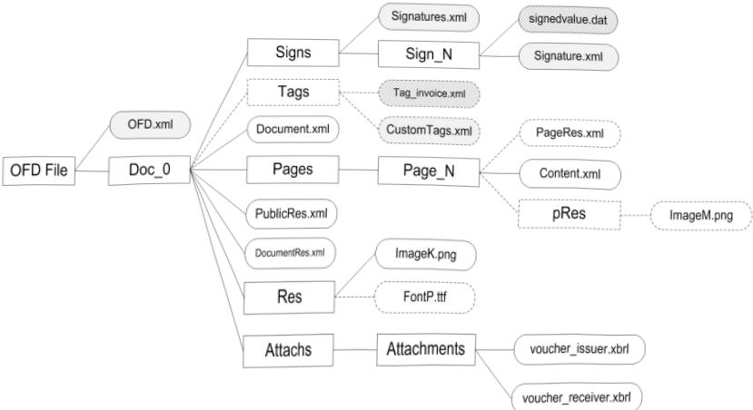
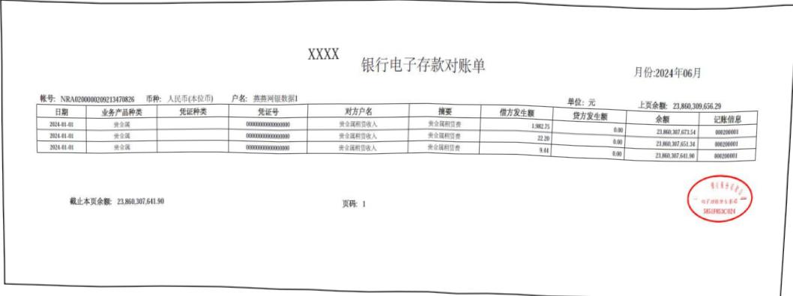
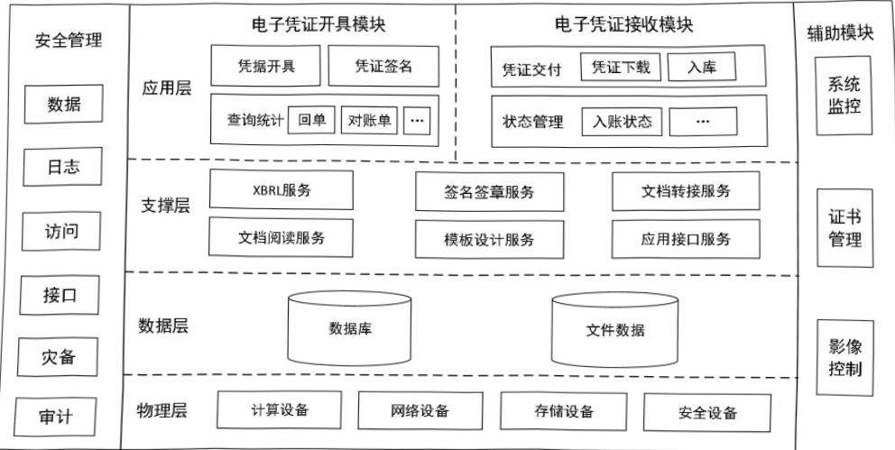
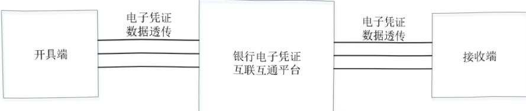

ICS 35.240.40CCS A 11

# 中华人民共和国金融行业标准

JR/T0288—2023

# 银行电子凭证技术规范

# Technical specification for bank electronic vouchers 

2023-07-25发布2023-07-25实施

中国人民银行发布

## 目次

II   
前言...  
  
1  
1范围..  
  
1  
2规范性引用文件..  
  
1  
3 术语和定义...  
  
2  
4缩略语.....  
  
2  
5电子凭证文件要求.  
  
4  
6数据与样式要求..  
  
11  
7系统逻辑框架..  
  
12  
8生成要求....  
  
12  
6通信传输要求..  
  
13  
10 安全要求...  
  
14  
11验证方法....  
  
17  
参考文献.....  

## 前言

本文件按照GB/T1.1—2020《标准化工作导则第1部分：标准化文件的结构和起草规则》的规定起草。

[T 

本文件由中国人民银行科技司提出。

本文件由全国金融标准化技术委员会（SAC/TC180）归口。

# 银行电子凭证技术规范

## 1 范围

本文件规定了银行电子凭证的文件、数据与样式、系统逻辑框架、生成、通信传输和安全要求，以及验证方法。

本文件适用于银行电子凭证数据实例与版式文件的开具、传输、接收和应用。

## 2 规范性引用文件

下列文件中的内容通过文中的规范性引用而构成本文件必不可少的条款。其中，注日期的引用文件，仅该日期对应的版本适用于本文件；不注日期的引用文件，其最新版本（包括所有的修改单）适用于本文件。

GB/T25500（所有部分）可扩展商业报告语言（XBRL）技术规范

GB/T27910金融服务信息安全指南

GB/T32010.1文献管理可移植文档格式第1部分：PDF1.7

GB/T 33190电子文件存储与交换格式版式文档

GB/T 35275信息安全技术SM2密码算法加密签名消息语法规范

GB/T 38540信息安全技术术安全电子签章密码技术规范

GB/T 38674信息安全技术应用软件安全编程指南

JR/T0071（所有部分）金融行业网络安全等级保护实施指引

JR/T 0124金融机构编码规范

IR/T 0171个人金融信息保护技术规范

IEC 61966-2-1:1999司多媒体系统与设备色彩测量和管理第2-1部分：色彩管理缺省RGB色彩空间sRGB(Multimedia systems and equipment—Colour measurement and management—Part 2-1:Colour management—Default RGB colour space—sRGB)

## 3 术语和定义

下列术语和定义适用于本文件。

### 3.1 

电子凭证 electronic voucher 

记录经济活动信息并作为记账凭证附件，具有安全保护机制的各类电子文件。

注：1.电子凭证包括发票、财政票据、客票、行程单、海关专用缴款书、银行回单和对账单等。

的合法性和有效性。

### 3.2 

银行回单bank receipt 

由银行提供、反映用户银行账户资金往来变动情况的一种文件。

### 3.3 

## 银行对账单 bank statement 

由银行提供、反映一段时期内用户银行账户资金往来变动明细的一种文件。

JR/T 0288—2023

### 3.4 

银行电子凭证开具端bank electronic voucher issuer 

开具银行电子凭证的银行。

### 3.5 

## 银行电子凭证接收端 bank electronic voucher receiver 

接收银行电子凭证的单位。

### 3.6 

## 版式 fixed layout 

将文本、图形、图像等多种数字内容对象按照一定规则进行版面固化呈现的一种文件格式。

### 3.7 

## 电子印章electronic seal 

一种由电子印章制章者数字签名的安全数据。

注：电子印章包括电子印章所有者信息和图形化内容的数据，用于安全签署电子文件。

[来源：GB/T38540，3.1]

### 3.8 

## 电子签章electronic seal signature 

使用电子印章签署电子文件的过程。

注：电子签章可实现与纸质文件盖章操作相似的可视效果，可保障数据来源的真实性、数据完整性以及签名人行为的不可否认性。

[来源：GB/T38540，3.2]

### 3.9 

## 电子签章数据 electronic seal signature data 

电子签章过程产生的包含电子印章、原文信息和数字签名等信息的数据。

[来源：GB/T38540，3.4]

### 3.10 

## 数字签名digitalsignature 

签名者使用私钥对待签名的杂凑值做密码运算得到的结果。

注：该结果只能用签名者的公钥进行验证，用于确认待签名数据的完整性、签名者身份的真实性和签名行为的抗抵赖性。

[来源：GM/T0054，3.10]

## 4 缩略语

下列缩略语适用于本文件。

下列缩略语适用子本文件。

API：应用程序接口（Application ProgrammingInterface)

HTTPS：安全的超文本传输协议（Hypertext TransferProtocol Secure)

OFD：开放式版式文档格式（OpenFixed-layout Documentformat)

PDF：便携式文档格式（Portable Document Format)

XBRL：可扩展商业报告语言（eXtensible Business Reporting Language)

## 电子凭证文件要求

### 5.1 通用要求

中

a）以版式文档形态交付、接收和归档。

，：一目仅了许并机认别处理目的细构化效后，且能够独立于软硬件平台进行显示或打印。

c）包含银行电子凭证开具端（以下简称开具端）或其委托方的签名或签章，签名或签章应作用于所在的版式文档。

d）采用可靠的技术处理保障机读与人读数据的一致性。

### 5.2 文件格式要求

银行电子凭证应选用公开的通用文档格式，在此基础上，根据银行电子凭证业务特点进行约束和裁剪，消除冗余并易于实现业务目标，具体要求如下。

a）宜采用GB/T33190规定的格式（即OFD格式）。

b）采用OFD格式的银行电子凭证文件，除外观应符合本文件指导的样式外，还应包含元数据、XBRL 会计数据、电子签章或数字签名。

c）1个文件内只包含1份银行电子凭证，不应使用文档组合功能。

d）宜包含该凭证的报文内容标引。

e）除文件格式规定的豁免内容之外，显示和打印所需的全部信息应包含在文件中。

f）不应使用加密选项。

g）不应使用版式文件的大纲、书签等导航功能。

h）不应使用动态元素，例如动画、音视频等。

### 5.3 数字签名和电子签章要求

数字签名和电子签章应符合GB/T33190中的相关要求，保证银行电子凭证版式文件全部内容的真实性、完整性，且应满足如下要求。

a）应用的电子签章或数字签名应满足如下要求。

——电子签章数据结构应符合GB/T38540的规定。

——数字签名数据结构应符合GB/T35275的规定。

b）电子印章区域应为银行电子凭证的验签触发区域。

c）数字签名和电子签章验签后应采用便于用户识别和校验的方式显示验证结果及重点细节。

d）应用的密码算法和技术必须符合国家密码主管部门的相关要求。

### 5.4 附件要求

银行电子凭证的会计数据（XBRL实例文件）应作为不可见附件嵌入到版式文档中。

银行对账单的会计数据附件文件名称固定为“bkrs_issuer_{日期}_{对账单唯一标识}.xml”。其中“{日期}”取值于表2中的“签发日期”，格式为“yyyymmdd”，{对账单唯一标识}由各签发机构自行编制。

银行回单的会计数据附件文件名称固定为“bker_issuer_{日期}_{回单唯一标识}.xml”。其中“{日期}”取值于表3中的“签发日期”，格式为“yyyymmdd”，{回单唯一标识}取值于表3中的“校验码”。

采用OFD的银行电子凭证，在主入口文件（OFD.xml）中应包含附件文件夹（Attachs），会计数据附件及附件列表（Attachments.xml）应包含在Attachs内。采用OFD的银行电子凭证的包内组织方式如图1所示。

注：1.方框表示文件夹，圆角矩形表示包内文件，实线边框表示必选（必须存在），虚线边框表示可选。2.斜线底纹表示该文件除OFD外，还应遵循其他标准。

图1采用OFD的银行电子凭证的包内组织方式

采用PDF格式的银行电子凭证，应采用附件（attachment）的方式将会计数据嵌入到文件中。会计数据嵌入PDF文件时，应对该文件使用压缩，压缩算法仅限Deflate算法。

注：Deflate算法是一种无损压缩算法，该算法将输入数据流分为多个块，并对每个块分别进行压缩。每个块都由1个3字节的头部和1个压缩数据块组成。头部包含了块的类型和块的长度信息。

## 6 数据与样式要求

### 6.1 数据类型

若无特殊说明的，开具端和银行电子凭证接收端（以下简称接收端）的数据描述所对应的数据类型如表1所示。

表1数据类型说明

<html><body><table border="1"><tbody><tr><td>数据类型</td><td>数据格式或含义说明</td></tr><tr><td>文本型</td><td>text</td></tr><tr><td>货币型</td><td>X</td></tr><tr><td>枚举型</td><td>E</td></tr><tr><td>布尔型</td><td>Y/N</td></tr><tr><td>日期型</td><td>yyyy-mm-dd</td></tr><tr><td>年月型</td><td>yyyy-mm</td></tr><tr><td>年份型</td><td>yyyy</td></tr><tr><td>时间型</td><td>hh:mm:ss</td></tr><tr><td></td><td>代表没有需要披露的信息，通常为表单中的标题等提示信息。</td></tr></tbody></table></body></html>

### 6.2 银行对账单

#### 6.2.1 通用信息项要求

银行对账单通用信息项的名称及约束见表2。

各信息项的描述必须遵循国家或行业主管部门的规定。

表2银行对账单通用信息项的名称及约束

<html><body><table border="1"><tbody><tr><td>命名 空间</td><td>标识符</td><td>数据类型</td><td>中文标签</td><td>英文标签</td><td>中文展示标签</td><td>英文展示标签</td><td>备注</td></tr><tr><td>bkrs</td><td>银行对账单信 息[摘要]</td><td>Information of bank reconciliation statement [abstract]</td><td>银行对账单信 息[摘要]</td><td>Information of bank reconciliation statement [abstract]</td><td></td><td>Information OfBankRecon ciliationSt atementAbst ract</td><td></td></tr><tr><td>对账单抬头信 息[摘要]</td><td>Header information of bank reconciliation statement [abstract]</td><td>对账单抬头信 息[摘要]</td><td>Header information of bank reconciliation statement [abstract]</td><td></td><td>bkrs</td><td>HeaderInfor mationOfBan kReconcilia tionStateme ntAbstract</td><td></td></tr><tr><td>bkrs</td><td>Identificat ionCodeOfIs suer</td><td>文本型</td><td>签发机构</td><td>Identification code of issuer</td><td>签发机构</td><td>Identification code of issuer</td><td>应符合JR/T 0124关于金 融机构编码 的规定（编 码长度为14 位）。</td></tr><tr><td>bkrs</td><td>NumberOfBan kBranch</td><td>文本型</td><td>营业网点编号</td><td>Number of bank branch</td><td>营业网点编号</td><td>Number of bank branch</td><td>客户账户归 属的银行网 点号。</td></tr><tr><td>文本型</td><td>币种</td><td>Currency</td><td>币种</td><td>Currency</td><td>采用3位国标 编码，每份对 账单只针对1 类币种。</td><td>bkrs</td><td>Currency</td></tr><tr><td>文本型</td><td>客户结算账号</td><td>Customer settlement bank account</td><td>客户账号</td><td>Customer bank account</td><td></td><td>bkrs</td><td>CustomerSet tlementBank Account</td></tr><tr><td>文本型</td><td>客户账户名称</td><td>Name of customer account</td><td>客户账户名称</td><td>Name of customer account</td><td></td><td>bkrs</td><td>NameOfCusto merAccount</td></tr><tr><td>文本型</td><td>银行客户编码</td><td>Code of bank customer</td><td>客户号</td><td>Number of customer</td><td></td><td>bkrs</td><td>CodeOfBankC ustomer</td></tr><tr><td>Year of bank reconciliation statement</td><td>年份</td><td>Year</td><td></td><td>bkrs</td><td>YearOfBankR econciliati onStatement</td><td>年份型</td><td>银行对账单年 份</td></tr><tr><td>Month of bank reconciliation statement</td><td>月份</td><td>Month</td><td></td><td>bkrs</td><td>MonthOfBank Reconciliat ionStatemen t</td><td>文本型</td><td>银行对账单月 份</td></tr><tr><td>Print times</td><td>打印次数</td><td>Print times</td><td>对账单打印 次数合计。</td><td>bkrs</td><td>PrintTimes</td><td>文本型</td><td>打印次数</td></tr><tr><td>bkrs</td><td>PrintDate</td><td>Print date</td><td>打印日期</td><td>Print date</td><td></td><td>日期型</td><td>打印日期</td></tr><tr><td>bkrs</td><td>Information OfReconcile DetailsAbst ract</td><td></td><td>对账明细信息 [摘要]</td><td>Information of reconcile details [abstract]</td><td>对账明细信息 [摘要]</td><td>Information of reconcile details [abstract]</td><td></td></tr></tbody></table></body></html>

表2银行对账单通用信息项的名称及约束（续)

<html><body><table border="1"><thead><tr><td>命名 空间</td><td>标识符</td><td>数据类型</td><td>中文标签</td><td>英文标签</td><td>中文展示标签</td><td>英文展示标签</td><td>备注</td></tr></thead><tbody><tr><td>bkrs</td><td>对账明细信息 [元组]</td><td>Information of reconcile details [tuple]</td><td>对账明细信息 [元组]</td><td>Information of reconcile details [tuple]</td><td></td><td>Information OfReconcile DetailsTupl e</td><td></td></tr><tr><td>bkrs</td><td>DateOfBookk eeping</td><td>日期型</td><td>记账日期</td><td>Date of bookkeeping</td><td>记账日期</td><td>Date of bookkeeping</td><td></td></tr><tr><td>bkrs</td><td>TypesOfBusi nessProduct S</td><td>文本型</td><td>业务产品种类</td><td>Types of business products</td><td>业务产品种类</td><td>Types of business products</td><td>区分业务种 类，例如现 金、转账、发 报、银税、数 字人民币等。</td></tr><tr><td>bkrs</td><td>BusinessSer ialNumber</td><td>文本型</td><td>业务流水号</td><td>Business serial number</td><td>业务流水号</td><td>Business serial number</td><td>交易的唯一 单号。</td></tr><tr><td>bkrs</td><td>TypeOfSourc eDocument</td><td>文本型</td><td>原始凭证种类</td><td>Type of source document</td><td>原始凭证种类</td><td>Type of source document</td><td>例如051-支 票等。</td></tr><tr><td>bkrs</td><td>NumberOfSou rceDocument</td><td>文本型</td><td>原始凭证号码</td><td>Number of source document</td><td>原始凭证号码</td><td>Number of source document</td><td>例如支票号 码等。</td></tr><tr><td>bkrs</td><td>Notes</td><td>文本型</td><td>银行电子回单 信息摘要</td><td>Notes</td><td>摘要</td><td>Notes</td><td></td></tr><tr><td>bkrs</td><td>Identificat ionOfCredit OrDebit</td><td>文本型</td><td>借贷标志</td><td>Identification of credit or debit</td><td>借贷标志</td><td>Identification of credit or debit</td><td>标记每条会 计分录的借 贷方向，其中 0代表借方，1 代表贷方。</td></tr><tr><td>bkrs</td><td>Transaction Amount</td><td>货币型</td><td>交易金额</td><td>Transaction amount</td><td>交易金额</td><td>Transaction amount</td><td></td></tr><tr><td>bkrs</td><td>DebitorCred itOfBalance</td><td>文本型</td><td>余额方向</td><td>Debit or credit of balance</td><td>余额方向</td><td>Debit or credit of balance</td><td>标记余额的 借贷方向，其 中0代表借 方，1代表贷 方。</td></tr><tr><td>bkrs</td><td>AccountBala nce</td><td>货币型</td><td>账户余额</td><td>Account balance</td><td>账户余额</td><td>Account balance</td><td></td></tr><tr><td>bkrs</td><td>Transaction Code</td><td>文本型</td><td>交易代码</td><td>Transaction code</td><td>交易代码</td><td>Transaction code</td><td></td></tr><tr><td>bkrs</td><td>AccountOfCo unterparty</td><td>文本型</td><td>对方账号</td><td>Account of counterparty</td><td>对方账号</td><td>Account of counterparty</td><td></td></tr><tr><td>bkrs</td><td>NameOfCount erparty</td><td>文本型</td><td>对方户名</td><td>Name of counterparty</td><td>对方户名</td><td>Name of counterparty</td><td></td></tr><tr><td>bkrs</td><td>DepositoryB ankOfCounte rparty</td><td>文本型</td><td>对方开户行</td><td>Depository bank of counterparty</td><td>对方开户行</td><td>Depository bank of counterparty</td><td>交易对手方 开户行名称。</td></tr><tr><td>bkrs</td><td>Bookkeeper</td><td>文本型</td><td>记账柜员</td><td>Bookkeeper</td><td>记账柜员</td><td>Bookkeeper</td><td></td></tr><tr><td>bkrs</td><td>TimeOfBookk eeping</td><td>时间型</td><td>记账时间</td><td>Time of bookkeeping</td><td>记账时间</td><td>Time of bookkeeping</td><td></td></tr><tr><td>bkrs</td><td>JournalAcco untOfBookke eping</td><td>文本型</td><td>记账流水</td><td>Journal account of bookkeeping</td><td>记账流水</td><td>Journal account of bookkeeping</td><td></td></tr></tbody></table></body></html>

表2银行对账单通用信息项的名称及约束（续）

<html><body><table border="1"><tbody><tr><td>命名 空间</td><td>中文标签</td><td>英文标签</td><td>中文展示标签</td><td>英文展示标签</td><td>备注</td><td>标识符</td><td>数据类 型</td></tr><tr><td>Other accounting information</td><td>其他记账信息</td><td>Other accounting information</td><td>除记账柜员、 时间、流水以 外的其他记 账信息。</td><td>bkrs</td><td>OtherAccoun tingInforma tion</td><td>文本型</td><td>其他记账信息</td></tr><tr><td>bkrs</td><td>NumberOfBan kElectronic Receipt</td><td>文本型</td><td>银行电子回单 编号</td><td>Number of bank electronic receipt</td><td>回单编号</td><td>Receipt number</td><td></td></tr><tr><td>bkrs</td><td>Information OfBalanceAt TheEndOfRec onciliation CycleAbstra ct</td><td></td><td>对账周期末信 息[摘要]</td><td>Information of balance at the end of reconciliation cycle [abstract]</td><td>对账周期末信 息[摘要]</td><td>Information of balance at the end of reconciliation cycle [abstract]</td><td></td></tr><tr><td>bkrs</td><td>AccountBala nceAtTheEnd OfReconcili ationCycleA mount</td><td>货币型</td><td>对账周期末账 户余额(额度)</td><td>Account balance at the end of reconciliation cycle (amount)</td><td>对账周期末账 户余额（额度）</td><td>Account balance at the end of reconciliation cycle (amount)</td><td></td></tr><tr><td>bkrs</td><td>ReserveBala nceAtTheEnd OfReconcili ationCycle</td><td>货币型</td><td>对账周期末保 留余额</td><td>Reserve balance at the end of reconciliation cycle</td><td>对账周期末保 留余额</td><td>Reserve balance at the end of reconciliation cycle</td><td></td></tr><tr><td>bkrs</td><td>FrozenBalan ceAtTheEnd0 fReconcilia tionCycle</td><td>货币型</td><td>对账周期末冻 结余额</td><td>Frozen balance at the end of reconciliation cycle</td><td>对账周期末冻 结余额</td><td>Frozen balance at the end of reconciliation cycle</td><td></td></tr><tr><td>bkrs</td><td>OverdraftBa lanceAtEnd0 fReconcilia tionCycle</td><td>货币型</td><td>对账周期末透 支余额</td><td>Overdraft balance at end of reconciliation cycle</td><td>对账周期末透 支余额</td><td>Overdraft balance at end of reconciliation cycle</td><td></td></tr><tr><td>bkrs</td><td>AvailableBa lanceAtTheE ndOfReconci liationCycl eAmount</td><td>货币型</td><td>对账周期末可 用余额(额度)</td><td>Available balance at the end of reconciliation cycle (amount)</td><td>对账周期末可 用余额（额度）</td><td>Available balance at the end of reconciliation cycle ( amount)</td><td></td></tr></tbody></table></body></html>

#### 6.2.2 版面显示要求

银行可根据交易内容对银行对账单样式进行调整,但应确保版面上展现接收端人工处理时必要的数据元素，具体要求如下。

a）银行对账单的版面规格为A4幅面尺寸或A5幅面尺寸。

b）单页最多包含30条交易数据。

Ta 

d）文字颜色为黑色（RGB值为#000000）。

e）具有明显代表银行电子凭证开具端的名称或标识。

注：RGB颜色是一种用于电子设备中的加色模式，其标准由国际电工委员会（InternationalElectrotechnical Commission，IEC）定义和维护。IEC在IEC61966-2-1-1999中定义了基于RGB颜色空间的标准色彩规范。通过对红（R）、绿（G）、蓝（B）3个颜色通道的变化以及相互之间的叠加来得到各式各样的颜色。

典型银行电子对账单样式见图2。

图2典型银行电子对账单样式

### 6.3 银行回单

#### 6.3.1 通用信息项要求

银行回单通用信息项的名称及约束见表3。各信息项的描述必须遵循国家或行业主管部门的规定。

表3银行回单通用信息项的名称及约束

<html><body><table border="1"><tr><td>命名 空间</td><td>标识符</td><td>数据类 型</td><td>中文标签</td><td>英文标签</td><td>中文展示标签</td><td>英文展示标签</td><td>备注</td></tr><tr><td>bker</td><td>IssuerInfor mationOfBan kElectronic ReceiptAbst ract</td><td>—</td><td>银行电子回 单开具端信 息[摘要]</td><td>Issuer information of bank electronic receipt [abstract]</td><td>银行电子回单 开具端信息 [摘要]</td><td>Issuer information of bank electronic receipt [abstract]</td><td></td></tr><tr><td>bker</td><td>HeaderInfor mationOfRec eiptAbstrac t</td><td></td><td>回单抬头信 息[摘要]</td><td>Header information of receipt [abstract]</td><td>回单抬头信息 [摘要]</td><td>Header information of receipt [abstract]</td><td></td></tr><tr><td>bker</td><td>Identifying Code</td><td>文本型</td><td>校验码</td><td>Identifying code</td><td>校验码</td><td>Identifying code</td><td>校验码由银行 电子回单签发 机构、回单编 号和校验位共 同构成，作为 银行电子回单 的唯一识别。</td></tr><tr><td>bker</td><td>NumberOfBan kElectronic Receipt</td><td>文本型</td><td>银行电子回 单编号</td><td>Number of bank electronic receipt</td><td>回单编号</td><td>Receipt number</td><td>同一签发机构 内回单编号唯 一。</td></tr><tr><td>bker</td><td>TypeOfBankE lectronicRe ceipt</td><td>文本型</td><td>银行电子回 单类型</td><td>Type of bank electronic receipt</td><td>回单类型</td><td>Receipt type</td><td>回单类型需自 定义，例如普 通回单、计息 回单等。</td></tr><tr><td>bker</td><td>Identificat ionCodeOfIs suer</td><td>文本型</td><td>签发机构</td><td>Identification code of issuer</td><td>签发机构</td><td>Identification code of issuer</td><td>应符合JR/T 0124关于金融 机构编码的规 定（编码长度 为14位）。</td></tr></table></body></html>

表3银行回单通用信息项的名称及约束（续)

<html><body><table border="1"><tbody><tr><td>命名 空间</td><td>标识符</td><td>数据类型</td><td>中文标签</td><td>英文标签</td><td>中文展示标 签</td><td>英文展示标 签</td><td>备注</td></tr><tr><td>bker</td><td>IssueDate</td><td>日期型</td><td>签发日期</td><td>Issue date</td><td>签发日期</td><td>Issue date</td><td></td></tr><tr><td>bker</td><td>DetailedInform ationOfReceipt Abstract</td><td></td><td>回单详细信息 [摘要]</td><td>Detailed information of receipt [abstract]</td><td>回单详细信 息[摘要]</td><td>Detailed information of receipt [abstract]</td><td></td></tr><tr><td>bker</td><td>Identification OfCreditorDebi t</td><td>文本型</td><td>借贷标志</td><td>Identification of credit or debit</td><td>借贷标志</td><td>Identificat ion of credit or debit</td><td>借贷标志中0 代表借方，1代 表贷方。</td></tr><tr><td>bker</td><td>Identification OfCashOrTransf er</td><td>文本型</td><td>现转标志</td><td>Identification of cash or transfer</td><td>现转标志</td><td>Identificat ion of cash or transfer</td><td>现转标志中0 代表现金，1代 表转账。</td></tr><tr><td>bker</td><td>DateOfBookkeep ing</td><td>日期型</td><td>记账日期</td><td>Date of bookkeeping</td><td>记账日期</td><td>Date of bookkeeping</td><td></td></tr><tr><td>bker</td><td>TimeOfBookkeep ing</td><td>时间型</td><td>记账时间</td><td>Time of bookkeeping</td><td>记账时间</td><td>Time of bookkeeping</td><td></td></tr><tr><td>bker</td><td>Bookkeeper</td><td>文本型</td><td>记账柜员</td><td>Bookkeeper</td><td>记账柜员</td><td>Bookkeeper</td><td></td></tr><tr><td>bker</td><td>JournalAccount OfBookkeeping</td><td>文本型</td><td>记账流水</td><td>Journal account of bookkeeping</td><td>记账流水</td><td>Journal account of bookkeeping</td><td></td></tr><tr><td>bker</td><td>Currency</td><td>文本型</td><td>币种</td><td>Currency</td><td>币种</td><td>Currency</td><td></td></tr><tr><td>bker</td><td>TransactionAmo untInFigures</td><td>货币型</td><td>小写金额</td><td>Transaction amount in figures</td><td>小写金额</td><td>Transaction amount in figures</td><td></td></tr><tr><td>bker</td><td>TypeOfSourceDo cument</td><td>文本型</td><td>原始凭证种类</td><td>Type of source document</td><td>原始凭证种 类</td><td>Type of source document</td><td>原始凭证种类 需自定义，例如 支票、本票、银 行承兑汇票等。</td></tr><tr><td>bker</td><td>NumberOfSource Document</td><td>文本型</td><td>原始凭证号码</td><td>Number of source document</td><td>原始凭证号 码</td><td>Number of source document</td><td></td></tr><tr><td>bker</td><td>BusinessProduc tType</td><td>文本型</td><td>业务（产品） 种类</td><td>Business (product) type</td><td>业务(产品) 种类</td><td>Business (product) type</td><td></td></tr><tr><td>bker</td><td>BusinessSerial Number</td><td>文本型</td><td>业务流水号</td><td>Business serial number</td><td>业务流水号</td><td>Business serial number</td><td></td></tr><tr><td>bker</td><td>TransactionCod e</td><td>文本型</td><td>交易代码</td><td>Transaction code</td><td>交易代码</td><td>Transaction code</td><td></td></tr><tr><td>bker</td><td>ChannelType</td><td>文本型</td><td>渠道</td><td>Channel type</td><td>渠道</td><td>Channel type</td><td></td></tr><tr><td>bker</td><td>Usage</td><td>文本型</td><td>用途</td><td>Usage</td><td>用途</td><td>Usage</td><td>—</td></tr><tr><td>bker</td><td>Notes</td><td>文本型</td><td>附言</td><td>Notes</td><td>附言</td><td>Notes</td><td></td></tr><tr><td>bker</td><td>InformationOfP ayerAbstract</td><td></td><td>付款人信息 [摘要]</td><td>Information of payer [abstract]</td><td>付款人信息 [摘要]</td><td>Information of payer [abstract]</td><td></td></tr><tr><td>bker</td><td>AccountNameOfP ayer</td><td>文本型</td><td>付款人户名</td><td>Account name of payer</td><td>付款人户名</td><td>Account name of payer</td><td>当借贷标志是 “借方”时，应 填报付款人户</td></tr></tbody></table></body></html>

表3银行回单通用信息项的名称及约束（续)

<html><body><table border="1"><tbody><tr><td>命名 空间</td><td>标识符</td><td>数据类 型</td><td>中文标签</td><td>英文标签</td><td>中文展示标签</td><td>英文展示标签</td><td>备注</td></tr><tr><td>bker</td><td>AccountNumb erOfPayer</td><td>付款人账号</td><td>Account number of payer</td><td>付款人账号</td><td>当借贷标志 是“借方”时， 应填报付款 人账号信息。</td><td>文本型</td><td>Account number of payer</td></tr><tr><td>bker</td><td>OpeningBank OfPayer</td><td>文本型</td><td>付款人开户 行</td><td>Opening bank of payer</td><td>付款人开户行</td><td>Opening bank of payer</td><td>当借贷标志 是“借方”时， 应填报付款 人开户行信 息。</td></tr><tr><td>bker</td><td>Information OfPayeeAbst ract</td><td></td><td>收款人信息 [摘要]</td><td>Information of payee [abstract]</td><td>收款人信息 [摘要]</td><td>Information of payee [abstract]</td><td></td></tr><tr><td>bker</td><td>AccountName OfPayee</td><td>文本型</td><td>收款人户名</td><td>Account name of payee</td><td>收款人户名</td><td>Account name of payee</td><td>当借贷标志 是“贷方”时， 应填报收款 人户名信息。</td></tr><tr><td>bker</td><td>AccountNumb erOfPayee</td><td>文本型</td><td>收款人账号</td><td>Account number of payee</td><td>收款人账号</td><td>Account number of payee</td><td>当借贷标志 是“贷方”时， 应填报收款 人账号信息。</td></tr><tr><td>bker</td><td>OpeningBank OfPayee</td><td>文本型</td><td>收款人开户 行</td><td>Opening bank of payee</td><td>收款人开户行</td><td>Opening bank of payee</td><td>当借贷标志 是“贷方”时， 应填报收款 人开户行信 息。</td></tr><tr><td>bker</td><td>Information OfRecipient Abstract</td><td></td><td>回单接收人 信息[摘要]</td><td>Information of recipient [abstract]</td><td>回单接收人信 息[摘要]</td><td>Information of recipient [abstract]</td><td></td></tr><tr><td>bker</td><td>AccountNumb erOfRecipie nt</td><td>文本型</td><td>回单接收人 账号</td><td>Account number of recipient</td><td>回单接收人账 号</td><td>Account number of recipient</td><td>回单接收人 账号用于规 定其他回单 接收人，例如 集团公司。</td></tr><tr><td>bker</td><td>Identificat ionNumberOf Recipient</td><td>文本型</td><td>回单接收人 证件号码</td><td>Identification number of recipient</td><td>回单接收人证 件号码</td><td>Identification number of recipient</td><td>回单接收人 证件号码用 于规定其他 回单接收人， 个人客户以 自然人为单 位，与相关管 理部门规定 的证件类型 保持一致；对 公客户为统 一社会信用 代码。</td></tr></tbody></table></body></html>

对通用信息项进行扩展应符合如下要求。

#### 6.3.2 扩展信息项要求

a）新增的信息项不应与通用信息项重名或含义相同，其在XBRL文件和版式文件中应遵循统一的命名方式。

b）对于新增的信息项，应定义其标识符、信息项名称、数据类型、长度、是否为必填项和说明等。

c）使用新增信息项时不应排除已定义的通用信息项。

d）XBRL文件扩展必须遵循相关管理部门关于会计信息化的要求及GB/T25500（所有部分）的相关要求。

#### 6.3.3 版面显示要求

各银行可根据交易内容对银行回单样式进行调整，但应确保版面上展现接收端人工处理时必要的数据元素，具体要求如下。

a）银行回单的版面规格为A4幅面尺寸或A5幅面尺寸。

b）银行回单中各元素名称可使用11磅（pt）的“宋体”字型。

c）文字颜色为黑色（RGB值为#000000）。

d）有明显的代表开具银行的名称或标识。

## 7 系统逻辑框架

### 7.1 定义和描述

本文件规范银行电子凭证开具和接收系统、银行电子凭证互联互通平台的逻辑框架。银行电子凭证开具和接收系统实现电子凭证开具、接收、管理等功能。银行电子凭证互联互通平台为行业级公共服务系统，按照“共建、共享、共用”原则打造，是连接开具端与接收端的电子凭证转接枢纽和交换通道。

### 7.2 银行电子凭证开具和接收系统逻辑框架

银行电子凭证开具和接收系统逻辑框架见图3。

图3银行电子凭证开具和接收系统逻辑框架

银行电子凭证开具和接收系统逻辑框架中，各组成部分的要求如下。

a）银行电子凭证开具和接收系统应在数据、日志、访问、接口、灾备、审计等方面具备本文件要求的安全管理功能。

b）银行电子凭证开具和接收系统应具有系统监控、证书管理、影像控制等辅助模块。

c）银行电子凭证开具和接收系统的物理层应包括计算设备、网络设备、存储设备、安全设备等。d）银行电子凭证开具和接收系统的数据层应同时支持对结构化数据和非结构化数据的管理。

e）银行电子凭证开具和接收系统的支撑层应包括XBRL服务、签名签章服务、文档转换服务、文档阅读服务、模板设计服务、应用接口服务等。

f）银行电子凭证开具和接收系统的应用层应实现凭证开具、接收入库、查询统计、状态管理等功能。

### 7.3 银行电子凭证互联互通平台逻辑框架

银行电子凭证互联互通平台提供银行电子凭证系统互联、凭证流转、真伪核验、业务协同等功能，有利于避免各金融机构尤其是中小银行重复开发银行电子凭证传输接口，减少机构多头连接，降低信息系统建设运维成本。

银行电子凭证互联互通平台作为行业级公共服务系统，可开具的银行电子凭证范围包括银行对账单与银行回单，后续还可增加开具其他符合相关管理部门关于电子凭证会计数据要求的电子凭证。银行回单、对账单等银行凭证电子化后，开具端与接收端经由银行电子凭证互联互通平台统一进行信息交互。该系统实现银行电子凭证开具转接、查询转接、查验转接等功能。银行电子凭证互联互通平台逻辑框架见图4。

图4银行电子凭证互联互通平台逻辑框架

银行电子凭证互联互通平台逻辑框架说明如下。

a）银行电子凭证互联互通平台支持开具端和接收端进行电子凭证信息交互。

b）银行电子凭证互联互通平台应提供查询凭证开具转接、查询转接、查验转接等功能。

## 8 生成要求

### 8.1 凭证生成

银行电子凭证中的会计数据及其版式文件应由各银行生成，或由其受委托方代理生成。

### 8.2 生成处理

银行电子凭证中应包含5.4规定的会计数据，且会计数据应以不可见$(\mathrm{V i s i b l e}=\mathrm{f a l s e})$ ）附件方式嵌入银行电子凭证中。

## 9 通信传输要求

开具端应支持专线、虚拟专用网络（VPN）等接入方式，通过API接口或其他形式完成银行电子凭证的交付。其中，API接口应基于HTTPS安全协议且满足令牌（token）鉴权保证可信源等安全设计要求。

传输的银行电子凭证应按照统一的命名规则命名，支持按行别在客户端自动建立目录，具体命名规则如下。

a）单个银行电子凭证文件命名规则为“行别+业务种类+凭证编号+账号+币种+凭证生成时间+自定义内容”。

b）批量银行电子凭证压缩包文件命名规则为“行别+业务种类+账号+币种+凭证生成时间+自定义内容”。

银行电子凭证网络传输文件命名规则说明见表4。

表4银行电子凭证网络传输文件命名规则说明

<html><body><table border="1"><tr><td>组成部分</td><td>说明</td><td>取值示例</td></tr><tr><td>行别</td><td>各家银行总行金融机构编码对应的中文简称。</td><td></td></tr><tr><td>业务种类(3位)</td><td>业务种类支持扩展延伸。</td><td>001-回单；002-对账单</td></tr></table></body></html>

## 10 安全要求

### 10.1 安全技术要求

#### 10.1.1 数据安全

银行电子凭证开具和接收系统及银行电子凭证互联互通平台应从电子凭证会计数据采集、传输、存储、使用、删除、销毁等方面建立全生命周期防护措施，包括但不限于以下内容。

a）符合GB/T27910和JR/T0171的相关要求，确保电子凭证会计数据流转过程中的隐私数据安全。

b）建立健全数据安全组织架构，明确信息传输、数据流转过程中的数据安全要求，保障银行电子凭证开具和接收系统及银行电子凭证互联互通平台的数据安全。

#### 10.1.2 接口安全

银行电子凭证开具和接收系统及银行电子凭证互联互通平台的接口安全要求应满足以下要求。

a）采用安全的接口协议，保证接口之间交互数据的完整性。

b）采用国家密码管理部门认可的密码算法和加密技术，实现接口之间交互数据的保密性。

c）各接口之间进行通信时，应通过身份验证机制相互验证对方的可信性，确保可信连接。

d）接入银行电子凭证互联互通平台的开具端和接收端必须符合国家或行业管理部门关于接口的相关要求并遵循GB/T38674关于代码编写安全的相关要求。

#### 10.1.3 数字签名

银行电子凭证开具和接收系统及银行电子凭证互联互通平台应使用数字签名技术和（或）电子印章技术查验银行电子凭证真实性，建立完整可控的签名和验签机制，包括但不限于以下内容。

a）开具端在输出银行电子凭证时应添加数字签名及电子签章，防止银行电子凭证被篡改。

b）多方填制的银行电子凭证应按照“一次填制，一次签名”操作方式，确保签名人在签名时实质控制签名本身及被签名的内容，在填制后立刻签名，防范数据在传输和签名过程中被篡改。

c）使用数字签名要保证证书信任链完整，其中公钥所有者应通过第三方专业机构等签发的证书证明公钥真实性。

#### 10.1.4 环境安全

银行电子凭证开具和接收系统及银行电子凭证互联互通平台应实施环境安全管理，措施包括但不限于以下内容。

a）保障银行电子凭证开具和接收系统及银行电子凭证互联互通平台全流程运行环境安全，例如银行电子凭证签名验证、数字证书信任链等环境。

b）运行环境应符合JR/T0071（所有部分）的相关要求。

c）定期检查运行环境的第三方接口、第三方依赖库，保障银行电子凭证开具、接收所依赖框架和库函数的安全。

d）保障运行环境相关配置信息的数据安全，防止泄露或恶意修改。

### 10.2 安全管理要求

#### 10.2.1 运维安全

银行电子凭证开具和接收系统及银行电子凭证互联互通平台应实施运维安全管理，应符合JR/T 0071（所有部分）的相关要求，具体措施包括但不限于以下内容。

a）银行电子凭证开具和接收系统及银行电子凭证互联互通平台能对运维管理过程中的重要活动及其责任人进行记录。

b）对银行电子凭证开具和接收系统及银行电子凭证互联互通平台开发过程中的计划、交付、关键路径、风险及其相关人进行记录。

#### 10.2.2 访问安全

银行电子凭证开具和接收系统及银行电子凭证互联互通平台应实施访问管理，规范主客体间的访问行为，具体措施包括但不限于以下内容。

a）银行电子凭证开具和接收系统及银行电子凭证互联互通平台的网络、主机、应用访问控制管理，应符合JR/T0071（所有部分）的相关要求。

b）结合业务需求定义银行电子凭证开具和接收系统及银行电子凭证互联互通平台的用户访问控制策略，具体策略包括但不限于以下内容。

—一根据用户权限对银行电子凭证开具和接收系统及银行电子凭证互联互通平台的数据资源进行访问控制，和对计算资源进行分配。

一一用户身份鉴别机制，银行电子凭证开具和接收系统及银行电子凭证互联互通平台具有用户身份验证功能，有效辨识用户角色，防止恶意用户窃取或篡改数据和签名证书。

-一重要事件的记录，例如签名证书使用、银行电子凭证开具等，银行电子凭证开具和接收系统及银行电子凭证互联互通平台根据用户的唯一标识对其访问、写入数据等行为进行记录。

#### 10.2.3 灾备安全

银行电子凭证开具和接收系统及银行电子凭证互联互通平台应符合JR/T0071（所有部分）的相关要求并实施灾备管理，提供合理的保障措施，确保银行电子凭证开具和接收系统及银行电子凭证互联互通平台发生灾难或者系统错误时操作的连续性。

#### 10.2.4 过程审计

银行电子凭证开具和接收系统及银行电子凭证互联互通平台应在技术实施过程中按照JR/T0071（所有部分）的相关要求实施内部过程审计，保留运行数据，配合审计工作，开展定期审查。

#### 10.2.5 日志安全

银行电子凭证开具和接收系统及银行电子凭证互联互通平台实施日志管理，提供审计依据，包括但不限于以下内容。

a）银行电子凭证开具和接收系统及银行电子凭证互联互通平台记录系统运行日志，包括但不限于以下内容。

—一记录系统信息，包含会计数据、证书信息、信息流转过程、所操作的软硬件环境信息、使用者的名字等。

记录事件日志，包含日期和时间、类型、源（终端、端口、地点、客户等）、日志等级等信息。

b）银行电子凭证开具和接收系统及银行电子凭证互联互通平台的日志定期进行归档，采用加密等方式进行存储，周期性审查日志的完整性，并对异常、未授权或可疑活动进行识别和跟踪。

## 11 验证方法

### 11.1 电子文件要求的验证

#### 11.1.1 通用要求

按照被验证系统的操作手册或其他材料，以取值范围内外的各参数调用并下载开具的银行电子凭证。调用参数在取值范围内应获取成功，调用参数在取值范围外应作合理提示。获取成功后按照11.1.2至11.1.4的要求进行验证。

#### 11.1.2 文件格式要求

宜使用GB/T25500、GB/T32010.1、GB/T33190等标准对应的电子文件验证工具确认格式及内容是否满足要求，不应仅凭文件后缀名进行判断。

#### 11.1.3 数字签名和电子签章要求

宜使用GB/T35275、GB/T38540等标准对应的电子文件验证工具验证银行电子凭证中的数字签名和电子签章数据格式及内容是否满足要求。

#### 11.1.4 附件要求

若银行电子凭证使用OFD格式，宜使用GB/T33190对应的文件验证工具验证其是否包含符合5.4且设置为不可见的附件，提取附件并核对其内容是否符合5.4中相应的要求。

若银行电子凭证使用PDF格式，宜使用专业版PDF阅读器验证其附件列表中是否包含符合5.4要求名称的附件，提取附件并核对其内容是否符合5.4中相应的要求。

### 11.2 数据与样式要求的验证

#### 11.2.1 银行对帐单

按照11.1.4提取银行电子凭证的附件内容，验证其内容中出现的节点名称及取值是否符合6.2.1中表2的要求。

用取得GB/T33190符合性测试报告的版式文档阅读软件打开银行电子凭证，验证其显示、打印预览和打印后是否符合6.2.2的要求。

#### 11.2.2 银行回单

按照11.1.4提取银行电子凭证的附件内容，验证其内容中出现的节点名称及取值是否符合6.3.1中表3的要求。若节点名称在表3中未出现，验证其是否按照6.3.2中不应与已有信息项重复定义、不排除已有信息项等要求。

用取得GB/T33190符合性测试报告的版式文档阅读软件打开银行电子凭证，验证其显示、打印预览和打印后是否符合6.3.3的要求。

### 11.3 框架要求的验证

#### 11.3.1 业务架构

审查银行电子凭证开具和接收系统及银行电子凭证互联互通平台的设计文档、用户应用报告等。设计文档应详细说明银行电子凭证开具、接收、转接等的实现方式和查验方法，报告中的结论应佐证设计文档中说明的情况。

#### 11.3.2 技术架构

审查银行电子凭证开具和接收系统及银行电子凭证互联互通平台的设计文档、采购合同、验收报告、评级报告等相关资料。对照技术架构要求逐项检查设计文档中是否有描述，以及其他材料中的内容是否可提供佐证。

示例：针对7.2中e）项的要求，可进行如下检查。

a）设计文档中是否存在关于XBRL服务、签名签章服务、文档转换服务、文档阅读服务、模板设计服务、应用接口服务的组件或模块描述。

b）系统中电子凭证开具、校验功能的实现方案中是否存在对支撑层组件的关联描述。

c）验收报告中是否确认关联了支撑层组件的功能运行正常。

d）支撑层组件如采用外部协作方式，是否有采购合同或合作协议支持，被采购产品是否具有标准符合性检测报告或提供单位是否具有该项能力证明。

e）支撑层组件如自行研制，相关软件模块是否取得软件登记证书、标准符合性检测报告等。

### 11.4 生成要求的验证

#### 11.4.1 凭证生成

验证银行电子凭证中数字签名和电子签章关联的证书是否是银行或者是受银行委托方的证书。

#### 11.4.2 生成处理

容的一致性，抽样数不少于100例。按照11.1.4规定的方法验证，并通过随机抽样法验证附件中内容与凭证的显示效果或打印效果中内

JR/T 0288—2023

### 11.5 通信传输要求的验证

验证银行电子凭证开具和接收系统及银行电子凭证互联互通平台的设计文档、用户应用报告等。设计文档应详细说明通过专线、虚拟专用网络（VPN）等接入方式，通过API接口或其他形式交付银行电子凭证的实现方式和验证方法，报告中的结论应佐证设计文档中说明的情况。中对于API接口交付方式，被验证系统设计文档、用户应用报告应支持“基于HTTPS安全协议且满足令牌（token）鉴权保证可信源等安全设计要求”结论。按照被验证系统的操作手册或其他材料，抽样下载或测试推送银行电子凭证，观察下载或推送是否在客户端形成文件夹，且其中文件的命名是否符合第9章的要求。抽样数不少于100例。

### 11.6 安全要求的验证

#### 11.6.1 安全技术要求的验证

按照GB/T27910、GB/T 38674和JR/T0171等对应的验证方法进行验证。

#### 11.6.2 安全管理要求的验证

按照JR/T0171对应的验证方法进行验证。

## 参考文献

[1]GB/T7408数据元和交换格式信息交换日期和时间表示法[2]GM/T0054信息系统密码应用基本要求
