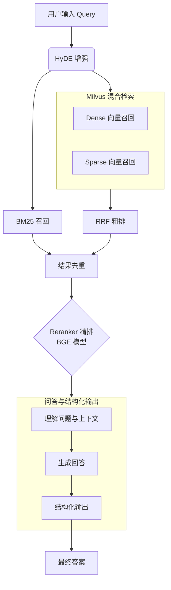
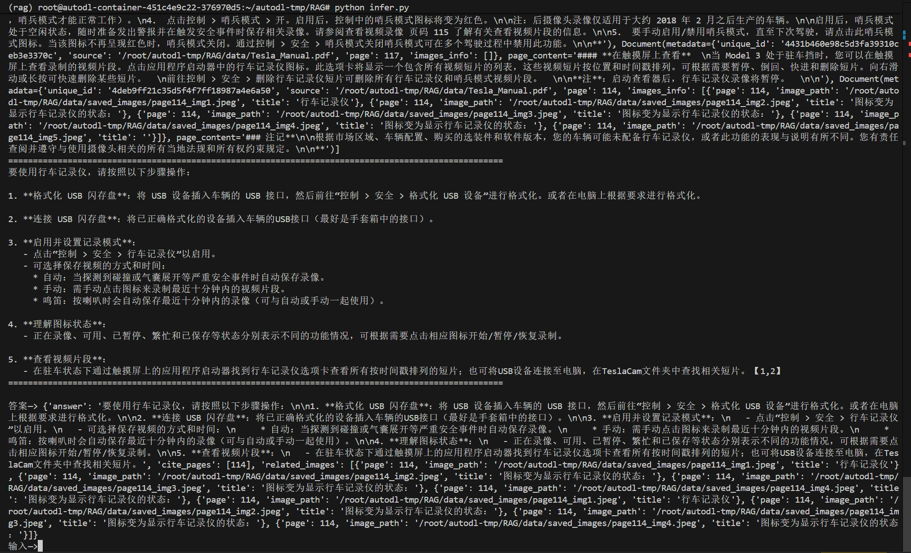
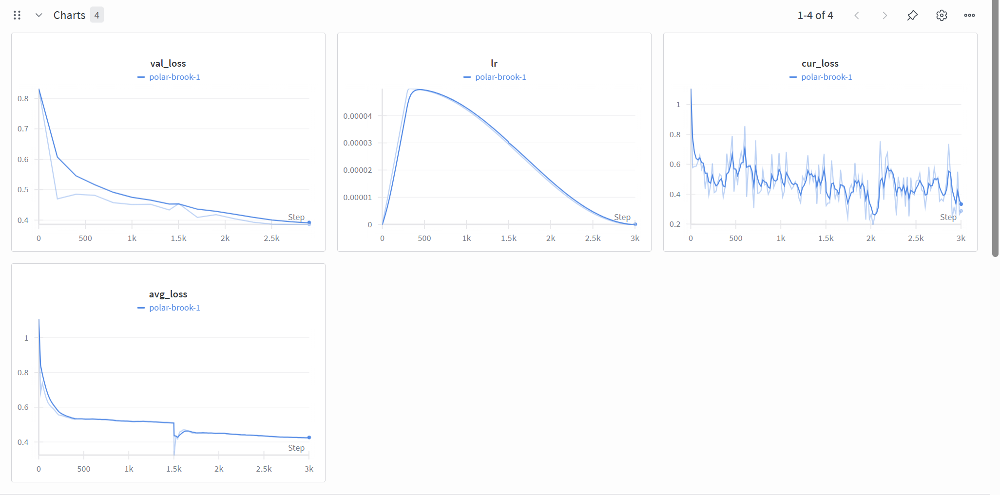
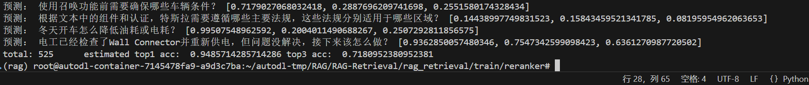
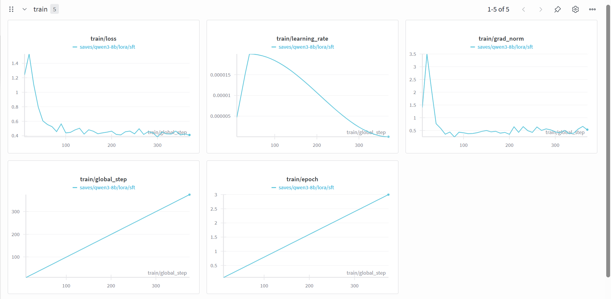
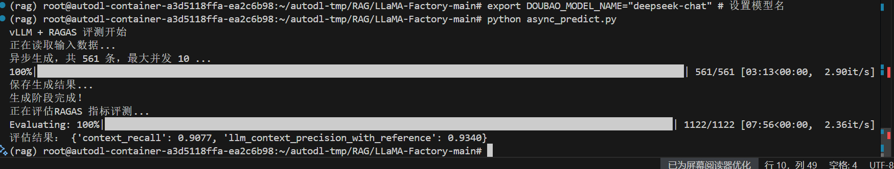
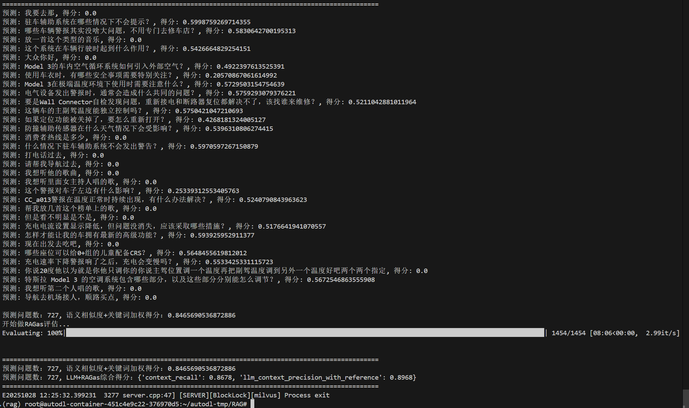

# RAG检索增强实战：车书问答系统

## 1. 项目流程图
<center>


</center> 


## 2. 项目运行
---
一些需要的框架
- [LLama-Factory](https://github.com/hiyouga/LLaMA-Factory) 用于SFT训练
- [RAG-rewtrieval](https://github.com/NovaSearch-Team/RAG-Retrieval) 用于ReRanker训练
- [ragas](https://github.com/explodinggradients/ragas) 用于评估RAG的指标

```bash
# 项目依赖安装，首先进入项目入口
conda create -n rag python=3.12
cd RAG/ 

# 安装所需依赖(LLama-factory & RAG-rewtrieval已经clone到项目中去了)
pip install requirements.txt 

pip install -e ".[torch,metrics]" --no-build-isolation
```

检查config.ini  
填写好对应模型的 API 密钥、URL和模型名称（根据官网填写即可）填写完成保存
```bash
vim config.ini

# insert mode
a

# 写入并且退出
：wq
```

检查模型路径名称：`RAG/src/constant.py`文件。

请检查文件保证模型下载到本地，以及微调好的模型保存完整：
- `base_dir`--基本路径
- `bm25_pickle_path, milvus_db_path` --索引路径
- `qwen3_8b_tune_model_name, bge_reranker_tuned_model_path` --微调后的Reranker和QA-LLM
- `bge_m3_model_path, m3e_small_model_path` --milvus使用的embedding和语义切分服务的模型路径
- 
使用`models/download.sh`下载到对应路径即可

## 3. 启动服务并进行测试
配置到环境变量和切换conda环境
```bash
source config.ini

# 通过infer.py进行推理验证
python infer.py
```
日志检查
```bash
# 可以通过log文件检查服务启动情况
tail -f log/qwen3-8B.log

tail -f log/semantic_chunk.log
```
## RAG问答效果展示



## 评估指标

### ReRanker
- 训练数据展示，这里选用的是BCE

> 
> 

### 🧩 Pointwise Ranking 原理

#### 🌐 一、Pointwise Ranking 简介

**Pointwise Ranking** 是最基础的排序学习方式。  
它把每个 `(query, document)` 当作一个独立样本，通过监督学习方式预测文档的相关性得分：

$$\hat{y}_i = f_\theta(q_i, d_i)$$

目标是让模型预测的得分 $\hat{y}_i$ 尽可能接近真实标签 $y_i$。

---

#### 🧠 二、标签说明

在本配置中：
$$ y' = \frac{y - \min{label}}{\max{label} - \min{label}} = \frac{y}{2}$$

| 标签值 | 含义 | 归一化值 |
|---------|------|--------------------------|
| 2 | 强相关（Highly relevant） | 1.0 |
| 1 | 弱相关（Partially relevant） | 0.5 |
| 0 | 不相关（Irrelevant） | 0.0 |

---

#### ⚙️ `pointwise_bce` — 二进制交叉熵（Binary Cross Entropy）

#### **定义**

$$\mathcal{L}_\text{BCE} = -[y \log \hat{p} + (1 - y)\log(1 - \hat{p})]$$

其中：
- $\hat{p} = \sigma(f_\theta(q,d))$ 表示模型输出的相关性概率；
- $y \in [0,1]$ 是标签（通过归一化获得）。

#### **适用场景**
- 适合二分类或软二分类任务；
- 标签为 0/1/2 时需归一化到 [0,1] 区间；
- 模型输出 sigmoid 概率。

#### **特征**
- 对噪声相对鲁棒；
- 训练稳定；
- 不显式保持标签之间的间隔关系。

---

<!-- #### ⚙️ `pointwise_mse` — 均方误差（Mean Squared Error）

#### **定义**

$$\mathcal{L}_\text{MSE} = (\hat{y} - y)^2$$

其中：
- $\hat{y}$ 是模型预测得分；
- $y \in \{0,1,2\}$ 是真实相关性标签。

#### **适用场景**
- 用于连续或多级标签；
- 模型直接输出一个实数得分；
- 能保持标签的顺序和间距关系。

#### **特征**
- 信息量更丰富；
- 对噪声较敏感；
- 更接近回归任务。

---

#### 🚀 六、一般配置策略

| 目标 | 推荐配置 | 理由 |
|------|-----------|------|
| 快速预训练 | `pointwise_mse` | 简单稳定，适合连续标签 |
| 二值任务 | `pointwise_bce` | 明确区分相关与不相关 |
| 蒸馏阶段 | `listwise_ce` | 学习教师模型的 soft 分布 | -->


### SFT

> 

> 

### Final Score
主要使用语义相似度和关键词的加权评分：

```py
# 使用 text2vec_model 计算语义相似度
semantic_score = semantic_search(simModel.encode([gold]), simModel.encode(pred), top_k=1)[0][0]['score']
join_keywords = [word for word in keywords if word in pred]
keyword_score = calc_jaccard(join_keywords, keywords)
# 并且按照 keyword 进行加分
if not keywords:
    score = semantic_score
else:
    score = 0.2 * keyword_score + 0.8 * semantic_score

```

评估指标

### 🧩 RAGAS 指标解析：LLMContextRecall() 与 LLMContextPrecisionWithReference()

🌐 概述

在 RAG（Retrieval-Augmented Generation）系统中，**检索阶段的质量** 直接影响最终答案的正确性。  
RAGAS 提供了多个评估指标，其中：

- **LLMContextRecall()**：衡量检索到的信息覆盖了多少真实答案所需的内容。  
- **LLMContextPrecisionWithReference()**：衡量检索到的信息中有多少是真正有用的。

这两个指标共同评估 **RAG 检索阶段的“全面性”与“纯净度”**。

---

### 🧠 1️⃣ LLMContextRecall()

**定义**
衡量在 *Ground Truth 答案所需的信息* 中，有多少被检索到的上下文覆盖到了。

**公式**
$$text{Context Recall} = \frac{\text{Relevant Information Retrieved}}{\text{Total Relevant Information}}$$

即：
> “模型真正需要的信息中，检索系统提供了多少。”

**计算过程**
1. 使用 LLM 或 embedding 模型判断哪些 retrieved contexts 含有与 reference answer 语义相关的信息；
2. 计算这些“命中”上下文的比例。

### 2️⃣ LLMContextPrecisionWithReference()

### **定义**
衡量在所有检索到的上下文中，有多少是真正有助于回答问题的。

### **公式**
$$\text{Context Precision} = \frac{\text{Relevant Information Retrieved}}{\text{Total Information Retrieved}}$$

即：
> “检索系统提供的内容里，有多少是有用的。”

### **计算过程**
1. 对每个检索到的文档片段，使用 LLM 判断其是否与参考答案语义相关；
2. 计算相关片段占总检索片段的比例。

---

#### ⚖️ 指标对比

| 指标 | 关注点 | 分子 | 分母 | 衡量的能力 | 高分代表 |
|------|--------|------|------|-------------|-----------|
| **LLMContextRecall()** | 覆盖度 | 有用信息被检出 | 所有必要信息 | 检到多少该检的 | 检索全面 |
| **LLMContextPrecisionWithReference()** | 纯净度 | 有用信息被检出 | 所有检索结果 | 检到的是否都有用 | 检索干净 |

---

### 🧩 LLM 语义判断机制

这两个指标前缀带 **LLM**，意味着它们依赖 **大语言模型进行语义判断**，而非关键词匹配。

- 由强大的/商用大模型 LLM（如 GPT-4、Qwen2.5 等）担任“评估者”；
- 对每个 context 判断其是否包含支持参考答案的语义；
- 输出“相关”或“不相关”的语义标记；
- 最终基于这些标记计算 Precision 与 Recall。

---
### 对应代码块为
```py
result = evaluate(
    dataset=evaluation_dataset, metrics=[
        LLMContextRecall(), LLMContextPrecisionWithReference()
    ],
    llm=evaluator_llm
)

```


### 最终的评测结果

```
预测问题数：727, 语义相似度+关键词加权得分：0.8465690536872886

预测问题数：727, LLM+RAGas综合得分：{'context_recall': 0.8678, 'llm_context_precision_with_reference': 0.8968}
```