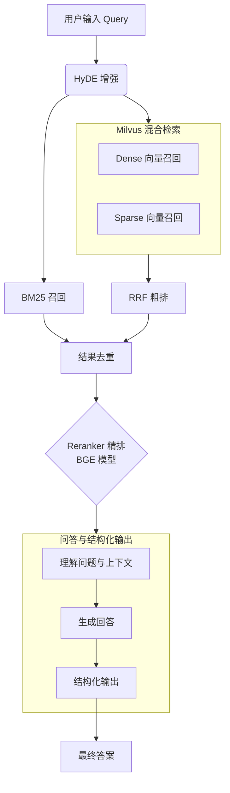

# RAG检索增强实战：车书问答系统

## 1. 项目流程图
<center>


</center> 


## 2. 项目运行
---
一些需要的框架
- [LLama-Factory](https://github.com/hiyouga/LLaMA-Factory) 用于SFT训练
- [RAG-rewtrieval](https://github.com/NovaSearch-Team/RAG-Retrieval) 用于ReRanker训练
- [ragas](https://github.com/explodinggradients/ragas) 用于评估RAG的指标

```bash
# 项目依赖安装，首先进入项目入口
conda create -n rag python=3.12
cd RAG/ 

# 安装所需依赖(LLama-factory & RAG-rewtrieval已经clone到项目中去了)
pip install requirements.txt 

pip install -e ".[torch,metrics]" --no-build-isolation
```

检查config.ini  
填写好对应模型的 API 密钥、URL和模型名称（根据官网填写即可）填写完成保存
```bash
vim config.ini

# insert mode
a

# 写入并且退出
：wq
```

检查模型路径名称：`RAG/src/constant.py`文件。

请检查文件保证模型下载到本地，以及微调好的模型保存完整：
- `base_dir`--基本路径
- `bm25_pickle_path, milvus_db_path` --索引路径
- `qwen3_8b_tune_model_name, bge_reranker_tuned_model_path` --微调后的Reranker和QA-LLM
- `bge_m3_model_path, m3e_small_model_path` --milvus使用的embedding和语义切分服务的模型路径
- 
使用`models/download.sh`下载到对应路径即可

## 3. 启动服务并进行测试
配置到环境变量和切换conda环境
```bash
source config.ini

# 通过infer.py进行推理验证
python infer.py
```
日志检查
```bash
# 可以通过log文件检查服务启动情况
tail -f log/qwen3-8B.log

tail -f log/semantic_chunk.log
```

