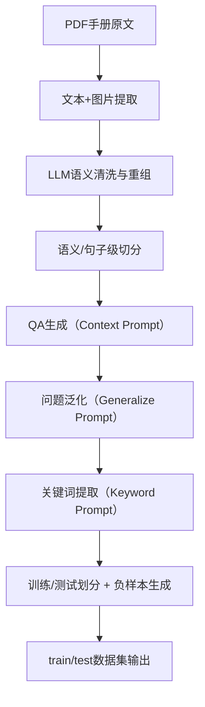
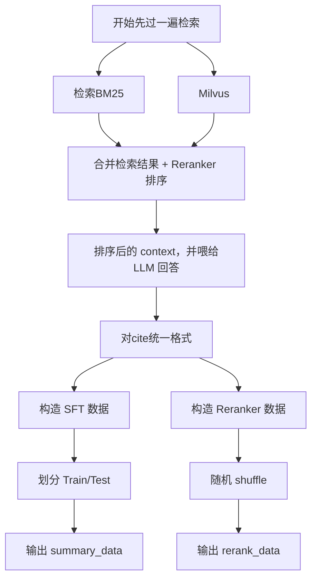

# 1️⃣数据处理部分

##  1.1  构建数据的索引：

- 读入PFDF文件，对数据进行一个基本的清洗（去除无效部分：页眉目录等）并且关联图片和文本。并且使用hash md5 生成 unique id作为 meta 信息
```python
def handle_image(img: Tuple, img_index: int, page: fitz.Page) -> ManualImages | None:
    """处理单个图片"""
    xref = img[0]
    base_image = page.parent.extract_image(xref)
    ...
    # 跳过小图标
    # 保存图片并获取路径
    # 获取扩展后的图片区域
    # 获取关联文本块
    related_blocks = get_related_text_blocks(page, expanded_rect, img_rect.y0)
    title_blocks = [text for is_title, text in related_blocks if is_title]

    return ManualImages(
        image_path=image_path,
        page=page.number + 1,
        title="\n".join(title_blocks)
    )
```    

- 借助LLM进行文档的规整和清洗（`llm_clean_client.py`），更方便后续的清洗逻辑
```py
    LLM_CLEAN_PROMPT = """
你是一个专业的文档整理助手，负责对汽车用户手册中的内容进行整理和总结。请根据以下要求对文档进行处理：

1. **让句子变得更加通顺**：重新整合句子、段落，去除一些不必要的符号，例如换行符等。
2. **按标题归类整理**：按照文档的语义关系，把属于同一个标题下的文档做归类合并, 记住标题要用markdown的形式加粗，例如###。

请根据以下文档内容进行整理：
{}
整理后的输出：
"""
```
- 在进行文档的切分，这里采用的是语义切分加滑动窗口切分，并且关联上父子文档（防止语义被二次切碎）`utils.py`:
    - 语义切分：先通过语义分组算法（如TextTiling或Embedding聚类）划分出逻辑段落；

    - 父子文档结构：构建层次化结构，防止语义过度碎片化；

    - 滑动窗口：控制切片长度以平衡上下文关联与模型输入上限。
```py
def texts_split(raw_docs):
    """语义切分 + 父子文档层次构建（简化示意版）"""
    all_split_docs = []

    for doc in raw_docs:
        # === 1. 语义级切分 ===
        semantic_groups = semantic_split(doc.page_content)

        parent_docs = []
        for group in semantic_groups:
            parent_doc = Document(page_content=group, metadata={"type": "parent"})
            parent_docs.append(parent_doc)
            all_split_docs.append(parent_doc)

        # === 2. 句子级再切分（子文档）===
        for parent in parent_docs:
            child_chunks = sentence_split(parent.page_content)
            for chunk in child_chunks:
                child_doc = Document(
                    page_content=chunk,
                    metadata={"type": "child", "parent": parent},
                )
                all_split_docs.append(child_doc)

    return all_split_docs
```
- 最后为索引入库

# 2️⃣ 生成式问答数据集
## 2.1 生成qa数据集

利用 LLM 从文档中直接生成 5 个问题与答案，形成初始 QA 样本集。

使用Deepseek进行加载的 PDF 文档进行生成式数据抽取，根据提示词要求模型生成 **Json** 格式。这样就获得了一个原始的数据集。  
```py 
CONTEXT_PROMPT_TPL = """
我会给你一段文本（<document></document>之间的部分），你需要阅读这段文本，分别针对这段文本生成5个问题，和基于这段文本对问题的回答，回答请保持完整，无须重复问题。

对问题、答案的要求：
1.问题：问题要与这段文本相关，不要询问类似“这个问题的答案在哪一章”这样的问题;
2.答案：回答请保持完整且简洁，无须重复问题。答案要能够独立回答问题，而不是引用其他章节和页码，例如答案内容不能出现请参阅xx页码;
3.5个问题里面至少要包含一个需要综合*大段*文本才能回答的问题，但不要问类似“这一段主要讲了什么内容”这样的问题;

对输出的要求：
1.返回结果以JSON形式组织，格式为[{"question": "...", "answer": "..."}, ...]。
2.如果当前文本主要是目录，或者是一些人名、地址、电子邮箱等没有办法生成有意义的问题时，可以返回[]。

下方是文本：
<document>
{{document}}
</document>

请生成结果：
"""
```

>但是对于这个数据样本还是比较少，接着再次**进行现有数据集问题的拓展**增强数据集的泛化性和丰富度，涵盖更广的场景（例如一些口语化场景等）。同样使用了Deepseek作为生成助手，对问题进行拓展。
## 2.2 问题泛化增强
为每个问题生成 5 个同义/口语化改写版本，提高模型泛化能力。
```py
GENERALIZE_PROMPT_TPL = """
你是一个造句大师，请根据我输入的问题，生成5个意思相近的问法。

要求：
1. 含义保持一致；
2. 可使用更口语化的表达；
3. 每个问题以序号+回车分隔输出。
"""
```
> >note:   
> 如果生成质量还不够和可以对低质量数据进行统一的过滤，也可以同样的使用llm进行打分。
> 

---

输入：怎么打开车窗  
输出：
1. 车窗怎么开启  
2. 要怎样才能把窗子打开  
3. 车窗按钮在哪里  
4. 怎么让车窗升降  
5. 打开车窗要按哪个键

## 2.3 关键词抽取

在测试集样本中，对答案文本提取汽车领域关键词，辅助评估召回/匹配性能。
```py
KEYWORDS_PROMPT_TPL = """
你是一名专业的汽车领域NLP工程师，任务是从给定文本中提取核心关键词。
输出格式：行车记录仪,辅助驾驶,车辆功率
关键词数量≤5，如无则输出“无”。
"""
```
- 提取规则：
    - 保留汽车专业术语；
    - 包含产品型号、规格；
    - 过滤通用词（如“使用”、“包括”）。


## 数据划分与负样本生成
训练/测试集划分

- 随机划分比例：train: 90%，test: 10%；
- 每条问答唯一 unique_id = md5(question)；
- 保留 (question, answer, keywords) 三元组结构。

负样本的构建
一些闲聊chat，和问答系统不相关的主题，混乱的输入内容整

理为数据源`raw_general_chats.txt`
- 标签形式构造为：
```json
{
  "question": "你好，今天的天气怎么样？",
  "answer": "无答案"
}
```
- 比例：约 95% 训练负样本，5% 测试负样本。


<center>


</center>

---

# 3. 训练数据集的生成
<center>


</center>


### ReRanker Data
### Reranker 
目标：
- 给定 query 与一组候选文档，判断每个文档与 query 的相关性（打分/排序）。

因此我们需要构建：

1. 正样本（relevant）

2. 负样本（irrelevant）

3. 中间样本（partially relevant）

```py
# 正样本和中间样本
positive = info["context"][0]
middle = random.choice(info["context"][-2:])
...
```

负样本:
1. 直接从回答为 "无答案" 
2. `merged_docs` 没有选中的文档 `neg_doc` 里面随机挑选

```py
 if format_answer != "无答案":
            ...
    if neg_docs:
        negative = random.choice(neg_docs)
        ...
else:
    negative = random.choice(info["merged_docs"])
    ...
```

### SFT

数据的正负样本的构造基本reranker基本一致

每一个 item 如下调整为SFT训练的格式：
```py
    item = {
        "query": query,
        "context": context,
        "instruction": instruction,
        "input": "",
        "output": format_answer
    }
```